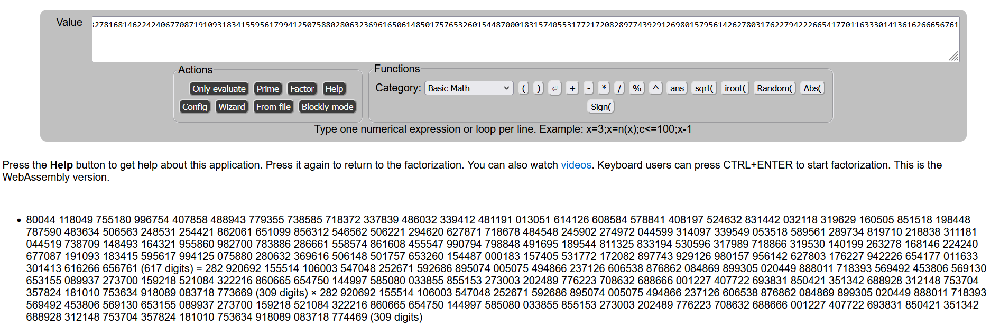

<!-- @import "[TOC]" {cmd="toc" depthFrom=1 depthTo=6 orderedList=false} -->

<!-- code_chunk_output -->

- [Crypto](#crypto)
  - [1.模！](#1模)
  - [2.NeXT RSA](#2next-rsa)
  - [3.Base64*rot13](#3base64rot13)
- [Reverse](#reverse)
  - [1.xor++](#1xor)

<!-- /code_chunk_output -->


队伍：d3c4de
# Crypto
## 1.模！ 
题目：
```python
from math import factorial
from functools import reduce

flag = "flag{xxxxxxxxx}"

def mooooo(s: str):
    res = 0
    for i in s:
        res <<= 8
        res += ( factorial(ord(i)) % 233 )
    return res

table = "abcdefghijklmnopqrstuvwxyz{}"
assert(reduce(lambda p,i:(i in table)*p, flag, True))

print(mooooo(flag))
# output: 2508450541438803643416583335895451914701844680466330955847
```

- 解题思路：
mooooo函数将flag的每个字符计算阶乘后模233保存到res，先将res的值8位8位地取出来（这时候是逆序的），再使用table计算每个字符的阶乘模233的值并保存，通过比较两个表的值获取flag
- EXP:
```python
output = 2508450541438803643416583335895451914701844680466330955847
print(bin(output))
# 0b11001100100110101110010000101011000110000011110011100100100110101110010000001000001111001110010010011010111001000000100010101110111001000000100010011010011000001010111011100100011000001000111
enc = 0b11001100100110101110010000101011000110000011110011100100100110101110010000001000001111001110010010011010111001000000100010101110111001000000100010011010011000001010111011100100011000001000111

# 初始化一个列表，用于保存每次取出的低8位
result = []

# 从二进制数的右侧开始，逐个取出低8位，并保存到列表中
for i in range(24):
    # 使用位运算将enc右移i*8位，然后使用与运算提取低8位
    current_byte = (enc >> (i * 8)) & 0xFF
    # 将取出的低8位添加到结果列表中
    result.append(current_byte)

# 输出结果
print("每次取出的低八位:", result)

from math import factorial

table = "abcdefghijklmnopqrstuvwxyz{}"
out = []

# 对table中每个字符计算 factorial(ord(i)) % 233，并保存到out中
for char in table:
    out.append(factorial(ord(char)) % 233)

# 输出out
print(out)

decrypted_string = ""
for value in result:
    for i in range(len(out)):
        if value == out[i]:
            decrypted_string += table[i]
            break

# result是逆序的，所以需要逆序输出
print(decrypted_string[::-1])
# flag{dalaodalaohaolihai}
```

## 2.NeXT RSA 
- 题目：
```python
import sympy
import libnum

flag="flag{" + "???" + "}"
m = libnum.s2n(flag)

p = sympy.randprime(1<<1024, 1<<1025)
q = sympy.nextprime(p)

n = p*q
r = (p-1)*(q-1)
e = 65537

c = pow(m, e, n)

print(n, e, c)
# output:
# 80044118049755180996754407858488943779355738585718372337839486032339412481191013051614126608584578841408197524632831442032118319629160505851518198448787590483634506563248531254421862061651099856312546562506221294620627871718678484548245902274972044599314097339549053518589561289734819710218838311181044519738709148493164321955860982700783886286661558574861608455547990794798848491695189544811325833194530596317989718866319530140199263278168146224240677087191093183415595617994125075880280632369616506148501757653260154487000183157405531772172082897743929126980157956142627803176227942226654177011633301413616266656761 65537 23280133104463252598665779150831148192014617461904564929071121215373331248942762386170411274023248423328388793808975632652896384007449549469345318875514363621903138122407682293848670093433946555776164835208375667498606187869211466397624286383057425296636315379314349307816391315242971306898487494604324473266965665471735612154916305882443496151118031672777088597821127499085632141307413890900246444539517971766135909771880642211582699957211983212981047822362311969553832913399476190919026666192056319334425636757404603336130688707109219644178606626422717046059209499394056295682594928581470210114322505904198054215544

```

注意到q = sympy.nextprime(p)，p和q很接近，那么可以很快分解p和q，使用在线网站分解
- EXP：
```python
from Crypto.Util.number import *
p = 282920692155514106003547048252671592686895074005075494866237126606538876862084869899305020449888011718393569492453806569130653155089937273700159218521084322216860665654750144997585080033855855153273003202489776223708632688666001227407722693831850421351342688928312148753704357824181010753634918089083718773669
q = 282920692155514106003547048252671592686895074005075494866237126606538876862084869899305020449888011718393569492453806569130653155089937273700159218521084322216860665654750144997585080033855855153273003202489776223708632688666001227407722693831850421351342688928312148753704357824181010753634918089083718774469
n = 80044118049755180996754407858488943779355738585718372337839486032339412481191013051614126608584578841408197524632831442032118319629160505851518198448787590483634506563248531254421862061651099856312546562506221294620627871718678484548245902274972044599314097339549053518589561289734819710218838311181044519738709148493164321955860982700783886286661558574861608455547990794798848491695189544811325833194530596317989718866319530140199263278168146224240677087191093183415595617994125075880280632369616506148501757653260154487000183157405531772172082897743929126980157956142627803176227942226654177011633301413616266656761
e = 65537
c = 23280133104463252598665779150831148192014617461904564929071121215373331248942762386170411274023248423328388793808975632652896384007449549469345318875514363621903138122407682293848670093433946555776164835208375667498606187869211466397624286383057425296636315379314349307816391315242971306898487494604324473266965665471735612154916305882443496151118031672777088597821127499085632141307413890900246444539517971766135909771880642211582699957211983212981047822362311969553832913399476190919026666192056319334425636757404603336130688707109219644178606626422717046059209499394056295682594928581470210114322505904198054215544
phi = (p-1)*(q-1)
d = inverse(e,phi)
m = pow(c,d,n)
print(long_to_bytes(m))
# b'flag{n0t_s3Cure_4t_aIl}'
```

## 3.Base64*rot13 
- 密文：MzkuM3gyrzI6Z3cyrzHlMKcSra0=
先rot13替换：得到 ZmxhZ3tlemV6M3plemUyZXpFen0=
再base64：flag{ezez3zeze2ezEz}

# Reverse
## 1.xor++ 
- ida64位打开程序：
定位到main函数
```C
int __cdecl main(int argc, const char **argv, const char **envp)
{
  char v4[48]; // [rsp+0h] [rbp-80h] BYREF
  __int64 v5[8]; // [rsp+30h] [rbp-50h] BYREF
  unsigned int i; // [rsp+74h] [rbp-Ch]
  int v7; // [rsp+78h] [rbp-8h]
  int v8; // [rsp+7Ch] [rbp-4h]

  memset(v5, 0, sizeof(v5));
  qmemcpy(v4, "%($!<*<", 7);
  v4[7] = 30;
  v4[8] = 20;
  v4[9] = 40;
  v4[10] = 36;
  v4[11] = 40;
  v4[12] = 41;
  v4[13] = 97;
  v4[14] = 50;
  v4[15] = 39;
  v4[16] = 63;
  v4[17] = 32;
  v4[18] = 12;
  v4[19] = 9;
  v4[20] = 32;
  v4[21] = 104;
  v4[22] = 55;
  v4[23] = 46;
  v4[24] = 4;
  v4[25] = 63;
  v4[26] = 53;
  v4[27] = 106;
  v4[28] = 17;
  v4[29] = 7;
  v4[30] = 4;
  v4[31] = 61;
  v4[32] = 14;
  v4[33] = 17;
  v4[34] = 38;
  v4[35] = 14;
  v4[36] = 26;
  puts("Guess what is the flag?");
  __isoc99_scanf("%50s", v5);
  v8 = 67;
  v7 = 1;
  for ( i = 0; i <= 0x24; ++i )
  {
    if ( (v8 ^ *((char *)v5 + (int)i)) != v4[i] )
    {
      v7 = 0;
      break;
    }
    ++v8;
  }
  if ( v7 )
    puts("That is the right answer!");
  else
    puts("Wrong answer sadly...");
  return 0;
}
```
- 将v4前7个字符也转换为ascii码数字再解密就可以
- EXP:
```python
v4 = [
    37,
    40,
    36,
    33,
    60,
    42,
    60,
    30,
    20,
    40,
    36,
    40,
    41,
    97,
    50,
    39,
    63,
    32,
    12,
    9,
    32,
    104,
    55,
    46,
    4,
    63,
    53,
    106,
    17,
    7,
    4,
    61,
    14,
    17,
    38,
    14,
    26,
]

v8 = 67
flag = ""
for value in v4:
    for i in range(256):
        if i ^ v8 == value:
            flag += chr(i)
    v8 += 1

print(flag)

# flag{buT_diff1cultY_w0nt_ch4Nge_muCh}

```