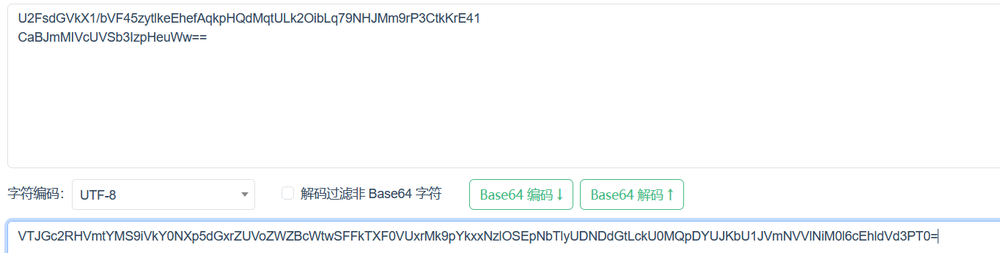
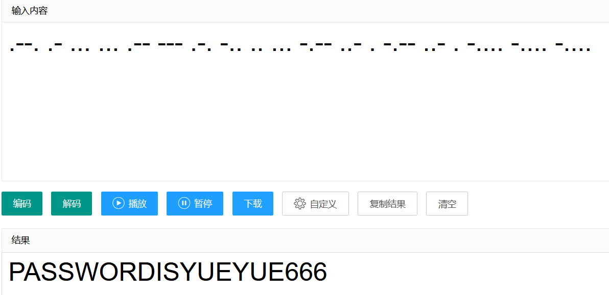
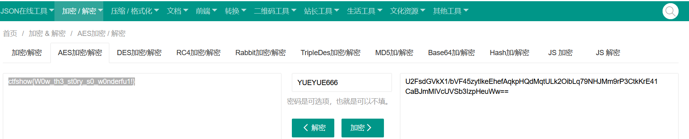

# 1.题目
- ctfshow月月的爱情故事

```
你知道吗。月月今天遇到了一个让他心动的女孩，她的名字叫做小雨，太幸运了。小雨是一个活泼可爱的女孩！她的笑容如同春天里的阳光。温暖了月月的心，月月第一次见到小雨是在图书馆里！事情是这样的。当时小雨正在专心致志地看书。阳光洒在她的脸上。让她看起来如同天使一般美丽！月月被小雨的美丽和才华所吸引。开始暗暗关注她。在接下来的日子里。月月开始尝试与小雨接触！和她聊天和学习。他们有着许多共同的兴趣爱好，一起度过了许多快乐的时光，渐渐地！月月发现自己对小雨产生了特殊的感情，他开始向小雨表达自己的心意，然而，小雨并没有立即接受月月的感情！她告诉月月。她曾经受过感情的伤害，需要时间来慢慢修复自己的心灵。月月尊重小雨的决定！他开始用更多的时间和精力来陪伴小雨，帮助她走出过去的阴影。在接下来的几个月里。月月和小雨的关系逐渐升温！他们一起参加了许多校园活动。一起探索了那个城市的角角落落。渐渐地！雨也开始对月月产生了感情。她发现自己越来越依赖他。越来越喜欢他。最终！小雨和月月走到了一起，他们的爱情故事成为了校园里的佳话。让同学们都羡慕不已，他们一起度过了青春岁月，一起经历了成长和进步的喜悦与挫折！他们的感情越来越深厚。也越来越稳定。在他们的恋爱过程中，月月和小雨也学会了如何相处和包容对方！他们互相理解互相支持。一起面对生活中的挑战和困难！他们的爱情让他们变得更加坚强和勇敢，也让他们感受到了生命中最美好的东西。月月相信他们能走得更远，更相信自己不会辜负小雨，当他们遭遇挫折和失败的时候！两人永远不会被打倒。这正是他们彼此爱的力量。在他们空闲的时候，月月经常带小雨出去逛街！晚上一起看电影。有一天！月月说将来他要给小雨一场最美的婚礼，小雨十分感动也十分期盼。就这样。这份约定成为了两人前进的动力。两人共同努力最终一起考上了同一所大学的研究生。两人非常开心彼此深情地看着对方似乎有说不完的情话！研究生三年他们互相帮助一起度过了人生最有意义的大学时光，毕业后两人也很轻松找到了自己心仪的企业。月月没有忘记当初的约定。是的。他要给小雨一场最美好的婚礼。终于！这一天到来了，小雨穿上月月为她定制的婚纱。他们手牵手走向了更美好的未来。场下。所有的嘉宾都为他们鼓掌和欢呼并祝福他们的爱情能够永恒长存。

VTJGc2RHVmtYMS9iVkY0NXp5dGxrZUVoZWZBcWtwSFFkTXF0VUxrMk9pYkxxNzlOSEpNbTlyUDNDdGtLckU0MQpDYUJKbU1JVmNVVlNiM0l6cEhldVd3PT0=

hint:试试摩斯吧！

```

# 解题
- 末尾的字符串一眼base64，先解密

- 得到字符串
```
U2FsdGVkX1/bVF45zytlkeEhefAqkpHQdMqtULk2OibLq79NHJMm9rP3CtkKrE41
CaBJmMIVcUVSb3IzpHeuWw==
```
- 有经验就知道这是AES加密后的结果（看网上的wp才知道）
- 接下来就去找到密钥，提示说试试摩斯吧
- 观察文字，发现只有三种标点符号
- 出现的顺序是。，！
- 将。替换成.
- ,替换成-
- ！替换成空格

## 替换脚本
```python
s='你知道吗。月月今天遇到了一个让他心动的女孩，她的名字叫做小雨，太幸运了。小雨是一个活泼可爱的女孩！她的笑容如同春天里的阳光。温暖了月月的心，月月第一次见到小雨是在图书馆里！事情是这样的。当时小雨正在专心致志地看书。阳光洒在她的脸上。让她看起来如同天使一般美丽！月月被小雨的美丽和才华所吸引。开始暗暗关注她。在接下来的日子里。月月开始尝试与小雨接触！和她聊天和学习。他们有着许多共同的兴趣爱好，一起度过了许多快乐的时光，渐渐地！月月发现自己对小雨产生了特殊的感情，他开始向小雨表达自己的心意，然而，小雨并没有立即接受月月的感情！她告诉月月。她曾经受过感情的伤害，需要时间来慢慢修复自己的心灵。月月尊重小雨的决定！他开始用更多的时间和精力来陪伴小雨，帮助她走出过去的阴影。在接下来的几个月里。月月和小雨的关系逐渐升温！他们一起参加了许多校园活动。一起探索了那个城市的角角落落。渐渐地！雨也开始对月月产生了感情。她发现自己越来越依赖他。越来越喜欢他。最终！小雨和月月走到了一起，他们的爱情故事成为了校园里的佳话。让同学们都羡慕不已，他们一起度过了青春岁月，一起经历了成长和进步的喜悦与挫折！他们的感情越来越深厚。也越来越稳定。在他们的恋爱过程中，月月和小雨也学会了如何相处和包容对方！他们互相理解互相支持。一起面对生活中的挑战和困难！他们的爱情让他们变得更加坚强和勇敢，也让他们感受到了生命中最美好的东西。月月相信他们能走得更远，更相信自己不会辜负小雨，当他们遭遇挫折和失败的时候！两人永远不会被打倒。这正是他们彼此爱的力量。在他们空闲的时候，月月经常带小雨出去逛街！晚上一起看电影。有一天！月月说将来他要给小雨一场最美的婚礼，小雨十分感动也十分期盼。就这样。这份约定成为了两人前进的动力。两人共同努力最终一起考上了同一所大学的研究生。两人非常开心彼此深情地看着对方似乎有说不完的情话！研究生三年他们互相帮助一起度过了人生最有意义的大学时光，毕业后两人也很轻松找到了自己心仪的企业。月月没有忘记当初的约定。是的。他要给小雨一场最美好的婚礼。终于！这一天到来了，小雨穿上月月为她定制的婚纱。他们手牵手走向了更美好的未来。场下。所有的嘉宾都为他们鼓掌和欢呼并祝福他们的爱情能够永恒长存。'
tmp=''
for i in s:
    if i=='。':
        tmp+='.'
    elif i=='，':
        tmp+='-'
    elif i=='！':
        tmp+=' '
print(tmp) #.--. .- ... ... .-- --- .-. -.. .. ... -.-- ..- . -.-- ..- . -.... -.... -....
```

- 得到摩斯串
```
.--. .- ... ... .-- --- .-. -.. .. ... -.-- ..- . -.-- ..- . -.... -.... -....
```

- 在线网站解密 https://www.lddgo.net/encrypt/morse

- 得到字符串PASSWORDISYUEYUE666
- 密钥就是YUEYUE666

正常的AES加密应该是
16 bytes = AES-128
24 bytes = AES-192
32 bytes = AES-256
这里密钥只有9 bytes
许多网站都无法解密
最后在 https://www.sojson.com/encrypt_aes.html 上成功解密

# flag
ctfshow{W0w_th3_st0ry_s0_w0nderfu1!}

# 总结
- base64解密之后不知道是AES，后面只能上网搜了
- 符号替换转莫斯密码
- 密钥长度不符合常规，许多网站无法解密
- 最后在网站上试了一下AES加密，发现加密后末尾有时出现=，字符串中间会出现/和+,DES情况也一样

# 2.题目
- 2024年VCTF纳新赛 crypto 狂飙
```python
import os
from flag import flag
from Crypto.Util.number import *
from Crypto.Cipher import AES
m = 88007513702424243702066490849596817304827839547007641526433597788800212065249
key = os.urandom(24)
key = bytes_to_long(key)
n=m % key
flag += (16 - len(flag) % 16) * b'\x00'
iv = os.urandom(16)
aes = AES.new(key,AES.MODE_CBC,iv)
enc_flag = aes.encrypt(flag)

print(n)
print(enc_flag)
print(iv)


#103560843006078708944833658339172896192389513625588
#b'\xfc\x87\xcb\x8e\x9d\x1a\x17\x86\xd9~\x16)\xbfU\x98D\xfe\x8f\xde\x9c\xb0\xd1\x9e\xe7\xa7\xefiY\x95C\x14\x13C@j1\x9d\x08\xd9\xe7W>F2\x96cm\xeb'
#b'UN\x1d\xe2r<\x1db\x00\xdb\x9a\x84\x1e\x82\xf0\x86'
```

- 解题关键key = m- n,找到k的所有除数爆破，比赛时没有想到好的算法和函数，复杂度太高
- 使用sympy的divisors()函数得到key的除数列表,最后筛选前四个字符是“flag”输出
```python
from Crypto.Cipher import AES
from Crypto.Util.number import *
from sympy import divisors

n = 103560843006078708944833658339172896192389513625588
m = 88007513702424243702066490849596817304827839547007641526433597788800212065249
key = m - n
# 88007513702424243702066490746035974298749130602173983187260701596410698439661
enc = b"\xfc\x87\xcb\x8e\x9d\x1a\x17\x86\xd9~\x16)\xbfU\x98D\xfe\x8f\xde\x9c\xb0\xd1\x9e\xe7\xa7\xefiY\x95C\x14\x13C@j1\x9d\x08\xd9\xe7W>F2\x96cm\xeb"
iv = b"UN\x1d\xe2r<\x1db\x00\xdb\x9a\x84\x1e\x82\xf0\x86"
for i in divisors(key):
    i = long_to_bytes(i, 24)
    aes = AES.new(i, AES.MODE_CBC, iv)
    flag = aes.decrypt(enc)
    if b"flag{" in flag:
        print(flag)
# flag{cf735a4d-f9d9-5110-8a73-5017fc39b1b0}

```