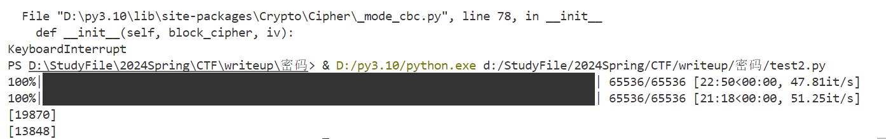

# Des
- [b01lers2020]Des-MMXX
```python
import sys
from hashlib import sha256
from Crypto.Cipher import DES


SECRET = 0xa########e          # remember to erase this later..
seed = b'secret_sauce_#9'   


def keygen(s):
   keys = []
   for i in range(2020):
      s = sha256(s).digest()
      keys.append(s)
   return keys

def scramble(s):
   ret = "".join( [format(s & 0xfffff, '020b')]*101 )
   ret += "".join( [format(s >> 20, '020b')]*101 )
   return int(ret, 2)
 
def encrypt(keys, msg):
   dk = scramble(SECRET)
   for v in keys:
      idx = dk & 3
      dk >>= 2
      k = v[idx*8:(idx+1)*8]
      cp = DES.new(k, DES.MODE_CBC, bytes(8))  
      msg = cp.encrypt(msg)
   return msg


keys = keygen(seed)

with open("flag.txt", "rb") as f:
   msg = f.read()

ctxt = encrypt(keys, msg)
sys.stdout.buffer.write(ctxt)

```
- 分析：keys = keygen(seed)用seed=b'secret_sauce_#9' 生成2020个随机数用于DES2020轮加密
- dk = scramble(SECRET)使用SECRET=0xa########e生成dk，dk = SECRET的低20位重复101次与SECRET的高20位重复101次拼接，注意到a########e一共40位
- idx = dk & 3，dk >>= 2，可以看到每次取到dk的低2位后dk就右移两位。
- 那么前1010次加密就只与dk的低2020位有关，即SECRET的高20位，后1010次加密至只与dk的高2020位有关，即SECRET的低20位，那么设m是明文，c是密文，对m加密1010次的结果与对c解密1010次的结果应该相同，这样就可以爆破出SECRET
- 爆破SECRET:（需要跑20多分钟）
```python
from Crypto.Util.number import *
from Crypto.Cipher import DES
from hashlib import sha256
from numpy import *
from tqdm import *

# 自己设定密文16字节
m = b"Attack at DAWN!!"


def keygen(s):
    keys = []
    for i in range(2020):
        s = sha256(s).digest()
        keys.append(s)
    return keys


# 加密只需要SECRET的高20位
def scramble_l(x):
    ret = "".join([format(x >> 20 - 20, "020b")] * 101)
    return int(ret, 2)


# 加密略有不同，因为SECRET需要爆破，爆破时每次更新SECRET即可
# 这里直接使用sec代替
def encrypt(msg, keys, sec):
    for i in range(1010):
        idx = (sec >> (2 * i)) & 3
        k = keys[i][idx * 8 : idx * 8 + 8]
        cp = DES.new(k, DES.MODE_CBC, bytes(8))
        msg = cp.encrypt(msg)
    return msg


keys = keygen(b"secret_sauce_#9")
cts_enc = []
for i in tqdm(range(0, 65536)):
    # 从A0000开始爆破，只需要爆破16位
    SECRET_H = scramble_l(0xA0000 + i)
    cts_enc.append(bytes_to_long(encrypt(m, keys, SECRET_H)))
# 现在加密1010轮结束，cts_enc末尾的元素就是加密1010轮的结果


c = b"\x15\x08\x54\xff\x3c\xf4\xc4\xc0\xd2\x3b\xd6\x8a\x82\x34\x83\xbe"


# 解密需要SECRET的低20位
def scramble_h(x):
    ret = "".join([format(x & 0xFFFFF, "020b")] * 101)
    return int(ret, 2)


def decrypt(msg, keys, sec):
    for i in range(1010):
        # 解密是从末尾开始
        idx = (sec >> (2018 - 2 * i)) & 3
        k = keys[2019 - i][idx * 8 : idx * 8 + 8]
        cp = DES.new(k, DES.MODE_CBC, bytes(8))
        msg = cp.decrypt(msg)
    return msg


cts_dec = []
for i in tqdm(range(0, 65536)):
    # 因为SECRET后20位是####E，所以是#### * 16 + E
    SECRET_L = scramble_h(0xE + i * 16)
    cts_dec.append(bytes_to_long(decrypt(c, keys, SECRET_L)))

# 找出相同的一项返回各自的 i
tip, xidx, yidx = intersect1d(cts_enc, cts_dec, return_indices=True)
print(xidx)
print(yidx)
# 184442183257442470540344695923362364633
# 19870
# 13848

```

- 有一点没有搞懂，就是关于c和m的选取，m当然可以随便取，但c是如何得到的？？？
- 翻阅多篇wp发现有注释，这就合理了
```python
#Plaintext: b'Attack at DAWN!!'
#Ciphertext: b'\x15\x08T\xff<\xf4\xc4\xc0\xd2;\xd6\x8a\x824\x83\xbe'
```


- SECRET高位=A0000+19870=A4D9E，低位=0000E+13848*16=3618E
- SECRET = 0xA4D9E3618E
- 读出flag.enc的字节串：
```python
with open("C:\\Users\\19753\\Desktop\\flag.enc", "rb") as f:
    out = f.read()
print(out)
# b'\x8c\xa9\xd3\xfaXu;)\xcd\xf6\xbe\x1e{\xa9[\xc9\xd7\xb9\x15\xa4}Q\x85z\xe7\xe8\xf5\xd6\xb6 \xed$\n\x80H\xfa\xa8\x9c\x9e\x0e'

```

- 解密：
```python
from hashlib import sha256
from Crypto.Cipher import DES

SECRET = 0xA4D9E3618E
seed = b"secret_sauce_#9"


def keygen(s):
    keys = []
    for i in range(2020):
        s = sha256(s).digest()
        keys.append(s)
    return keys


def scramble(s):
    ret = "".join([format(s & 0xFFFFF, "020b")] * 101)
    ret += "".join([format(s >> 20, "020b")] * 101)
    return int(ret, 2)


def decrypt(keys, msg):
    dk = scramble(SECRET)
    for i in range(2020):
        idx = (dk >> (4038 - (2 * i))) & 3
        k = keys[2019 - i][idx * 8 : (idx + 1) * 8]
        cp = DES.new(k, DES.MODE_CBC, bytes(8))
        msg = cp.decrypt(msg)
    return msg


keys = keygen(seed)

msg = b"\x8c\xa9\xd3\xfaXu;)\xcd\xf6\xbe\x1e{\xa9[\xc9\xd7\xb9\x15\xa4}Q\x85z\xe7\xe8\xf5\xd6\xb6 \xed$\n\x80H\xfa\xa8\x9c\x9e\x0e"

ctxt = decrypt(keys, msg)
print(ctxt)
# b'pctf{Two_tO_thE_s1xt33n7h?_E4sy-p3asy..}'

```
