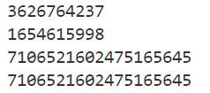
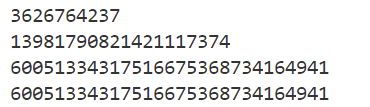

# MT19937随机数生成漏洞
- 题目[GKCTF 2021]Random1
```python
import random
from hashlib import md5

def get_mask():
    file = open("random.txt","w")
    for i in range(104):
        file.write(str(random.getrandbits(32))+"\n")
        file.write(str(random.getrandbits(64))+"\n")
        file.write(str(random.getrandbits(96))+"\n")
    file.close()
get_mask()
flag = md5(str(random.getrandbits(32)).encode()).hexdigest()
print(flag)
```
- 也就是要求生成104组随机数后的下一个32位随机数，md5加密后得到flag
```
random.getrandbits(k)
```
- 关键是这个函数，该函数随 MersenneTwister 生成器一起提供，由于MT算法存在漏洞，所以这种伪随机数生成算法并不安全。
MT算法能生成1-623个32位随机数，而我们有 (32/32+64/32+96/32)*104=624个已知随机数，那么我们就完全可以求出下一个随机数。
但是，MT只能生成32位随机数，如果是64位随机数该怎么生成呢？
做一个测试：
```python
import random

random.seed(0)
a = random.getrandbits(32)
b = random.getrandbits(32)
print(a)
print(b)
print((b << 32) + a)
random.seed(0)
c = random.getrandbits(64)
print(c)
```

- 可以看到64位随机数与前两个32位随机数有关联
- 96位随机数也是如此
```python
import random

random.seed(0)
a = random.getrandbits(32)
b = random.getrandbits(64)
print(a)
print(b)
print((b << 32) + a)
random.seed(0)
c = random.getrandbits(96)
print(c)
```


- 解题思路：将所有的64位和96位随机数拆分成32位，按顺序存入randcrack内，randcrack能帮我们处理并破解MersenneTwister（梅森旋转算法）
```python
from hashlib import md5
from randcrack import RandCrack

with open("C:\\Users\\19753\\Desktop\\random.txt", "r") as f:
    l = f.readlines()
l = [int(i.strip()) for i in l]
t = []
for i in range(len(l)):
    if i % 3 == 0:
        t.append(l[i])
    elif i % 3 == 1:
        t.append(l[i] & (2**32 - 1))
        t.append(l[i] >> 32)
    else:
        t.append(l[i] & (2**32 - 1))
        t.append((l[i] & (2**64 - 1)) >> 32)
        t.append(l[i] >> 64)
rc = RandCrack()
for i in t:
    rc.submit(i)
flag = rc.predict_getrandbits(32)
print(md5(str(flag).encode()).hexdigest())
# 14c71fec812b754b2061a35a4f6d8421

```

# MersenneTwister算法
- [NPUCTF2020]Mersenne twister
```python
from hashlib import *
from itertools import *
from binascii import hexlify , unhexlify

from flag import flag ,seed

assert len(flag) == 26
assert flag[:7] == 'npuctf{'
assert flag[-1] == '}'

XOR = lambda s1 ,s2 : bytes([x1 ^ x2 for x1 ,x2 in zip(s1 , s2)])

class mt73991:
    def __init__(self , seed):
        self.state = [seed] + [0] * 232
        self.flag = 0
        self.srand()
        self.generate()
    def srand(self):
        for i in range(232):
            self.state[i+1] = 1812433253 * (self.state[i] ^ (self.state[i] >> 27)) - i
            self.state[i+1] &= 0xffffffff


    def generate(self):
        for i in range(233):
            y = (self.state[i] & 0x80000000) | (self.state[(i+1)%233] & 0x7fffffff)
            temp = y >> 1
            temp ^= self.state[(i + 130) % 233]
            if y & 1:
                temp ^= 0x9908f23f
            self.state[i] = temp
    def getramdanbits(self):
        if self.flag == 233:
            self.generate()
            self.flag = 0
        bits = self.Next(self.state[self.flag]).to_bytes(4 , 'big')
        self.flag += 1
        return bits
        
    def Next(self , tmp):
        tmp ^= (tmp >> 11)
        tmp ^= (tmp << 7) & 0x9ddf4680
        tmp ^= (tmp << 15) & 0xefc65400
        tmp ^= (tmp >> 18) & 0x34adf670
        return tmp

def encrypt(key , plain):
    tmp = md5(plain).digest()
    return hexlify(XOR(tmp , key))

if __name__ == "__main__":
    flag = flag.encode()
    random = mt73991(seed)
    f = open('./cipher.txt' , 'wb')
    for i in flag:
        key = b''.join([random.getramdanbits() for _ in range(4)])
        cipher = encrypt(key , chr(i).encode())
        f.write(cipher)


```

- EXP:看不懂思密达
```python
from Crypto.Hash import MD5
from hashlib import *
from itertools import *
from binascii import hexlify, unhexlify
from Crypto.Util import number
import string

cipher = "cef4876036ee8b55aa59bca043725bf350a5e491debdef7ef7d63e9609a288ca1e2c82a7fe5"
# 没有写全是因为只需要前32位.
plain = "n"
plainmd5 = MD5.new(plain.encode()).hexdigest()
m1 = eval("0x" + plainmd5[:8]) ^ eval("0x" + cipher[:8])
# print(m1)
m1 = bin(m1)[2:].zfill(32)


def reverse1(x):
    x1 = x[:18]
    tmp = eval("0b" + x[:14]) & (eval("0b" + bin(0x34ADF670)[2:][-14:]))
    x2 = eval("0b" + x[-14:]) ^ tmp
    x2 = bin(x2)[2:].zfill(14)
    return x1 + x2


def reverse2(x):
    x2 = x[-15:]
    x1 = (eval("0b" + x2) & eval("0b" + bin(0xEFC65400)[2:][2:17])) ^ eval(
        "0b" + x[2:17]
    )
    tmp = eval("0b" + bin(x1)[-2:]) & eval("0b" + bin(0xEFC65400)[2:][:2]) ^ eval(
        "0b" + x[:2]
    )
    return bin(tmp)[2:].zfill(2) + bin(x1)[2:].zfill(15) + x2


def reverse3(x):
    x3 = x[-7:]
    x2 = (eval("0b" + x3) & eval("0b" + bin(0x9DDF4680)[2:][-14:-7])) ^ eval(
        "0b" + x[-14:-7]
    )
    x1 = (x2 & eval("0b" + bin(0x9DDF4680)[2:][-21:-14])) ^ eval("0b" + x[-21:-14])
    x0 = (x1 & eval("0b" + bin(0x9DDF4680)[2:][-28:-21])) ^ eval("0b" + x[-28:-21])
    tmp = bin(x0)[2:].zfill(7) + bin(x1)[2:].zfill(7) + bin(x2)[2:].zfill(7) + x3
    ans = (eval("0b" + tmp[3:28] + "0000000") & 0x9DDF4680) ^ eval("0b" + x)
    return bin(ans)[2:].zfill(32)


def reverse4(x):
    x1 = x[:11]
    x2 = eval("0b" + x1) ^ eval("0b" + x[11:22])
    tmp = "00000000000" + (x1 + bin(x2)[2:].zfill(11))[:21]
    ans = eval("0b" + tmp) ^ eval("0b" + x)
    return bin(ans)[2:].zfill(32)


res = m1
for i in range(1, 5):
    res = eval("reverse" + str(i) + "(res)")
# print(eval('0b'+res))
seed = 1668245885

XOR = lambda s1, s2: bytes([x1 ^ x2 for x1, x2 in zip(s1, s2)])


class mt73991:
    def __init__(self, seed):
        self.state = [seed] + [0] * 232
        self.flag = 0
        self.srand()
        self.generate()

    def srand(self):
        for i in range(232):
            self.state[i + 1] = 1812433253 * (self.state[i] ^ (self.state[i] >> 27)) - i
            self.state[i + 1] &= 0xFFFFFFFF

    def generate(self):
        for i in range(233):
            y = (self.state[i] & 0x80000000) | (self.state[(i + 1) % 233] & 0x7FFFFFFF)
            temp = y >> 1
            temp ^= self.state[(i + 130) % 233]
            if y & 1:
                temp ^= 0x9908F23F
            self.state[i] = temp

    def getramdanbits(self):
        if self.flag == 233:
            self.generate()
            self.flag = 0
        bits = self.Next(self.state[self.flag]).to_bytes(4, "big")
        self.flag += 1
        return bits

    def Next(self, tmp):
        tmp ^= tmp >> 11
        tmp ^= (tmp << 7) & 0x9DDF4680
        tmp ^= (tmp << 15) & 0xEFC65400
        tmp ^= (tmp >> 18) & 0x34ADF670
        return tmp


def encrypt(key, plain):
    tmp = md5(plain).digest()
    return hexlify(XOR(tmp, key))


crypto = mt73991(seed)
f = open("C:\\Users\\19753\\Desktop\\cipher.txt", "r").read()

s = string.printable
dic = {}
for i in s:
    temp = MD5.new(i.encode()).hexdigest()
    dic[temp] = i

flag = ""
for i in range(0, len(f), 32):
    temp = f[i : i + 32]
    key = b"".join([crypto.getramdanbits() for _ in range(4)])
    tempnum = number.bytes_to_long(key)
    tempmd5 = eval("0x" + temp) ^ tempnum
    tempmd5 = hex(tempmd5)[2:].zfill(32)
    flag += dic[tempmd5]
print(flag)
# npuctf{@_m2r$enne_tw1ste2}

```