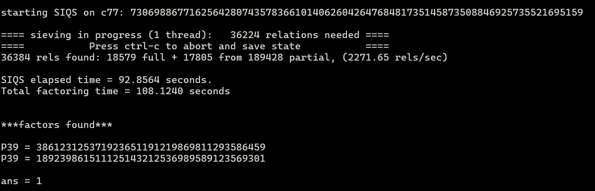
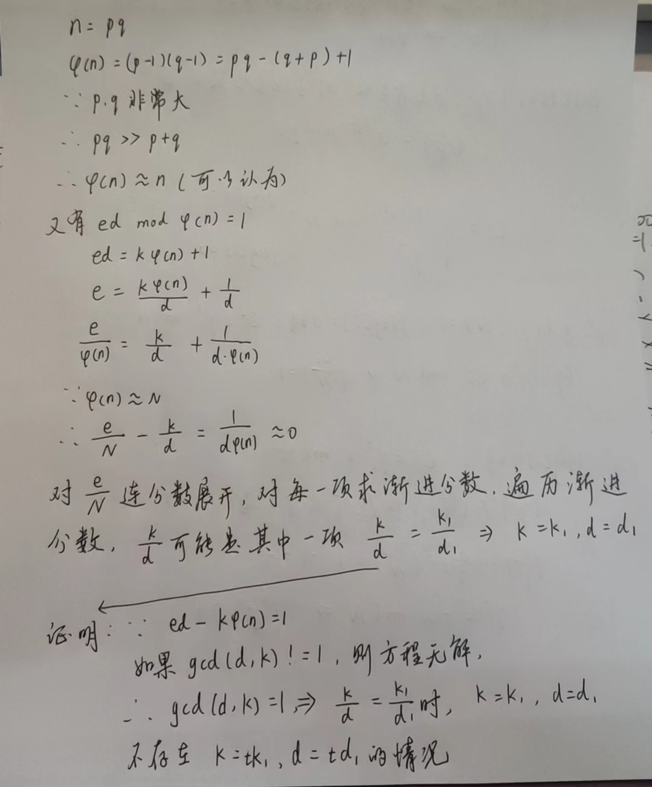

# 好好总结RSA题型

# 1.直接分解n得到p、q
- 适用情况：n已知且可因式分解（n不太大）
- 第一种，在线分解http://www.factordb.com/
- 第二种，yafu工具分解https://sourceforge.net/projects/yafu/ ,yafu分解适用于两个数相差很大或者相差很小（如相邻素数）


    yafu-x64 factor(n)                               //常规分解n

    yafu-x64 "factor(@)" -batchfile a.txt   //把n复制到txt文件中再分解,用于n过长的情况,txt文件最后要回车

- 例题，[WUSTCTF2020]babyrsa
```
c = 28767758880940662779934612526152562406674613203406706867456395986985664083182
n = 73069886771625642807435783661014062604264768481735145873508846925735521695159
e = 65537
```

- 题目直接了当给了c，n，e，可以直接分解n

p = 386123125371923651191219869811293586459
q = 189239861511125143212536989589123569301

- 解密脚本
```python
import gmpy2
from Crypto.Util.number import *

p = 386123125371923651191219869811293586459
q = 189239861511125143212536989589123569301

e = 65537
c = 28767758880940662779934612526152562406674613203406706867456395986985664083182

n = p * q
d = gmpy2.invert(e, (p - 1) * (q - 1))
print(d)
m = pow(c, d, n)
print(m)
print(long_to_bytes(m))

```
## 相邻素数分解n
- [ACTF新生赛2020]crypto-rsa3
```python
from flag import FLAG
from Cryptodome.Util.number import *
import gmpy2
import random

e = 65537
p = getPrime(512)
q = int(gmpy2.next_prime(p))
n = p * q
m = bytes_to_long(FLAG)
c = pow(m, e, n)
print(n)
print(c)
# n = 177606504836499246970959030226871608885969321778211051080524634084516973331441644993898029573612290095853069264036530459253652875586267946877831055147546910227100566496658148381834683037366134553848011903251252726474047661274223137727688689535823533046778793131902143444408735610821167838717488859902242863683
# c = 1457390378511382354771000540945361168984775052693073641682375071407490851289703070905749525830483035988737117653971428424612332020925926617395558868160380601912498299922825914229510166957910451841730028919883807634489834128830801407228447221775264711349928156290102782374379406719292116047581560530382210049

```
## p,q相邻分解n，联立方程
- 题目简单，只需要分解n就行，已知p，q是相邻的素数，使用yafu分解
- 脚本就不需要了，太简单了

- 题目[ACTF新生赛2020]crypto-rsa3
```python
N=636585149594574746909030160182690866222909256464847291783000651837227921337237899651287943597773270944384034858925295744880727101606841413640006527614873110651410155893776548737823152943797884729130149758279127430044739254000426610922834573094957082589539445610828279428814524313491262061930512829074466232633130599104490893572093943832740301809630847541592548921200288222432789208650949937638303429456468889100192613859073752923812454212239908948930178355331390933536771065791817643978763045030833712326162883810638120029378337092938662174119747687899484603628344079493556601422498405360731958162719296160584042671057160241284852522913676264596201906163
m1=90009974341452243216986938028371257528604943208941176518717463554774967878152694586469377765296113165659498726012712288670458884373971419842750929287658640266219686646956929872115782173093979742958745121671928568709468526098715927189829600497283118051641107305128852697032053368115181216069626606165503465125725204875578701237789292966211824002761481815276666236869005129138862782476859103086726091860497614883282949955023222414333243193268564781621699870412557822404381213804026685831221430728290755597819259339616650158674713248841654338515199405532003173732520457813901170264713085107077001478083341339002069870585378257051150217511755761491021553239
m2=487443985757405173426628188375657117604235507936967522993257972108872283698305238454465723214226871414276788912058186197039821242912736742824080627680971802511206914394672159240206910735850651999316100014691067295708138639363203596244693995562780286637116394738250774129759021080197323724805414668042318806010652814405078769738548913675466181551005527065309515364950610137206393257148357659666687091662749848560225453826362271704292692847596339533229088038820532086109421158575841077601268713175097874083536249006018948789413238783922845633494023608865256071962856581229890043896939025613600564283391329331452199062858930374565991634191495137939574539546

```

- p，q接近，先yafu分解
- 解密c1，c2，联立方程解出f1，f2(解方程是本题的重点)
- 输出flag1和flag2，拼接得到flag
- 脚本如下：
```python
from gmpy2 import *
from Crypto.Util.number import *
from sympy import symbols, solve
from sympy.abc import a, b, c

n = 636585149594574746909030160182690866222909256464847291783000651837227921337237899651287943597773270944384034858925295744880727101606841413640006527614873110651410155893776548737823152943797884729130149758279127430044739254000426610922834573094957082589539445610828279428814524313491262061930512829074466232633130599104490893572093943832740301809630847541592548921200288222432789208650949937638303429456468889100192613859073752923812454212239908948930178355331390933536771065791817643978763045030833712326162883810638120029378337092938662174119747687899484603628344079493556601422498405360731958162719296160584042671057160241284852522913676264596201906163
m1 = 90009974341452243216986938028371257528604943208941176518717463554774967878152694586469377765296113165659498726012712288670458884373971419842750929287658640266219686646956929872115782173093979742958745121671928568709468526098715927189829600497283118051641107305128852697032053368115181216069626606165503465125725204875578701237789292966211824002761481815276666236869005129138862782476859103086726091860497614883282949955023222414333243193268564781621699870412557822404381213804026685831221430728290755597819259339616650158674713248841654338515199405532003173732520457813901170264713085107077001478083341339002069870585378257051150217511755761491021553239
m2 = 487443985757405173426628188375657117604235507936967522993257972108872283698305238454465723214226871414276788912058186197039821242912736742824080627680971802511206914394672159240206910735850651999316100014691067295708138639363203596244693995562780286637116394738250774129759021080197323724805414668042318806010652814405078769738548913675466181551005527065309515364950610137206393257148357659666687091662749848560225453826362271704292692847596339533229088038820532086109421158575841077601268713175097874083536249006018948789413238783922845633494023608865256071962856581229890043896939025613600564283391329331452199062858930374565991634191495137939574539546
# p,q相邻，使用yafu分解很快
p = 797862863902421984951231350430312260517773269684958456342860983236184129602390919026048496119757187702076499551310794177917920137646835888862706126924088411570997141257159563952725882214181185531209186972351469946269508511312863779123205322378452194261217016552527754513215520329499967108196968833163329724620251096080377748737
q = 797862863902421984951231350430312260517773269684958456342860983236184129602390919026048496119757187702076499551310794177917920137646835888862706126924088411570997141257159563952725882214181185531209186972351469946269508511312863779123205322378452194261217016552527754513215520329499967108196968833163329724620251096080377747699
e = "0x10001"
e = int(e, 16)
# e = 65537
d = gmpy2.invert(e, (p - 1) * (q - 1))
c1 = pow(m1, d, n)
c2 = pow(m2, d, n)

# 接下来解方程
aa = solve([a + b - c1, pow(a, 3) + pow(b, 3) - c2], [a, b])
print(aa)
f1 = 1141553212031156130619789508463772513350070909
f2 = 1590956290598033029862556611630426044507841845
print(long_to_bytes(f2))
print(long_to_bytes(f1))
# GWHT{f709e0e2cfe7e530ca8972959a1033b2}

```
## n可以分解，e和phi不互素
- 题目[NPUCTF2020]EzRSA1
```python
from gmpy2 import lcm , powmod , invert , gcd , mpz
from Crypto.Util.number import getPrime
from sympy import nextprime
from random import randint
p = getPrime(1024)
q = getPrime(1024)
n = p * q
gift = lcm(p - 1 , q - 1)
e = 54722
flag = b'NPUCTF{******************}'
m = int.from_bytes(flag , 'big')
c = powmod(m , e , n)
print('n: ' , n)
print('gift: ' , gift)
print('c: ' , c)

#n:  17083941230213489700426636484487738282426471494607098847295335339638177583685457921198569105417734668692072727759139358207667248703952436680183153327606147421932365889983347282046439156176685765143620637107347870401946946501620531665573668068349080410807996582297505889946205052879002028936125315312256470583622913646319779125559691270916064588684997382451412747432722966919513413709987353038375477178385125453567111965259721484997156799355617642131569095810304077131053588483057244340742751804935494087687363416921314041547093118565767609667033859583125275322077617576783247853718516166743858265291135353895239981121
#gift:  2135492653776686212553329560560967285303308936825887355911916917454772197960682240149821138177216833586509090969892419775958406087994054585022894165950768427741545736247918410255804894522085720642952579638418483800243368312702566458196708508543635051350999572787188236243275631609875253617015664414032058822919469443284453403064076232765024248435543326597418851751586308514540124571309152787559712950209357825576896132278045112177910266019741013995106579484868768251084453338417115483515132869594712162052362083414163954681306259137057581036657441897428432575924018950961141822554251369262248368899977337886190114104
#c:  3738960639194737957667684143565005503596276451617922474669745529299929395507971435311181578387223323429323286927370576955078618335757508161263585164126047545413028829873269342924092339298957635079736446851837414357757312525158356579607212496060244403765822636515347192211817658170822313646743520831977673861869637519843133863288550058359429455052676323196728280408508614527953057214779165450356577820378810467527006377296194102671360302059901897977339728292345132827184227155061326328585640019916328847372295754472832318258636054663091475801235050657401857262960415898483713074139212596685365780269667500271108538319
```

- n可以分解，但是直接解会出错，求不出d，因为e和phi不互素
- 原理如下：
- 脚本：
```python
from sympy import *
from gmpy2 import *
from Crypto.Util.number import long_to_bytes

p = 106021448991021391444550749375115277080844281746248845802565680557785009341952320484175568763707424932172033597514861602114171459176440279045761846695231788376075050452154924141266290931413542110639081792550648106240966552406813059396358355737185354885474455248579946190266152416149137616855791805617206153497
q = 161136651053130509602530659420755324119806487925813087617466818245407407797561810253722204813002837916779909309520498985459703212021249251124954613236122142746302911323565396331355397916764254680629384957057354297855676493062493901977415968666512459829211010720514167083018352796496733697235524845188512914793
n = 17083941230213489700426636484487738282426471494607098847295335339638177583685457921198569105417734668692072727759139358207667248703952436680183153327606147421932365889983347282046439156176685765143620637107347870401946946501620531665573668068349080410807996582297505889946205052879002028936125315312256470583622913646319779125559691270916064588684997382451412747432722966919513413709987353038375477178385125453567111965259721484997156799355617642131569095810304077131053588483057244340742751804935494087687363416921314041547093118565767609667033859583125275322077617576783247853718516166743858265291135353895239981121
c = 3738960639194737957667684143565005503596276451617922474669745529299929395507971435311181578387223323429323286927370576955078618335757508161263585164126047545413028829873269342924092339298957635079736446851837414357757312525158356579607212496060244403765822636515347192211817658170822313646743520831977673861869637519843133863288550058359429455052676323196728280408508614527953057214779165450356577820378810467527006377296194102671360302059901897977339728292345132827184227155061326328585640019916328847372295754472832318258636054663091475801235050657401857262960415898483713074139212596685365780269667500271108538319
e = 54722
phi = (p - 1) * (q - 1)
# 直接解密不行因为e和phi不互素，求不出d
a = gcd(e, phi)
print(a)
# a=2,则e也要除以2
e = e // 2
d = gmpy2.invert(e, phi)
m = gmpy2.iroot(pow(c, d, n), 2)[0]
print(long_to_bytes(m))
# NPUCTF{diff1cult_rsa_1s_e@sy}

```

# 2.低加密指数攻击（e很小一般e=3）
## 2.1适用情况n很大但是e很小，一般e=3，重点是n和c相差很大
- n很大时我们就不能因式分解了，当然还有其他思路，例如当e很小时，比如e=3，有c=m^e+kn，我们可以对k进行爆破，直到c-kn可以开根，借此得到m。

- 题目
```
e = 0x3
n = 0x52d483c27cd806550fbe0e37a61af2e7cf5e0efb723dfc81174c918a27627779b21fa3c851e9e94188eaee3d5cd6f752406a43fbecb53e80836ff1e185d3ccd7782ea846c2e91a7b0808986666e0bdadbfb7bdd65670a589a4d2478e9adcafe97c6ee23614bcb2ecc23580f4d2e3cc1ecfec25c50da4bc754dde6c8bfd8d1fc16956c74d8e9196046a01dc9f3024e11461c294f29d7421140732fedacac97b8fe50999117d27943c953f18c4ff4f8c258d839764078d4b6ef6e8591e0ff5563b31a39e6374d0d41c8c46921c25e5904a817ef8e39e5c9b71225a83269693e0b7e3218fc5e5a1e8412ba16e588b3d6ac536dce39fcdfce81eec79979ea6872793
c = 0x10652cdfaa6b63f6d7bd1109da08181e500e5643f5b240a9024bfa84d5f2cac9310562978347bb232d63e7289283871efab83d84ff5a7b64a94a79d34cfbd4ef121723ba1f663e514f83f6f01492b4e13e1bb4296d96ea5a353d3bf2edd2f449c03c4a3e995237985a596908adc741f32365

```

- 解题脚本

```python
import gmpy2
from Crypto.Util.number import *
 
def de(c, e, n):
    k = 0
    while True:
        m = c + n*k
        result, flag = gmpy2.iroot(m, e)
        if True == flag:
            return result
        k += 1
e= 3
n= 0x52d483c27cd806550fbe0e37a61af2e7cf5e0efb723dfc81174c918a27627779b21fa3c851e9e94188eaee3d5cd6f752406a43fbecb53e80836ff1e185d3ccd7782ea846c2e91a7b0808986666e0bdadbfb7bdd65670a589a4d2478e9adcafe97c6ee23614bcb2ecc23580f4d2e3cc1ecfec25c50da4bc754dde6c8bfd8d1fc16956c74d8e9196046a01dc9f3024e11461c294f29d7421140732fedacac97b8fe50999117d27943c953f18c4ff4f8c258d839764078d4b6ef6e8591e0ff5563b31a39e6374d0d41c8c46921c25e5904a817ef8e39e5c9b71225a83269693e0b7e3218fc5e5a1e8412ba16e588b3d6ac536dce39fcdfce81eec79979ea6872793
c= 0x10652cdfaa6b63f6d7bd1109da08181e500e5643f5b240a9024bfa84d5f2cac9310562978347bb232d63e7289283871efab83d84ff5a7b64a94a79d34cfbd4ef121723ba1f663e514f83f6f01492b4e13e1bb4296d96ea5a353d3bf2edd2f449c03c4a3e995237985a596908adc741f32365
 
m=de(c,e,n)
print(m)
print(long_to_bytes(m))
```
- 函数说明
gmpy2.iroot(m, e) 函数用于计算整数 m 的 e 次方根。它返回一个包含两个元素的元组 (root, exact)，其中 root 是 m 的 e 次方根的整数部分，而 exact 是一个布尔值，指示是否确切地找到了 m 的 e 次方根。

## 2.2 e很小，但c与n差距不大，已知m高位爆破低位（Coppersmith算法）
- 此时不能直接爆破m^e，复杂度太大
- [NewStarCTF 2023 公开赛道]小明的密码题
```python
from Crypto.Util.number import *
from secret import *
flag_part = flag_content + '#' + secret_token
p = getPrime(512)
q = getPrime(512)

m = bytes_to_long(flag_part.encode())

e = 5
n = p*q

c = pow(m,e,n)

print('n =', n)
print('c =', c)
print('flag_part =', flag_part)
print()
print('--- hint begin ---')
print('flag = "flag{" + flag_part + "}"')
print('type of secret_token is', type(secret_token))
print('length of secret_token is', len(secret_token))

# n = 131889193322687215946601811511407251196213571687093913054335139712633125177496800529685285401802802683116451016274353008428347997732857844896393358010946452397522017632024075459908859131965234835870443110233375074265933004741459359128684375786221535003839961829770182916778717973782408036072622166388614214899
# c = 11188201757361363141578235564807411583085091933389381887827791551369738717117549969067660372214366275040055647621817803877495473068767571465521881010707873686036336475554105314475193676388608812872218943728455841652208711802376453034141883236142677345880594246879967378770573385522326039206400578260353074379
# flag_part = sm4ll_r00ts_is_brilliant#◼️◼️◼️◼️◼️◼️◼️◼️
# 
# --- hint begin ---
# flag = "flag{" + flag_part + "}"
# type of secret_token is <class 'str'>
# length of secret_token is 8

```
- 此题e很小，e=5，但c，n接近
- 已知m的高位是sm4ll_r00ts_is_brilliant#，使用Coppersmith算法爆破低位
- EXP:
```python
# sage运行
from sage.all import *
from Crypto.Util.number import *
n = 131889193322687215946601811511407251196213571687093913054335139712633125177496800529685285401802802683116451016274353008428347997732857844896393358010946452397522017632024075459908859131965234835870443110233375074265933004741459359128684375786221535003839961829770182916778717973782408036072622166388614214899
c = 11188201757361363141578235564807411583085091933389381887827791551369738717117549969067660372214366275040055647621817803877495473068767571465521881010707873686036336475554105314475193676388608812872218943728455841652208711802376453034141883236142677345880594246879967378770573385522326039206400578260353074379
part = bytes_to_long(b'sm4ll_r00ts_is_brilliant#')
# 定义一个多项式环，F 是在模 n 下的整数环，x 是多项式环的生成元。
F = Zmod(n)
x = PolynomialRing(F, 'x').gen()
# 构造一个多项式 f，它将部分明文左移 64 位后与 x 相加，然后取五次幂。这个多项式 f 与密文 c 相减，得到一个在模 n 下的多项式 f。
f = ((part << 64) + x) ** 5 - c
# 使用 small_roots 函数在多项式 f 中寻找值为 2 的 64 次方的根，其中第一个根即为我们需要的解密结果
xx = f.small_roots(X = 2 ** 64)[0]
flag = (part << 64) + xx
print(b'flag{'+ long_to_bytes(int(flag)) +b'}')
#flag{sm4ll_r00ts_is_brilliant#cc0dac72}
```

## 2.3 e很小，c，n相差不大，已知部分明文攻击coefficients
- welcome CTF2022 rsa2
```python
from Crypto.Util.number import bytes_to_long, getPrime

FLAG = <REDACTED>

assert 60 <= len(FLAG) <= 80

message = "Dear Sir/Madam,\n\n" \
+ "I am writing this email to let you know about our new CTF.\n" \
+ FLAG + "\n\n" \
+ "The CTF is hosted at https://welcomectf.nusgreyhats.org/ \n" \
+ "We have a rsa encryption challenge here. Do you want to try and solve it?\n\n"

p = getPrime(1024)
q = getPrime(1024)
e = 3
n = p * q
m = bytes_to_long(message.encode())

c = pow(m, e, n)

print(f"n = {n}")
print(f"c = {c}")

# n = 17310997569767470937982704478928823328709005148408703299271211912505536893274677120330093385140013778107513760348674228622058664142400741560854905538512983692695782620762366341416390488026695961022289762583846386942084644532083287618474879299569554507405459436526598533783358365591238146236993010356644841001112026790227190700334409564980351693854918670098673243029383582774362297709914060586877753795823335091537258909992359347994070802100045460566531640507381531806264772450282645091409092707774400876187066848715079136965327781234657208923744165370777595523581384495089320790889212805369379414196501019779597370397
# c = 2145583958382769131219261083711973450386674486801103506091963180720017614567928417625039715454375401558004906983704693732907166757173985801795274591651948692560474767604650249972749219380157198910954536422100307434685154867639789830659596579561615156250986146631188868005157514298175247161326175798163550224151297597152834112334622768072076953987309046766052281326954253176400036404418024152528178864611467388543724200225189599992140890494672555316509847989355275395703322949002384755607044720620975872580216541603063661542329091608615249994011278019429374837769601089441990922510583038271638444538996876539455650766

```
- e=3,c,n相差不大，部分明文是已知的，采用coefficients攻击
```python
# sage
from Crypto.Util.number import bytes_to_long, long_to_bytes

n = 17310997569767470937982704478928823328709005148408703299271211912505536893274677120330093385140013778107513760348674228622058664142400741560854905538512983692695782620762366341416390488026695961022289762583846386942084644532083287618474879299569554507405459436526598533783358365591238146236993010356644841001112026790227190700334409564980351693854918670098673243029383582774362297709914060586877753795823335091537258909992359347994070802100045460566531640507381531806264772450282645091409092707774400876187066848715079136965327781234657208923744165370777595523581384495089320790889212805369379414196501019779597370397
c = 2145583958382769131219261083711973450386674486801103506091963180720017614567928417625039715454375401558004906983704693732907166757173985801795274591651948692560474767604650249972749219380157198910954536422100307434685154867639789830659596579561615156250986146631188868005157514298175247161326175798163550224151297597152834112334622768072076953987309046766052281326954253176400036404418024152528178864611467388543724200225189599992140890494672555316509847989355275395703322949002384755607044720620975872580216541603063661542329091608615249994011278019429374837769601089441990922510583038271638444538996876539455650766

e = 3

R.<m> = Zmod(n)[]

msgPart1 = "Dear Sir/Madam,\n\n" \
+ "I am writing this email to let you know about our new CTF.\n"

msgPart2 = "\n\n" \
+ "The CTF is hosted at https://welcomectf.nusgreyhats.org/ \n" \
+ "We have a rsa encryption challenge here. Do you want to try and solve it?\n\n"

for l in range(60, 80):
    f = bytes_to_long(msgPart1.encode()) * 256^(len(msgPart2) + l) 
    f += m * 256^(len(msgPart2)) 
    f += bytes_to_long(msgPart2.encode())
    f = f^e - c
    f /= f.coefficients()[-1]
    sol = f.small_roots(X=256^72, epsilon=0.05)
    if (len(sol) == 0):
        continue
    print(long_to_bytes(int(sol[0])))

# greyhats{If_you_Know_part_of_it_you_know_all_of_it_RZZgrFNxKvHtsFyU6wQj}

```

# 3.低指数加密广播攻击（e很小;多组n,c;中国剩余定理）
适用情况：很多组不同的n和c，但用的是同一个e且很小。
此时我们可以使用中国剩余定理来求出m^e

- 题目buuctf RSA4
```
N = 331310324212000030020214312244232222400142410423413104441140203003243002104333214202031202212403400220031202142322434104143104244241214204444443323000244130122022422310201104411044030113302323014101331214303223312402430402404413033243132101010422240133122211400434023222214231402403403200012221023341333340042343122302113410210110221233241303024431330001303404020104442443120130000334110042432010203401440404010003442001223042211442001413004 
c = 310020004234033304244200421414413320341301002123030311202340222410301423440312412440240244110200112141140201224032402232131204213012303204422003300004011434102141321223311243242010014140422411342304322201241112402132203101131221223004022003120002110230023341143201404311340311134230140231412201333333142402423134333211302102413111111424430032440123340034044314223400401224111323000242234420441240411021023100222003123214343030122032301042243

N = 302240000040421410144422133334143140011011044322223144412002220243001141141114123223331331304421113021231204322233120121444434210041232214144413244434424302311222143224402302432102242132244032010020113224011121043232143221203424243134044314022212024343100042342002432331144300214212414033414120004344211330224020301223033334324244031204240122301242232011303211220044222411134403012132420311110302442344021122101224411230002203344140143044114 
c = 112200203404013430330214124004404423210041321043000303233141423344144222343401042200334033203124030011440014210112103234440312134032123400444344144233020130110134042102220302002413321102022414130443041144240310121020100310104334204234412411424420321211112232031121330310333414423433343322024400121200333330432223421433344122023012440013041401423202210124024431040013414313121123433424113113414422043330422002314144111134142044333404112240344

N = 332200324410041111434222123043121331442103233332422341041340412034230003314420311333101344231212130200312041044324431141033004333110021013020140020011222012300020041342040004002220210223122111314112124333211132230332124022423141214031303144444134403024420111423244424030030003340213032121303213343020401304243330001314023030121034113334404440421242240113103203013341231330004332040302440011324004130324034323430143102401440130242321424020323 
c = 10013444120141130322433204124002242224332334011124210012440241402342100410331131441303242011002101323040403311120421304422222200324402244243322422444414043342130111111330022213203030324422101133032212042042243101434342203204121042113212104212423330331134311311114143200011240002111312122234340003403312040401043021433112031334324322123304112340014030132021432101130211241134422413442312013042141212003102211300321404043012124332013240431242
```


- 解题
- 当n很大时我们就可以考虑e=3的低指数情况，把n和c放到数组里，像n=[n1,n2,n3]，c=[c1,c2,c3].然后最方便的是调用sympy库里的中国剩余定理，也就是crt(c,n)方法直接可以求出m的e次，然后开方得到m就行了。其中sympy也是第三方库，可以pip或者pycharm里导入的时候顺手装上去就行了。
这道题还有一点要注意的是给出的n和c是五进制，注意先转换成10进制。python解题脚本如下：
```python
import gmpy2
import libnum
from Crypto.Util.number import long_to_bytes
from sympy.ntheory.modular import crt
 
N1 = int('331310324212000030020214312244232222400142410423413104441140203003243002104333214202031202212403400220031202142322434104143104244241214204444443323000244130122022422310201104411044030113302323014101331214303223312402430402404413033243132101010422240133122211400434023222214231402403403200012221023341333340042343122302113410210110221233241303024431330001303404020104442443120130000334110042432010203401440404010003442001223042211442001413004',5)
c1 = int('310020004234033304244200421414413320341301002123030311202340222410301423440312412440240244110200112141140201224032402232131204213012303204422003300004011434102141321223311243242010014140422411342304322201241112402132203101131221223004022003120002110230023341143201404311340311134230140231412201333333142402423134333211302102413111111424430032440123340034044314223400401224111323000242234420441240411021023100222003123214343030122032301042243',5)
 
N2 = int('302240000040421410144422133334143140011011044322223144412002220243001141141114123223331331304421113021231204322233120121444434210041232214144413244434424302311222143224402302432102242132244032010020113224011121043232143221203424243134044314022212024343100042342002432331144300214212414033414120004344211330224020301223033334324244031204240122301242232011303211220044222411134403012132420311110302442344021122101224411230002203344140143044114',5)
c2 = int('112200203404013430330214124004404423210041321043000303233141423344144222343401042200334033203124030011440014210112103234440312134032123400444344144233020130110134042102220302002413321102022414130443041144240310121020100310104334204234412411424420321211112232031121330310333414423433343322024400121200333330432223421433344122023012440013041401423202210124024431040013414313121123433424113113414422043330422002314144111134142044333404112240344',5)
 
N3 = int('332200324410041111434222123043121331442103233332422341041340412034230003314420311333101344231212130200312041044324431141033004333110021013020140020011222012300020041342040004002220210223122111314112124333211132230332124022423141214031303144444134403024420111423244424030030003340213032121303213343020401304243330001314023030121034113334404440421242240113103203013341231330004332040302440011324004130324034323430143102401440130242321424020323',5)
c3 = int('10013444120141130322433204124002242224332334011124210012440241402342100410331131441303242011002101323040403311120421304422222200324402244243322422444414043342130111111330022213203030324422101133032212042042243101434342203204121042113212104212423330331134311311114143200011240002111312122234340003403312040401043021433112031334324322123304112340014030132021432101130211241134422413442312013042141212003102211300321404043012124332013240431242',5)
 
e = 3
n = [N1,N2,N3]
c = [c1,c2,c3]
resultant, mod = crt(n, c)
value, is_perfect = gmpy2.iroot(resultant, e)
print(long_to_bytes(value))
```

- 函数说明
crt(n, c) 函数是用于求解中国剩余定理（Chinese Remainder Theorem, CRT）的。在密码学中，当你有多个模数和它们对应的同余方程的解时，你可以使用CRT来找到一个整数，它在每个模数下都满足给定的同余方程。
函数签名可能会有所不同，但通常 n 是模数的列表，c 是同余方程的解的列表。crt(n, c) 函数将返回满足所有同余方程的解。
crt(n, c) 函数的两个返回值分别是解密后的明文和模数。

# 4.公因数攻击（多组n,c）
- 适用情况：很多组n和c
和上面的广播攻击类似，题目会给你很多组n和c。我们知道n=p*q，而p、q是两个大素数。所以说当有很多组n的时候，很有可能出现两个n之间存在公因数。而这个公因数就是p和q其中的一个，当然知道其中一个另一个也就知道了，我们就可以求出d进而根据对应密文求出m。

- 题目buuctf rsa5
- 题目给了20组n和c，这里就不展示了，还给了e=65537
- 脚本
```python
import gmpy2
import libnum
from Crypto.Util.number import long_to_bytes

n1 = 20474918894051778533305262345601880928088284471121823754049725354072477155873778848055073843345820697886641086842612486541250183965966001591342031562953561793332341641334302847996108417466360688139866505179689516589305636902137210185624650854906780037204412206309949199080005576922775773722438863762117750429327585792093447423980002401200613302943834212820909269713876683465817369158585822294675056978970612202885426436071950214538262921077409076160417436699836138801162621314845608796870206834704116707763169847387223307828908570944984416973019427529790029089766264949078038669523465243837675263858062854739083634207
c1 = 974463908243330865728978769213595400782053398596897741316275722596415018912929508637393850919224969271766388710025195039896961956062895570062146947736340342927974992616678893372744261954172873490878805483241196345881721164078651156067119957816422768524442025688079462656755605982104174001635345874022133045402344010045961111720151990412034477755851802769069309069018738541854130183692204758761427121279982002993939745343695671900015296790637464880337375511536424796890996526681200633086841036320395847725935744757993013352804650575068136129295591306569213300156333650910795946800820067494143364885842896291126137320

n2 = 20918819960648891349438263046954902210959146407860980742165930253781318759285692492511475263234242002509419079545644051755251311392635763412553499744506421566074721268822337321637265942226790343839856182100575539845358877493718334237585821263388181126545189723429262149630651289446553402190531135520836104217160268349688525168375213462570213612845898989694324269410202496871688649978370284661017399056903931840656757330859626183773396574056413017367606446540199973155630466239453637232936904063706551160650295031273385619470740593510267285957905801566362502262757750629162937373721291789527659531499435235261620309759
c2 = 15819636201971185538694880505120469332582151856714070824521803121848292387556864177196229718923770810072104155432038682511434979353089791861087415144087855679134383396897817458726543883093567600325204596156649305930352575274039425470836355002691145864435755333821133969266951545158052745938252574301327696822347115053614052423028835532509220641378760800693351542633860702225772638930501021571415907348128269681224178300248272689705308911282208685459668200507057183420662959113956077584781737983254788703048275698921427029884282557468334399677849962342196140864403989162117738206246183665814938783122909930082802031855

n3 = 25033254625906757272369609119214202033162128625171246436639570615263949157363273213121556825878737923265290579551873824374870957467163989542063489416636713654642486717219231225074115269684119428086352535471683359486248203644461465935500517901513233739152882943010177276545128308412934555830087776128355125932914846459470221102007666912211992310538890654396487111705385730502843589727289829692152177134753098649781412247065660637826282055169991824099110916576856188876975621376606634258927784025787142263367152947108720757222446686415627479703666031871635656314282727051189190889008763055811680040315277078928068816491
c3 = 4185308529416874005831230781014092407198451385955677399668501833902623478395669279404883990725184332709152443372583701076198786635291739356770857286702107156730020004358955622511061410661058982622055199736820808203841446796305284394651714430918690389486920560834672316158146453183789412140939029029324756035358081754426645160033262924330248675216108270980157049705488620263485129480952814764002865280019185127662449318324279383277766416258142275143923532168798413011028271543085249029048997452212503111742302302065401051458066585395360468447460658672952851643547193822775218387853623453638025492389122204507555908862

n4 = 21206968097314131007183427944486801953583151151443627943113736996776787181111063957960698092696800555044199156765677935373149598221184792286812213294617749834607696302116136745662816658117055427803315230042700695125718401646810484873064775005221089174056824724922160855810527236751389605017579545235876864998419873065217294820244730785120525126565815560229001887622837549118168081685183371092395128598125004730268910276024806808565802081366898904032509920453785997056150497645234925528883879419642189109649009132381586673390027614766605038951015853086721168018787523459264932165046816881682774229243688581614306480751
c4 = 4521038011044758441891128468467233088493885750850588985708519911154778090597136126150289041893454126674468141393472662337350361712212694867311622970440707727941113263832357173141775855227973742571088974593476302084111770625764222838366277559560887042948859892138551472680654517814916609279748365580610712259856677740518477086531592233107175470068291903607505799432931989663707477017904611426213770238397005743730386080031955694158466558475599751940245039167629126576784024482348452868313417471542956778285567779435940267140679906686531862467627238401003459101637191297209422470388121802536569761414457618258343550613

n5 = 22822039733049388110936778173014765663663303811791283234361230649775805923902173438553927805407463106104699773994158375704033093471761387799852168337898526980521753614307899669015931387819927421875316304591521901592823814417756447695701045846773508629371397013053684553042185725059996791532391626429712416994990889693732805181947970071429309599614973772736556299404246424791660679253884940021728846906344198854779191951739719342908761330661910477119933428550774242910420952496929605686154799487839923424336353747442153571678064520763149793294360787821751703543288696726923909670396821551053048035619499706391118145067
c5 = 15406498580761780108625891878008526815145372096234083936681442225155097299264808624358826686906535594853622687379268969468433072388149786607395396424104318820879443743112358706546753935215756078345959375299650718555759698887852318017597503074317356745122514481807843745626429797861463012940172797612589031686718185390345389295851075279278516147076602270178540690147808314172798987497259330037810328523464851895621851859027823681655934104713689539848047163088666896473665500158179046196538210778897730209572708430067658411755959866033531700460551556380993982706171848970460224304996455600503982223448904878212849412357

n6 = 21574139855341432908474064784318462018475296809327285532337706940126942575349507668289214078026102682252713757703081553093108823214063791518482289846780197329821139507974763780260290309600884920811959842925540583967085670848765317877441480914852329276375776405689784571404635852204097622600656222714808541872252335877037561388406257181715278766652824786376262249274960467193961956690974853679795249158751078422296580367506219719738762159965958877806187461070689071290948181949561254144310776943334859775121650186245846031720507944987838489723127897223416802436021278671237227993686791944711422345000479751187704426369
c6 = 20366856150710305124583065375297661819795242238376485264951185336996083744604593418983336285185491197426018595031444652123288461491879021096028203694136683203441692987069563513026001861435722117985559909692670907347563594578265880806540396777223906955491026286843168637367593400342814725694366078337030937104035993569672959361347287894143027186846856772983058328919716702982222142848848117768499996617588305301483085428547267337070998767412540225911508196842253134355901263861121500650240296746702967594224401650220168780537141654489215019142122284308116284129004257364769474080721001708734051264841350424152506027932

n7 = 25360227412666612490102161131174584819240931803196448481224305250583841439581008528535930814167338381983764991296575637231916547647970573758269411168219302370541684789125112505021148506809643081950237623703181025696585998044695691322012183660424636496897073045557400768745943787342548267386564625462143150176113656264450210023925571945961405709276631990731602198104287528528055650050486159837612279600415259486306154947514005408907590083747758953115486124865486720633820559135063440942528031402951958557630833503775112010715604278114325528993771081233535247118481765852273252404963430792898948219539473312462979849137
c7 = 19892772524651452341027595619482734356243435671592398172680379981502759695784087900669089919987705675899945658648623800090272599154590123082189645021800958076861518397325439521139995652026377132368232502108620033400051346127757698623886142621793423225749240286511666556091787851683978017506983310073524398287279737680091787333547538239920607761080988243639547570818363788673249582783015475682109984715293163137324439862838574460108793714172603672477766831356411304446881998674779501188163600664488032943639694828698984739492200699684462748922883550002652913518229322945040819064133350314536378694523704793396169065179

n8 = 22726855244632356029159691753451822163331519237547639938779517751496498713174588935566576167329576494790219360727877166074136496129927296296996970048082870488804456564986667129388136556137013346228118981936899510687589585286517151323048293150257036847475424044378109168179412287889340596394755257704938006162677656581509375471102546261355748251869048003600520034656264521931808651038524134185732929570384705918563982065684145766427962502261522481994191989820110575981906998431553107525542001187655703534683231777988419268338249547641335718393312295800044734534761692799403469497954062897856299031257454735945867491191
c8 = 6040119795175856407541082360023532204614723858688636724822712717572759793960246341800308149739809871234313049629732934797569781053000686185666374833978403290525072598774001731350244744590772795701065129561898116576499984185920661271123665356132719193665474235596884239108030605882777868856122378222681140570519180321286976947154042272622411303981011302586225630859892731724640574658125478287115198406253847367979883768000812605395482952698689604477719478947595442185921480652637868335673233200662100621025061500895729605305665864693122952557361871523165300206070325660353095592778037767395360329231331322823610060006

n9 = 23297333791443053297363000786835336095252290818461950054542658327484507406594632785712767459958917943095522594228205423428207345128899745800927319147257669773812669542782839237744305180098276578841929496345963997512244219376701787616046235397139381894837435562662591060768476997333538748065294033141610502252325292801816812268934171361934399951548627267791401089703937389012586581080223313060159456238857080740699528666411303029934807011214953984169785844714159627792016926490955282697877141614638806397689306795328344778478692084754216753425842557818899467945102646776342655167655384224860504086083147841252232760941
c9 = 5418120301208378713115889465579964257871814114515046096090960159737859076829258516920361577853903925954198406843757303687557848302302200229295916902430205737843601806700738234756698575708612424928480440868739120075888681672062206529156566421276611107802917418993625029690627196813830326369874249777619239603300605876865967515719079797115910578653562787899019310139945904958024882417833736304894765433489476234575356755275147256577387022873348906900149634940747104513850154118106991137072643308620284663108283052245750945228995387803432128842152251549292698947407663643895853432650029352092018372834457054271102816934

n10 = 28873667904715682722987234293493200306976947898711255064125115933666968678742598858722431426218914462903521596341771131695619382266194233561677824357379805303885993804266436810606263022097900266975250431575654686915049693091467864820512767070713267708993899899011156106766178906700336111712803362113039613548672937053397875663144794018087017731949087794894903737682383916173267421403408140967713071026001874733487295007501068871044649170615709891451856792232315526696220161842742664778581287321318748202431466508948902745314372299799561625186955234673012098210919745879882268512656931714326782335211089576897310591491
c10 = 9919880463786836684987957979091527477471444996392375244075527841865509160181666543016317634963512437510324198702416322841377489417029572388474450075801462996825244657530286107428186354172836716502817609070590929769261932324275353289939302536440310628698349244872064005700644520223727670950787924296004296883032978941200883362653993351638545860207179022472492671256630427228461852668118035317021428675954874947015197745916918197725121122236369382741533983023462255913924692806249387449016629865823316402366017657844166919846683497851842388058283856219900535567427103603869955066193425501385255322097901531402103883869

n11 = 22324685947539653722499932469409607533065419157347813961958075689047690465266404384199483683908594787312445528159635527833904475801890381455653807265501217328757871352731293000303438205315816792663917579066674842307743845261771032363928568844669895768092515658328756229245837025261744260614860746997931503548788509983868038349720225305730985576293675269073709022350700836510054067641753713212999954307022524495885583361707378513742162566339010134354907863733205921845038918224463903789841881400814074587261720283879760122070901466517118265422863420376921536734845502100251460872499122236686832189549698020737176683019
c11 = 1491527050203294989882829248560395184804977277747126143103957219164624187528441047837351263580440686474767380464005540264627910126483129930668344095814547592115061057843470131498075060420395111008619027199037019925701236660166563068245683975787762804359520164701691690916482591026138582705558246869496162759780878437137960823000043988227303003876410503121370163303711603359430764539337597866862508451528158285103251810058741879687875218384160282506172706613359477657215420734816049393339593755489218588796607060261897905233453268671411610631047340459487937479511933450369462213795738933019001471803157607791738538467

n12 = 27646746423759020111007828653264027999257847645666129907789026054594393648800236117046769112762641778865620892443423100189619327585811384883515424918752749559627553637785037359639801125213256163008431942593727931931898199727552768626775618479833029101249692573716030706695702510982283555740851047022672485743432464647772882314215176114732257497240284164016914018689044557218920300262234652840632406067273375269301008409860193180822366735877288205783314326102263756503786736122321348320031950012144905869556204017430593656052867939493633163499580242224763404338807022510136217187779084917996171602737036564991036724299
c12 = 21991524128957260536043771284854920393105808126700128222125856775506885721971193109361315961129190814674647136464887087893990660894961612838205086401018885457667488911898654270235561980111174603323721280911197488286585269356849579263043456316319476495888696219344219866516861187654180509247881251251278919346267129904739277386289240394384575124331135655943513831009934023397457082184699737734388823763306805326430395849935770213817533387235486307008892410920611669932693018165569417445885810825749609388627231235840912644654685819620931663346297596334834498661789016450371769203650109994771872404185770230172934013971

n13 = 20545487405816928731738988374475012686827933709789784391855706835136270270933401203019329136937650878386117187776530639342572123237188053978622697282521473917978282830432161153221216194169879669541998840691383025487220850872075436064308499924958517979727954402965612196081404341651517326364041519250125036424822634354268773895465698920883439222996581226358595873993976604699830613932320720554130011671297944433515047180565484495191003887599891289037982010216357831078328159028953222056918189365840711588671093333013117454034313622855082795813122338562446223041211192277089225078324682108033843023903550172891959673551
c13 = 14227439188191029461250476692790539654619199888487319429114414557975376308688908028140817157205579804059783807641305577385724758530138514972962209062230576107406142402603484375626077345190883094097636019771377866339531511965136650567412363889183159616188449263752475328663245311059988337996047359263288837436305588848044572937759424466586870280512424336807064729894515840552404756879590698797046333336445465120445087587621743906624279621779634772378802959109714400516183718323267273824736540168545946444437586299214110424738159957388350785999348535171553569373088251552712391288365295267665691357719616011613628772175

n14 = 27359727711584277234897157724055852794019216845229798938655814269460046384353568138598567755392559653460949444557879120040796798142218939251844762461270251672399546774067275348291003962551964648742053215424620256999345448398805278592777049668281558312871773979931343097806878701114056030041506690476954254006592555275342579529625231194321357904668512121539514880704046969974898412095675082585315458267591016734924646294357666924293908418345508902112711075232047998775303603175363964055048589769318562104883659754974955561725694779754279606726358588862479198815999276839234952142017210593887371950645418417355912567987
c14 = 3788529784248255027081674540877016372807848222776887920453488878247137930578296797437647922494510483767651150492933356093288965943741570268943861987024276610712717409139946409513963043114463933146088430004237747163422802959250296602570649363016151581364006795894226599584708072582696996740518887606785460775851029814280359385763091078902301957226484620428513604630585131511167015763190591225884202772840456563643159507805711004113901417503751181050823638207803533111429510911616160851391754754434764819568054850823810901159821297849790005646102129354035735350124476838786661542089045509656910348676742844957008857457

n15 = 27545937603751737248785220891735796468973329738076209144079921449967292572349424539010502287564030116831261268197384650511043068738911429169730640135947800885987171539267214611907687570587001933829208655100828045651391618089603288456570334500533178695238407684702251252671579371018651675054368606282524673369983034682330578308769886456335818733827237294570476853673552685361689144261552895758266522393004116017849397346259119221063821663280935820440671825601452417487330105280889520007917979115568067161590058277418371493228631232457972494285014767469893647892888681433965857496916110704944758070268626897045014782837
c15 = 14069112970608895732417039977542732665796601893762401500878786871680645798754783315693511261740059725171342404186571066972546332813667711135661176659424619936101038903439144294886379322591635766682645179888058617577572409307484708171144488708410543462972008179994594087473935638026612679389759756811490524127195628741262871304427908481214992471182859308828778119005750928935764927967212343526503410515793717201360360437981322576798056276657140363332700714732224848346808963992302409037706094588964170239521193589470070839790404597252990818583717869140229811712295005710540476356743378906642267045723633874011649259842

n16 = 25746162075697911560263181791216433062574178572424600336856278176112733054431463253903433128232709054141607100891177804285813783247735063753406524678030561284491481221681954564804141454666928657549670266775659862814924386584148785453647316864935942772919140563506305666207816897601862713092809234429096584753263707828899780979223118181009293655563146526792388913462557306433664296966331469906428665127438829399703002867800269947855869262036714256550075520193125987011945192273531732276641728008406855871598678936585324782438668746810516660152018244253008092470066555687277138937298747951929576231036251316270602513451
c16 = 17344284860275489477491525819922855326792275128719709401292545608122859829827462088390044612234967551682879954301458425842831995513832410355328065562098763660326163262033200347338773439095709944202252494552172589503915965931524326523663289777583152664722241920800537867331030623906674081852296232306336271542832728410803631170229642717524942332390842467035143631504401140727083270732464237443915263865880580308776111219718961746378842924644142127243573824972533819479079381023103585862099063382129757560124074676150622288706094110075567706403442920696472627797607697962873026112240527498308535903232663939028587036724

n17 = 23288486934117120315036919418588136227028485494137930196323715336208849327833965693894670567217971727921243839129969128783853015760155446770590696037582684845937132790047363216362087277861336964760890214059732779383020349204803205725870225429985939570141508220041286857810048164696707018663758416807708910671477407366098883430811861933014973409390179948577712579749352299440310543689035651465399867908428885541237776143404376333442949397063249223702355051571790555151203866821867908531733788784978667478707672984539512431549558672467752712004519300318999208102076732501412589104904734983789895358753664077486894529499
c17 = 10738254418114076548071448844964046468141621740603214384986354189105236977071001429271560636428075970459890958274941762528116445171161040040833357876134689749846940052619392750394683504816081193432350669452446113285638982551762586656329109007214019944975816434827768882704630460001209452239162896576191876324662333153835533956600295255158377025198426950944040643235430211011063586032467724329735785947372051759042138171054165854842472990583800899984893232549092766400510300083585513014171220423103452292891496141806956300396540682381668367564569427813092064053993103537635994311143010708814851867239706492577203899024

n18 = 19591441383958529435598729113936346657001352578357909347657257239777540424811749817783061233235817916560689138344041497732749011519736303038986277394036718790971374656832741054547056417771501234494768509780369075443550907847298246275717420562375114406055733620258777905222169702036494045086017381084272496162770259955811174440490126514747876661317750649488774992348005044389081101686016446219264069971370646319546429782904810063020324704138495608761532563310699753322444871060383693044481932265801505819646998535192083036872551683405766123968487907648980900712118052346174533513978009131757167547595857552370586353973
c18 = 3834917098887202931981968704659119341624432294759361919553937551053499607440333234018189141970246302299385742548278589896033282894981200353270637127213483172182529890495903425649116755901631101665876301799865612717750360089085179142750664603454193642053016384714515855868368723508922271767190285521137785688075622832924829248362774476456232826885801046969384519549385428259591566716890844604696258783639390854153039329480726205147199247183621535172450825979047132495439603840806501254997167051142427157381799890725323765558803808030109468048682252028720241357478614704610089120810367192414352034177484688502364022887

n19 = 19254242571588430171308191757871261075358521158624745702744057556054652332495961196795369630484782930292003238730267396462491733557715379956969694238267908985251699834707734400775311452868924330866502429576951934279223234676654749272932769107390976321208605516299532560054081301829440688796904635446986081691156842271268059970762004259219036753174909942343204432795076377432107630203621754552804124408792358220071862369443201584155711893388877350138023238624566616551246804054720492816226651467017802504094070614892556444425915920269485861799532473383304622064493223627552558344088839860178294589481899206318863310603
c19 = 6790553533991297205804561991225493105312398825187682250780197510784765226429663284220400480563039341938599783346724051076211265663468643826430109013245014035811178295081939958687087477312867720289964506097819762095244479129359998867671811819738196687884696680463458661374310994610760009474264115750204920875527434486437536623589684519411519100170291423367424938566820315486507444202022408003879118465761273916755290898112991525546114191064022991329724370064632569903856189236177894007766690782630247443895358893983735822824243487181851098787271270256780891094405121947631088729917398317652320497765101790132679171889

n20 = 26809700251171279102974962949184411136459372267620535198421449833298448092580497485301953796619185339316064387798092220298630428207556482805739803420279056191194360049651767412572609187680508073074653291350998253938793269214230457117194434853888765303403385824786231859450351212449404870776320297419712486574804794325602760347306432927281716160368830187944940128907971027838510079519466846176106565164730963988892400240063089397720414921398936399927948235195085202171264728816184532651138221862240969655185596628285814057082448321749567943946273776184657698104465062749244327092588237927996419620170254423837876806659
c20 = 386213556608434013769864727123879412041991271528990528548507451210692618986652870424632219424601677524265011043146748309774067894985069288067952546139416819404039688454756044862784630882833496090822568580572859029800646671301748901528132153712913301179254879877441322285914544974519727307311002330350534857867516466612474769753577858660075830592891403551867246057397839688329172530177187042229028685862036140779065771061933528137423019407311473581832405899089709251747002788032002094495379614686544672969073249309703482556386024622814731015767810042969813752548617464974915714425595351940266077021672409858645427346

e = 65537
n = []
c = []
p = []
for i in range(1, 20):
    n.append(eval("n" + str(i)))
    c.append(eval("c" + str(i)))
data = list(zip(n, c))
for i in range(len(n)):
    for j in range(i + 1, len(n)):
        if gmpy2.gcd(n[i], n[j]) != 1:
            print(i, j)  # i=4,j=17
            print(gmpy2.gcd(n[i], n[j]))
p = gmpy2.gcd(n5, n18)
q = n5 // p
d = gmpy2.invert(e, (p - 1) * (q - 1))
print(d)
m = pow(c5, d, n5)
print(long_to_bytes(m))

```

# 5.低解密指数攻击（e很大）
- 适用情况：e很大
和低加密指数攻击相反，当e很大的时候我们怎么办呢，这里就要用到低解密指数攻击。当e很大时，相对的d就会很小。这里我们用到github上一个wienerHacker脚本[pablocelayes/rsa-wiener-attack: A Python implementation of the Wiener attack on RSA public-key encryption scheme. (github.com)](https://github.com/pablocelayes/rsa-wiener-attack)
下载之后把里面RSAwienerHacker.py改一改输入题目给你的e和n就可以帮你解出d。

- 题目 buuctf rsa2
```python
N = 101991809777553253470276751399264740131157682329252673501792154507006158434432009141995367241962525705950046253400188884658262496534706438791515071885860897552736656899566915731297225817250639873643376310103992170646906557242832893914902053581087502512787303322747780420210884852166586717636559058152544979471
e = 46731919563265721307105180410302518676676135509737992912625092976849075262192092549323082367518264378630543338219025744820916471913696072050291990620486581719410354385121760761374229374847695148230596005409978383369740305816082770283909611956355972181848077519920922059268376958811713365106925235218265173085

import hashlib
flag = "flag{" + hashlib.md5(hex(d)).hexdigest() + "}"
```

# 6.共模攻击
- 题目BUUCTF  [BJDCTF2020]rsa_output
```python
{21058339337354287847534107544613605305015441090508924094198816691219103399526800112802416383088995253908857460266726925615826895303377801614829364034624475195859997943146305588315939130777450485196290766249612340054354622516207681542973756257677388091926549655162490873849955783768663029138647079874278240867932127196686258800146911620730706734103611833179733264096475286491988063990431085380499075005629807702406676707841324660971173253100956362528346684752959937473852630145893796056675793646430793578265418255919376323796044588559726703858429311784705245069845938316802681575653653770883615525735690306674635167111,2767}

{21058339337354287847534107544613605305015441090508924094198816691219103399526800112802416383088995253908857460266726925615826895303377801614829364034624475195859997943146305588315939130777450485196290766249612340054354622516207681542973756257677388091926549655162490873849955783768663029138647079874278240867932127196686258800146911620730706734103611833179733264096475286491988063990431085380499075005629807702406676707841324660971173253100956362528346684752959937473852630145893796056675793646430793578265418255919376323796044588559726703858429311784705245069845938316802681575653653770883615525735690306674635167111,3659}

message1=20152490165522401747723193966902181151098731763998057421967155300933719378216342043730801302534978403741086887969040721959533190058342762057359432663717825826365444996915469039056428416166173920958243044831404924113442512617599426876141184212121677500371236937127571802891321706587610393639446868836987170301813018218408886968263882123084155607494076330256934285171370758586535415136162861138898728910585138378884530819857478609791126971308624318454905992919405355751492789110009313138417265126117273710813843923143381276204802515910527468883224274829962479636527422350190210717694762908096944600267033351813929448599

message2=11298697323140988812057735324285908480504721454145796535014418738959035245600679947297874517818928181509081545027056523790022598233918011261011973196386395689371526774785582326121959186195586069851592467637819366624044133661016373360885158956955263645614345881350494012328275215821306955212788282617812686548883151066866149060363482958708364726982908798340182288702101023393839781427386537230459436512613047311585875068008210818996941460156589314135010438362447522428206884944952639826677247819066812706835773107059567082822312300721049827013660418610265189288840247186598145741724084351633508492707755206886202876227
```
- 题目给的应该是c1,c2,e1,e2,和一个共同的n,并且e1和e2互质
gcd（e1，e2）=1

- 脚本
```python
import gmpy2
from Crypto.Util.number import getPrime, long_to_bytes

e1 = 2767
e2 = 3659
n = 21058339337354287847534107544613605305015441090508924094198816691219103399526800112802416383088995253908857460266726925615826895303377801614829364034624475195859997943146305588315939130777450485196290766249612340054354622516207681542973756257677388091926549655162490873849955783768663029138647079874278240867932127196686258800146911620730706734103611833179733264096475286491988063990431085380499075005629807702406676707841324660971173253100956362528346684752959937473852630145893796056675793646430793578265418255919376323796044588559726703858429311784705245069845938316802681575653653770883615525735690306674635167111

c1 = 20152490165522401747723193966902181151098731763998057421967155300933719378216342043730801302534978403741086887969040721959533190058342762057359432663717825826365444996915469039056428416166173920958243044831404924113442512617599426876141184212121677500371236937127571802891321706587610393639446868836987170301813018218408886968263882123084155607494076330256934285171370758586535415136162861138898728910585138378884530819857478609791126971308624318454905992919405355751492789110009313138417265126117273710813843923143381276204802515910527468883224274829962479636527422350190210717694762908096944600267033351813929448599
c2 = 11298697323140988812057735324285908480504721454145796535014418738959035245600679947297874517818928181509081545027056523790022598233918011261011973196386395689371526774785582326121959186195586069851592467637819366624044133661016373360885158956955263645614345881350494012328275215821306955212788282617812686548883151066866149060363482958708364726982908798340182288702101023393839781427386537230459436512613047311585875068008210818996941460156589314135010438362447522428206884944952639826677247819066812706835773107059567082822312300721049827013660418610265189288840247186598145741724084351633508492707755206886202876227

t, s1, s2 = gmpy2.gcdext(e1, e2)
print(t)
m = pow(c1, s1, n) * pow(c2, s2, n) % n
print(long_to_bytes(m))

```

- 函数说明
函数 gmpy2.gcdext(e1, e2) 用于计算两个整数 e1 和 e2 的最大公约数及其系数。具体来说，它返回一个三元组 (gcd, s, t)，其中 gcd 是 e1 和 e2 的最大公约数，s 和 t 是满足 s  * e1 + t * e2 = gcd 的整数。

# 共模攻攻击原理


## 例题2
- 题目[SWPUCTF 2021新生赛]crypto2
```python
from gmpy2 import *
from Crypto.Util.number import *
 
flag = '***************'
 
p = getPrime(512)
q = getPrime(512)
m1 = bytes_to_long(bytes(flag.encode()))
 
n = p * q
e1 = getPrime(32)
e2 = getPrime(32)
 
flag1 = pow(m1, e1, n)  # flag1=(m1^e1)%n
flag2 = pow(m1, e2, n)  # flag2=(m1^e2)%n   (de)mod&n=1    m=(c2^d2)%n
print('flag1= ' + str(flag1))
print('flag2= ' + str(flag2))
print('e1= ' + str(e1))
print('e2= ' + str(e2))
print('n= ' + str(n))
 
# flag1= 100156221476910922393504870369139942732039899485715044553913743347065883159136513788649486841774544271396690778274591792200052614669235485675534653358596366535073802301361391007325520975043321423979924560272762579823233787671688669418622502663507796640233829689484044539829008058686075845762979657345727814280
# flag2= 86203582128388484129915298832227259690596162850520078142152482846864345432564143608324463705492416009896246993950991615005717737886323630334871790740288140033046061512799892371429864110237909925611745163785768204802056985016447086450491884472899152778839120484475953828199840871689380584162839244393022471075
# e1= 3247473589
# e2= 3698409173
# n= 103606706829811720151309965777670519601112877713318435398103278099344725459597221064867089950867125892545997503531556048610968847926307322033117328614701432100084574953706259773711412853364463950703468142791390129671097834871371125741564434710151190962389213898270025272913761067078391308880995594218009110313
```

- 脚本
```python
from math import gcd
import gmpy2
from Crypto.Util.number import *

flag1 = 100156221476910922393504870369139942732039899485715044553913743347065883159136513788649486841774544271396690778274591792200052614669235485675534653358596366535073802301361391007325520975043321423979924560272762579823233787671688669418622502663507796640233829689484044539829008058686075845762979657345727814280
flag2 = 86203582128388484129915298832227259690596162850520078142152482846864345432564143608324463705492416009896246993950991615005717737886323630334871790740288140033046061512799892371429864110237909925611745163785768204802056985016447086450491884472899152778839120484475953828199840871689380584162839244393022471075
e1 = 3247473589
e2 = 3698409173
n = 103606706829811720151309965777670519601112877713318435398103278099344725459597221064867089950867125892545997503531556048610968847926307322033117328614701432100084574953706259773711412853364463950703468142791390129671097834871371125741564434710151190962389213898270025272913761067078391308880995594218009110313

t, s1, s2 = gmpy2.gcdext(e1, e2)
print(t)
# t = 1
m = pow(flag1, s1, n) * pow(flag2, s2, n) % n
print(long_to_bytes(m))
# NSSCTF{xxxxx******xxxxx}
```

## 6.1 共模攻击，e1,e2不互素
- 题目[SWPUCTF 2021新生赛]crypto1
```python
from gmpy2 import *
from Crypto.Util.number import *
 
 
 
flag  = '****************************'
p = getPrime(2048)
q = getPrime(2048)
m1 = bytes_to_long(bytes(flag.encode()))
 
e1*e2 = 3087# 3*3*7*7*7
n = p*q
print()
 
flag1 = pow(m1,e1,n)
flag2 = pow(m1,e2,n)
print('flag1= '+str(flag1))
print('flag2= '+str(flag2))
print('n= '+str(n))
 
 
#flag1= 463634070971821449698012827631572665302589213868521491855038966879005784397309389922926838028598122795187584361359142761652619958273094398420314927073008031088375892957173280915904309949716842152249806486027920136603248454946737961650252641668562626310035983343018705370077783879047584582817271215517599531278507300104564011142229942160380563527291388260832749808727470291331902902518196932928128107067117198707209620169906575791373793854773799564060536121390593687449884988936522369331738199522700261116496965863870682295858957952661531894477603953742494526632841396338388879198270913523572980574440793543571757278020533565628285714358815083303489096524318164071888139412436112963845619981511061231001617406815056986634680975142352197476024575809514978857034477688443230263761729039797859697947454810551009108031457294164840611157524719173343259485881089252938664456637673337362424443150013961181619441267926981848009107466576314685961478748352388452114042115892243272514245081604607798243817586737546663059737344687130881861357423084448027959893402445303299089606081931041217035955143939567456782107203447898345284731038150377722447329202078375870541529539840051415759436083384408203659613313535094343772238691393447475364806171594
#flag2= 130959534275704453216282334815034647265875632781798750901627773826812657339274362406246297925411291822193191483409847323315110393729020700526946712786793380991675008128561863631081095222226285788412970362518398757423705216112313533155390315204875516645459370629706277876211656753247984282379731850770447978537855070379324935282789327428625259945250066774049650951465043700088958965762054418615838049340724639373351248933494355591934236360506778496741051064156771092798005112534162050165095430065000827916096893408569751085550379620558282942254606978819033885539221416335848319082054806148859427713144286777516251724474319613960327799643723278205969253636514684757409059003348229151341200451785288395596484563480261212963114071064979559812327582474674812225260616757099890896900340007990585501470484762752362734968297532533654846190900571017635959385883945858334995884341767905619567505341752047589731815868489295690574109758825021386698440670611361127170896689015108432408490763723594673299472336065575301681055583084547847733168801030191262122130369687497236959760366874106043801542493392227424890925595734150487586757484304609945827925762382889592743709682485229267604771944535469557860120878491329984792448597107256325783346904408
#n= 609305637099654478882754880905638123124918364116173050874864700996165096776233155524277418132679727857702738043786588380577485490575591029930152718828075976000078971987922107645530323356525126496562423491563365836491753476840795804040219013880969539154444387313029522565456897962200817021423704204077133003361140660038327458057898764857872645377236870759691588009666047187685654297678987435769051762120388537868493789773766688347724903911796741124237476823452505450704989455260077833828660552130714794889208291939055406292476845194489525212129635173284301782141617878483740788532998492403101324795726865866661786740345862631916793208037250277376942046905892342213663197755010315060990871143919384283302925469309777769989798197913048813940747488087191697903624669415774198027063997058701217124640082074789591591494106726857376728759663074734040755438623372683762856958888826373151815914621262862750497078245369680378038995425628467728412953392359090775734440671874387905724083226246587924716226512631671786591611586774947156657178654343092123117255372954798131265566301316033414311712092913492774989048057650627801991277862963173961355088082419091848569675686058581383542877982979697235829206442087786927939745804017455244315305118437
 
 
```

- 脚本
```python
from math import gcd
from gmpy2 import *
from Crypto.Util.number import *

flag1 = 463634070971821449698012827631572665302589213868521491855038966879005784397309389922926838028598122795187584361359142761652619958273094398420314927073008031088375892957173280915904309949716842152249806486027920136603248454946737961650252641668562626310035983343018705370077783879047584582817271215517599531278507300104564011142229942160380563527291388260832749808727470291331902902518196932928128107067117198707209620169906575791373793854773799564060536121390593687449884988936522369331738199522700261116496965863870682295858957952661531894477603953742494526632841396338388879198270913523572980574440793543571757278020533565628285714358815083303489096524318164071888139412436112963845619981511061231001617406815056986634680975142352197476024575809514978857034477688443230263761729039797859697947454810551009108031457294164840611157524719173343259485881089252938664456637673337362424443150013961181619441267926981848009107466576314685961478748352388452114042115892243272514245081604607798243817586737546663059737344687130881861357423084448027959893402445303299089606081931041217035955143939567456782107203447898345284731038150377722447329202078375870541529539840051415759436083384408203659613313535094343772238691393447475364806171594
flag2 = 130959534275704453216282334815034647265875632781798750901627773826812657339274362406246297925411291822193191483409847323315110393729020700526946712786793380991675008128561863631081095222226285788412970362518398757423705216112313533155390315204875516645459370629706277876211656753247984282379731850770447978537855070379324935282789327428625259945250066774049650951465043700088958965762054418615838049340724639373351248933494355591934236360506778496741051064156771092798005112534162050165095430065000827916096893408569751085550379620558282942254606978819033885539221416335848319082054806148859427713144286777516251724474319613960327799643723278205969253636514684757409059003348229151341200451785288395596484563480261212963114071064979559812327582474674812225260616757099890896900340007990585501470484762752362734968297532533654846190900571017635959385883945858334995884341767905619567505341752047589731815868489295690574109758825021386698440670611361127170896689015108432408490763723594673299472336065575301681055583084547847733168801030191262122130369687497236959760366874106043801542493392227424890925595734150487586757484304609945827925762382889592743709682485229267604771944535469557860120878491329984792448597107256325783346904408
n = 609305637099654478882754880905638123124918364116173050874864700996165096776233155524277418132679727857702738043786588380577485490575591029930152718828075976000078971987922107645530323356525126496562423491563365836491753476840795804040219013880969539154444387313029522565456897962200817021423704204077133003361140660038327458057898764857872645377236870759691588009666047187685654297678987435769051762120388537868493789773766688347724903911796741124237476823452505450704989455260077833828660552130714794889208291939055406292476845194489525212129635173284301782141617878483740788532998492403101324795726865866661786740345862631916793208037250277376942046905892342213663197755010315060990871143919384283302925469309777769989798197913048813940747488087191697903624669415774198027063997058701217124640082074789591591494106726857376728759663074734040755438623372683762856958888826373151815914621262862750497078245369680378038995425628467728412953392359090775734440671874387905724083226246587924716226512631671786591611586774947156657178654343092123117255372954798131265566301316033414311712092913492774989048057650627801991277862963173961355088082419091848569675686058581383542877982979697235829206442087786927939745804017455244315305118437

# 此题只给了e1*e2，需要爆破
e = 3087


for e1 in range(1, e):
    if e % e1 == 0:
        e2 = e // e1
        t, s1, s2 = gmpy2.gcdext(e1, e2)
        print(t)
        m = pow(flag1, s1, n) * pow(flag2, s2, n) % n
        flag = long_to_bytes(iroot(m, t)[0])
        print(flag)

# NSSCTF{d64dba66-b608-4255-b888-0b0f25c2f90e}

```

- 值得注意的是此题e1，e2不互素，所以得到的m需要开t次方根之后才是真正的m
- iroot（m,t）返回两个值，第一个是m开t次方根的值，第二个数是布尔值，表示是否为精确根。iroot(m, t)[0]表示取第一个数

## 6.2 共模攻击，最后ascii码转换
- 题目buuctf SameMod
```python
{6266565720726907265997241358331585417095726146341989755538017122981360742813498401533594757088796536341941659691259323065631249,773}
{6266565720726907265997241358331585417095726146341989755538017122981360742813498401533594757088796536341941659691259323065631249,839}

message1=3453520592723443935451151545245025864232388871721682326408915024349804062041976702364728660682912396903968193981131553111537349
message2=5672818026816293344070119332536629619457163570036305296869053532293105379690793386019065754465292867769521736414170803238309535
```

- 脚本
```python
from math import gcd
import gmpy2
from Crypto.Util.number import *

flag1 = 3453520592723443935451151545245025864232388871721682326408915024349804062041976702364728660682912396903968193981131553111537349
flag2 = 5672818026816293344070119332536629619457163570036305296869053532293105379690793386019065754465292867769521736414170803238309535
e1 = 773
e2 = 839
n = 6266565720726907265997241358331585417095726146341989755538017122981360742813498401533594757088796536341941659691259323065631249

t, s1, s2 = gmpy2.gcdext(e1, e2)
print(t)
# t = 1
m = pow(flag1, s1, n) * pow(flag2, s2, n) % n

# 需要转ascii码，观察m的数字102,108,97,103正好是flag
result = str(m)
print(result)
flag = ""
i = 0
while i < len(result):
    if result[i] == "1":
        c = chr(int(result[i : i + 3]))
        i += 3
    else:
        c = chr(int(result[i : i + 2]))
        i += 2
    flag += c
print(flag)
# flag{whenwethinkitispossible}

```

## 6.3 共模攻击，但e不同，多组c + base64隐写
- 题目buuctf RSA & what
- 参考 https://www.cnblogs.com/vict0r/p/13572457.html
```python
from Crypto.Util.number import bytes_to_long, getPrime
from random import randint
from gmpy2 import powmod

p = getPrime(2048)
q = getPrime(2048)
N = p*q
Phi = (p-1)*(q-1)
def get_enc_key(N,Phi):
    e = getPrime(N)
    if Phi % e == 0:
        return get_enc_key(N, Phi)
    else:
        return e
e1 = get_enc_key(randint(10, 12), Phi)
e2 = get_enc_key(randint(10, 12), Phi)

fr = open(r"./base64", "rb")#flag is in this file
f1 = open(r"./HUB1", "wb")
f2 = open(r"./HUB2", "wb")
base64 = fr.read(255)
f1.write("%d\n%d\n" % (N, e1))
f2.write("%d\n%d\n" % (N, e2))
while len(base64)>0:
    pt = bytes_to_long(base64)
    ct1 = powmod(pt, e1, N)
    ct2 = powmod(pt, e2, N)
    f1.write("\n%d" % ct1)
    f2.write("\n%d" % ct2)
    base64 = fr.read(255)
fr.close()
f1.close()
f2.close()


```

- 打开HUB1和HUB2，发现相同的N，e1，e2和6组c
- 共模攻击，使用sameNAttack（自己再github上下载后添加到Lib文件夹中）中的same_n_attack（）函数 https://github.com/lineOneTwo/CTF/blob/master/sameNAttack.py
```python
from sameNAttack import same_n_attack
from Crypto.Util.number import *

N = 785095419718268286866508214304816985447077293766819398728046411166917810820484759314291028976498223661229395009474063173705162627037610993539617751905443039278227583504604808251931083818909467613277587874545761074364427549966555519371913859875313577282243053150056274667798049694695703660313532933165449312949725581708965417273055582216295994587600975970124811496270080896977076946000102701030260990598181466447208054713391526313700681341093922240317428173599031624125155188216489476825606191521182034969120343287691181300399683515414809262700457525876691808180257730351707673660380698973884642306898810000633684878715402823143549139850732982897459698089649561190746850698130299458080255582312696873149210028240898137822888492559957665067936573356367589784593119016624072433872744537432005911668494455733330689385141214653091888017782049043434862620306783436169856564175929871100669913438980899219579329897753233450934770193915434791427728636586218049874617231705308003720066269312729135764175698611068808404054125581540114956463603240222497919384691718744014002554201602395969312999994159599536026359879060218056496345745457493919771337601177449899066579857630036350871090452649830775029695488575574985078428560054253180863725364147
e1 = 1697
e2 = 599
ct1_1 = 412629526163150748619328091306742267675740578011800062477174189782151273970783531227579758540364970485350157944321579108232221072397135934034064481497887079641131808838242743811511451355024436983050572020925065644355566434625618133203024215941534926113892937988520918939061441606915556516246057349589921494351383160036280826024605351878408056180907759973804117263002554923041750587548819746346813966673034182913325507826219961923932100526305289894965216608254252188398580139545189681875824089456195044984585824938384521905334289906422454152976834867304693292466676355760173232407753256256317546190171995276258924613533179898467683358934751999655196790168438343198229183747091108262988777659858609744709324571850262293294975336628234767258858873839342596887193772615000676401522431518310648303975593582965021189182246986957349253156736526071639973844039068996404290548474640668851856078201093335425412842295604919065487301340901573809617549185106072798799159726375235125260509158832996701927878713084753334549129580912412168594170659605421750204835970231909591063407612779337478065175988365401590396247576709343727196106058477166945670117868989025903023998142850338956985816131805349549059377047477131270847579095628384569645636821650
ct2_1 = 592169079372093727306100216011395857825646323934289480976073629037543922902098120901138454462177159996376654176248238979132528728327590301098966139983157980612320563496546128644967731000716697705104079039156276714872147463350811303393260622707024952543509891692246246277965823414460326811240048060543656588688604452353899779068825120910282167004715339763187734797180326976132213325054697165320479166356562518029805927741656605174809726397565772271562066078076105491745903986597877400370206718954975288721072048333678609055008135809089304229015364348490924974097403734627265297637171818849461766523691595241613878709865506436588268999163342945070495338153600520537498539457396582804692959296612715752573140296135784933206146091436617979599749774330699946637591406356289409716084034451049094715202196203486088368791744107629271647320273259836915312794297246589501008666299165717722507702866033454215783240025504356157664454861755286285777763585177751796252655008206383024707883077513745863312079349790275094080707502392866946325796914450602264462588722052297430827681750827349094323968337670311272933785838850649376115667223821665435911506351891489985627506615492005617098615432522564204152887767244129985681083657783356557756654335186

ct1_2 = 494644347943710545224678831941589086572700792465459558770782213550069709458568349686998660541810166872034041584767487150140111151788221460027897193248273461607411027815984883969396220626358625041781558277804930212654296704055890683796941327712758797770820006623289146990000114915293539639766846910274034245607746230740851938158390562286057002223177609606376329007676845450142537930798148258428701466415483232670659815791064681384406494388237742330786225557303988025468036820082959712050733095860546860468575857084616069132051094882919253745234762029759124776348047587755897123575123506976140900565238840752841856713613368250071926171873213897914794115466890719123299469964019450899291410760762179836946570945555295288184698184555018368687708432612286248476073758067175481771199066581572870175460016017100414479346437034291784837132240891321931601494414908927713208448927221095745802380014441841139882391378410438764884597938773868771896252329517440068673532468372840830510218585255432000690265226016573313570977945083879214961394087065558376158826938257664840570952233832852869328785568175434516247720356520242602299510374317488182738732700078879665745909603766482100138001417023680647717824323143388857817595766172152883484274718248
ct2_2 = 373940646416832740878733255707567753033716583448402000789202767511920210382830343955553654111486728333980557319799362514960627879016797491389812007768832730979916230647641872759001906846747977631675704310179448857128160385701185892914523053669366534408863734305635222625590986006420486092550427301086984563126480814987024980594613542978310129247678826691418335300577577527951623696426435497835228167084738007750914270251001921329521479047662848650808989996085600197309361410863238526802127877523767262921515150984998560136647154865791163316503073285223966216441025637452229043510097323724381056976302288136843260163922706692913035222445496716008888946581535004546355744211680390731257309941902587303353139951102244865270295414474488798335404630458489706639805186573874814586736746232358849677477533671968344154242963289415569487579895910660999043578737461300406937828924818002658292769882181668784501439254131996848948120781562158861495883827848139425862249576454689133681009549361314460818658995959098228995702202268649635363105549975932395335076521137604288520082040121286614922986554652700056148966514178935952363036963217619879899671383604638416567950421350546204434902113156720006282720889591288850271076074941927715678306057176

ct1_3 = 152942283599728307168144137370127212672611894072038732126041098102628831053000986759260271210671922070555948023688596575415822984026159010574404359474670428678518262175033880513984372909748992727828381694416776740981021730545374002974037896534944567124543272737618380646771071804878796585983783360553761828325817820260204820004421979881871027255562690952334900616675606524933557440263648233514757200263521499508373975003431306847453046714027687108396945719803444444954079308404947126216395526551292104722047878178373207886033071857277857997932255251315982837892164421298202073945919187779856785892717251746704537315003771369737854896595170485152591013676942418134278534037654467840633528916812275267230155352077736583130992587670941654695382287023971261529987384520843829695778029311786431227409189019205818351911572757145556993606643464336196802350204616056286497246016800105003143046120608673496196758720552776772796609670537056331996894322779267635281472481559819839042424017171718303214059720568484939239370144038161541354254182769979771948759413102933987773401644506930205164891773826513161783736386604783484446345744957119469799231796368324927570694496679453313927562345656690240414624431304646248599226046524702364131095964335
ct2_3 = 527630926460622936571385649841758214453416849039412401087443444317101857090904711485538107058823056085840539073345920792871368232355475394571098380596835468509997340505604333730547799560998822989747473780307779717715522787724471724766494090783971030594671013168209717686720448579582618378459567979027822271918653169622428153856198907810040224340270362413432495029672123261375400927159831537760709974778708160583252613784358234858583174544777979242887938827573604837766801998381379999076416444683891078093889686055482709838668356120916040352123019019255084513769603803814947774554028717814638951416291274696771515474086351482107953150253616922787262398450376249126999644026382478413080973933173079111305142716133389111399235545279259017424722601848670061556859163943895466553927946412523750166582734005733378328468250568944945912238495877929717101722314678120172228493787964904072583905721074766711732215815561012960394537195757832959268603775112932862105945720853959285187521763557915356428113876893276879775603217718981852114599706699524551973934242045743122744146361596971245034059345915315495232135483464496114770357536576200511490922413208178149869347802988786513451486411409887164516065062084917556120712465074206435831498113605

ct1_4 = 79717988936247951265489157583697956031893477858854186991051529161879478488281744062318600470906120960002282886511477294555606503083169449335174864424180701080203993329996226566203834693869525797695969610065991941396723959032680019082506816443041598300477625793433080664346470586416385854692124426348587211026568667694805849554780794033764714016521711467557284846737236374990121316809833819996821592832639024026411520407330206281265390130763948165694574512140518775603040182029818771866749548761938870605590174330887949847420877829240131490902432602005681085180807294176837646062568094875766945890382971790015490163385088144673549085079635083262975154206269679142412897438231719704933258660779310737302680265445437771977749959110744959368586293082016067927548564967400845992380076107522755566531760628823374519718763740378295585535591752887339222947397184116326706799921515431185636740825707782742373783475781052674257292910213843986132987466810027275052416774693363446184518901899202502828670309452622347532932678874990809930682575738653876289384151496807194146308614368821006660626870989784697045160231069428458961107751207771093777394616856305293335603892178327520756554333365975114235981173451368131680404850832773147333013716920
ct2_4 = 8786437178698940322877889807009957616777351844979869726962356553244050911283984280960665761649310895230455072977431415102053987735969326553978994853162483051544656873294555116009995592043183070208706258164840540599577072097104139505857517663273929851202628854185356185647194933800084230503413037858893307713037149307477830536758283681093517617820169181420796105338681582230788318108428132051793761014952837330456262272828627355701464740578197966332613127307037255647286823496355917642353327912440019621838870388091824748629637425759125214639885130163183752378908729773517053259212525494555880921052679512582051516604297098204363525081039382358483926727008679327719083138865969291911863630382097160230960738043575559330264018212774424527719153248563876760067931499029384228993253862501939337758514377472011933279273181144830381169849387893799390755052093069179605579485710343655570028592595882436632426527654452895431758715126580164902410286422637215098476316042367916779431052267545769495994723721129943616294879642305545894912914632980455031755879087401575310699765408473606166727137934224515998416625122213056208800095077933103150699272650116151674702438463062734472714004926103668378506804002740045547964716693536349447660850580

ct1_5 = 123111353650401158556639983459870663057297871992927053886971224773529636525110628183715748795987525113177540092814119928708272290370336537110381023134637759740716140969662183269370676630325583385284994943164692397459103195434968057377474610500216801375394703781249039351368816958227409657934091741509357152328382960684515093945552479461382281913961956745154260686029997827565075768703774895750561575155143606297116391666385705899138085693913246313778033627210312268959737394553510894720099165193981333775907531107232556909478156441457899797515694348816961762796703443502856101079430585547997496001098926600499728389113862894833789669213630332988693669889340482430613291490613803204484751470676686041002772556117213612152322606737150858116122936539131795111263513114569794532805886643087299918196635113037777138666914296986040549274559835214505300618256105508764026461518876579387159881983544667258537064954616097750399839661065797883103731694314852301848272092388637114950059216922969842082648527035538090054093890365647676119748995243416337805666557501345234056968476142608491830438065401219751688687373709390057521910942736632126729711606256158399963682990881473178216060827021373776598901281958527655543318413664277921492723185984
ct2_5 = 205314962204511500352858372254132533167549960825498949618514841570703199264867431580754674275990554478140637041427842111391746883257447120035947621456863890934062044010795443059281736346976175772415034838334682726635263432655537852942177334888025283748611576171534251461847349566505628290587224150869640386437623371249743165260396675220683302142805646368906930575140628610003919131999295855501215111393294818218799982703289304596989070475000081175510085432290264502023736899104746316830742226946395027029820825791831870857382647221322734605026210073093918331247494307555600335550942340526536281372036612138713881098866303169425501998978400008829873080965592009371176208668290074288903681417933657472279670688597862835627506340169978450918788539270346340385928840299573889292189531738082166408734046381423516467694328971385421907314814283489322619386570046183556572383980777277173349209330683424343658179781015072259378576130442222984963071166207642585589822061597282467850868050737957726423713761694231879497037175627546427449730638216214828463003483408928375620315193290871300316930139260521382533279767663839278693750409419493280753368451508802658272220767624766390639285308433607255253282702383762149755935518922075584637512494819

ct1_6 = 36869806815936046911848195817405817350259890871483063184373728397968909458432625046025376290214729914038387534731762237978339011724858818860181178811639468996206294711495853807311240013786226884265118119546377272154555615363105236192878292703331473547623021744317034819416624562896226194523639793573028006666236271812390759036235867495803255905843636447252225413871038762657801345647584493917576263471587347202664391908570140389126903204602391093990827188675090199750617303773574821926387194478875191828814971296674530519321530805302667925998711835019806761133078403281404889374663875077339168901297819436499920958268483684335998301056068380228873524800383911402490807139268964095165069610454677558808756444381542173782815227920906224931028457073652453777424387873533280455944646592996920617956675786286711447540353883400282402551158169958389450168079568459656526911857835375748015814860506707921852997096156275804955989964215077733621769938075413007804223217091604613132253046399456747595300404564172224333936405545921819654435437072133387523533568472443532200069133022979195685683508297337961701169394794966256415112246587706103819620428258245999539040721929317130088874161577093962579487428358736401687123174207198251449851429295
ct2_6 = 271453634732502613378948161256470991260052778799128789839624515809143527363206813219580098196957510291648493698144497567392065251244844074992734669490296293997386198359280316655904691639367482203210051809125904410431506925238374843856343243276508280641059690938930957474434518308646618959004216831130099873532714372402117796666560677624822509159287675432413016478948594640872091688482149004426363946048517480052906306290126242866034249478040406351940088231081456109195799442996799641647167552689564613346415247906852055588498305665928450828756152103096629274760601528737639415361467941349982213641454967962723875032638267311935042334584913897338553953961877439389588793074211502597238465542889335363559052368180212013206172712561221352833891640659020253527584706465205486408990762759230842192028381048563437724528409174790022752557512795782713125166158329880702730769957185428522011430144840232256419113631679343171680631630775266488738173707357123139368825087043785842169049943237537188129367275730984789479909103397937113837824575137021012333461552176687570010445744268373840742899299977372834041925102853718964831225250407279578465008537542659673685686242773379131904890865110699190451534445434533919127658976874721029586168106207

ct1 = []
ct2 = []
flag = ""
for i in range(1, 7):
    ct1.append(eval("ct1_" + str(i)))
    ct2.append(eval("ct2_" + str(i)))
    flag += str(long_to_bytes(same_n_attack(N, e1, e2, ct1[i - 1], ct2[i - 1])))
print(flag)
# b'VEhJUz==\nRkxBR3==\nSVN=\nSElEREVOLo==\nQ0FO\nWU9V\nRklORM==\nSVT=\nT1VUP4==\nRE8=\nWU9V\nS05PV9==\nQkFTRTY0P5==\nWW91bmdD\nVEhJTku=\nWU9V\nQVJF\nTk9U\nVEhBVE==\nRkFNSUxJQVI=\nV0lUSO==\nQkFTRTY0Lh==\nQmFzZTY0\naXO=\nYW==\nZ3JvdXA=\nb2b=\nc2ltaWxhcn==\nYmluYXJ5LXRvLXRleHR=\nZW5jb2Rpbm'b'e=\nc2NoZW1lc0==\ndGhhdD==\ncmVwcmVzZW50\nYmluYXJ5\nZGF0YW==\naW5=\nYW6=\nQVNDSUl=\nc3RyaW5n\nZm9ybWF0\nYnk=\ndHJhbnNsYXRpbmd=\naXS=\naW50b1==\nYT==\ncmFkaXgtNjQ=\ncmVwcmVzZW50YXRpb24u\nVGhl\ndGVybc==\nQmFzZTY0\nb3JpZ2luYXRlc8==\nZnJvbd==\nYY==\nc3BlY2lmaWN=\nTUlNRT==\nY29udGVudI='b'=\ndHJhbnNmZXI=\nZW5jb2Rpbmcu\nVGhl\ncGFydGljdWxhct==\nc2V0\nb2b=\nNjR=\nY2hhcmFjdGVyc5==\nY2hvc2Vu\ndG+=\ncmVwcmVzZW50\ndGhl\nNjQ=\ncGxhY2UtdmFsdWVz\nZm9y\ndGhl\nYmFzZd==\ndmFyaWVz\nYmV0d2Vlbt==\naW1wbGVtZW50YXRpb25zLp==\nVGhl\nZ2VuZXJhbI==\nc3RyYXRlZ3n=\naXO=\ndG9=\nY2hvb3Nl\nNjR'b'=\nY2hhcmFjdGVyc5==\ndGhhdA==\nYXJl\nYm90aN==\nbWVtYmVyc5==\nb2a=\nYS==\nc3Vic2V0\nY29tbW9u\ndG8=\nbW9zdM==\nZW5jb2RpbmdzLA==\nYW5k\nYWxzb8==\ncHJpbnRhYmxlLg==\nVGhpc9==\nY29tYmluYXRpb25=\nbGVhdmVz\ndGhl\nZGF0YW==\ndW5saWtlbHk=\ndG/=\nYmV=\nbW9kaWZpZWS=\naW5=\ndHJhbnNpdE==\ndGhyb3V'b'naN==\naW5mb3JtYXRpb26=\nc3lzdGVtcyw=\nc3VjaN==\nYXM=\nRS1tYWlsLD==\ndGhhdA==\nd2VyZQ==\ndHJhZGl0aW9uYWxseQ==\nbm90\nOC1iaXQ=\nY2xlYW4uWzFd\nRm9y\nZXhhbXBsZSw=\nTUlNRSdz\nQmFzZTY0\naW1wbGVtZW50YXRpb24=\ndXNlcw==\nQahDWiw=\nYahDeiw=\nYW5k\nMKhDOQ==\nZm9y\ndGhl\nZmlyc3Q=\nNjI=\ndmFs'b'dWVzLg==\nT3RoZXI=\ndmFyaWF0aW9ucw==\nc2hhcmU=\ndGhpcw==\ncHJvcGVydHk=\nYnV0\nZGlmZmVy\naW4=\ndGhl\nc3ltYm9scw==\nY2hvc2Vu\nZm9y\ndGhl\nbGFzdA==\ndHdv\ndmFsdWVzOw==\nYW4=\nZXhhbXBsZQ==\naXM=\nVVRGLTcu'
```
- 得到base64密文
- 隐写脚本
```python
from Crypto.Util.number import *
import base64

c = b"VEhJUz==\nRkxBR3==\nSVN=\nSElEREVOLo==\nQ0FO\nWU9V\nRklORM==\nSVT=\nT1VUP4==\nRE8=\nWU9V\nS05PV9==\nQkFTRTY0P5==\nWW91bmdD\nVEhJTku=\nWU9V\nQVJF\nTk9U\nVEhBVE==\nRkFNSUxJQVI=\nV0lUSO==\nQkFTRTY0Lh==\nQmFzZTY0\naXO=\nYW==\nZ3JvdXA=\nb2b=\nc2ltaWxhcn==\nYmluYXJ5LXRvLXRleHR=\nZW5jb2Rpbme=\nc2NoZW1lc0==\ndGhhdD==\ncmVwcmVzZW50\nYmluYXJ5\nZGF0YW==\naW5=\nYW6=\nQVNDSUl=\nc3RyaW5n\nZm9ybWF0\nYnk=\ndHJhbnNsYXRpbmd=\naXS=\naW50b1==\nYT==\ncmFkaXgtNjQ=\ncmVwcmVzZW50YXRpb24u\nVGhl\ndGVybc==\nQmFzZTY0\nb3JpZ2luYXRlc8==\nZnJvbd==\nYY==\nc3BlY2lmaWN=\nTUlNRT==\nY29udGVudI==\ndHJhbnNmZXI=\nZW5jb2Rpbmcu\nVGhl\ncGFydGljdWxhct==\nc2V0\nb2b=\nNjR=\nY2hhcmFjdGVyc5==\nY2hvc2Vu\ndG+=\ncmVwcmVzZW50\ndGhl\nNjQ=\ncGxhY2UtdmFsdWVz\nZm9y\ndGhl\nYmFzZd==\ndmFyaWVz\nYmV0d2Vlbt==\naW1wbGVtZW50YXRpb25zLp==\nVGhl\nZ2VuZXJhbI==\nc3RyYXRlZ3n=\naXO=\ndG9=\nY2hvb3Nl\nNjR=\nY2hhcmFjdGVyc5==\ndGhhdA==\nYXJl\nYm90aN==\nbWVtYmVyc5==\nb2a=\nYS==\nc3Vic2V0\nY29tbW9u\ndG8=\nbW9zdM==\nZW5jb2RpbmdzLA==\nYW5k\nYWxzb8==\ncHJpbnRhYmxlLg==\nVGhpc9==\nY29tYmluYXRpb25=\nbGVhdmVz\ndGhl\nZGF0YW==\ndW5saWtlbHk=\ndG/=\nYmV=\nbW9kaWZpZWS=\naW5=\ndHJhbnNpdE==\ndGhyb3VnaN==\naW5mb3JtYXRpb26=\nc3lzdGVtcyw=\nc3VjaN==\nYXM=\nRS1tYWlsLD==\ndGhhdA==\nd2VyZQ==\ndHJhZGl0aW9uYWxseQ==\nbm90\nOC1iaXQ=\nY2xlYW4uWzFd\nRm9y\nZXhhbXBsZSw=\nTUlNRSdz\nQmFzZTY0\naW1wbGVtZW50YXRpb24=\ndXNlcw==\nQahDWiw=\nYahDeiw=\nYW5k\nMKhDOQ==\nZm9y\ndGhl\nZmlyc3Q=\nNjI=\ndmFsdWVzLg==\nT3RoZXI=\ndmFyaWF0aW9ucw==\nc2hhcmU=\ndGhpcw==\ncHJvcGVydHk=\nYnV0\nZGlmZmVy\naW4=\ndGhl\nc3ltYm9scw==\nY2hvc2Vu\nZm9y\ndGhl\nbGFzdA==\ndHdv\ndmFsdWVzOw==\nYW4=\nZXhhbXBsZQ==\naXM=\nVVRGLTcu"


def get_base64_diff_value(s1, s2):
    base64chars = b"ABCDEFGHIJKLMNOPQRSTUVWXYZabcdefghijklmnopqrstuvwxyz0123456789+/"
    res = 0
    for i in range(len(s2)):
        if s1[i] != s2[i]:
            return abs(base64chars.index(s1[i]) - base64chars.index(s2[i]))
    return res


def solve_stego():
    line = b""
    bin_str = ""
    for i in c:
        k = long_to_bytes(i)
        if k == b"\n":
            steg_line = line
            norm_line = base64.b64encode(base64.b64decode(line))
            diff = get_base64_diff_value(steg_line, norm_line)
            # print(diff)
            pads_num = steg_line.count(b"=")
            if diff:
                bin_str += bin(diff)[2:].zfill(pads_num * 2)
            else:
                bin_str += "0" * pads_num * 2
            print(goflag(bin_str))
            line = b""
            continue
        line += k


def goflag(bin_str):
    res_str = ""
    for i in range(0, len(bin_str), 8):
        res_str += chr(int(bin_str[i : i + 8], 2))
    return res_str


if __name__ == "__main__":
    solve_stego()


```

## 6.4 共模攻击 + 字符拼接
- [QCTF2018]Xman-RSA1
- 打开题目发现是代码，但是很乱，quipqiup解密
```python
from gmpy2 import is_prime
from os import urandom
import base64


def bytes_to_num(b):
    return int(b.encode("hev"), 16)


def num_to_bytes(n):
    b = hev(n)[2:-1]
    b = "0" + b if len(b) % 2 == 1 else b
    return b.decode("hev")


def get_a_prime(l):
    random_seed = urandom(l)
    num = bytes_to_num(random_seed)
    while true:
        if is_prime(num):
            break
        num += 1
        return num


def encrypt(s, e, n):
    p = bytes_to_num(s)
    p = pow(p, e, n)
    return num_to_bytes(p).encode("hev")


def separate(n):
    p = n % 4
    t = (p * p) % 4
    return t == 1


f = open("flag.tvt", "r")
flag = f.read()
msg1 = ""
msg2 = ""
for i in range(len(flag)):
    if separate(i):
        msg2 += flag[i]
    else:
        msg1 += flag[i]
p1 = get_a_prime(128)
p2 = get_a_prime(128)
p3 = get_a_prime(128)
n1 = p1 * p2
n2 = p1 * p3
e = 0x1001
c1 = encrypt(msg1, e, n1)
c2 = encrypt(msg2, e, n2)
print(c1)
print(c2)
e1 = 0x1001
e2 = 0x101
p4 = get_a_prime(128)
p5 = get_a_prime(128)
n3 = p4 * p5
c1 = num_to_bytes(pow(n1, e1, n3)).encode("hev")
c2 = num_to_bytes(pow(n1, e2, n3)).encode("hev")
print(c1)
print(c2)
print(base64.b64encode(num_to_bytes(n2)))
print(base64.b64encode(num_to_bytes(n3)))

```
- 其余文件中给了c1,c2,e,nc1,nc2,e1,e2,n2,n3
- 先通过共模攻击解出n1,n1可以直接分解，之后可以解出msg1，n2也可以分解，解出msg2
- 字符还原flag，记得flag += chr(msg1[i // 2])中chr转换，否则一直报错
- 脚本：
```python
import gmpy2
from Crypto.Util.number import long_to_bytes, bytes_to_long
from sympy import *
import base64

c1 = int(
    0x1240198B148089290E375B999569F0D53C32D356B2E95F5ACEE070F016B3BEF243D0B5E46D9AD7AA7DFE2F21BDA920D0AC7CE7B1E48F22B2DE410C6F391CE7C4347C65FFC9704ECB3068005E9F35CBBB7B27E0F7A18F4F42AE572D77AAA3EE189418D6A07BAB7D93BEAA365C98349D8599EB68D21313795F380F05F5B3DFDC6272635EDE1F83D308C0FDB2BAF444B9EE138132D0D532C3C7E60EFB25B9BF9CB62DBA9833AA3706344229BD6045F0877661A073B6DEEF2763452D0AD7AB3404BA494B93FD6DFDF4C28E4FE83A72884A99DDF15CA030ACE978F2DA87B79B4F504F1D15B5B96C654F6CD5179B72ED5F84D3A16A8F0D5BF6774E7FD98D27BF3C9839
)
c2 = int(
    0x129D5D4AB3F9E8017D4E6761702467BBEB1B884B6C4F8FF397D078A8C41186A3D52977FA2307D5B6A0AD01FEDFC3BA7B70F776BA3790A43444FB954E5AFD64B1A3ABEB6507CF70A5EB44678A886ADF81CB4848A35AFB4DB7CD7818F566C7E6E2911F5ABABDBDD2D4FF9825827E58D48D5466E021A64599B3E867840C07E29582961F81643DF07F678A61A9F9027EBD34094E272DFBDC4619FA0AC60F0189AF785DF77E7EC784E086CF692A7BF7113A7FB8446A65EFA8B431C6F72C14BCFA49C9B491FB1D87F2570059E0F13166A85BB555B40549F45F04BC5DBD09D8B858A5382BE6497D88197FFB86381085756365BD757EC3CDFA8A77BA1728EC2DE596C5AB
)
e = 0x1001
nc1 = int(
    0x2639C28E3609A4A8C953CCA9C326E8E062756305AE8AEE6EFCD346458AADE3EE8C2106AB9DFE5F470804F366AF738AA493FD2DC26CB249A922E121287F3EDDEC0ED8DEA89747DC57AED7CD2089D75C23A69BF601F490A64F73F6A583081AE3A7ED52238C13A95D3322065ADBA9053EE5B12F1DE1873DBAD9FBF4A50A2F58088DF0FDDFE2ED8CA1118C81268C8C0FD5572494276F4E48B5EB424F116E6F5E9D66DA1B6B3A8F102539B690C1636E82906A46F3C5434D5B04ED7938861F8D453908970ECCEF07BF13F723D6FDD26A61BE8B9462D0DDFBEDC91886DF194EA022E56C1780AA6C76B9F1C7D5EA743DC75CEC3C805324E90EA577FA396A1EFFDAFA3090
)

nc2 = int(
    0x42FF1157363D9CD10DA64EB4382B6457EBB740DBEF40ADE9B24A174D0145ADAA0115D86AA2FC2A41257F2B62486EAEBB655925DAC78DD8D13AB405AEF5B8B8F9830094C712193500DB49FB801E1368C73F88F6D8533C99C8E7259F8B9D1C926C47215ED327114F235BA8C873AF7A0052AA2D32C52880DB55C5615E5A1793B690C37EFDD5E503F717BB8DE716303E4D6C4116F62D81BE852C5D36EF282A958D8C82CF3B458DCC8191DCC7B490F227D1562B1D57FBCF7BF4B78A5D90CD385FD79C8CA4688E7D62B3204AEAF9692BA4D4E44875EAA63642775846434F9CE51D138CA702D907849823B1E86896E4EA6223F93FAE68B026CFE5FA5A665569A9E3948A
)
e1 = 0x1001
e2 = 0x101
s_n2 = "PVNHb2BfGAnmxLrbKhgsYXRwWIL9eOj6K0s3I0slKHCTXTAUtZh3T0r+RoSlhpO3+77AY8P7WETYz2Jzuv5FV/mMODoFrM5fMyQsNt90VynR6J3Jv+fnPJPsm2hJ1Fqt7EKaVRwCbt6a4BdcRoHJsYN/+eh7k/X+FL5XM7viyvQxyFawQrhSV79FIoX6xfjtGW+uAeVF7DScRcl49dlwODhFD7SeLqzoYDJPIQS+VSb3YtvrDgdV+EhuS1bfWvkkXRijlJEpLrgWYmMdfsYX8u/+Ylf5xcBGn3hv1YhQrBCg77AHuUF2w/gJ/ADHFiMcH3ux3nqOsuwnbGSr7jA6Cw=="
s_n3 = "TmNVbWUhCXR1od3gBpM+HGMKK/4ErfIKITxomQ/QmNCZlzmmsNyPXQBiMEeUB8udO7lWjQTYGjD6k21xjThHTNDG4z6C2cNNPz73VIaNTGz0hrh6CmqDowFbyrk+rv53QSkVKPa8EZnFKwGz9B3zXimm1D+01cov7V/ZDfrHrEjsDkgK4ZlrQxPpZAPl+yqGlRK8soBKhY/PF3/GjbquRYeYKbagpUmWOhLnF4/+DP33ve/EpaSAPirZXzf8hyatL4/5tAZ0uNq9W6T4GoMG+N7aS2GeyUA2sLJMHymW4cFK5l5kUvjslRdXOHTmz5eHxqIV6TmSBQRgovUijlNamQ=="
n2 = bytes_to_long(base64.b64decode(s_n2))
n3 = bytes_to_long(base64.b64decode(s_n3))

# 共模攻击解出n1
t, s1, s2 = gmpy2.gcdext(e1, e2)
n1 = pow(nc1, s1, n3) * pow(nc2, s2, n3) % n3
# print(n1)

# n1,n2都可以直接分解,求msg1
p2 = 36503560711222200347745635238792106713920033958622200829092748503591270659903081394620276506325026411074230626397319741508641600002903305233380003999170571805545704321579972221393658587490213987917997698711182322920804807669281318998024155277432216030985270653843416557319053811218180174081048812060180634801
p1 = 68475150402136550069561649755295544963289030785101058202360554598728892273874900512013972536010281921862638482624050145776516868431210229550944533343142576416459199101144902197593841367980791503251475193609136925280837184839979646652186999511796418448787979170775450657311911945185202715164053596280658868979
# print(gcd(e, (p1 - 1) * (p2 - 1)))
d1 = gmpy2.invert(e, (p1 - 1) * (p2 - 1))
msg1 = pow(c1, d1, n1)
msg1 = long_to_bytes(msg1)
# msg1 = "XA{RP0I_0Itrsigi s.y"

# 分解得到p3，求msg2
p3 = 113057116110640629442838729892384636071708596904428483152114609685936140664770589059214780753000125747653792221591510804947737833483206498631262985233023673075253476613965561679900695245558177430781375269136603105651856671527157586176048122119973067362460787539110922411635014408169669810929828500304139655817
# print(gcd(e, (p1 - 1) * (p3 - 1)))
d2 = gmpy2.invert(e, (p1 - 1) * (p3 - 1))
msg2 = pow(c2, d2, n2)
msg2 = long_to_bytes(msg2)
# msg2 = "MNCYT_55_neetnvmrap}"


# 调整顺序得到flag
def separate(n):
    p = n % 4
    t = (p * p) % 4
    return t == 1


flag = ""

for i in range(40):
    if i % 2 == 0:
        flag += chr(msg1[i // 2])
    else:
        flag += chr(msg2[(i - 1) // 2])
print(flag)
# XMAN{CRYPT0_I5_50_Interestingvim rsa.py}

```

## 6.5看似共模攻击，但指数互逆
- n00bzCTF2022 RSA
```python
# ct = 68915718021581205938132340378
# n = 22964326243465188806208175092817347325223751455203934839482603060029805229708465878030254819573089332477084079330445929855173787412006349904864930449245982063200060526847746608051441362052994064461426109292644943462306467765210530381760387813568149905672759271878822092979239650360475796179311415340966347044401497301347973838444826544061998479163636946750265778097717211762208385963205388216125639236403616607313423716206061201112615302831337395011064188536794425701313580122604533837935452384701344503773605128479669035610395170026350607423780797383865621285538151344219282466601404674101508588637419153433890102137
# s = 6747770137526404810839680591618349902868945426501581276399132116507818856417271976886226143238796548185022079396435297411063351895882402872038955136430497260880818613647851713479263986391308789043197324119239260033630040630976512064481721240642729114116561261667588426398515959668695454587899042998666589705506998832917739337175589667828567571421541128057015371328723095841794613223799998429126797512729366352049800447550388154359724453576012916007310993864290045596969157854816882402679820492333445924724199994952395214639223249892224753494733720946542351810699104265693993026233289328344375145590992008664182919067
from Crypto.Util.number import *
p = getPrime(1024)
q = getPrime(1024)
n = p*q
e = 65537
flag = b'REDACTED'
flag_int = bytes_to_long(flag)	
phi = (p-1)*(q-1)
ct = pow(flag_int,e,n)
#assert ct = 0xdeadbeefdeadbeefdeadbeef + 1337 + 1337 + 1337
d = inverse(e,phi)
s = pow(flag_int,d,n)
print(f's = {s}')
print(f'n = {n}')
print(f'ct = {ct}')
```

- 看起来像是共模攻击，但发现指数居然分别是e和d，s=flag^d % n,再来个e次方不就还原flag了么
- EXP：
```python
from Crypto.Util.number import long_to_bytes

ct = 68915718021581205938132340378
n = 22964326243465188806208175092817347325223751455203934839482603060029805229708465878030254819573089332477084079330445929855173787412006349904864930449245982063200060526847746608051441362052994064461426109292644943462306467765210530381760387813568149905672759271878822092979239650360475796179311415340966347044401497301347973838444826544061998479163636946750265778097717211762208385963205388216125639236403616607313423716206061201112615302831337395011064188536794425701313580122604533837935452384701344503773605128479669035610395170026350607423780797383865621285538151344219282466601404674101508588637419153433890102137
s = 6747770137526404810839680591618349902868945426501581276399132116507818856417271976886226143238796548185022079396435297411063351895882402872038955136430497260880818613647851713479263986391308789043197324119239260033630040630976512064481721240642729114116561261667588426398515959668695454587899042998666589705506998832917739337175589667828567571421541128057015371328723095841794613223799998429126797512729366352049800447550388154359724453576012916007310993864290045596969157854816882402679820492333445924724199994952395214639223249892224753494733720946542351810699104265693993026233289328344375145590992008664182919067
e = 65537
m = pow(s, e, n)
print(long_to_bytes(m))
# b'n00bz{pl34s3_s1gn_h3r3_4nd_h3r3_4nd_h3r3...}'
```

# 7.dp泄露
- 适用情况：题目提供dp/dq
有时候除了e,n,c之外题目还会给你像dp,dq这样的值，这是为了方便计算产生的，同时也给了我们另一种解题思路。首先，了解dp,dq是什么东西：
```
dp = d % (p - 1)
```
- 然后就可以进行推导，简单过程如下:
```
d = dp + k1 * (p-1) 

d * e = 1 + k2(p-1)(q-1) 

把第二个式子的d代换掉：

e * (dp + k1(p-1)) = 1 + k2(p-1)(q-1)

两边同时对(p-1)取模，消去k

e * dp % (p - 1) = 1

e * dp = 1 + k(p - 1)

k = (e * dp - 1) / (p - 1)
又有dp < p - 1
所以 k = (e * dp - 1) / (p - 1) < e,接下来就可以爆破k
```
- 得到这个式子之后我们就可以通过爆破k的方式来求出p，进而求出d。

- 题目BUUCTF RSA2
```
e = 65537

n=248254007851526241177721526698901802985832766176221609612258877371620580060433101538328030305219918697643619814200930679612109885533801335348445023751670478437073055544724280684733298051599167660303645183146161497485358633681492129668802402065797789905550489547645118787266601929429724133167768465309665906113

dp=905074498052346904643025132879518330691925174573054004621877253318682675055421970943552016695528560364834446303196939207056642927148093290374440210503657

c=140423670976252696807533673586209400575664282100684119784203527124521188996403826597436883766041879067494280957410201958935737360380801845453829293997433414188838725751796261702622028587211560353362847191060306578510511380965162133472698713063592621028959167072781482562673683090590521214218071160287665180751
```

- 脚本
```python
import gmpy2
from Crypto.Util.number import long_to_bytes

e = 65537
n = 248254007851526241177721526698901802985832766176221609612258877371620580060433101538328030305219918697643619814200930679612109885533801335348445023751670478437073055544724280684733298051599167660303645183146161497485358633681492129668802402065797789905550489547645118787266601929429724133167768465309665906113
dp = 905074498052346904643025132879518330691925174573054004621877253318682675055421970943552016695528560364834446303196939207056642927148093290374440210503657

c = 140423670976252696807533673586209400575664282100684119784203527124521188996403826597436883766041879067494280957410201958935737360380801845453829293997433414188838725751796261702622028587211560353362847191060306578510511380965162133472698713063592621028959167072781482562673683090590521214218071160287665180751

# i即是k
for i in range(1, e):
    if (dp * e - 1) % i == 0:  # (dp * e - 1)整除k
        if n % (((dp * e - 1) // i) + 1) == 0:  # ((dp * e - 1) // i) = p - 1
            p = ((dp * e - 1) // i) + 1
            q = n // (((dp * e - 1) // i) + 1)
            d = gmpy2.invert(e, (p - 1) * (q - 1))
            m = pow(c, d, n)

print(m)
print(long_to_bytes(m))
# flag{wow_leaking_dp_breaks_rsa?_98924743502}

```

# 8.dp,dq同时泄露
- 适用情况：dp,dq同时泄露
有的时候题目把dp，dq都给我们了，这个时候我们不用知道e也可以解密。此时有：
```
    m1 = c ^ dp mod p
    m2 = c ^ dq mod q
    m = (((m1 - m2) * I) % p)* q+ m2
    其中I为对pq求逆元
```

- 题目buuctf rsa1
```
p = 8637633767257008567099653486541091171320491509433615447539162437911244175885667806398411790524083553445158113502227745206205327690939504032994699902053229 
q = 12640674973996472769176047937170883420927050821480010581593137135372473880595613737337630629752577346147039284030082593490776630572584959954205336880228469 
dp = 6500795702216834621109042351193261530650043841056252930930949663358625016881832840728066026150264693076109354874099841380454881716097778307268116910582929 
dq = 783472263673553449019532580386470672380574033551303889137911760438881683674556098098256795673512201963002175438762767516968043599582527539160811120550041 
c = 24722305403887382073567316467649080662631552905960229399079107995602154418176056335800638887527614164073530437657085079676157350205351945222989351316076486573599576041978339872265925062764318536089007310270278526159678937431903862892400747915525118983959970607934142974736675784325993445942031372107342103852
```

- 脚本
```python
import gmpy2
from Crypto.Util.number import long_to_bytes
p = 8637633767257008567099653486541091171320491509433615447539162437911244175885667806398411790524083553445158113502227745206205327690939504032994699902053229
q = 12640674973996472769176047937170883420927050821480010581593137135372473880595613737337630629752577346147039284030082593490776630572584959954205336880228469
dp = 6500795702216834621109042351193261530650043841056252930930949663358625016881832840728066026150264693076109354874099841380454881716097778307268116910582929
dq = 783472263673553449019532580386470672380574033551303889137911760438881683674556098098256795673512201963002175438762767516968043599582527539160811120550041
c = 24722305403887382073567316467649080662631552905960229399079107995602154418176056335800638887527614164073530437657085079676157350205351945222989351316076486573599576041978339872265925062764318536089007310270278526159678937431903862892400747915525118983959970607934142974736675784325993445942031372107342103852
I = gmpy2.invert(q,p)
m1 = pow(c,dp,p)
m2 = pow(c,dq,q)
m = (((m1-m2)*I)%p)*q+m2
print(long_to_bytes(m))
# noxCTF{W31c0m3_70_Ch1n470wn}
```

# 9.共享素数
- 适用情况：多个n，且多个n之间有共同的因子
- 题目[羊城杯 2021]Bigrsa‘共享素数’
```python
n1 = 103835296409081751860770535514746586815395898427260334325680313648369132661057840680823295512236948953370895568419721331170834557812541468309298819497267746892814583806423027167382825479157951365823085639078738847647634406841331307035593810712914545347201619004253602692127370265833092082543067153606828049061
n2 = 115383198584677147487556014336448310721853841168758012445634182814180314480501828927160071015197089456042472185850893847370481817325868824076245290735749717384769661698895000176441497242371873981353689607711146852891551491168528799814311992471449640014501858763495472267168224015665906627382490565507927272073
e = 65537
m = bytes_to_long(flag)
c = pow(m, e, n1)
c = pow(c, e, n2)

print("c = %d" % c)

# output
# c = 60406168302768860804211220055708551816238816061772464557956985699400782163597251861675967909246187833328847989530950308053492202064477410641014045601986036822451416365957817685047102703301347664879870026582087365822433436251615243854347490600004857861059245403674349457345319269266645006969222744554974358264
```

- 脚本
```python
from math import gcd
import gmpy2
from Crypto.Util.number import long_to_bytes

n1 = 103835296409081751860770535514746586815395898427260334325680313648369132661057840680823295512236948953370895568419721331170834557812541468309298819497267746892814583806423027167382825479157951365823085639078738847647634406841331307035593810712914545347201619004253602692127370265833092082543067153606828049061
n2 = 115383198584677147487556014336448310721853841168758012445634182814180314480501828927160071015197089456042472185850893847370481817325868824076245290735749717384769661698895000176441497242371873981353689607711146852891551491168528799814311992471449640014501858763495472267168224015665906627382490565507927272073
e = 65537
# 先看一下n1，n2是否有共同因子
p = gcd(n1, n2)
print(p)
# p = 10210039189276167395636779557271057346691950991057423589319031237857569595284598319093522326723650646963251941930167018746859556383067696079622198265424441

# 这里要用//,不能用/,/会得到浮点数
q1 = n1 // p
q2 = n2 // p

d1 = gmpy2.invert(e, (p - 1) * (q1 - 1))
d2 = gmpy2.invert(e, (p - 1) * (q2 - 1))

# 根据加密顺序解密
c = 60406168302768860804211220055708551816238816061772464557956985699400782163597251861675967909246187833328847989530950308053492202064477410641014045601986036822451416365957817685047102703301347664879870026582087365822433436251615243854347490600004857861059245403674349457345319269266645006969222744554974358264
m = pow(c, d2, n2)
m = pow(m, d1, n1)

flag = long_to_bytes(m)
print(flag)
# SangFor{qSccmm1WrgvIg2Uq_cZhmqNfEGTz2GV8}

```

- 题目[BJDCTF2020]RSA
```python3
from Crypto.Util.number import getPrime,bytes_to_long

flag=open("flag","rb").read()

p=getPrime(1024)
q=getPrime(1024)
assert(e<100000)
n=p*q
m=bytes_to_long(flag)
c=pow(m,e,n)
print c,n
print pow(294,e,n)

p=getPrime(1024)
n=p*q
m=bytes_to_long("BJD"*32)
c=pow(m,e,n)
print c,n

'''
output:
12641635617803746150332232646354596292707861480200207537199141183624438303757120570096741248020236666965755798009656547738616399025300123043766255518596149348930444599820675230046423373053051631932557230849083426859490183732303751744004874183062594856870318614289991675980063548316499486908923209627563871554875612702079100567018698992935818206109087568166097392314105717555482926141030505639571708876213167112187962584484065321545727594135175369233925922507794999607323536976824183162923385005669930403448853465141405846835919842908469787547341752365471892495204307644586161393228776042015534147913888338316244169120  13508774104460209743306714034546704137247627344981133461801953479736017021401725818808462898375994767375627749494839671944543822403059978073813122441407612530658168942987820256786583006947001711749230193542370570950705530167921702835627122401475251039000775017381633900222474727396823708695063136246115652622259769634591309421761269548260984426148824641285010730983215377509255011298737827621611158032976420011662547854515610597955628898073569684158225678333474543920326532893446849808112837476684390030976472053905069855522297850688026960701186543428139843783907624317274796926248829543413464754127208843070331063037
381631268825806469518166370387352035475775677163615730759454343913563615970881967332407709901235637718936184198930226303761876517101208677107311006065728014220477966000620964056616058676999878976943319063836649085085377577273214792371548775204594097887078898598463892440141577974544939268247818937936607013100808169758675042264568547764031628431414727922168580998494695800403043312406643527637667466318473669542326169218665366423043579003388486634167642663495896607282155808331902351188500197960905672207046579647052764579411814305689137519860880916467272056778641442758940135016400808740387144508156358067955215018
979153370552535153498477459720877329811204688208387543826122582132404214848454954722487086658061408795223805022202997613522014736983452121073860054851302343517756732701026667062765906277626879215457936330799698812755973057557620930172778859116538571207100424990838508255127616637334499680058645411786925302368790414768248611809358160197554369255458675450109457987698749584630551177577492043403656419968285163536823819817573531356497236154342689914525321673807925458651854768512396355389740863270148775362744448115581639629326362342160548500035000156097215446881251055505465713854173913142040976382500435185442521721  12806210903061368369054309575159360374022344774547459345216907128193957592938071815865954073287532545947370671838372144806539753829484356064919357285623305209600680570975224639214396805124350862772159272362778768036844634760917612708721787320159318432456050806227784435091161119982613987303255995543165395426658059462110056431392517548717447898084915167661172362984251201688639469652283452307712821398857016487590794996544468826705600332208535201443322267298747117528882985955375246424812616478327182399461709978893464093245135530135430007842223389360212803439850867615121148050034887767584693608776323252233254261047
'''

```

- 脚本
```python
from gmpy2 import *
from Crypto.Util.number import *

c1 = 12641635617803746150332232646354596292707861480200207537199141183624438303757120570096741248020236666965755798009656547738616399025300123043766255518596149348930444599820675230046423373053051631932557230849083426859490183732303751744004874183062594856870318614289991675980063548316499486908923209627563871554875612702079100567018698992935818206109087568166097392314105717555482926141030505639571708876213167112187962584484065321545727594135175369233925922507794999607323536976824183162923385005669930403448853465141405846835919842908469787547341752365471892495204307644586161393228776042015534147913888338316244169120
n1 = 13508774104460209743306714034546704137247627344981133461801953479736017021401725818808462898375994767375627749494839671944543822403059978073813122441407612530658168942987820256786583006947001711749230193542370570950705530167921702835627122401475251039000775017381633900222474727396823708695063136246115652622259769634591309421761269548260984426148824641285010730983215377509255011298737827621611158032976420011662547854515610597955628898073569684158225678333474543920326532893446849808112837476684390030976472053905069855522297850688026960701186543428139843783907624317274796926248829543413464754127208843070331063037
k = 381631268825806469518166370387352035475775677163615730759454343913563615970881967332407709901235637718936184198930226303761876517101208677107311006065728014220477966000620964056616058676999878976943319063836649085085377577273214792371548775204594097887078898598463892440141577974544939268247818937936607013100808169758675042264568547764031628431414727922168580998494695800403043312406643527637667466318473669542326169218665366423043579003388486634167642663495896607282155808331902351188500197960905672207046579647052764579411814305689137519860880916467272056778641442758940135016400808740387144508156358067955215018
c2 = 979153370552535153498477459720877329811204688208387543826122582132404214848454954722487086658061408795223805022202997613522014736983452121073860054851302343517756732701026667062765906277626879215457936330799698812755973057557620930172778859116538571207100424990838508255127616637334499680058645411786925302368790414768248611809358160197554369255458675450109457987698749584630551177577492043403656419968285163536823819817573531356497236154342689914525321673807925458651854768512396355389740863270148775362744448115581639629326362342160548500035000156097215446881251055505465713854173913142040976382500435185442521721
n2 = 12806210903061368369054309575159360374022344774547459345216907128193957592938071815865954073287532545947370671838372144806539753829484356064919357285623305209600680570975224639214396805124350862772159272362778768036844634760917612708721787320159318432456050806227784435091161119982613987303255995543165395426658059462110056431392517548717447898084915167661172362984251201688639469652283452307712821398857016487590794996544468826705600332208535201443322267298747117528882985955375246424812616478327182399461709978893464093245135530135430007842223389360212803439850867615121148050034887767584693608776323252233254261047

# n1和n2有共同因子q
q = gmpy2.gcd(n1, n2)
p = n1 // q

# 接下来爆破e,e是小于100000的
for e in range(1, 100000):
    if k == pow(294, e, n1):
        print("e = ", e)
        break

# e =  52361
d = gmpy2.invert(e, (p - 1) * (q - 1))
m = pow(c1, d, n1)
print(long_to_bytes(m))
# BJD{p_is_common_divisor}

```

# 10.其他直接求p，q类型
## 10.1 联立方程求p，q
- 题目[BJDCTF2020]easyrsa1
```python
from Crypto.Util.number import getPrime,bytes_to_long
from sympy import Derivative
from fractions import Fraction
from secret import flag

p=getPrime(1024)
q=getPrime(1024)
e=65537
n=p*q
z=Fraction(1,Derivative(arctan(p),p))-Fraction(1,Derivative(arth(q),q))
m=bytes_to_long(flag)
c=pow(m,e,n)
print(c,z,n)
'''
output:
7922547866857761459807491502654216283012776177789511549350672958101810281348402284098310147796549430689253803510994877420135537268549410652654479620858691324110367182025648788407041599943091386227543182157746202947099572389676084392706406084307657000104665696654409155006313203957292885743791715198781974205578654792123191584957665293208390453748369182333152809882312453359706147808198922916762773721726681588977103877454119043744889164529383188077499194932909643918696646876907327364751380953182517883134591810800848971719184808713694342985458103006676013451912221080252735948993692674899399826084848622145815461035
32115748677623209667471622872185275070257924766015020072805267359839059393284316595882933372289732127274076434587519333300142473010344694803885168557548801202495933226215437763329280242113556524498457559562872900811602056944423967403777623306961880757613246328729616643032628964072931272085866928045973799374711846825157781056965164178505232524245809179235607571567174228822561697888645968559343608375331988097157145264357626738141646556353500994924115875748198318036296898604097000938272195903056733565880150540275369239637793975923329598716003350308259321436752579291000355560431542229699759955141152914708362494482
15310745161336895413406690009324766200789179248896951942047235448901612351128459309145825547569298479821101249094161867207686537607047447968708758990950136380924747359052570549594098569970632854351825950729752563502284849263730127586382522703959893392329333760927637353052250274195821469023401443841395096410231843592101426591882573405934188675124326997277775238287928403743324297705151732524641213516306585297722190780088180705070359469719869343939106529204798285957516860774384001892777525916167743272419958572055332232056095979448155082465977781482598371994798871917514767508394730447974770329967681767625495394441

'''


```
- 根据题目列方程求p，q
- 脚本如下：
```python
import gmpy2
from Crypto.Util.number import *
from sympy.abc import *
from sympy import sqrt

c = 7922547866857761459807491502654216283012776177789511549350672958101810281348402284098310147796549430689253803510994877420135537268549410652654479620858691324110367182025648788407041599943091386227543182157746202947099572389676084392706406084307657000104665696654409155006313203957292885743791715198781974205578654792123191584957665293208390453748369182333152809882312453359706147808198922916762773721726681588977103877454119043744889164529383188077499194932909643918696646876907327364751380953182517883134591810800848971719184808713694342985458103006676013451912221080252735948993692674899399826084848622145815461035
z = 32115748677623209667471622872185275070257924766015020072805267359839059393284316595882933372289732127274076434587519333300142473010344694803885168557548801202495933226215437763329280242113556524498457559562872900811602056944423967403777623306961880757613246328729616643032628964072931272085866928045973799374711846825157781056965164178505232524245809179235607571567174228822561697888645968559343608375331988097157145264357626738141646556353500994924115875748198318036296898604097000938272195903056733565880150540275369239637793975923329598716003350308259321436752579291000355560431542229699759955141152914708362494482
n = 15310745161336895413406690009324766200789179248896951942047235448901612351128459309145825547569298479821101249094161867207686537607047447968708758990950136380924747359052570549594098569970632854351825950729752563502284849263730127586382522703959893392329333760927637353052250274195821469023401443841395096410231843592101426591882573405934188675124326997277775238287928403743324297705151732524641213516306585297722190780088180705070359469719869343939106529204798285957516860774384001892777525916167743272419958572055332232056095979448155082465977781482598371994798871917514767508394730447974770329967681767625495394441
e = 65537

x = sqrt(z + 2 * n)
y = sqrt(z - 2 * n)
p = (x + y) // 2
q = x - p
d = gmpy2.invert(e, int((p - 1) * (q - 1)))
m = pow(c, d, n)
print(long_to_bytes(m))
# BJD{Advanced_mathematics_is_too_hard!!!}
```
- 代码问题，使用
```
d = gmpy2.invert(e, (p - 1) * (q - 1))
```
这样会报错d = gmpy2.invert(e, (p - 1) * (q - 1))
TypeError: invert() requires 'mpz','mpz' arguments

- 方法一：原因是上面使用x = sqrt(z + 2 * n)，导致(p - 1) * (q - 1)太大，转整数解决
```
d = gmpy2.invert(e, int((p - 1) * (q - 1)))
```

- 方法二：
```
x = gmpy2.iroot(z + 2 * n, 2)[0]
y = gmpy2.iroot(z - 2 * n, 2)[0]
d = gmpy2.invert(e, (p - 1) * (q - 1))
# 不报错
```

## 10.2 相邻素数爆破p，q
- 题目[NCTF2019]babyRSA1
```python
from Crypto.Util.number import *
from secret import flag


def nextPrime(n):
    n += 2 if n & 1 else 1
    while not isPrime(n):
        n += 2
    return n


p = getPrime(1024)
q = nextPrime(p)
n = p * q
e = 0x10001
d = inverse(e, (p - 1) * (q - 1))
c = pow(bytes_to_long(flag.encode()), e, n)

# d = 19275778946037899718035455438175509175723911466127462154506916564101519923603308900331427601983476886255849200332374081996442976307058597390881168155862238533018621944733299208108185814179466844504468163200369996564265921022888670062554504758512453217434777820468049494313818291727050400752551716550403647148197148884408264686846693842118387217753516963449753809860354047619256787869400297858568139700396567519469825398575103885487624463424429913017729585620877168171603444111464692841379661112075123399343270610272287865200880398193573260848268633461983435015031227070217852728240847398084414687146397303110709214913
# c = 5382723168073828110696168558294206681757991149022777821127563301413483223874527233300721180839298617076705685041174247415826157096583055069337393987892262764211225227035880754417457056723909135525244957935906902665679777101130111392780237502928656225705262431431953003520093932924375902111280077255205118217436744112064069429678632923259898627997145803892753989255615273140300021040654505901442787810653626524305706316663169341797205752938755590056568986738227803487467274114398257187962140796551136220532809687606867385639367743705527511680719955380746377631156468689844150878381460560990755652899449340045313521804

```

- p,q是相邻素数，那么爆破就需要考虑范围问题，否则复杂度太高
- e*d % (p-1)(q-1) = 1
e*d - 1 = k*(p-1)*(q-1)
phi = (p-1)(q-1)
e*d直接算出来是2064位，p和q都是1024位，且是相邻素数，那么(p-1)*(q-1) > p^2,那么(p-1)(q-1)开平方后，左边的素数就是p，右边的素数就是q
而(p-1)(q-1)最少是2047位，相差最多17位，那么k的值就小于2^17，而且大于2^15
- 代码上掌握prevprime和nextprime的使用，事半功倍
- 脚本如下：
```python
import gmpy2
from Crypto.Util.number import *
from sympy import nextprime, prevprime, sqrt

d = 19275778946037899718035455438175509175723911466127462154506916564101519923603308900331427601983476886255849200332374081996442976307058597390881168155862238533018621944733299208108185814179466844504468163200369996564265921022888670062554504758512453217434777820468049494313818291727050400752551716550403647148197148884408264686846693842118387217753516963449753809860354047619256787869400297858568139700396567519469825398575103885487624463424429913017729585620877168171603444111464692841379661112075123399343270610272287865200880398193573260848268633461983435015031227070217852728240847398084414687146397303110709214913
c = 5382723168073828110696168558294206681757991149022777821127563301413483223874527233300721180839298617076705685041174247415826157096583055069337393987892262764211225227035880754417457056723909135525244957935906902665679777101130111392780237502928656225705262431431953003520093932924375902111280077255205118217436744112064069429678632923259898627997145803892753989255615273140300021040654505901442787810653626524305706316663169341797205752938755590056568986738227803487467274114398257187962140796551136220532809687606867385639367743705527511680719955380746377631156468689844150878381460560990755652899449340045313521804
e = 65537
print(size(e * d))
# e * d 是2064位
# p = getPrime(1024)
# q = nextprime(p)
# print(size(p * q))
# 最少是2047位，最多相差17位
for k in range(2**15, 2**17):
    if (e * d - 1) % k == 0:
        phi = (e * d - 1) // k
        p = prevprime(gmpy2.iroot(phi, 2)[0])
        q = nextprime(p)
        if (p - 1) * (q - 1) == phi:
            n = p * q
            m = pow(c, d, n)
            print(long_to_bytes(m))
            break
# NCTF{70u2_nn47h_14_v3ry_gOO0000000d}

```

## 10.3 不求p,q,求phi=(p-1)*(q-1)
- 题目2024VCTF rrsa
```python
from flag import flag
import random
from Crypto.Util.number import *

def genprime():
	o = getPrime(300)
	while True:
		r = random.randint(2**211,2**212)
		if isPrime(o*r+1):
			return o,o*r+1
o1,p = genprime()
o2,q = genprime()
n=p*q
g = random.randint(2,n)
order = o1*o2

a = pow(g, (p-1)*(q-1)//order, n)
assert pow(a,order,n)==1

m = bytes_to_long(flag)
e = 65537
c = pow(m,e,n)
print(f'n={n}')
print(f'c={c}')
print(f'a={a}')
print(f'o={order}')
n=44435425447782114838897637647733409614831121089064725526413247701631122523646623518523253532066782191116739274354991533158902831935676078270115998050827358178237970133151467497051097694866238654012042884894924846645692294679774577780414805605811029994570132760841672754334836945991390844881416693502552870759
c=41355409695119524180275572228024314281790321005050664347253778436753663918879919757571129194249071204946415158483084730406579433518426895158142068246063333111438863836668823874266012696265984976829088976346775293102571794377818611709336242495598331872036489022428750111592728015245733975923531682859930386731
a=39844923600973712577104437232871220768052114284995840460375902596405104689968610170336151307934820030811039502338683925817667771016288030594299464019664781911131177394369348831163266849069740191783143327911986419528382896919157135487360024877230254274474109707112110411601273850406237677432935818199348150470
o=1745108106200960949680880500144134006212310627077303652648249235148621661187609612344828833696608872318217367008018829485062303972702933973340909520462917612611270028511222134076453

```
- 化简

```python
from Crypto.Util.number import *
import gmpy2

n = 44435425447782114838897637647733409614831121089064725526413247701631122523646623518523253532066782191116739274354991533158902831935676078270115998050827358178237970133151467497051097694866238654012042884894924846645692294679774577780414805605811029994570132760841672754334836945991390844881416693502552870759
c = 41355409695119524180275572228024314281790321005050664347253778436753663918879919757571129194249071204946415158483084730406579433518426895158142068246063333111438863836668823874266012696265984976829088976346775293102571794377818611709336242495598331872036489022428750111592728015245733975923531682859930386731
a = 39844923600973712577104437232871220768052114284995840460375902596405104689968610170336151307934820030811039502338683925817667771016288030594299464019664781911131177394369348831163266849069740191783143327911986419528382896919157135487360024877230254274474109707112110411601273850406237677432935818199348150470
o = 1745108106200960949680880500144134006212310627077303652648249235148621661187609612344828833696608872318217367008018829485062303972702933973340909520462917612611270028511222134076453

phi = n // o * o
e = 65537
d = gmpy2.invert(e, phi)
m = pow(c, d, n)
print(long_to_bytes(m))

```

- 脚本
```python
from Crypto.Util.number import *
import gmpy2

n = 44435425447782114838897637647733409614831121089064725526413247701631122523646623518523253532066782191116739274354991533158902831935676078270115998050827358178237970133151467497051097694866238654012042884894924846645692294679774577780414805605811029994570132760841672754334836945991390844881416693502552870759
c = 41355409695119524180275572228024314281790321005050664347253778436753663918879919757571129194249071204946415158483084730406579433518426895158142068246063333111438863836668823874266012696265984976829088976346775293102571794377818611709336242495598331872036489022428750111592728015245733975923531682859930386731
a = 39844923600973712577104437232871220768052114284995840460375902596405104689968610170336151307934820030811039502338683925817667771016288030594299464019664781911131177394369348831163266849069740191783143327911986419528382896919157135487360024877230254274474109707112110411601273850406237677432935818199348150470
order = 1745108106200960949680880500144134006212310627077303652648249235148621661187609612344828833696608872318217367008018829485062303972702933973340909520462917612611270028511222134076453

phi = n // order * order
print(phi)
e = 65537
d = gmpy2.invert(e, phi)
m = pow(c, d, n)
print(long_to_bytes(m))
```


# 11. public.key + flag.enc
- 题目[AFCTF2018]可怜的RSA
- 给了两个文件public.key和flag.enc
- 通过public.key解出e,n,脚本如下：
```python
from Crypto.PublicKey import RSA

path = r"C:\Users\19753\Desktop\public.key"
with open(path) as f:
    key = RSA.import_key(f.read())

print("e = %d" % key.e)
print("n = %d" % key.n)

e = 65537
n = 79832181757332818552764610761349592984614744432279135328398999801627880283610900361281249973175805069916210179560506497075132524902086881120372213626641879468491936860976686933630869673826972619938321951599146744807653301076026577949579618331502776303983485566046485431039541708467141408260220098592761245010678592347501894176269580510459729633673468068467144199744563731826362102608811033400887813754780282628099443490170016087838606998017490456601315802448567772411623826281747245660954245413781519794295336197555688543537992197142258053220453757666537840276416475602759374950715283890232230741542737319569819793988431443

```
- 没有别的办法，只能硬分解n，yafu和在线网站都可以，分解后发现两个素数相差很大，这也是可以直接分解的原因
```
p = 3133337
q = 25478326064937419292200172136399497719081842914528228316455906211693118321971399936004729134841162974144246271486439695786036588117424611881955950996219646807378822278285638261582099108339438949573034101215141156156408742843820048066830863814362379885720395082318462850002901605689761876319151147352730090957556940842144299887394678743607766937828094478336401159449035878306853716216548374273462386508307367713112073004011383418967894930554067582453248981022011922883374442736848045920676341361871231787163441467533076890081721882179369168787287724769642665399992556052144845878600126283968890273067575342061776244939
```

- 接着看flag.enc，发现是base64加密后的密文
```
GVd1d3viIXFfcHapEYuo5fAvIiUS83adrtMW/MgPwxVBSl46joFCQ1plcnlDGfL19K/3PvChV6n5QGohzfVyz2Z5GdTlaknxvHDUGf5HCukokyPwK/1EYU7NzrhGE7J5jPdi0Aj7xi/Odxy0hGMgpaBLd/nL3N8O6i9pc4Gg3O8soOlciBG/6/xdfN3SzSStMYIN8nfZZMSq3xDDvz4YB7TcTBh4ik4wYhuC77gmT+HWOv5gLTNQ3EkZs5N3EAopy11zHNYU80yv1jtFGcluNPyXYttU5qU33jcp0Wuznac+t+AZHeSQy5vk8DyWorSGMiS+J4KNqSVlDs12EqXEqqJ0uA==
```

- 脚本解密：
```python
from Crypto.PublicKey import RSA
import gmpy2
import base64
from Crypto.Util.number import *
from Crypto.Cipher import PKCS1_OAEP

e = 65537
n = 79832181757332818552764610761349592984614744432279135328398999801627880283610900361281249973175805069916210179560506497075132524902086881120372213626641879468491936860976686933630869673826972619938321951599146744807653301076026577949579618331502776303983485566046485431039541708467141408260220098592761245010678592347501894176269580510459729633673468068467144199744563731826362102608811033400887813754780282628099443490170016087838606998017490456601315802448567772411623826281747245660954245413781519794295336197555688543537992197142258053220453757666537840276416475602759374950715283890232230741542737319569819793988431443
p = 3133337
q = 25478326064937419292200172136399497719081842914528228316455906211693118321971399936004729134841162974144246271486439695786036588117424611881955950996219646807378822278285638261582099108339438949573034101215141156156408742843820048066830863814362379885720395082318462850002901605689761876319151147352730090957556940842144299887394678743607766937828094478336401159449035878306853716216548374273462386508307367713112073004011383418967894930554067582453248981022011922883374442736848045920676341361871231787163441467533076890081721882179369168787287724769642665399992556052144845878600126283968890273067575342061776244939

phi = (p - 1) * (q - 1)
d = gmpy2.invert(e, phi)
text = "GVd1d3viIXFfcHapEYuo5fAvIiUS83adrtMW/MgPwxVBSl46joFCQ1plcnlDGfL19K/3PvChV6n5QGohzfVyz2Z5GdTlaknxvHDUGf5HCukokyPwK/1EYU7NzrhGE7J5jPdi0Aj7xi/Odxy0hGMgpaBLd/nL3N8O6i9pc4Gg3O8soOlciBG/6/xdfN3SzSStMYIN8nfZZMSq3xDDvz4YB7TcTBh4ik4wYhuC77gmT+HWOv5gLTNQ3EkZs5N3EAopy11zHNYU80yv1jtFGcluNPyXYttU5qU33jcp0Wuznac+t+AZHeSQy5vk8DyWorSGMiS+J4KNqSVlDs12EqXEqqJ0uA=="
c_bytes = base64.b64decode(text)

# 创建rsa密钥对象
rsa_components = (n, e, int(d), p, q)
rsakey = RSA.construct(rsa_components)

# 使用 RSA OAEP 解密
cipher = PKCS1_OAEP.new(rsakey)
decrypted_bytes = cipher.decrypt(c_bytes)
print(decrypted_bytes)
# afctf{R54_|5_$0_B0rin9}

```
- 这里不是RSA模幂运算来解密，密文 c 是一个字节串，直接使用 RSA OAEP 解密算法对其进行解密
- 使用n,e,phi,p,q创建rsa密钥对象，之后cipher = PKCS1_OAEP.new(rsakey)声明密文，再使用cipher.decrypt(c_bytes)解密，这里c_bytes需要是字符串，如果得到的c是数字，则需要使用cipher.decrypt(long_to_bytes(c))，这样解密得到的密文就是字符串，不需要bytes_to_long()转换。
- 体会RSA模幂运算解密(一般题目会表明c是通过模幂运算得到的长数字)和使用RSA OAEP 解密算法（像这种给public.key + flag.enc）的区别

# 12.n=p*q*r , 威尔逊定理
- 题目[RoarCTF2019]babyRSA
- 威尔逊定理
- writeup https://www.cnblogs.com/vict0r/p/13563073.html
```python
import sympy
import random

def myGetPrime():
    A= getPrime(513)
    print(A)
    B=A-random.randint(1e3,1e5)
    print(B)
    return sympy.nextPrime((B!)%A)
p=myGetPrime()
#A1=21856963452461630437348278434191434000066076750419027493852463513469865262064340836613831066602300959772632397773487317560339056658299954464169264467234407
#B1=21856963452461630437348278434191434000066076750419027493852463513469865262064340836613831066602300959772632397773487317560339056658299954464169264467140596

q=myGetPrime()
#A2=16466113115839228119767887899308820025749260933863446888224167169857612178664139545726340867406790754560227516013796269941438076818194617030304851858418927
#B2=16466113115839228119767887899308820025749260933863446888224167169857612178664139545726340867406790754560227516013796269941438076818194617030304851858351026

r=myGetPrime()

n=p*q*r
#n=85492663786275292159831603391083876175149354309327673008716627650718160585639723100793347534649628330416631255660901307533909900431413447524262332232659153047067908693481947121069070451562822417357656432171870951184673132554213690123308042697361969986360375060954702920656364144154145812838558365334172935931441424096270206140691814662318562696925767991937369782627908408239087358033165410020690152067715711112732252038588432896758405898709010342467882264362733
c=pow(flag,e,n)
#e=0x1001
#c=75700883021669577739329316795450706204502635802310731477156998834710820770245219468703245302009998932067080383977560299708060476222089630209972629755965140317526034680452483360917378812244365884527186056341888615564335560765053550155758362271622330017433403027261127561225585912484777829588501213961110690451987625502701331485141639684356427316905122995759825241133872734362716041819819948645662803292418802204430874521342108413623635150475963121220095236776428
#so,what is the flag?
```

- 分析题目，目的是求p，q，r
- 方法1：发现阶乘，想到威尔逊定理，由威尔逊定理求p，q；r = n // p // q
- 方法2：居然可以在线网站直接分解p，q，r！
- 直接分解出pqr太简单就不展示了，给出使用威尔逊定理求p，q，r的脚本：
```python
from sympy import nextprime
from Crypto.Util.number import *
from gmpy2 import invert

def get_p_q(A,B):
    tmp = 1
    # calculate remain value (mod A) of (A−1)(A−2)(A−3)...(B+1)
    for i in range(B+1,A-1):
        tmp *= i
        tmp %= A

    tmp_inv = invert(tmp,A)
    result = nextprime(tmp_inv)
    return result

A1=21856963452461630437348278434191434000066076750419027493852463513469865262064340836613831066602300959772632397773487317560339056658299954464169264467234407
B1=21856963452461630437348278434191434000066076750419027493852463513469865262064340836613831066602300959772632397773487317560339056658299954464169264467140596

A2=16466113115839228119767887899308820025749260933863446888224167169857612178664139545726340867406790754560227516013796269941438076818194617030304851858418927
B2=16466113115839228119767887899308820025749260933863446888224167169857612178664139545726340867406790754560227516013796269941438076818194617030304851858351026

n=85492663786275292159831603391083876175149354309327673008716627650718160585639723100793347534649628330416631255660901307533909900431413447524262332232659153047067908693481947121069070451562822417357656432171870951184673132554213690123308042697361969986360375060954702920656364144154145812838558365334172935931441424096270206140691814662318562696925767991937369782627908408239087358033165410020690152067715711112732252038588432896758405898709010342467882264362733
e=0x1001
c=75700883021669577739329316795450706204502635802310731477156998834710820770245219468703245302009998932067080383977560299708060476222089630209972629755965140317526034680452483360917378812244365884527186056341888615564335560765053550155758362271622330017433403027261127561225585912484777829588501213961110690451987625502701331485141639684356427316905122995759825241133872734362716041819819948645662803292418802204430874521342108413623635150475963121220095236776428

p = get_p_q(A1,B1)
q = get_p_q(A2,B2)
print(p)
print(q)
# p = 1276519424397216455160791032620569392845781005616561979809403385593761615670426423039762716291920053306063214548359656555809123127361539475238435285654851
# q = 13242175493583584108411324143773780862426183382017753129633978933213674770487765387985282956574197274056162861584407275172775868763712231230219112670015751

r = n // p // q
print(r)
# r = 5057572094237208127867754008134739503717927865750318894982404287656747895573075881186030840558129423864679886646066477437020450654848839861455661385205433

phn = (p - 1) * (q - 1) * (r - 1)
d = invert(e, phn)
print(d)
# d = 23245991568931089935575398139533179902151911325504278186895368123724684132878362590745372016987963378102056924287587028702166372731411906405181410326380814220943063812165970658883369631308421395770179828382024820676516261188276456737434776404340381374859304944884947772697915445301641449023374627214573292539161320959779418043275889202421521069705878414823578781441160766914068377017428380775625886023385019623499784980822629415795884228504498888092721097658433
m = pow(c,d,n)
print(m)
# 49562188096458630410563044417358818341913265571373725266976612126526106528404944745044614126232074073813936259453
print(long_to_bytes(m))

```

# 13.N由多个素数相乘
- 题目[MRCTF2020]babyRSA1
```python
import sympy
import random
from gmpy2 import gcd, invert
from Crypto.Util.number import (
    getPrime,
    isPrime,
    getRandomNBitInteger,
    bytes_to_long,
    long_to_bytes,
)
from z3 import *

flag = b"MRCTF{xxxx}"
base = 65537


def GCD(A):
    B = 1
    for i in range(1, len(A)):
        B = gcd(A[i - 1], A[i])
    return B


def gen_p():
    P = [0 for i in range(17)]
    P[0] = getPrime(128)
    for i in range(1, 17):
        P[i] = sympy.nextprime(P[i - 1])
    print("P_p :", P[9])
    n = 1
    for i in range(17):
        n *= P[i]
    p = getPrime(1024)
    factor = pow(p, base, n)
    print("P_factor :", factor)
    return sympy.nextprime(p)


def gen_q():
    sub_Q = getPrime(1024)
    Q_1 = getPrime(1024)
    Q_2 = getPrime(1024)
    Q = sub_Q**Q_2 % Q_1
    print("Q_1: ", Q_1)
    print("Q_2: ", Q_2)
    print("sub_Q: ", sub_Q)
    return sympy.nextprime(Q)


if __name__ == "__main__":
    _E = base
    _P = gen_p()
    _Q = gen_q()
    assert gcd(_E, (_P - 1) * (_Q - 1)) == 1
    _M = bytes_to_long(flag)
    _C = pow(_M, _E, _P * _Q)
    print("Ciphertext = ", _C)
"""
P_p : 206027926847308612719677572554991143421
P_factor : 213671742765908980787116579976289600595864704574134469173111790965233629909513884704158446946409910475727584342641848597858942209151114627306286393390259700239698869487469080881267182803062488043469138252786381822646126962323295676431679988602406971858136496624861228526070581338082202663895710929460596143281673761666804565161435963957655012011051936180536581488499059517946308650135300428672486819645279969693519039407892941672784362868653243632727928279698588177694171797254644864554162848696210763681197279758130811723700154618280764123396312330032986093579531909363210692564988076206283296967165522152288770019720928264542910922693728918198338839
Q_1:  103766439849465588084625049495793857634556517064563488433148224524638105971161051763127718438062862548184814747601299494052813662851459740127499557785398714481909461631996020048315790167967699932967974484481209879664173009585231469785141628982021847883945871201430155071257803163523612863113967495969578605521
Q_2:  151010734276916939790591461278981486442548035032350797306496105136358723586953123484087860176438629843688462671681777513652947555325607414858514566053513243083627810686084890261120641161987614435114887565491866120507844566210561620503961205851409386041194326728437073995372322433035153519757017396063066469743
sub_Q:  168992529793593315757895995101430241994953638330919314800130536809801824971112039572562389449584350643924391984800978193707795909956472992631004290479273525116959461856227262232600089176950810729475058260332177626961286009876630340945093629959302803189668904123890991069113826241497783666995751391361028949651
Ciphertext =  1709187240516367141460862187749451047644094885791761673574674330840842792189795049968394122216854491757922647656430908587059997070488674220330847871811836724541907666983042376216411561826640060734307013458794925025684062804589439843027290282034999617915124231838524593607080377300985152179828199569474241678651559771763395596697140206072537688129790126472053987391538280007082203006348029125729650207661362371936196789562658458778312533505938858959644541233578654340925901963957980047639114170033936570060250438906130591377904182111622236567507022711176457301476543461600524993045300728432815672077399879668276471832
"""

```
- 算出_P和_Q即可
- 先来看_P:
gen_p()函数中factor = pow(p, base, n)，base和factor是已知的，求出n就得到p
n是一个数组的全部元素乘积，题目给了P[9]的值，遍历出P[9]前面的9个素数和后面的7个素数即可
这里n由17个素数相乘，那么phi也需要由17个(P[i]-1)相乘
p的下一个素数就是_P
- 再来看_Q:
_Q比较简单，Q = sub_Q^Q_2 % Q_1，右边三个数全部知道，直接算就可以，__但是不要使用这样 Q = sub_Q^Q_2 % Q_1的语法计算__，非常慢，使用<mark>pow(sub_Q, Q_2, Q_1)<mark> 计算快很多，得到Q的下一个素数就是_Q
- 脚本：
```python
from sympy import *
from gmpy2 import *
from Crypto.Util.number import long_to_bytes

P_p = 206027926847308612719677572554991143421
P_factor = 213671742765908980787116579976289600595864704574134469173111790965233629909513884704158446946409910475727584342641848597858942209151114627306286393390259700239698869487469080881267182803062488043469138252786381822646126962323295676431679988602406971858136496624861228526070581338082202663895710929460596143281673761666804565161435963957655012011051936180536581488499059517946308650135300428672486819645279969693519039407892941672784362868653243632727928279698588177694171797254644864554162848696210763681197279758130811723700154618280764123396312330032986093579531909363210692564988076206283296967165522152288770019720928264542910922693728918198338839
Q_1 = 103766439849465588084625049495793857634556517064563488433148224524638105971161051763127718438062862548184814747601299494052813662851459740127499557785398714481909461631996020048315790167967699932967974484481209879664173009585231469785141628982021847883945871201430155071257803163523612863113967495969578605521
Q_2 = 151010734276916939790591461278981486442548035032350797306496105136358723586953123484087860176438629843688462671681777513652947555325607414858514566053513243083627810686084890261120641161987614435114887565491866120507844566210561620503961205851409386041194326728437073995372322433035153519757017396063066469743
sub_Q = 168992529793593315757895995101430241994953638330919314800130536809801824971112039572562389449584350643924391984800978193707795909956472992631004290479273525116959461856227262232600089176950810729475058260332177626961286009876630340945093629959302803189668904123890991069113826241497783666995751391361028949651
Ciphertext = 1709187240516367141460862187749451047644094885791761673574674330840842792189795049968394122216854491757922647656430908587059997070488674220330847871811836724541907666983042376216411561826640060734307013458794925025684062804589439843027290282034999617915124231838524593607080377300985152179828199569474241678651559771763395596697140206072537688129790126472053987391538280007082203006348029125729650207661362371936196789562658458778312533505938858959644541233578654340925901963957980047639114170033936570060250438906130591377904182111622236567507022711176457301476543461600524993045300728432815672077399879668276471832

P = [0 for i in range(17)]
P[9] = P_p

for i in range(8, -1, -1):
    P[i] = prevprime(P[i + 1])
    # print(P[i])

for i in range(10, 17):
    P[i] = nextprime(P[i - 1])

n = 1
phi_p = 1
for i in range(0, 17):
    n *= P[i]
    phi_p *= P[i] - 1
# print(n)

e = 65537
d_p = gmpy2.invert(e, phi_p)
_P = nextprime(pow(P_factor, d_p, n))
# print(_P)

_Q = nextprime(pow(sub_Q, Q_2, Q_1))
# print(gcd(e, (_P - 1) * (_Q - 1)))

phi = (_P - 1) * (_Q - 1)
d = gmpy2.invert(e, phi)
m = pow(Ciphertext, d, _P * _Q)
print(long_to_bytes(m))
# MRCTF{sti11_@_b@by_qu3st10n}

```

# 14.n，c超级大，几百万位
- 题目[INSHack2017]rsa16m
- 题目给的rsa_16m文件中，n和c都是几百万位的十六进制数，根本无法分解，也无法算d
- 回顾rsa加密算法：
c = m ^ e mod n
猜测d的值很下，甚至可能是1，那么m就等于c开e次方

- 脚本：
```python
import gmpy2
from Crypto.Util.number import *

f = open("C:\\Users\\19753\\Desktop\\rsa_16m", "r")

# 因为文件每一行是以"n= ""c= ""e= "开头，所以每一行从第四个字符开始读取
# 直接n都不需要，读第一行但不需要赋值给n
f.readline()
c = f.readline()[4:]
e = f.readline()[4:]

f.close()
# 转十进制
c = int(c, 16)
e = int(e, 16)

m = gmpy2.iroot(c, e)[0]

print(long_to_bytes(m))

# b'INSA{(I)NSA_W0uld_bE_pr0uD}'

```

# 15.中国剩余定理，开根爆破e（e不大），e和phi不互素
- 题目[De1CTF2019]babyrsa1
- https://blog.csdn.net/a5555678744/article/details/117308377
- https://blog.csdn.net/qq_52193383/article/details/120092207
```python
import binascii
from data import e1,e2,p,q1p,q1q,hint,flag

n =  [20129615352491765499340112943188317180548761597861300847305827141510465619670536844634558246439230371658836928103063432870245707180355907194284861510906071265352409579441048101084995923962148527097370705452070577098780246282820065573711015664291991372085157016901209114191068574208680397710042842835940428451949500607613634682684113208766694028789275748528254287705759528498986306494267817198340658241873024800336013946294891687591013414935237821291805123285905335762719823771647853378892868896078424572232934360940672962436849523915563328779942134504499568866135266628078485232098208237036724121481835035731201383423L, 31221650155627849964466413749414700613823841060149524451234901677160009099014018926581094879840097248543411980533066831976617023676225625067854003317018794041723612556008471579060428898117790587991055681380408263382761841625714415879087478072771968160384909919958010983669368360788505288855946124159513118847747998656422521414980295212646675850690937883764000571667574381419144372824211798018586804674824564606122592483286575800685232128273820087791811663878057827386379787882962763290066072231248814920468264741654086011072638211075445447843691049847262485759393290853117072868406861840793895816215956869523289231421L, 29944537515397953361520922774124192605524711306753835303703478890414163510777460559798334313021216389356251874917792007638299225821018849648520673813786772452822809546571129816310207232883239771324122884804993418958309460009406342872173189008449237959577469114158991202433476710581356243815713762802478454390273808377430685157110095496727966308001254107517967559384019734279861840997239176254236069001453544559786063915970071130087811123912044312219535513880663913831358790376650439083660611831156205113873793106880255882114422025746986403355066996567909581710647746463994280444700922867397754748628425967488232530303L, 25703437855600135215185778453583925446912731661604054184163883272265503323016295700357253105301146726667897497435532579974951478354570415554221401778536104737296154316056314039449116386494323668483749833147800557403368489542273169489080222009368903993658498263905567516798684211462607069796613434661148186901892016282065916190920443378756167250809872483501712225782004396969996983057423942607174314132598421269169722518224478248836881076484639837343079324636997145199835034833367743079935361276149990997875905313642775214486046381368619638551892292787783137622261433528915269333426768947358552919740901860982679180791L]
c =  [19131432661217908470262338421299691998526157790583544156741981238822158563988520225986915234570037383888112724408392918113942721994125505014727545946133307329781747600302829588248042922635714391033431930411180545085316438084317927348705241927570432757892985091396044950085462429575440060652967253845041398399648442340042970814415571904057667028157512971079384601724816308078631844480110201787343583073815186771790477712040051157180318804422120472007636722063989315320863580631330647116993819777750684150950416298085261478841177681677867236865666207391847046483954029213495373613490690687473081930148461830425717614569L, 15341898433226638235160072029875733826956799982958107910250055958334922460202554924743144122170018355117452459472017133614642242411479849369061482860570279863692425621526056862808425135267608544855833358314071200687340442512856575278712986641573012456729402660597339609443771145347181268285050728925993518704899005416187250003304581230701444705157412790787027926810710998646191467130550713600765898234392350153965811595060656753711278308005193370936296124790772689433773414703645703910742193898471800081321469055211709339846392500706523670145259024267858368216902176489814789679472227343363035428541915118378163012031L, 18715065071648040017967211297231106538139985087685358555650567057715550586464814763683688299037897182845007578571401359061213777645114414642903077003568155508465819628553747173244235936586812445440095450755154357646737087071605811984163416590278352605433362327949048243722556262979909488202442530307505819371594747936223835233586945423522256938701002370646382097846105014981763307729234675737702252155130837154876831885888669150418885088089324534892506199724486783446267336789872782137895552509353583305880144947714110009893134162185382309992604435664777436197587312317224862723813510974493087450281755452428746194446L, 2282284561224858293138480447463319262474918847630148770112472703128549032592187797289965592615199709857879008271766433462032328498580340968871260189669707518557157836592424973257334362931639831072584824103123486522582531666152363874396482744561758133655406410364442174983227005501860927820871260711861008830120617056883514525798709601744088135999465598338635794275123149165498933580159945032363880613524921913023341209439657145962332213468573402863796920571812418200814817086234262280338221161622789516829363805084715652121739036183264026120868756523770196284142271849879003202190966150390061195469351716819539183797L]
f=lambda m,e,n,c:pow(m,e,n)==c
assert(sum(map(f,[p]*4,[4]*4,n,c))==4)

ee1 = 42
ee2 = 3
ce1 =  45722651786340123946960815003059322528810481841378247280642868553607692149509126962872583037142461398806689489141741494974836882341505234255325683219092163052843461632338442529011502378931140356111756932712822516814023166068902569458299933391973504078898958921809723346229893913662577294963528318424676803942288386430172430880307619748186863890050113934573820505570928109017842647598266634344447182347849367714564686341871007505886728393751147033556889217604647355628557502208364412269944908011305064122941446516990168924709684092200183860653173856272384
ce2 =  13908468332333567158469136439932325992349696889129103935400760239319454409539725389747059213835238373047899198211128689374049729578146875309231962936554403287882999967840346216695208424582739777034261079550395918048421086843927009452479936045850799096750074359160775182238980989229190157551197830879877097703347301072427149474991803868325769967332356950863518504965486565464059770451458557744949735282131727956056279292800694203866167270268988437389945703117070604488999247750139568614939965885211276821987586882908159585863514561191905040244967655444219603287214405014887994238259270716355378069726760953320025828158
tmp =  864078778078609835167779565982540757684070450697854309005171742813414963447462554999012718960925081621571487444725528982424037419052194840720949809891134854871222612682162490991065015935449289960707882463387
n  =  15911581555796798614711625288508309704791837516232122410440958830726078821069050404012820896260071751380436992710638364294658173571101596931605797509712839622479368850251206419748090059752427303611760004621378226431226983665746837779056271530181865648115862947527212787824629516204832313026456390047768174765687040950636530480549014401279054346098030395100387004111574278813749630986724706263655166289586230453975953773791945408589484679371854113457758157492241225180907090235116325034822993748409011554673180494306003272836905082473475046277554085737627846557240367696214081276345071055578169299060706794192776825039
assert(pow(e1,ee1,n)==ce1)
assert(pow(e2+tmp,ee2,n)==ce2)

e = 46531
n = 16278524034278364842964386062476113517067911891699789991355982121084973951738324063305190630865511554888330215827724887964565979607808294168282995825864982603759381323048907814961279012375346497781046417204954101076457350988751188332353062731641153547102721113593787978587135707313755661153376485647168543680503160420091693269984008764444291289486805840439906620313162344057956594836197521501755378387944609246120662335790110901623740990451586621846212047950084207251595169141015645449217847180683357626383565631317253913942886396494396189837432429078251573229378917400841832190737518763297323901586866664595327850603
c = 14992132140996160330967307558503117255626925777426611978518339050671013041490724616892634911030918360867974894371539160853827180596100892180735770688723270765387697604426715670445270819626709364566478781273676115921657967761494619448095207169386364541164659123273236874649888236433399127407801843412677293516986398190165291102109310458304626261648346825196743539220198199366711858135271877662410355585767124059539217274691606825103355310348607611233052725805236763220343249873849646219850954945346791015858261715967952461021650307307454434510851869862964236227932964442289459508441345652423088404453536608812799355469
hint=int(binascii.hexlify(hint),16)
assert(q1p*q1q==n)
assert(q1p<q1q)
assert(c==pow(hint,e,n))

flag=int(binascii.hexlify(flag),16)
q1=q1p
q2 =  114401188227479584680884046151299704656920536168767132916589182357583461053336386996123783294932566567773695426689447410311969456458574731187512974868297092638677515283584994416382872450167046416573472658841627690987228528798356894803559278308702635288537653192098514966089168123710854679638671424978221959513
c1 =  262739975753930281690942784321252339035906196846340713237510382364557685379543498765074448825799342194332681181129770046075018122033421983227887719610112028230603166527303021036386350781414447347150383783816869784006598225583375458609586450854602862569022571672049158809874763812834044257419199631217527367046624888837755311215081173386523806086783266198390289097231168172692326653657393522561741947951887577156666663584249108899327053951891486355179939770150550995812478327735917006194574412518819299303783243886962455399783601229227718787081785391010424030509937403600351414176138124705168002288620664809270046124
c2 =  7395591129228876649030819616685821899204832684995757724924450812977470787822266387122334722132760470911599176362617225218345404468270014548817267727669872896838106451520392806497466576907063295603746660003188440170919490157250829308173310715318925771643105064882620746171266499859049038016902162599261409050907140823352990750298239508355767238575709803167676810456559665476121149766947851911064706646506705397091626648713684511780456955453552020460909638016134124590438425738826828694773960514221910109473941451471431637903182205738738109429736425025621308300895473186381826756650667842656050416299166317372707709596
assert(c1==pow(flag,e1,p*q1))
assert(c2==pow(flag,e2,p*q2))
```

- 1.中国剩余定理求p，最后求flag需要p（中国剩余定理，低指数广播加密攻击）
- 2.求e1，e2，n无法分解，开根爆破e1,e2
- 3.求q1p和hint，这一步的n可以分解，这里最简单
- 4.flag被两个e同时加密，p和q1，q2都知道，显然不能直接解密了，发现gcd(e1,(p-1)*(q1-1))=14,gcd(e2,(p-1)*(q2-1))=14,说明只能求出m^14，之后将方程分解，令m^2 = M,新的指数为7，满足gcd(e,q1-1)=1,gcd(e,q2-1)=1，使用中国剩余定理求出cc3，使得M^7 = cc3 mod q1*q2，这样的话，e = 7 , n = q1*q2 ,c = cc3，很容易就求出M，再开根就可以求出明文m。
- 这个题真挺难


- 脚本：
```python
from gmpy2 import *
from sympy import *
from Crypto.Util.number import *
from sympy.ntheory.modular import crt

# 第一步求p
n = [
    20129615352491765499340112943188317180548761597861300847305827141510465619670536844634558246439230371658836928103063432870245707180355907194284861510906071265352409579441048101084995923962148527097370705452070577098780246282820065573711015664291991372085157016901209114191068574208680397710042842835940428451949500607613634682684113208766694028789275748528254287705759528498986306494267817198340658241873024800336013946294891687591013414935237821291805123285905335762719823771647853378892868896078424572232934360940672962436849523915563328779942134504499568866135266628078485232098208237036724121481835035731201383423,
    31221650155627849964466413749414700613823841060149524451234901677160009099014018926581094879840097248543411980533066831976617023676225625067854003317018794041723612556008471579060428898117790587991055681380408263382761841625714415879087478072771968160384909919958010983669368360788505288855946124159513118847747998656422521414980295212646675850690937883764000571667574381419144372824211798018586804674824564606122592483286575800685232128273820087791811663878057827386379787882962763290066072231248814920468264741654086011072638211075445447843691049847262485759393290853117072868406861840793895816215956869523289231421,
    29944537515397953361520922774124192605524711306753835303703478890414163510777460559798334313021216389356251874917792007638299225821018849648520673813786772452822809546571129816310207232883239771324122884804993418958309460009406342872173189008449237959577469114158991202433476710581356243815713762802478454390273808377430685157110095496727966308001254107517967559384019734279861840997239176254236069001453544559786063915970071130087811123912044312219535513880663913831358790376650439083660611831156205113873793106880255882114422025746986403355066996567909581710647746463994280444700922867397754748628425967488232530303,
    25703437855600135215185778453583925446912731661604054184163883272265503323016295700357253105301146726667897497435532579974951478354570415554221401778536104737296154316056314039449116386494323668483749833147800557403368489542273169489080222009368903993658498263905567516798684211462607069796613434661148186901892016282065916190920443378756167250809872483501712225782004396969996983057423942607174314132598421269169722518224478248836881076484639837343079324636997145199835034833367743079935361276149990997875905313642775214486046381368619638551892292787783137622261433528915269333426768947358552919740901860982679180791,
]
c = [
    19131432661217908470262338421299691998526157790583544156741981238822158563988520225986915234570037383888112724408392918113942721994125505014727545946133307329781747600302829588248042922635714391033431930411180545085316438084317927348705241927570432757892985091396044950085462429575440060652967253845041398399648442340042970814415571904057667028157512971079384601724816308078631844480110201787343583073815186771790477712040051157180318804422120472007636722063989315320863580631330647116993819777750684150950416298085261478841177681677867236865666207391847046483954029213495373613490690687473081930148461830425717614569,
    15341898433226638235160072029875733826956799982958107910250055958334922460202554924743144122170018355117452459472017133614642242411479849369061482860570279863692425621526056862808425135267608544855833358314071200687340442512856575278712986641573012456729402660597339609443771145347181268285050728925993518704899005416187250003304581230701444705157412790787027926810710998646191467130550713600765898234392350153965811595060656753711278308005193370936296124790772689433773414703645703910742193898471800081321469055211709339846392500706523670145259024267858368216902176489814789679472227343363035428541915118378163012031,
    18715065071648040017967211297231106538139985087685358555650567057715550586464814763683688299037897182845007578571401359061213777645114414642903077003568155508465819628553747173244235936586812445440095450755154357646737087071605811984163416590278352605433362327949048243722556262979909488202442530307505819371594747936223835233586945423522256938701002370646382097846105014981763307729234675737702252155130837154876831885888669150418885088089324534892506199724486783446267336789872782137895552509353583305880144947714110009893134162185382309992604435664777436197587312317224862723813510974493087450281755452428746194446,
    2282284561224858293138480447463319262474918847630148770112472703128549032592187797289965592615199709857879008271766433462032328498580340968871260189669707518557157836592424973257334362931639831072584824103123486522582531666152363874396482744561758133655406410364442174983227005501860927820871260711861008830120617056883514525798709601744088135999465598338635794275123149165498933580159945032363880613524921913023341209439657145962332213468573402863796920571812418200814817086234262280338221161622789516829363805084715652121739036183264026120868756523770196284142271849879003202190966150390061195469351716819539183797,
]

resultant, mod = crt(n, c)
# print(mod)
# 四组数，开四次方
p = gmpy2.iroot(resultant, 4)[0]
# print(p)
# p=109935857933867829728985398563235455481120300859311421762540858762721955038310117609456763338082237907005937380873151279351831600225270995344096532750271070807051984097524900957809427861441436796934012393707770012556604479065826879107677002380580866325868240270494148512743861326447181476633546419262340100453


# 第二步,求e1，e2
# n分解不出来，只能爆破e1，e2
ee1 = 42
ee2 = 3
ce1 = 45722651786340123946960815003059322528810481841378247280642868553607692149509126962872583037142461398806689489141741494974836882341505234255325683219092163052843461632338442529011502378931140356111756932712822516814023166068902569458299933391973504078898958921809723346229893913662577294963528318424676803942288386430172430880307619748186863890050113934573820505570928109017842647598266634344447182347849367714564686341871007505886728393751147033556889217604647355628557502208364412269944908011305064122941446516990168924709684092200183860653173856272384
ce2 = 13908468332333567158469136439932325992349696889129103935400760239319454409539725389747059213835238373047899198211128689374049729578146875309231962936554403287882999967840346216695208424582739777034261079550395918048421086843927009452479936045850799096750074359160775182238980989229190157551197830879877097703347301072427149474991803868325769967332356950863518504965486565464059770451458557744949735282131727956056279292800694203866167270268988437389945703117070604488999247750139568614939965885211276821987586882908159585863514561191905040244967655444219603287214405014887994238259270716355378069726760953320025828158
tmp = 864078778078609835167779565982540757684070450697854309005171742813414963447462554999012718960925081621571487444725528982424037419052194840720949809891134854871222612682162490991065015935449289960707882463387
n = 15911581555796798614711625288508309704791837516232122410440958830726078821069050404012820896260071751380436992710638364294658173571101596931605797509712839622479368850251206419748090059752427303611760004621378226431226983665746837779056271530181865648115862947527212787824629516204832313026456390047768174765687040950636530480549014401279054346098030395100387004111574278813749630986724706263655166289586230453975953773791945408589484679371854113457758157492241225180907090235116325034822993748409011554673180494306003272836905082473475046277554085737627846557240367696214081276345071055578169299060706794192776825039

# 这里i的范围够大就行，爆破不出就再加大
for i in range(0, 100000000):
    if gmpy2.iroot(ce1 + i * n, ee1)[1] == true:
        e1 = int(gmpy2.iroot(ce1 + i * n, ee1)[0])
        break
print("e1 = ", e1)

for i in range(0, 1000000000):
    if gmpy2.iroot(ce2 + i * n, ee2)[1] == true:
        temp = int(gmpy2.iroot(ce2 + i * n, ee2)[0])
        e2 = temp - tmp
        break
print("e2 = ", e2)

# 第三步求q1p和hint，第三步的n可以直接分解了（在线）
e = 46531
n = 16278524034278364842964386062476113517067911891699789991355982121084973951738324063305190630865511554888330215827724887964565979607808294168282995825864982603759381323048907814961279012375346497781046417204954101076457350988751188332353062731641153547102721113593787978587135707313755661153376485647168543680503160420091693269984008764444291289486805840439906620313162344057956594836197521501755378387944609246120662335790110901623740990451586621846212047950084207251595169141015645449217847180683357626383565631317253913942886396494396189837432429078251573229378917400841832190737518763297323901586866664595327850603
c = 14992132140996160330967307558503117255626925777426611978518339050671013041490724616892634911030918360867974894371539160853827180596100892180735770688723270765387697604426715670445270819626709364566478781273676115921657967761494619448095207169386364541164659123273236874649888236433399127407801843412677293516986398190165291102109310458304626261648346825196743539220198199366711858135271877662410355585767124059539217274691606825103355310348607611233052725805236763220343249873849646219850954945346791015858261715967952461021650307307454434510851869862964236227932964442289459508441345652423088404453536608812799355469
# assert(q1p<q1q)
q1p = 127587319253436643569312142058559706815497211661083866592534217079310497260365307426095661281103710042392775453866174657404985539066741684196020137840472950102380232067786400322600902938984916355631714439668326671310160916766472897536055371474076089779472372913037040153356437528808922911484049460342088834871
q1q = 127587319253436643569312142058559706815497211661083866592534217079310497260365307426095661281103710042392775453866174657404985539066741684196020137840472950102380232067786400322600902938984916355631714439668326671310160916766472897536055371474076089779472372913037040153356437528808922911484049460342088835693
dd = gmpy2.invert(e, (q1p - 1) * (q1q - 1))
hint = pow(c, dd, n)
print(long_to_bytes(hint))
# hint = b'orz...you.found.me.but.sorry.no.hint...keep.on.and.enjoy.it!'

# 第四步，求flag
q1 = 127587319253436643569312142058559706815497211661083866592534217079310497260365307426095661281103710042392775453866174657404985539066741684196020137840472950102380232067786400322600902938984916355631714439668326671310160916766472897536055371474076089779472372913037040153356437528808922911484049460342088834871
p = 109935857933867829728985398563235455481120300859311421762540858762721955038310117609456763338082237907005937380873151279351831600225270995344096532750271070807051984097524900957809427861441436796934012393707770012556604479065826879107677002380580866325868240270494148512743861326447181476633546419262340100453
q2 = 114401188227479584680884046151299704656920536168767132916589182357583461053336386996123783294932566567773695426689447410311969456458574731187512974868297092638677515283584994416382872450167046416573472658841627690987228528798356894803559278308702635288537653192098514966089168123710854679638671424978221959513
c1 = 262739975753930281690942784321252339035906196846340713237510382364557685379543498765074448825799342194332681181129770046075018122033421983227887719610112028230603166527303021036386350781414447347150383783816869784006598225583375458609586450854602862569022571672049158809874763812834044257419199631217527367046624888837755311215081173386523806086783266198390289097231168172692326653657393522561741947951887577156666663584249108899327053951891486355179939770150550995812478327735917006194574412518819299303783243886962455399783601229227718787081785391010424030509937403600351414176138124705168002288620664809270046124
c2 = 7395591129228876649030819616685821899204832684995757724924450812977470787822266387122334722132760470911599176362617225218345404468270014548817267727669872896838106451520392806497466576907063295603746660003188440170919490157250829308173310715318925771643105064882620746171266499859049038016902162599261409050907140823352990750298239508355767238575709803167676810456559665476121149766947851911064706646506705397091626648713684511780456955453552020460909638016134124590438425738826828694773960514221910109473941451471431637903182205738738109429736425025621308300895473186381826756650667842656050416299166317372707709596
print(gmpy2.gcd(e1, (p - 1) * (q1 - 1)))
print(gmpy2.gcd(e2, (p - 1) * (q2 - 1)))
# gcd(e1, (p - 1) * (q1 - 1)) = 14
# gcd(e1, (p - 1) * (q1 - 1)) = 14
# e和phi不互素,需要开14次根号
e1 = e1 // 14
d1 = gmpy2.invert(e1, (p - 1) * (q1 - 1))
cc1 = pow(c1, d1, q1)
e2 = e2 // 14
d2 = gmpy2.invert(e2, (p - 1) * (q2 - 1))
cc2 = pow(c2, d2, q2)

# 求cc3
m1 = q2
m2 = q1
t1 = gmpy2.invert(m1, q1)
t2 = gmpy2.invert(m2, q2)
cc3 = (t1 * m1 * cc1 + t2 * m2 * cc2) % (q1 * q2)
d = gmpy2.invert(7, (q1 - 1) * (q2 - 1))
M = pow(cc3, d, q1 * q2)
flag = gmpy2.iroot(M, 2)[0]
print(long_to_bytes(flag))
# de1ctf{9b10a98b-71bb-4bdf-a6ff-f319943de21f}
```

# 16.离散对数问题
- [NPUCTF2020]认清形势，建立信心1
- 对于有原根的正整数m，设其中一个原根为g，对满足（a，m）=1的整数a，必存在唯一的正整数0<=k<=phi(m),使得：
g ^ k = a % m,k就是以g为底，模m的离散对数
```python
from Crypto.Util.number import *
from gmpy2 import *
from secret import flag

p = getPrime(25)
e = # Hidden
q = getPrime(25)
n = p * q
m = bytes_to_long(flag.strip(b"npuctf{").strip(b"}"))

c = pow(m, e, n)
print(c)
print(pow(2, e, n))
print(pow(4, e, n))
print(pow(8, e, n))

'''
169169912654178
128509160179202
518818742414340
358553002064450
'''


```

- 脚本：
```python
from Crypto.Util.number import *
from gmpy2 import *
from sympy import *

c = 169169912654178
c1 = 128509160179202
c2 = 518818742414340
c3 = 358553002064450
n = GCD(c2 - c1**2, c3 - c1**3)
print(n)
# n = p * q * 2,2不需要下面重新计算n
p = 18195301
q = 28977097
n = p * q
print(GCD(p, q))
e = discrete_log(n, c1, 2)
print("e = ", e)
phi = (p - 1) * (q - 1)
d = gmpy2.invert(e, phi)
m = pow(c, d, n)
print(long_to_bytes(m))
# b'345y!'
```
- 此题求e用到了discrete_log()函数解决离散对数问题
- 但e也可以直接爆破出来
- C++爆破10秒：
```C++
#include<iostream>
#include<chrono>
#define LL long long
using namespace std;
using namespace std::chrono;

int main() {
    auto start = high_resolution_clock::now(); // 记录开始时间

    LL e = 1, X = 2, N = 527247002021197, a = 128509160179202;
    while (e < 10000000000) {
        e++;
        X = X * 2 % N;
        if (X == a) {
            cout << "find" << endl;
            cout << e << endl;
            break;
        }
    }

    auto stop = high_resolution_clock::now(); // 记录结束时间
    auto duration = duration_cast<milliseconds>(stop - start); // 计算时间差

    cout << "Time taken by function: " << duration.count() << " milliseconds" << endl;

    return 0;
}
```

- python想爆破就很慢了，幸好有discrete_log()，跑了230秒

```python
import time

start_time = time.time()  # 记录开始时间

x = 2
n = 527247002021197
c1 = 128509160179202
for i in range(1, 10000000000):
    x = x * 2 % n
    if x == c1:
        print("e =", i)
        break

end_time = time.time()  # 记录结束时间
execution_time = end_time - start_time  # 计算执行时间
print("Execution time:", execution_time, "seconds")

```


# 17.nthroot_mod求m + Sagemath解方程
- [NPUCTF2020]共 模 攻 击
```python
# task.py
from gmpy2 import *
from Crypto.Util.number import *
from secret import flag

flag = flag.strip(b"npuctf{").strip(b"}")
m = bytes_to_long(flag)

p, q = getPrime(512), getPrime(512)
n = p * q
e1, e2 = p, q
c1, c2 = pow(m, e1, n), pow(m, e2, n)

print(n)
print(c1)
print(c2)

'''
128205304743751985889679351195836799434324346996129753896234917982647254577214018524580290192396070591032007818847697193260130051396080104704981594190602854241936777324431673564677900773992273463534717009587530152480725448774018550562603894883079711995434332008363470321069097619786793617099517770260029108149
96860654235275202217368130195089839608037558388884522737500611121271571335123981588807994043800468529002147570655597610639680977780779494880330669466389788497046710319213376228391138021976388925171307760030058456934898771589435836261317283743951614505136840364638706914424433566782044926111639955612412134198
9566853166416448316408476072940703716510748416699965603380497338943730666656667456274146023583837768495637484138572090891246105018219222267465595710692705776272469703739932909158740030049375350999465338363044226512016686534246611049299981674236577960786526527933966681954486377462298197949323271904405241585
'''

# hint.py
from gmpy2 import *
from Crypto.Util.number import *
from secret import hint

m = bytes_to_long(hint)
p = getPrime(256)
c = pow(m, 256, p)
print(p)

p, q = getPrime(256), getPrime(256)
n = p * q
e1, e2 = getPrime(32), getPrime(32)
c1, c2 = pow(c, e1, n), pow(c, e2, n)
print(n)
print(e1, c1)
print(e2, c2)

'''
107316975771284342108362954945096489708900302633734520943905283655283318535709
6807492006219935335233722232024809784434293293172317282814978688931711423939629682224374870233587969960713638310068784415474535033780772766171320461281579
2303413961 1754421169036191391717309256938035960912941109206872374826444526733030696056821731708193270151759843780894750696642659795452787547355043345348714129217723
2622163991 1613454015951555289711148366977297613624544025937559371784736059448454437652633847111272619248126613500028992813732842041018588707201458398726700828844249
'''


```

- 1.先看hint.py，c1, c2 = pow(c, e1, n), pow(c, e2, n)，并且知道n,c1,c2,e1,e2，明显共模攻击，可先求出c
- 2.c = pow(m, 256, p)，即c = m ^ 256 % p,并且c，p都知道，看起来分解p就可以求m，但发现p无法分解，使用hint = nthroot_mod(c, 256, p)函数求m，得到hint：m.bit_length() < 400，提示task.py中m的位数小于400
- 3.c1, c2 = pow(m, e1, n), pow(m, e2, n)，注意到e1, e2 = p, q，方程可以化简：

- 4.利用Sagemath求解方程即可：


- 脚本：
```python
import gmpy2
from Crypto.Util.number import getPrime, long_to_bytes
from sympy import *

# 第一步求hint
n = 6807492006219935335233722232024809784434293293172317282814978688931711423939629682224374870233587969960713638310068784415474535033780772766171320461281579
e1 = 2303413961
e2 = 2622163991
c1 = 1754421169036191391717309256938035960912941109206872374826444526733030696056821731708193270151759843780894750696642659795452787547355043345348714129217723
c2 = 1613454015951555289711148366977297613624544025937559371784736059448454437652633847111272619248126613500028992813732842041018588707201458398726700828844249
t, s1, s2 = gmpy2.gcdext(e1, e2)
print(t)
c = pow(c1, s1, n) * pow(c2, s2, n) % n
print(c)
p = 107316975771284342108362954945096489708900302633734520943905283655283318535709
hint = nthroot_mod(c, 256, p)
print(long_to_bytes(hint))
# b'm.bit_length() < 400'
# 第二步求flag

n = 128205304743751985889679351195836799434324346996129753896234917982647254577214018524580290192396070591032007818847697193260130051396080104704981594190602854241936777324431673564677900773992273463534717009587530152480725448774018550562603894883079711995434332008363470321069097619786793617099517770260029108149
c1 = 96860654235275202217368130195089839608037558388884522737500611121271571335123981588807994043800468529002147570655597610639680977780779494880330669466389788497046710319213376228391138021976388925171307760030058456934898771589435836261317283743951614505136840364638706914424433566782044926111639955612412134198
c2 = 9566853166416448316408476072940703716510748416699965603380497338943730666656667456274146023583837768495637484138572090891246105018219222267465595710692705776272469703739932909158740030049375350999465338363044226512016686534246611049299981674236577960786526527933966681954486377462298197949323271904405241585

# Sage中运行
# R.<x>=Zmod(n)[]
# f = x^2 - (c1+c2)*x +c1*c2
# f.small_roots(X=2^400)
flag = 4242839043019782000788118887372132807371568279472499477998758466224002905442227156537788110520335652385855
print(long_to_bytes(flag))
# b'verrrrrrry_345yyyyyyy_rsaaaaaaa_righttttttt?'

```

# 18.椭圆曲线
- 椭圆曲线学习 https://blog.csdn.net/sitebus/article/details/82835492
- https://blog.csdn.net/a5555678744/article/details/117575339
- [watevrCTF 2019]ECC-RSA1
```python
from fastecdsa.curve import P521 as Curve
from fastecdsa.point import Point
from Crypto.Util.number import bytes_to_long, isPrime
from os import urandom
from random import getrandbits

def gen_rsa_primes(G):
	urand = bytes_to_long(urandom(521//8))
	while True:
		s = getrandbits(521) ^ urand

		Q = s*G
		if isPrime(Q.x) and isPrime(Q.y):
			print("ECC Private key:", hex(s))
			print("RSA primes:", hex(Q.x), hex(Q.y))
			print("Modulo:", hex(Q.x * Q.y))
			return (Q.x, Q.y)


flag = int.from_bytes(input(), byteorder="big")

ecc_p = Curve.p
a = Curve.a
b = Curve.b

Gx = Curve.gx
Gy = Curve.gy
G = Point(Gx, Gy, curve=Curve)


e = 0x10001
p, q = gen_rsa_primes(G)
n = p*q


file_out = open("downloads/ecc-rsa.txt", "w")

file_out.write("ECC Curve Prime: " + hex(ecc_p) + "\n")
file_out.write("Curve a: " + hex(a) + "\n")
file_out.write("Curve b: " + hex(b) + "\n")
file_out.write("Gx: " + hex(Gx) + "\n")
file_out.write("Gy: " + hex(Gy) + "\n")

file_out.write("e: " + hex(e) + "\n")
file_out.write("p * q: " + hex(n) + "\n")

c = pow(flag, e, n)
file_out.write("ciphertext: " + hex(c) + "\n")
```
- 解题思路：
- sagemath解方程：
- 三个解有两个不是素数，剩下的就是rsa解密了
```python
import gmpy2
from Crypto.Util.number import long_to_bytes
from sympy import *

# sagemath中运行
# n=0x118aaa1add80bdd0a1788b375e6b04426c50bb3f9cae0b173b382e3723fc858ce7932fb499cd92f5f675d4a2b05d2c575fc685f6cf08a490d6c6a8a6741e8be4572adfcba233da791ccc0aee033677b72788d57004a776909f6d699a0164af514728431b5aed704b289719f09d591f5c1f9d2ed36a58448a9d57567bd232702e9b28f
# a=-0x3
# b=0x51953eb9618e1c9a1f929a21a0b68540eea2da725b99b315f3b8b489918ef109e156193951ec7e937b1652c0bd3bb1bf073573df883d2c34f1ef451fd46b503f00
# ecc_p=0x1ffffffffffffffffffffffffffffffffffffffffffffffffffffffffffffffffffffffffffffffffffffffffffffffffffffffffffffffffffffffffffffffffff
# R.<x>=Zmod(ecc_p)[]
# f=x**5+a*x**3+b*x**2-n**2
# f.roots()

p = 4573744216059593260686660411936793507327994800883645562370166075007970317346237399760397301505506131100113886281839847419425482918932436139080837246914736557
n = 0x118AAA1ADD80BDD0A1788B375E6B04426C50BB3F9CAE0B173B382E3723FC858CE7932FB499CD92F5F675D4A2B05D2C575FC685F6CF08A490D6C6A8A6741E8BE4572ADFCBA233DA791CCC0AEE033677B72788D57004A776909F6D699A0164AF514728431B5AED704B289719F09D591F5C1F9D2ED36A58448A9D57567BD232702E9B28F
q = n // p
c = 0x3862C872480BDD067C0C68CFEE4527A063166620C97CCA4C99BAFF6EB0CF5D42421B8F8D8300DF5F8C7663ADB5D21B47C8CB4CA5AAB892006D7D44A1C5B5F5242D88C6E325064ADF9B969C7DFC52A034495FE67B5424E1678CA4332D59225855B7A9CB42DB2B1DB95A90AB6834395397E305078C5BAFF78C4B7252D7966365AFED9E
e = 0x10001
phi = (p - 1) * (q - 1)
d = invert(e, phi)
m = pow(c, int(d), n)
print(long_to_bytes(m))
# watevr{factoring_polynomials_over_finite_fields_is_too_ez}

```

# 19.pubulic.key + 共享素数
- 题目[AFCTF2018]One Secret, Two encryption
- 题目给了两个公钥文件，两个加密后的文件，一个hint
- 先解析两个公钥，得到e1，n1，e2，n2，发现e1很大，可能是低解密指数攻击，但可惜不是
- 提示素数生成好慢，猜测共享素数，果然gcd（n1，n2）不等于1，由此可以求出p1，q1，p2，q2
- 但是这里n1，和n2都可以直接分解，相当于有两种方法
- 使用n1，e1，p1，q1解密flag_encryq就可以了
```python
from Crypto.PublicKey import RSA
from gmpy2 import *
from sympy import gcd
import rsa

path = r"C:\Users\19753\Desktop\public1.pub"
with open(path) as f:
    key = RSA.import_key(f.read())

# print("e = %d" % key.e)
# print("n = %d" % key.n)
e1 = 1666626632960368239001159408047765991270250042206244157447171188195657302933019501932101777999510001235736338843107709871785906749393004257614129802061081155861433722380145001537181142613515290138835765236002811689986472280762408157176437503021753061588746520433720734608953639111558556930490721517579994493088551013050835690019772600744317398218183883402192060480979979456469937863257781362521184578142129444122428832106721725409309113975986436241662107879085361014650716439042856013203440242834878648506244428367706708431121109714505981728529818874621868624754285069693368779495316600601299037277003994790396589299
n1 = 4850297138162223468826481623082440249579136876798312652735204698689613969008632545220976699170308454082390834742570718247804202060929493571642074679428565168405877110681518105667301785653517697684490982375078989886040451115082120928982588380914609273008153977907950532498605486225883973643141516024058315360572988744607134110254489421516026937249163493982681336628726033489124705657217768229058487155865265080427488028921879608338898933540825564889012166181346177276639828346376362168934208822467295673761876965864573164529336885250577357767314256581019474130651412100897839606491189424373959244023695669653213498329
p1 = 27809722472252756488236572384949349891208643090117349509994417047989746484576130392206781875743390815588696964830219136848285391966773129269973231061599768809907518881304479207799187410626121509031210549317480187679455501340422680238395009932081263455435640341892702399022829951248686529928945588545968218943
q1 = 174410123761631337520799179808598127914184971978811796722414215239874114048347830609255805203105210941441708658356189056418366104015120153227123562166980882513945308613658062284844636341082646995916907680076101741743945938845994542592182491688095893467336553001430454260431413695816790105384153941685561590503

path = r"C:\Users\19753\Desktop\public2.pub"
with open(path) as f:
    key = RSA.import_key(f.read())

# print("e = %d" % key.e)
# print("n = %d" % key.n)
e2 = 65537
n2 = 2367536768672000959668181171787295271898789288397672997134843418932405959946739637368044420319861797856771490573443003520137149324080217971836780570522258661419034481514883068092752166752967879497095564732505614751532330408675056285275354250157955321457579006360393218327164804951384290041956551855334492796719901818165788902547584563455747941517296875697241841177219635024461395596117584194226134777078874543699117761893699634303571421106917894215078938885999963580586824497040073241055890328794310025879014294051230590716562942538031883965317397728271589759718376073414632026801806560862906691989093298478752580277
p2 = gcd(n1, n2)
q2 = n2 // p2


d1 = gmpy2.invert(e1, int((p1 - 1) * (q1 - 1)))
# rsa对象
_RSA = rsa.PrivateKey(n1, e1, d1, p1, q1)
# 二进制读取
with open("C:\\Users\\19753\\Desktop\\flag_encry1", "rb") as f:
    cipher = f.read()
    print(rsa.decrypt(cipher, _RSA))
# afctf{You_Know_0p3u55I}


```

# 20.费马定理 + 二项式展开
- [GKCTF 2021]RRRRsa
```python
from Crypto.Util.number import *
from gmpy2 import gcd

flag = b'xxxxxxxxxxxxx'
p = getPrime(512)
q = getPrime(512)
m = bytes_to_long(flag)
n = p*q
e = 65537
c = pow(m,e,n)
print('c={}'.format(c))

p1 = getPrime(512)
q1 = getPrime(512)
n1 = p1*q1
e1 = 65537
assert gcd(e1,(p1-1)*(q1-1)) == 1
c1 = pow(p,e1,n1)
print('n1={}'.format(n1))
print('c1={}'.format(c1))
hint1 = pow(2020 * p1 + q1, 202020, n1)
hint2 = pow(2021 * p1 + 212121, q1, n1)
print('hint1={}'.format(hint1))
print('hint2={}'.format(hint2))

p2 = getPrime(512)
q2 = getPrime(512)
n2 = p2*q2
e2 = 65537
assert gcd(e1,(p2-1)*(q2-1)) == 1
c2 = pow(q,e2,n2)
hint3 = pow(2020 * p2 + 2021 * q2, 202020, n2)
hint4 = pow(2021 * p2 + 2020 * q2, 212121, n2)
print('n2={}'.format(n2))
print('c2={}'.format(c2))
print('hint3={}'.format(hint3))
print('hint4={}'.format(hint4))

#c=13492392717469817866883431475453770951837476241371989714683737558395769731416522300851917887957945766132864151382877462142018129852703437240533684604508379950293643294877725773675505912622208813435625177696614781601216465807569201380151669942605208425645258372134465547452376467465833013387018542999562042758
#n1=75003557379080252219517825998990183226659117019770735080523409561757225883651040882547519748107588719498261922816865626714101556207649929655822889945870341168644508079317582220034374613066751916750036253423990673764234066999306874078424803774652754587494762629397701664706287999727238636073466137405374927829
#c1=68111901092027813007099627893896838517426971082877204047110404787823279211508183783468891474661365139933325981191524511345219830693064573462115529345012970089065201176142417462299650761299758078141504126185921304526414911455395289228444974516503526507906721378965227166653195076209418852399008741560796631569
#hint1=23552090716381769484990784116875558895715552896983313406764042416318710076256166472426553520240265023978449945974218435787929202289208329156594838420190890104226497263852461928474756025539394996288951828172126419569993301524866753797584032740426259804002564701319538183190684075289055345581960776903740881951
#hint2=52723229698530767897979433914470831153268827008372307239630387100752226850798023362444499211944996778363894528759290565718266340188582253307004810850030833752132728256929572703630431232622151200855160886614350000115704689605102500273815157636476901150408355565958834764444192860513855376978491299658773170270
#n2=114535923043375970380117920548097404729043079895540320742847840364455024050473125998926311644172960176471193602850427607899191810616953021324742137492746159921284982146320175356395325890407704697018412456350862990849606200323084717352630282539156670636025924425865741196506478163922312894384285889848355244489
#c2=67054203666901691181215262587447180910225473339143260100831118313521471029889304176235434129632237116993910316978096018724911531011857469325115308802162172965564951703583450817489247675458024801774590728726471567407812572210421642171456850352167810755440990035255967091145950569246426544351461548548423025004
#hint3=25590923416756813543880554963887576960707333607377889401033718419301278802157204881039116350321872162118977797069089653428121479486603744700519830597186045931412652681572060953439655868476311798368015878628002547540835719870081007505735499581449077950263721606955524302365518362434928190394924399683131242077
#hint4=104100726926923869566862741238876132366916970864374562947844669556403268955625670105641264367038885706425427864941392601593437305258297198111819227915453081797889565662276003122901139755153002219126366611021736066016741562232998047253335141676203376521742965365133597943669838076210444485458296240951668402513
```

- 通过二项式定理展开化简hint1，费马定理展开化简hint2，联立解出p
- 二项式展开化简hint3，hint4，联立解出q
- 解出m


- 脚本：
```python
import gmpy2
from Crypto.Util.number import long_to_bytes

c = 13492392717469817866883431475453770951837476241371989714683737558395769731416522300851917887957945766132864151382877462142018129852703437240533684604508379950293643294877725773675505912622208813435625177696614781601216465807569201380151669942605208425645258372134465547452376467465833013387018542999562042758
n1 = 75003557379080252219517825998990183226659117019770735080523409561757225883651040882547519748107588719498261922816865626714101556207649929655822889945870341168644508079317582220034374613066751916750036253423990673764234066999306874078424803774652754587494762629397701664706287999727238636073466137405374927829
c1 = 68111901092027813007099627893896838517426971082877204047110404787823279211508183783468891474661365139933325981191524511345219830693064573462115529345012970089065201176142417462299650761299758078141504126185921304526414911455395289228444974516503526507906721378965227166653195076209418852399008741560796631569
hint1 = 23552090716381769484990784116875558895715552896983313406764042416318710076256166472426553520240265023978449945974218435787929202289208329156594838420190890104226497263852461928474756025539394996288951828172126419569993301524866753797584032740426259804002564701319538183190684075289055345581960776903740881951
hint2 = 52723229698530767897979433914470831153268827008372307239630387100752226850798023362444499211944996778363894528759290565718266340188582253307004810850030833752132728256929572703630431232622151200855160886614350000115704689605102500273815157636476901150408355565958834764444192860513855376978491299658773170270
n2 = 114535923043375970380117920548097404729043079895540320742847840364455024050473125998926311644172960176471193602850427607899191810616953021324742137492746159921284982146320175356395325890407704697018412456350862990849606200323084717352630282539156670636025924425865741196506478163922312894384285889848355244489
c2 = 67054203666901691181215262587447180910225473339143260100831118313521471029889304176235434129632237116993910316978096018724911531011857469325115308802162172965564951703583450817489247675458024801774590728726471567407812572210421642171456850352167810755440990035255967091145950569246426544351461548548423025004
hint3 = 25590923416756813543880554963887576960707333607377889401033718419301278802157204881039116350321872162118977797069089653428121479486603744700519830597186045931412652681572060953439655868476311798368015878628002547540835719870081007505735499581449077950263721606955524302365518362434928190394924399683131242077
hint4 = 104100726926923869566862741238876132366916970864374562947844669556403268955625670105641264367038885706425427864941392601593437305258297198111819227915453081797889565662276003122901139755153002219126366611021736066016741562232998047253335141676203376521742965365133597943669838076210444485458296240951668402513
e = 65537

# 求p
hint1 = (hint1 * pow(2021, 202020, n1)) % n1
hint2 = (pow(hint2 - 212121, 202020, n1) * pow(2020, 202020, n1)) % n1
q1 = gmpy2.gcd(hint2 - hint1, n1)
print(q1)
p1 = n1 // q1
d1 = gmpy2.invert(e, (p1 - 1) * (q1 - 1))
p = pow(c1, d1, n1)

# 求q
hint3 = pow(hint3 * pow(2021, 202020, n2), 212121, n2)
hint4 = pow(hint4 * pow(2020, 212121, n2), 202020, n2)
q2 = gmpy2.gcd(hint4 - hint3, n2)
print(q2)
p2 = n2 // q2
d2 = gmpy2.invert(e, (p2 - 1) * (q2 - 1))
q = pow(c2, d2, n2)

n = p * q
d = gmpy2.invert(e, (p - 1) * (q - 1))
m = pow(c, d, n)
print(long_to_bytes(m))

# GKCTF{f64310b5-d5e6-45cb-ae69-c86600cdf8d8}

```

# 21.n很大，但e不大
- [b01lers2020]safety_in_numbers1
- 题目给了public.pem,flag.enc,enc.py
```python
# enc.py
import sys
import Crypto.PublicKey.RSA as RSA


def enc(msg, pubkey):
   (n,e) = pubkey
   m = int.from_bytes(msg, byteorder = 'little')
   c = pow(m, e, n)
   ctxt = (c).to_bytes(c.bit_length() // 8 + 1, byteorder = 'little')
   return ctxt


with open("pubkey.pem", "r") as f:
   ciph = RSA.importKey(f.read())     # chill out, Crypto.RSA takes its sweet time... (minutes)

pubkey = (ciph.n, ciph.e)


with open("flag.txt", "rb") as f:
   flag = f.read()

sys.stdout.buffer.write(enc(flag, pubkey))

```
- 加密过程简单，取出pubkey.pem的n和e，再对flag.txt加密，注意读flag.txt是小端方式读，也就是说最后需要逆序输出
- 先得到n和e,因为pubkey.pem太大，这里需要一些时间，有一个取巧的方法，pubkey.pem末尾是e的值
```python
from Crypto.Util.number import *
import base64

s = "KwVm5ZgHKQIDAQAB"
out = base64.b64decode(s)
out = bytes_to_long(out)
print(hex(out))
# 0x2b0566e59807290203010001
# e = 0x10001
```

```python
import Crypto.PublicKey.RSA as RSA

with open("C:\\Users\\19753\\Desktop\\pubkey.pem", "r") as f:
    ciph = RSA.importKey(
        f.read()
    )  # chill out, Crypto.RSA takes its sweet time... (minutes)

pubkey = (ciph.n, ciph.e)
print(pubkey.e, pubkey.n)
```

- n太大，e=65537，直接对c开e次方得到m
```python
from gmpy2 import *
from libnum import *
from Crypto.Util.number import *

f = open("C:\\Users\\19753\\Desktop\\flag.enc", "rb").read()

e = 65537
tmp = int.from_bytes(f, byteorder="little")

m = gmpy2.iroot(tmp, e)[0]
print(long_to_bytes(m))
# 逆序输出
print(long_to_bytes(m)[::-1])
# b'}f00Rp_3RutUf!{ftcp'
# b'pctf{!fUtuR3_pR00f}'

```

# 22.dp泄露，同余性质使用p求m（不使用n）
- 题目[羊城杯 2020]Power1
```python
from Crypto.Util.number import *
import gmpy2
from secret import flag

p = getPrime(512)
q = getPrime(512)
n = p**4*q

e = 0x10001
phi = gmpy2.lcm(p - 1, q - 1)
d = gmpy2.invert(e, phi)
dp = d % (p - 1)
m = bytes_to_long(flag)
c = pow(m, e, n)
print "dp = " + str(dp)
print "c = " + str(c)

y = 449703347709287328982446812318870158230369688625894307953604074502413258045265502496365998383562119915565080518077360839705004058211784369656486678307007348691991136610142919372779782779111507129101110674559235388392082113417306002050124215904803026894400155194275424834577942500150410440057660679460918645357376095613079720172148302097893734034788458122333816759162605888879531594217661921547293164281934920669935417080156833072528358511807757748554348615957977663784762124746554638152693469580761002437793837094101338408017407251986116589240523625340964025531357446706263871843489143068620501020284421781243879675292060268876353250854369189182926055204229002568224846436918153245720514450234433170717311083868591477186061896282790880850797471658321324127334704438430354844770131980049668516350774939625369909869906362174015628078258039638111064842324979997867746404806457329528690722757322373158670827203350590809390932986616805533168714686834174965211242863201076482127152571774960580915318022303418111346406295217571564155573765371519749325922145875128395909112254242027512400564855444101325427710643212690768272048881411988830011985059218048684311349415764441760364762942692722834850287985399559042457470942580456516395188637916303814055777357738894264037988945951468416861647204658893837753361851667573185920779272635885127149348845064478121843462789367112698673780005436144393573832498203659056909233757206537514290993810628872250841862059672570704733990716282248839
g = 2
x = 2019*p**2 + 2020*p**3 + 2021*p**4
c1 = pow(g, x, y)
print "c1 = " + str(c1)

# dp = 3272293505696712831419859641571956066667516012597886098021642320155056349966612629986261146617139998624603483170466852538289743936225789351270153550594329
# c = 22524257534087703614496632403022329621384173069680778965750290698059674588465640878754707363673789674111671270645152584118206145007310499274423606886261969807360070526126452646719628307689968971699215841867636770320159256301550908771135042912287955209485328267670825390080110910391913063177323585204392804538642393453388536211144485389902591029350060800993352969569703901717308330574394200996651534321547814313195218895547718815009876393987398738932001924661338796059973950012706427109598830049455186171345179840564502215531573714428772608739268313985559628612004439028014417408631851880698512023740903181116906766066951473942201698375224240271523568161242951730224901227589413731025281719101368668617497947995579443908773425555177346524678673641140157885033923288401884
# c1 = 290707924192892686920253390955676600323331633814839708838347288502692494699485764473635783441705302268064111648851157070038783719749721994682837294625334517914882191486257362565066745587415388291939979195637720350919055988532145531805200483161599965215275808797976727969023747299578173497083532351976473770041800769265319548352841139802163279116490053292316399038329210043455932786945180855178341998049756983301499491011851026499269682821602212971062877270127451987836730083380463825717889123804613394241190839837791281657872259492589868751745327696030438893865069941066073554427558697972551085353027574529823439588670263047287131740802375738439636789806332323994866753085014446479034974063195632514803340511247735647970572837053148490258113394359072976858781060349776921428492973183958437965966963122069107876143476772436757554253049619918403996315720023020827394900507088006299225934263699192253079026440287311664705744424959801981503191480257138833694306501816837037995549817186335377411638035575004595417788588264823861850877111374085336446477943372458378834664678094751978400910288151519902977326995118727880223621964441498323865158898463327323193833062919619201107279964663654606753750042791368210261574897455830722232022689695292080269205470491791950839486861811469879413313773338916781857981641910031441448964144000585506870170898052132929034349451945051362244755750988705018897859238859476967568556992146975789444151432386692872801263000639711599152191790766776280

```
- dp泄露，但没给n，所以爆破p需要从别的地方入手
- 注意到：
```python
y = 449703347709287328982446812318870158230369688625894307953604074502413258045265502496365998383562119915565080518077360839705004058211784369656486678307007348691991136610142919372779782779111507129101110674559235388392082113417306002050124215904803026894400155194275424834577942500150410440057660679460918645357376095613079720172148302097893734034788458122333816759162605888879531594217661921547293164281934920669935417080156833072528358511807757748554348615957977663784762124746554638152693469580761002437793837094101338408017407251986116589240523625340964025531357446706263871843489143068620501020284421781243879675292060268876353250854369189182926055204229002568224846436918153245720514450234433170717311083868591477186061896282790880850797471658321324127334704438430354844770131980049668516350774939625369909869906362174015628078258039638111064842324979997867746404806457329528690722757322373158670827203350590809390932986616805533168714686834174965211242863201076482127152571774960580915318022303418111346406295217571564155573765371519749325922145875128395909112254242027512400564855444101325427710643212690768272048881411988830011985059218048684311349415764441760364762942692722834850287985399559042457470942580456516395188637916303814055777357738894264037988945951468416861647204658893837753361851667573185920779272635885127149348845064478121843462789367112698673780005436144393573832498203659056909233757206537514290993810628872250841862059672570704733990716282248839
g = 2
x = 2019*p**2 + 2020*p**3 + 2021*p**4
c1 = pow(g, x, y)
```
- 这里所有的数都给了，只有未知数p，由此爆破p
- 拿到p后发现n=p**4*q，根据同余的性质可以不知道n而求出d

- EXP：
```python
import gmpy2
from Crypto.Util.number import *

dp = 3272293505696712831419859641571956066667516012597886098021642320155056349966612629986261146617139998624603483170466852538289743936225789351270153550594329
c = 22524257534087703614496632403022329621384173069680778965750290698059674588465640878754707363673789674111671270645152584118206145007310499274423606886261969807360070526126452646719628307689968971699215841867636770320159256301550908771135042912287955209485328267670825390080110910391913063177323585204392804538642393453388536211144485389902591029350060800993352969569703901717308330574394200996651534321547814313195218895547718815009876393987398738932001924661338796059973950012706427109598830049455186171345179840564502215531573714428772608739268313985559628612004439028014417408631851880698512023740903181116906766066951473942201698375224240271523568161242951730224901227589413731025281719101368668617497947995579443908773425555177346524678673641140157885033923288401884
c1 = 290707924192892686920253390955676600323331633814839708838347288502692494699485764473635783441705302268064111648851157070038783719749721994682837294625334517914882191486257362565066745587415388291939979195637720350919055988532145531805200483161599965215275808797976727969023747299578173497083532351976473770041800769265319548352841139802163279116490053292316399038329210043455932786945180855178341998049756983301499491011851026499269682821602212971062877270127451987836730083380463825717889123804613394241190839837791281657872259492589868751745327696030438893865069941066073554427558697972551085353027574529823439588670263047287131740802375738439636789806332323994866753085014446479034974063195632514803340511247735647970572837053148490258113394359072976858781060349776921428492973183958437965966963122069107876143476772436757554253049619918403996315720023020827394900507088006299225934263699192253079026440287311664705744424959801981503191480257138833694306501816837037995549817186335377411638035575004595417788588264823861850877111374085336446477943372458378834664678094751978400910288151519902977326995118727880223621964441498323865158898463327323193833062919619201107279964663654606753750042791368210261574897455830722232022689695292080269205470491791950839486861811469879413313773338916781857981641910031441448964144000585506870170898052132929034349451945051362244755750988705018897859238859476967568556992146975789444151432386692872801263000639711599152191790766776280
y = 449703347709287328982446812318870158230369688625894307953604074502413258045265502496365998383562119915565080518077360839705004058211784369656486678307007348691991136610142919372779782779111507129101110674559235388392082113417306002050124215904803026894400155194275424834577942500150410440057660679460918645357376095613079720172148302097893734034788458122333816759162605888879531594217661921547293164281934920669935417080156833072528358511807757748554348615957977663784762124746554638152693469580761002437793837094101338408017407251986116589240523625340964025531357446706263871843489143068620501020284421781243879675292060268876353250854369189182926055204229002568224846436918153245720514450234433170717311083868591477186061896282790880850797471658321324127334704438430354844770131980049668516350774939625369909869906362174015628078258039638111064842324979997867746404806457329528690722757322373158670827203350590809390932986616805533168714686834174965211242863201076482127152571774960580915318022303418111346406295217571564155573765371519749325922145875128395909112254242027512400564855444101325427710643212690768272048881411988830011985059218048684311349415764441760364762942692722834850287985399559042457470942580456516395188637916303814055777357738894264037988945951468416861647204658893837753361851667573185920779272635885127149348845064478121843462789367112698673780005436144393573832498203659056909233757206537514290993810628872250841862059672570704733990716282248839
g = 2
e = 0x10001
for i in range(1, e):
    if (dp * e - 1) % i == 0:
        p = ((dp * e - 1) // i) + 1
        x = 2019 * p**2 + 2020 * p**3 + 2021 * p**4
        if c1 == pow(g, x, y):
            print(p)
            break
p = 7234391427703598327916723159145232922047935397302241978344500497098972068808591685717500902909442183573763273395725479516998210374727754578133587007330339
assert isPrime(p)
phi = p - 1
d = gmpy2.invert(e, phi)
m = pow(c, d, p)
print(long_to_bytes(m))
# b'GWHT{f372e52f2a0918d92267ff78ff1a9f09}'
```

# 23.e和phi不互素，并且公因子太大
- 一般的e和phi不互素，可以对e进行e = e//gcd(e,phi)，求得m后开gcd(e,phi)次方，但只对gcd(e,phi)比较小时才适用，太大了求不出来
- [NCTF2019]easyRSA
```python
from flag import flag

e = 0x1337
p = 199138677823743837339927520157607820029746574557746549094921488292877226509198315016018919385259781238148402833316033634968163276198999279327827901879426429664674358844084491830543271625147280950273934405879341438429171453002453838897458102128836690385604150324972907981960626767679153125735677417397078196059
q = 112213695905472142415221444515326532320352429478341683352811183503269676555434601229013679319423878238944956830244386653674413411658696751173844443394608246716053086226910581400528167848306119179879115809778793093611381764939789057524575349501163689452810148280625226541609383166347879832134495444706697124741
n = p * q

assert(flag.startswith('NCTF'))
m = int.from_bytes(flag.encode(), 'big')
assert(m.bit_length() > 1337)

c = pow(m, e, n)
print(c)
# 10562302690541901187975815594605242014385201583329309191736952454310803387032252007244962585846519762051885640856082157060593829013572592812958261432327975138581784360302599265408134332094134880789013207382277849503344042487389850373487656200657856862096900860792273206447552132458430989534820256156021128891296387414689693952047302604774923411425863612316726417214819110981605912408620996068520823370069362751149060142640529571400977787330956486849449005402750224992048562898004309319577192693315658275912449198365737965570035264841782399978307388920681068646219895287752359564029778568376881425070363592696751183359
```
- 题目看起来很简单，但发现gcd(e,phi)=4919，问题棘手起来
- 有限域上的高次开根AMM算法可以解决ctf部分rsa中的e和phi不互素的问题
- https://mrwq.github.io/aggregate-paper/butian/%E6%9C%89%E9%99%90%E5%9F%9F%E4%B8%8A%E7%9A%84%E9%AB%98%E6%AC%A1%E5%BC%80%E6%A0%B9AMM%E7%AE%97%E6%B3%95%E5%9C%A8RSA%E4%B8%8A%E7%9A%84%E5%BA%94%E7%94%A8/

# 24.rabin加密
- [NewStarCTF 公开赛赛道]ezRabin
- 算法介绍https://blog.csdn.net/qq_43698421/article/details/107452334
- 简单概述：
1.对同一密文，可能有多个明文
2.e满足1 < e < phi(n),且gcd(e,phi(n))=1,e取2
3.n = p * q,p和q都同余3模4
4.
$$
c = m^2 \quad mod \quad n
$$
$$
又因为p，q都是同余3模4，则有：
$$
$$
m_p=c^{\frac{1}{4}(p+1)} \quad mod \quad p
$$
$$
m_q=c^{\frac{1}{4}(q+1)} \quad mod \quad q
$$
$$
使用欧几里得算法查找 
$$
$$
y_p, y_q
$$
$$
y_p * p + y_q * q = 1
$$
$$
根据孙子定理求得4个模n的平方根：
$$
$$
r_1 \quad = \quad (y_p*p*m_q+y_q*q*m_p) \quad mod \quad n
$$
$$
r_2 \quad = \quad n-r_1
$$
$$
r_3 \quad = \quad (y_p*p*m_q-y_q*q*m_p) \quad mod
\quad n
$$
$$
r_4 \quad = \quad n-r_3
$$
- 得到四个值有一个是原始明文m

- 看题目：
```python
from Crypto.Util.number import *
from somewhere_you_do_not_know import flag
#flag格式为 flag{XXXX}
def ezprime(n):
    p=getPrime(n)
    while p%4!=3:
        p=getPrime(n)
    return p
p=ezprime(512)
q=ezprime(512)
n=p*q
m=bytes_to_long(flag)
m=(m<<(300))+getRandomNBitInteger(300)
assert m**2>n and m<n
c=pow(m,4,n)
print('c=',c)
print('p=',p)
print('q=',q)
'''
c= 59087040011818617875466940950576089096932769518087477304162753047334728508009365510335057824251636964132317478310267427589970177277870220660958570994888152191522928881774614096675980017700457666192609573774572571582962861504174396725705862549311100229145101667835438230371282904888448863223898642183925834109
p= 10522889477508921233145726452630168129218487981917965097647277937267556441871668611904567713868254050044587941828674788953975031679913879970887998582514571
q= 11287822338267163056031463255265099337492571870189068887689824393221951058498526362126606231275830844407608185240702408947800715624427717739233431252556379
就要花里胡哨（
'''
```
- 先是取两个同余3模4的p和q
- m的高300位是flag
- e = 4
- 将m^4 看成 x^2,可以解出4个x，x = y ^2,每一个x得到4个y，总共有16个解
- EXP：
```python
import gmpy2
from Crypto.Util.number import *


p = 10522889477508921233145726452630168129218487981917965097647277937267556441871668611904567713868254050044587941828674788953975031679913879970887998582514571
q = 11287822338267163056031463255265099337492571870189068887689824393221951058498526362126606231275830844407608185240702408947800715624427717739233431252556379
n = p * q
e = 2
c = 59087040011818617875466940950576089096932769518087477304162753047334728508009365510335057824251636964132317478310267427589970177277870220660958570994888152191522928881774614096675980017700457666192609573774572571582962861504174396725705862549311100229145101667835438230371282904888448863223898642183925834109
# yp和yq
inv_p = gmpy2.invert(p, q)
inv_q = gmpy2.invert(q, p)
# 还可以这样
# t, inv_p, inv_q = gmpy2.gcdext(p, q)


def de_rabin(c):
    mp = pow(c, (p + 1) // 4, p)
    mq = pow(c, (q + 1) // 4, q)
    a = (inv_p * p * mq + inv_q * q * mp) % n
    b = n - int(a)
    c = (inv_p * p * mq - inv_q * q * mp) % n
    d = n - int(c)
    return a, b, c, d


# 求m^2,得到4个解
a, b, c, d = de_rabin(c)
# 每个解求出4个m，总共16个m
a1, a2, a3, a4 = de_rabin(a)
b1, b2, b3, b4 = de_rabin(b)
c1, c2, c3, c4 = de_rabin(c)
d1, d2, d3, d4 = de_rabin(d)

l = [a1, a2, a3, a4, b1, b2, b3, b4, c1, c2, c3, c4, d1, d2, d3, d4]
for ll in l:
    print(long_to_bytes(ll >> 300))
# flag{R4bin_3ncrypti0n_with_3_mod_4_is_two_e4sy}
```

# 25.Schmidt-Samoa 密码体系
- [GUET-CTF2019]Uncle Sam
- 与 Rabin 类似，它的安全性基于大整数分解的困难性。但 Rabin 解密时会得到四个解，而 Schmidt-Samor 得到的是唯一解。
参考 https://www.ruanx.net/schmidt-samoa/
https://blog.csdn.net/MikeCoke/article/details/113915715
```python
from Crypto.Util.number import *

def generkey(k):
	p, q = getPrime(k), getPrime(k)
	pubkey = p**2 * q
	n = pubkey
	l = (p-1)*(q-1) / gcd(p-1, q-1)
	privkey = inverse(n, l)
	return pubkey, privkey

def encrypt(m, pubkey):
	return pow(bytes_to_long(m), pubkey, pubkey)


# pubkey =  2188967977749378274223515689363599801320698247938997135947965550196681836543275429767581633044354412195352229175764784503562989045268075431206876726265968368605210824232207290410773979606662689866265612797103853982014198455433380266671856355564273196151136025319624636805659505233975208570409914054916955097594873702395812044506205943671404203774360656553350987491558491176962018842708476009578127303566834534914605109859995649555122751891647040448980718882755855420324482466559223748065037520788159654436293431470164057490350841209872489538460060216015196875136927502162027562546316560342464968237957692873588796640619530455268367136243313422579857823529592167101260779382665832380054690727358197646512896661216090677033395209196007249594394515130315041760988292009930675192749010228592156047159029095406021812884258810889225617544404799863903982758961208187042972047819358256866346758337277473016068375206319837317222523597
# privkey = 1430375790065574721602196196929651174572674429040725535698217207301881161695296519567051246290199551982286327831985649037584885137134580625982555634409225551121712376849579015320947279716204424716566222721338735256648873164510429206991141648646869378141312253135997851908862030990576004173514556541317395106924370019574216894560447817319669690140544728277302043783163888037836675290468320723215759693903569878293475447370766682477726453262771004872749335257953507469109966448126634101604029506006038527612917418016783711729800719387298398848370079742790126047329182349899824258355003200173612567191747851669220766603
# enc = 1491421391364871767357931639710394622399451019824572362288458431186299231664459957755422474433520889084351841298056066100216440853409346006657723086501921816381226292526490195810903459483318275931326433052468863850690793659405367902593999395060606972100169925074005992478583035226026829214443008941631771292291305226470216430735050944285543542354459162474346521327649934512511202470099020668235115245819634762067338432916012664452035696422865651002305445711778476072004708256200872226475346448360491248823843688268126341094612981308791499434770936360676087490303951728563482686307164877000300082742316368597958297217061375140696272398140310043942637287763946305961019518639745426370821124559939597559475362769382796386720030343305889701616194279058139516811941262747298761646317383112470923295543635754747288259324745583689440061956478083777663996487389553238481759103908588004219390662578446313004404784835263543083088327198

```
- 解题关键是算出p*q
- 本题给的d不是inv(N,phi(pq)),但仍然可以计算pq
- EXP:
```python
import gmpy2
from Crypto.Util.number import long_to_bytes


def getPQ(pub, priv):
    return gmpy2.gcd(pub, gmpy2.powmod(2, pub * priv, pub) - 2)


def decrypt(pub, priv, enc):
    return gmpy2.powmod(enc, priv, getPQ(pub, priv))


pubkey = 2188967977749378274223515689363599801320698247938997135947965550196681836543275429767581633044354412195352229175764784503562989045268075431206876726265968368605210824232207290410773979606662689866265612797103853982014198455433380266671856355564273196151136025319624636805659505233975208570409914054916955097594873702395812044506205943671404203774360656553350987491558491176962018842708476009578127303566834534914605109859995649555122751891647040448980718882755855420324482466559223748065037520788159654436293431470164057490350841209872489538460060216015196875136927502162027562546316560342464968237957692873588796640619530455268367136243313422579857823529592167101260779382665832380054690727358197646512896661216090677033395209196007249594394515130315041760988292009930675192749010228592156047159029095406021812884258810889225617544404799863903982758961208187042972047819358256866346758337277473016068375206319837317222523597
privkey = 1430375790065574721602196196929651174572674429040725535698217207301881161695296519567051246290199551982286327831985649037584885137134580625982555634409225551121712376849579015320947279716204424716566222721338735256648873164510429206991141648646869378141312253135997851908862030990576004173514556541317395106924370019574216894560447817319669690140544728277302043783163888037836675290468320723215759693903569878293475447370766682477726453262771004872749335257953507469109966448126634101604029506006038527612917418016783711729800719387298398848370079742790126047329182349899824258355003200173612567191747851669220766603
enc = 1491421391364871767357931639710394622399451019824572362288458431186299231664459957755422474433520889084351841298056066100216440853409346006657723086501921816381226292526490195810903459483318275931326433052468863850690793659405367902593999395060606972100169925074005992478583035226026829214443008941631771292291305226470216430735050944285543542354459162474346521327649934512511202470099020668235115245819634762067338432916012664452035696422865651002305445711778476072004708256200872226475346448360491248823843688268126341094612981308791499434770936360676087490303951728563482686307164877000300082742316368597958297217061375140696272398140310043942637287763946305961019518639745426370821124559939597559475362769382796386720030343305889701616194279058139516811941262747298761646317383112470923295543635754747288259324745583689440061956478083777663996487389553238481759103908588004219390662578446313004404784835263543083088327198

print(long_to_bytes(decrypt(pubkey, privkey, enc)))
# b'flag{61e19444-7afb-11e9-b704-4ccc6adfc6f0}'


```

# 26.维纳攻击（wiener attack），也叫低解密指数攻击
- 原理：


## 例题：十三届全国大学生网络安全竞赛 bd
```python
from secret import flag
from Crypto.Util.number import *

m = bytes_to_long(flag)

p = getPrime(512)
q = getPrime(512)   #取个512比特的随机质数
N = p * q
phi = (p-1) * (q-1)
while True:
    d = getRandomNBitInteger(200)  #生成恰好为200比特的随机数
    if GCD(d, phi) == 1:
        e = inverse(d, phi)
        break

c = pow(m, e, N)

print(c, e, N, sep='\n')

# 37625098109081701774571613785279343908814425141123915351527903477451570893536663171806089364574293449414561630485312247061686191366669404389142347972565020570877175992098033759403318443705791866939363061966538210758611679849037990315161035649389943256526167843576617469134413191950908582922902210791377220066
# 46867417013414476511855705167486515292101865210840925173161828985833867821644239088991107524584028941183216735115986313719966458608881689802377181633111389920813814350964315420422257050287517851213109465823444767895817372377616723406116946259672358254060231210263961445286931270444042869857616609048537240249
# 86966590627372918010571457840724456774194080910694231109811773050866217415975647358784246153710824794652840306389428729923771431340699346354646708396564203957270393882105042714920060055401541794748437242707186192941546185666953574082803056612193004258064074902605834799171191314001030749992715155125694272289


```
- 本题可以用github上一个wiener attack秒，但python3运行不了，所以自己写脚本攻击：
```python
import gmpy2
import libnum
from Crypto.Util.number import long_to_bytes


def transform(x, y):  # 使用辗转相除将分数 x/y 转为连分数的形式
    res = []
    while y:
        res.append(x // y)
        x, y = y, x % y
    return res


def continued_fraction(sub_res):
    numerator, denominator = 1, 0
    for i in sub_res[::-1]:  # 从sublist的后面往前循环
        denominator, numerator = numerator, i * numerator + denominator
    return denominator, numerator  # 得到渐进分数的分母和分子，并返回


# 求解每个渐进分数
def sub_fraction(x, y):
    res = transform(x, y)
    res = list(
        map(continued_fraction, (res[0:i] for i in range(1, len(res))))
    )  # 将连分数的结果逐一截取以求渐进分数
    return res


def get_pq(a, b, c):  # 由p+q和pq的值通过韦达定理来求解p和q
    par = gmpy2.isqrt(b * b - 4 * a * c)  # 由上述可得，开根号一定是整数，因为有解
    x1, x2 = (-b + par) // (2 * a), (-b - par) // (2 * a)
    return x1, x2


def wienerAttack(e, n):
    for d, k in sub_fraction(
        e, n
    ):  # 用一个for循环来注意试探e/n的连续函数的渐进分数，直到找到一个满足条件的渐进分数
        if k == 0:  # 可能会出现连分数的第一个为0的情况，排除
            continue
        if (
            e * d - 1
        ) % k != 0:  # ed=1 (mod φ(n)) 因此如果找到了d的话，(ed-1)会整除φ(n),也就是存在k使得(e*d-1)//k=φ(n)
            continue

        phi = (e * d - 1) // k  # 这个结果就是 φ(n)
        px, qy = get_pq(1, n - phi + 1, n)
        if px * qy == n:
            p, q = abs(int(px)), abs(
                int(qy)
            )  # 可能会得到两个负数，负负得正未尝不会出现
            d = gmpy2.invert(
                e, (p - 1) * (q - 1)
            )  # 求ed=1 (mod  φ(n))的结果，也就是e关于 φ(n)的乘法逆元d
            return d
    print("该方法不适用")


e = 46867417013414476511855705167486515292101865210840925173161828985833867821644239088991107524584028941183216735115986313719966458608881689802377181633111389920813814350964315420422257050287517851213109465823444767895817372377616723406116946259672358254060231210263961445286931270444042869857616609048537240249
n = 86966590627372918010571457840724456774194080910694231109811773050866217415975647358784246153710824794652840306389428729923771431340699346354646708396564203957270393882105042714920060055401541794748437242707186192941546185666953574082803056612193004258064074902605834799171191314001030749992715155125694272289
d = wienerAttack(e, n)
print("d=", d)
c = 37625098109081701774571613785279343908814425141123915351527903477451570893536663171806089364574293449414561630485312247061686191366669404389142347972565020570877175992098033759403318443705791866939363061966538210758611679849037990315161035649389943256526167843576617469134413191950908582922902210791377220066
m = pow(c, d, n)
print(long_to_bytes(m))
# b'flag{d3752538-90d0-c373-cfef-9247d3e16848}'
```

## [羊城杯 2020]rrrrrsa 
- 本题两个N都可以直接分解，因为有相邻素数，但学习一下维纳攻击解法
```python
import hashlib
import sympy
from Crypto.Util.number import *

flag = 'GWHT{************}'

flag1 = flag[:19].encode()  #两截flag
flag2 = flag[19:].encode()
assert(len(flag) == 38)

P1 = getPrime(1038)
P2 = sympy.nextprime(P1)  #p2>p1
assert(P2 - P1 < 1000)

Q1 = getPrime(512)
Q2 = sympy.nextprime(Q1)  #q2>q1

N1 = P1 * P1 * Q1
N2 = P2 * P2 * Q2

E1 = getPrime(1024)
E2 = sympy.nextprime(E1)

m1 = bytes_to_long(flag1)
m2 = bytes_to_long(flag2)

c1 = pow(m1, E1, N1)
c2 = pow(m2, E2, N2)


output = open('secret', 'w')
output.write('N1=' + str(N1) + '\n')
output.write('c1=' + str(c1) + '\n')
output.write('E1=' + str(E1) + '\n')
output.write('N2=' + str(N2) + '\n')
output.write('c2=' + str(c2) + '\n')
output.write('E2=' + str(E2) + '\n')
output.close()

N1=60143104944034567859993561862949071559877219267755259679749062284763163484947626697494729046430386559610613113754453726683312513915610558734802079868190554644983911078936369464590301246394586190666760362763580192139772729890492729488892169933099057105842090125200369295070365451134781912223048179092058016446222199742919885472867511334714233086339832790286482634562102936600597781342756061479024744312357407750731307860842457299116947352106025529309727703385914891200109853084742321655388368371397596144557614128458065859276522963419738435137978069417053712567764148183279165963454266011754149684758060746773409666706463583389316772088889398359242197165140562147489286818190852679930372669254697353483887004105934649944725189954685412228899457155711301864163839538810653626724347

c1=55094296873556883585060020895253176070835143350249581136609315815308788255684072804968957510292559743192424646169207794748893753882418256401223641287546922358162629295622258913168323493447075410872354874300793298956869374606043622559405978242734950156459436487837698668489891733875650048466360950142617732135781244969524095348835624828008115829566644654403962285001724209210887446203934276651265377137788183939798543755386888532680013170540716736656670269251318800501517579803401154996881233025210176293554542024052540093890387437964747460765498713092018160196637928204190194154199389276666685436565665236397481709703644555328705818892269499380797044554054118656321389474821224725533693520856047736578402581854165941599254178019515615183102894716647680969742744705218868455450832

E1=125932919717342481428108392434488550259190856475011752106073050593074410065655587870702051419898088541590032209854048032649625269856337901048406066968337289491951404384300466543616578679539808215698754491076340386697518948419895268049696498272031094236309803803729823608854215226233796069683774155739820423103

N2=60143104944034567859993561862949071559877219267755259679749062284763163484947626697494729046430386559610613113754453726683312513915610558734802079868195633647431732875392121458684331843306730889424418620069322578265236351407591029338519809538995249896905137642342435659572917714183543305243715664380787797562011006398730320980994747939791561885622949912698246701769321430325902912003041678774440704056597862093530981040696872522868921139041247362592257285423948870944137019745161211585845927019259709501237550818918272189606436413992759328318871765171844153527424347985462767028135376552302463861324408178183842139330244906606776359050482977256728910278687996106152971028878653123533559760167711270265171441623056873903669918694259043580017081671349232051870716493557434517579121

c2=39328446140156257571484184713861319722905864197556720730852773059147902283123252767651430278357950872626778348596897711320942449693270603776870301102881405303651558719085454281142395652056217241751656631812580544180434349840236919765433122389116860827593711593732385562328255759509355298662361508611531972386995239908513273236239858854586845849686865360780290350287139092143587037396801704351692736985955152935601987758859759421886670907735120137698039900161327397951758852875291442188850946273771733011504922325622240838288097946309825051094566685479503461938502373520983684296658971700922069426788236476575236189040102848418547634290214175167767431475003216056701094275899211419979340802711684989710130215926526387138538819531199810841475218142606691152928236362534181622201347

E2=125932919717342481428108392434488550259190856475011752106073050593074410065655587870702051419898088541590032209854048032649625269856337901048406066968337289491951404384300466543616578679539808215698754491076340386697518948419895268049696498272031094236309803803729823608854215226233796069683774155739820425393


```

- EXP:
```python
# -*- coding: utf-8 -*-
"""
Created on Fri Jul  8 17:56:10 2022

@author: Lan
"""

import gmpy2
from Crypto.Util import number
N1=60143104944034567859993561862949071559877219267755259679749062284763163484947626697494729046430386559610613113754453726683312513915610558734802079868190554644983911078936369464590301246394586190666760362763580192139772729890492729488892169933099057105842090125200369295070365451134781912223048179092058016446222199742919885472867511334714233086339832790286482634562102936600597781342756061479024744312357407750731307860842457299116947352106025529309727703385914891200109853084742321655388368371397596144557614128458065859276522963419738435137978069417053712567764148183279165963454266011754149684758060746773409666706463583389316772088889398359242197165140562147489286818190852679930372669254697353483887004105934649944725189954685412228899457155711301864163839538810653626724347
c1=55094296873556883585060020895253176070835143350249581136609315815308788255684072804968957510292559743192424646169207794748893753882418256401223641287546922358162629295622258913168323493447075410872354874300793298956869374606043622559405978242734950156459436487837698668489891733875650048466360950142617732135781244969524095348835624828008115829566644654403962285001724209210887446203934276651265377137788183939798543755386888532680013170540716736656670269251318800501517579803401154996881233025210176293554542024052540093890387437964747460765498713092018160196637928204190194154199389276666685436565665236397481709703644555328705818892269499380797044554054118656321389474821224725533693520856047736578402581854165941599254178019515615183102894716647680969742744705218868455450832
E1=125932919717342481428108392434488550259190856475011752106073050593074410065655587870702051419898088541590032209854048032649625269856337901048406066968337289491951404384300466543616578679539808215698754491076340386697518948419895268049696498272031094236309803803729823608854215226233796069683774155739820423103
N2=60143104944034567859993561862949071559877219267755259679749062284763163484947626697494729046430386559610613113754453726683312513915610558734802079868195633647431732875392121458684331843306730889424418620069322578265236351407591029338519809538995249896905137642342435659572917714183543305243715664380787797562011006398730320980994747939791561885622949912698246701769321430325902912003041678774440704056597862093530981040696872522868921139041247362592257285423948870944137019745161211585845927019259709501237550818918272189606436413992759328318871765171844153527424347985462767028135376552302463861324408178183842139330244906606776359050482977256728910278687996106152971028878653123533559760167711270265171441623056873903669918694259043580017081671349232051870716493557434517579121
c2=39328446140156257571484184713861319722905864197556720730852773059147902283123252767651430278357950872626778348596897711320942449693270603776870301102881405303651558719085454281142395652056217241751656631812580544180434349840236919765433122389116860827593711593732385562328255759509355298662361508611531972386995239908513273236239858854586845849686865360780290350287139092143587037396801704351692736985955152935601987758859759421886670907735120137698039900161327397951758852875291442188850946273771733011504922325622240838288097946309825051094566685479503461938502373520983684296658971700922069426788236476575236189040102848418547634290214175167767431475003216056701094275899211419979340802711684989710130215926526387138538819531199810841475218142606691152928236362534181622201347
E2=125932919717342481428108392434488550259190856475011752106073050593074410065655587870702051419898088541590032209854048032649625269856337901048406066968337289491951404384300466543616578679539808215698754491076340386697518948419895268049696498272031094236309803803729823608854215226233796069683774155739820425393
def continuedFra(x, y):    #辗转相除，把x/y转化为连分数形式
    cF = []
    while y:
        cF += [x // y]
        x, y = y, x % y
    return cF
def Simplify(ctnf):
    numerator = 0
    denominator = 1
    for x in ctnf[::-1]:
        numerator, denominator = denominator, x * denominator + numerator
    return (numerator, denominator)
def getit(c):
    cf=[]
    for i in range(1,len(c)):
        cf.append(Simplify(c[:i]))
    return cf
#求渐进分数
def wienerAttack(e, n):
    cf=continuedFra(e,n)
    for (p2,p1) in getit(cf):
        if p1 == 0:
            continue
        if N1%p1==0 and p1!=1:
            return p1
    print('not find!')
q1=wienerAttack(N1,N2)
#p1=11628371843051760370952910026406764366191062991235308941262037248377376991693250742343307155422036713746576338866595433599862614339347536916226536644210947
print(q1)
p1=gmpy2.iroot(N1//q1,2)[0]
p2=gmpy2.next_prime(p1)
q2=gmpy2.next_prime(q1)
phi1=p1*(p1-1)*(q1-1)
phi2=p2*(p2-1)*(q2-1)
d1=gmpy2.invert(E1,phi1)
d2=gmpy2.invert(E2,phi2)
m1=number.long_to_bytes(gmpy2.powmod(c1,d1,N1))
m2=number.long_to_bytes(gmpy2.powmod(c2,d2,N2))
print((m1+m2))

#GWHT{3aadab41754799f978669d53e64a3aca}


```

##  [羊城杯 2020]Simple
- 本题也是可以直接分解N，维纳攻击多多益善
```python
from Crypto.Util.number import *
from Crypto.Cipher import DES
import gmpy2
from secret import flag
import random

key = "abcdefgh"

def des_encrypt(m):
    des = DES.new(key, DES.MODE_ECB)
    res = des.encrypt(m)
    return res

def gen_key():
    p = getPrime(2048)
    q = getPrime(2048)
    n = p * q
    bit = n.bit_length()
    phi_n = (p - 1) * (q - 1)
    num = random.randint(1, 100)
    while True:
        u = getPrime(bit / 4 - num)
        if gmpy2.gcd(u, phi_n) != 1:
            continue
        t = gmpy2.invert(u, phi_n)
        e = bytes_to_long(des_encrypt(long_to_bytes(t)))
        if gmpy2.gcd(e, phi_n) == 1:
            break
    return (n, e)

P = getPrime(1024)
Q = getPrime(1024)
N = P * Q
E = 65537
lcm = gmpy2.lcm(P-1, Q-1)
e1 = gmpy2.invert(getPrime(730), lcm)
e2 = gmpy2.invert(getPrime(730), lcm)
m = bytes_to_long(flag)
c = pow(m, E, N)
print "N = " + str(N)
print "e2 = " + str(e2)
print "c = " + str(c)
_n, _e = gen_key()
_c = pow(e1, _e, _n)
print "_n = " + str(_n)
print "_e = " + str(_e)
print "_c = " + str(_c)

# N = 14922959775784066499316528935316325825140011208871830627653191549546959775167708525042423039865322548420928571524120743831693550123563493981797950912895893476200447083386549353336086899064921878582074346791320104106139965010480614879592357793053342577850761108944086318475849882440272688246818022209356852924215237481460229377544297224983887026669222885987323082324044645883070916243439521809702674295469253723616677245762242494478587807402688474176102093482019417118703747411862420536240611089529331148684440513934609412884941091651594861530606086982174862461739604705354416587503836130151492937714365614194583664241
# e2 = 27188825731727584656624712988703151030126350536157477591935558508817722580343689565924329442151239649607993377452763119541243174650065563589438911911135278704499670302489754540301886312489410648471922645773506837251600244109619850141762795901696503387880058658061490595034281884089265487336373011424883404499124002441860870291233875045675212355287622948427109362925199018383535259913549859747158348931847041907910313465531703810313472674435425886505383646969400166213185676876969805238803587967334447878968225219769481841748776108219650785975942208190380614555719233460250841332020054797811415069533137170950762289
# c = 6472367338832635906896423990323542537663849304314171581554107495210830026660211696089062916158894195561723047864604633460433867838687338370676287160274165915800235253640690510046066541445140501917731026596427080558567366267665887665459901724487706983166070740324307268574128474775026837827907818762764766069631267853742422247229582756256253175941899099898884656334598790711379305490419932664114615010382094572854799421891622789614614720442708271653376485660139560819668239118588069312179293488684403404385715780406937817124588773689921642802703005341324008483201528345805611493251791950304129082313093168732415486813
# _n = 440489238264900860776949063845200558734341182253911040104689726634414488997095518284964514078079911856352824174173937251558842251349762631716798307360995414545464514355957499460396352456341058329671470384493547042182238690727766731554287411757022792467324815342497916894285866240516524768645049867582541899123632009100512965460004548382054578461249990158442675234477122521189649316341623637146867589119951831385717513964941787562068891523060843170463600255518728070958509224053460041184869943038887434435024428311063533345514827827485121055022245800823723487812635502090530820946638405345755666124356919178290008475459419571761406117827422883820901663916276191422633940699113760516149002609672230610575442643822241126824287790055264162725209120192661985259423924307785452001927701323647247782658775780117642900694831475681037634691806232211286493187121464506122012889644137364079403183353774265910554863733455161820449073656744610495110838881353269890437984975607744603113572453211439334880155671730821755361054781243639407912133971530394031933785051770725331242932929244719594830548310768937037042243794551163891451545574837838357398072638709907958216067999891842395376953596940377457308329336524488962532620850237570279134567668379
# _e = 861605654852236668414010386016782729745549477722901970933220380452652052018502113737968204529790495739233258572209422774257139256367928649554562561889013164344608269555777150446651170697255381344437283003508476336814132594917061838422072660017477530465048729471603537912401826065081663165440462979219418291010867656746870617893935758241591032350010782861988742885918015532494020406350897048575155800941991107973433915573030255070411073793489218782862225921465295055907689734413881263179029741870520797816282420230090879687287575328294171448819803530205292587159921154471289747571107461754730577787617451127061265552788125691266357724955508391085485034126227212788895416902189479587194999818764639403752596165043883295506465916277734482380252399557395621566461322664559344483889187037851178431011220134914560438657522787409632677020269086895142488669203469256629173438313487046130238010206678820035631793666627274457756812810094004185303422637897314225624079032617334487815628021058997628511963565055629435278956251869329025544623291223984190562109149316159243565323565271491356378189561005084676592786453581431393651385181326525455441155960432946682976515756161038293313433862078763004704003356983371787414787104076401121444383911561
# _c = 305937839546594439230463861584604201077374759167468410827830943528403007941779658881672477705113617614828611332427199124217887937391378281943856159571057598203709366891547401974326016980711130197275312149966105151573748299654404630150641461765232935912266448303266990247145252052886920248198006212876273661195636104435277145396636985516064154534488750879453474211852461463041960835745695368577903786702607508492658563272121038693371752289017330781719235752018697635304458321008407930986565779826278048082764754367267460637798512780153281325733348999426407049795270044819657399403071013496169060640127279409914638535996355848933378734045908205536540619564723586905257569498716707820544351092379516465943537383422680357333849248129118148543389733395686399565999586899123087310025442994131218237679518267106194962305629529210402269726736072967966518381350920965727690274018080619332676536005722214955949897632990356174168234408837737546230730400434240785496100281815168806724358191550743656843853383646410487436540166360406982096949178466861150173527305369007546917550634679211293496458282787881244581230558011582720632502886494712233308474151958909251857281750741736910202763888790654287328846201724930302778996046434656839999091303411

```
- wp https://blog.csdn.net/qq_38060946/article/details/129409299

## 扩展维纳攻击，phi发生变化
### qsnctf2024 factor1
- 题目：
```python
import gmpy2
import hashlib
from Crypto.Util.number import *

p = getPrime(512)
q = getPrime(512)
d = getPrime(256)
e = gmpy2.invert(d, (p**2 - 1) * (q**2 - 1))
flag = "qsnctf{" + hashlib.md5(str(p + q).encode()).hexdigest() + "}"
print(e)
print(p * q)
# 4602579741478096718172697218991734057017874575484294836043557658035277770732473025335441717904100009903832353915404911860888652406859201203199117870443451616457858224082143505393843596092945634675849883286107358454466242110831071552006337406116884147391687266536283395576632885877802269157970812862013700574069981471342712011889330292259696760297157958521276388120468220050600419562910879539594831789625596079773163447643235584124521162320450208920533174722239029506505492660271016917768383199286913178821124229554263149007237679675898370759082438533535303763664408320263258144488534391712835778283152436277295861859
# 78665180675705390001452176028555030916759695827388719494705803822699938653475348982551790040292552032924503104351703419136483078949363470430486531014134503794074329285351511023863461560882297331218446027873891885693166833003633460113924956936552466354566559741886902240131031116897293107970411780310764816053
```
- 此题phi=(p^2-1)*(q^2-1)，回想一下，当n=p*q时，phi=(p-1)*(q-1)，现在phi=(p^2-1)*(q^2-1)，n应该等于n^2
- 由于攻击参数n变成n^2，所以解出来的p和q均是平方值，需要开平方
- EXP:
```python
import gmpy2
import libnum
from Crypto.Util.number import long_to_bytes


def transform(x, y):  # 使用辗转相除将分数 x/y 转为连分数的形式
    res = []
    while y:
        res.append(x // y)
        x, y = y, x % y
    return res


def continued_fraction(sub_res):
    numerator, denominator = 1, 0
    for i in sub_res[::-1]:  # 从sublist的后面往前循环
        denominator, numerator = numerator, i * numerator + denominator
    return denominator, numerator  # 得到渐进分数的分母和分子，并返回


# 求解每个渐进分数
def sub_fraction(x, y):
    res = transform(x, y)
    res = list(
        map(continued_fraction, (res[0:i] for i in range(1, len(res))))
    )  # 将连分数的结果逐一截取以求渐进分数
    return res


def get_pq(a, b, c):  # 由p+q和pq的值通过韦达定理来求解p和q
    par = gmpy2.isqrt(b * b - 4 * a * c)  # 由上述可得，开根号一定是整数，因为有解
    x1, x2 = (-b + par) // (2 * a), (-b - par) // (2 * a)
    return x1, x2


def wienerAttack(e, n):
    for d, k in sub_fraction(
        e, n
    ):  # 用一个for循环来注意试探e/n的连续函数的渐进分数，直到找到一个满足条件的渐进分数
        if k == 0:  # 可能会出现连分数的第一个为0的情况，排除
            continue
        if (
            e * d - 1
        ) % k != 0:  # ed=1 (mod φ(n)) 因此如果找到了d的话，(ed-1)会整除φ(n),也就是存在k使得(e*d-1)//k=φ(n)
            continue

        phi = (e * d - 1) // k  # 这个结果就是 φ(n)
        px, qy = get_pq(1, n - phi + 1, n)
        if px * qy == n:
            p, q = abs(int(px)), abs(
                int(qy)
            )  # 可能会得到两个负数，负负得正未尝不会出现
            d = gmpy2.invert(
                e, (p - 1) * (q - 1)
            )  # 求ed=1 (mod  φ(n))的结果，也就是e关于 φ(n)的乘法逆元d
            p = gmpy2.iroot(p, 2)[0]
            q = gmpy2.iroot(q, 2)[0]
            return d, p, q
    print("该方法不适用")


e = 4602579741478096718172697218991734057017874575484294836043557658035277770732473025335441717904100009903832353915404911860888652406859201203199117870443451616457858224082143505393843596092945634675849883286107358454466242110831071552006337406116884147391687266536283395576632885877802269157970812862013700574069981471342712011889330292259696760297157958521276388120468220050600419562910879539594831789625596079773163447643235584124521162320450208920533174722239029506505492660271016917768383199286913178821124229554263149007237679675898370759082438533535303763664408320263258144488534391712835778283152436277295861859
n = 78665180675705390001452176028555030916759695827388719494705803822699938653475348982551790040292552032924503104351703419136483078949363470430486531014134503794074329285351511023863461560882297331218446027873891885693166833003633460113924956936552466354566559741886902240131031116897293107970411780310764816053
d, p, q = wienerAttack(e, n * n)
assert p * q == n
import hashlib

flag = "qsnctf{" + hashlib.md5(str(p + q).encode()).hexdigest() + "}"
print(flag)
# qsnctf{8072e8b2982bc729cc74ef58f1abc862}
```

### XYCTF2024 factor1
- 题目
```python
import gmpy2
import hashlib
from Crypto.Util.number import *

p = getPrime(512)
q = getPrime(512)
d = getPrime(512)
e = gmpy2.invert(d, (p**3 - 1) * (q**3 - 1))
flag = "XYCTF{" + hashlib.md5(str(p + q).encode()).hexdigest() + "}"
print(e)
print(p * q)
# 172005065945326769176157335849432320425605083524943730546805772515111751580759726759492349719668775270727323745284785341119685198468883978645793770975366048506237371435027612758232099414404389043740306443065413069994232238075194102578269859784981454218948784071599231415554297361219709787507633404217550013282713899284609273532223781487419770338416653260109238572639243087280632577902857385265070736208291583497988891353312351322545840742380550393294960815728021248513046077985900158814037534487146730483099151396746751774427787635287611736111679074330407715700153025952858666841328055071403960165321273972935204988906850585454805923440635864200149694398767776539993952528995717480620593326867245714074205285828967234591508039849777840636255379730281105670496110061909219669860172557450779495125345533232776767292561378244884362014224844319802810586344516400297830227894063759083198761120293919537342405893653545157892446163
# 99075185389443078008327214328328747792385153883836599753096971412377366865826254033534293886034828804219037466246175526347014045811852531994537520303063113985486063022444972761276531422538694915030159420989401280012025249129111871649831185047820236417385693285461420040134313833571949090757635806658958193793

```
- e很大，采用维纳攻击
- 此题phi=(p^3-1)(q^3-1),所以n需要使用n^3
- 解得的p*q=n^3,所以p和q均需要开三次方
- EXP:
```python
import gmpy2
import libnum
from Crypto.Util.number import long_to_bytes


def transform(x, y):  # 使用辗转相除将分数 x/y 转为连分数的形式
    res = []
    while y:
        res.append(x // y)
        x, y = y, x % y
    return res


def continued_fraction(sub_res):
    numerator, denominator = 1, 0
    for i in sub_res[::-1]:  # 从sublist的后面往前循环
        denominator, numerator = numerator, i * numerator + denominator
    return denominator, numerator  # 得到渐进分数的分母和分子，并返回


# 求解每个渐进分数
def sub_fraction(x, y):
    res = transform(x, y)
    res = list(
        map(continued_fraction, (res[0:i] for i in range(1, len(res))))
    )  # 将连分数的结果逐一截取以求渐进分数
    return res


def get_pq(a, b, c):  # 由p+q和pq的值通过韦达定理来求解p和q
    par = gmpy2.isqrt(b * b - 4 * a * c)  # 由上述可得，开根号一定是整数，因为有解
    x1, x2 = (-b + par) // (2 * a), (-b - par) // (2 * a)
    return x1, x2


def wienerAttack(e, n):
    for d, k in sub_fraction(
        e, n
    ):  # 用一个for循环来注意试探e/n的连续函数的渐进分数，直到找到一个满足条件的渐进分数
        if k == 0:  # 可能会出现连分数的第一个为0的情况，排除
            continue
        if (
            e * d - 1
        ) % k != 0:  # ed=1 (mod φ(n)) 因此如果找到了d的话，(ed-1)会整除φ(n),也就是存在k使得(e*d-1)//k=φ(n)
            continue

        phi = (e * d - 1) // k  # 这个结果就是 φ(n)
        px, qy = get_pq(1, n - phi + 1, n)
        if px * qy == n:
            p, q = abs(int(px)), abs(
                int(qy)
            )  # 可能会得到两个负数，负负得正未尝不会出现
            d = gmpy2.invert(
                e, (p - 1) * (q - 1)
            )  # 求ed=1 (mod  φ(n))的结果，也就是e关于 φ(n)的乘法逆元d
            p = gmpy2.iroot(p, 3)[0]
            q = gmpy2.iroot(q, 3)[0]
            return d, p, q
    print("该方法不适用")


e = 172005065945326769176157335849432320425605083524943730546805772515111751580759726759492349719668775270727323745284785341119685198468883978645793770975366048506237371435027612758232099414404389043740306443065413069994232238075194102578269859784981454218948784071599231415554297361219709787507633404217550013282713899284609273532223781487419770338416653260109238572639243087280632577902857385265070736208291583497988891353312351322545840742380550393294960815728021248513046077985900158814037534487146730483099151396746751774427787635287611736111679074330407715700153025952858666841328055071403960165321273972935204988906850585454805923440635864200149694398767776539993952528995717480620593326867245714074205285828967234591508039849777840636255379730281105670496110061909219669860172557450779495125345533232776767292561378244884362014224844319802810586344516400297830227894063759083198761120293919537342405893653545157892446163
n = 99075185389443078008327214328328747792385153883836599753096971412377366865826254033534293886034828804219037466246175526347014045811852531994537520303063113985486063022444972761276531422538694915030159420989401280012025249129111871649831185047820236417385693285461420040134313833571949090757635806658958193793
d, p, q = wienerAttack(e, n * n * n)
assert p * q == n
import hashlib

flag = "XYCTF{" + hashlib.md5(str(p + q).encode()).hexdigest() + "}"
print(flag)
# XYCTF{a83211a7f0e18145a59671c08ddc67ba4}
```

## 类似维纳攻击，但phi=(p^2 +p+1)*(q^2+q+1),论文题
- 先看论文https://blog.csdn.net/weixin_52640415/article/details/130547942  crypto/not_RSA部分
- 题目是一个类似RSA的加密方法,乘幂是通过一对明文来回交叉然后作幂数组加法(重定规则),phi是(p^ 2+p+1)*(q^2 +q+1) 而p和q的生成方法是a^ 2 + 3 * b^ 2，经过验证，这里p和q的生成方法也可以是a^3 + 3*b^3
- 看几个例题：

### XYCTF2024
- 题目
```python
from Crypto.Util.number import *
import random

flag = b'XYCTF{*****}'
m = bytes_to_long(flag)
def gainPrime():
    while True:
        x = random.getrandbits(256)
        y = random.getrandbits(256)

        if y % 2 == 0:
            continue

        p = x ** 3 + 3 * y ** 3
        if p.bit_length() == 768 and p % 2 == 1 and isPrime(p):
            return p

p, q = gainPrime(), gainPrime()
N = p * q
phi = (p ** 2 + p + 1) * (q ** 2 + q + 1)
d = getPrime(320)
e = inverse(d, phi)
c = d**2^m

print(f"N: {N}")
print(f"e: {e}")
print(f"c: {c}")

N: 913125842482770239379848062277162627509794409924607555622246822717218133091223291889541294440266178282194506242444509803611492259403578922020590849630191477864719052980160940803309686069818208833547621252544423652489179493083138385424424384165228024273745733240109761707533778691158938848158094054261174692601673435971526522219273943464877956131040249169850420336023942653021547841666224446678539579529590840999008107782784268926145671962239929431694391039559247
e: 494518390582436635999115147756676313570637682518235195828939117782099618734167908630788943568232122157772909140885391963441876427590731524706959546524212914108888799081844320513851526790475333924396837458796755678072486028072639014677580265244176441153444956871730684233063789931539669072735599696830757690822185323538738397827461580678488181113667710378657058297572328491762536595872579603698945272140918157163640403488075948987156585480146162739943419183496337465468187233821931312507662218106713861638334075899266373256620752680354704533272722692596941861606161634082613228896420520465402725359166156632884432690715903666803067996854084671477445131853993177110154928274312496230096270510089973592664248613332000290545537840595645944390047611474888693558676781309912289044962293014118087259307560444929227407113819165713213046898243995956550944640168932947118400215917515277554126694376415569909534496134700668701465649939
c: 4450931337369461482106945992542133557585962894030505065110870389112565329875502952762182372926117037373210509516570958483606566274369840551132381128665744266165792377925899683228751870742727716
```
- 很有特点
- p和q的生成方法是a^3 + 3*b^3
- phi是(p^2+p+1)*(q^2+q+1)
- 先用脚本分解n：
```python
#---------------------------
'''
1,素数结构 p = a^2 + 3* b^2 ,p%3 == 1
2,phi的结构phi = (p^2+p+1)*(q^2+q+1)
3,给出N,e,c 
论文:https://eprint.iacr.org/2021/1160.pdf 
'''
import time
 
############################################
# Config
##########################################
 
"""
Setting debug to true will display more informations
about the lattice, the bounds, the vectors...
"""
debug = True
 
"""
Setting strict to true will stop the algorithm (and
return (-1, -1)) if we don't have a correct 
upperbound on the determinant. Note that this 
doesn't necesseraly mean that no solutions 
will be found since the theoretical upperbound is
usualy far away from actual results. That is why
you should probably use `strict = False`
"""
strict = False
 
"""
This is experimental, but has provided remarkable results
so far. It tries to reduce the lattice as much as it can
while keeping its efficiency. I see no reason not to use
this option, but if things don't work, you should try
disabling it
"""
helpful_only = True
dimension_min = 7 # stop removing if lattice reaches that dimension
 
############################################
# Functions
##########################################
 
# display stats on helpful vectors
def helpful_vectors(BB, modulus):
    nothelpful = 0
    for ii in range(BB.dimensions()[0]):
        if BB[ii,ii] >= modulus:
            nothelpful += 1
 
    print(nothelpful, "/", BB.dimensions()[0], " vectors are not helpful")
 
# display matrix picture with 0 and X
def matrix_overview(BB, bound):
    for ii in range(BB.dimensions()[0]):
        a = ('%02d ' % ii)
        for jj in range(BB.dimensions()[1]):
            a += '0' if BB[ii,jj] == 0 else 'X'
            if BB.dimensions()[0] < 60:
                a += ' '
        if BB[ii, ii] >= bound:
            a += '~'
        print(a)
 
# tries to remove unhelpful vectors
# we start at current = n-1 (last vector)
def remove_unhelpful(BB, monomials, bound, current):
    # end of our recursive function
    if current == -1 or BB.dimensions()[0] <= dimension_min:
        return BB
 
    # we start by checking from the end
    for ii in range(current, -1, -1):
        # if it is unhelpful:
        if BB[ii, ii] >= bound:
            affected_vectors = 0
            affected_vector_index = 0
            # let's check if it affects other vectors
            for jj in range(ii + 1, BB.dimensions()[0]):
                # if another vector is affected:
                # we increase the count
                if BB[jj, ii] != 0:
                    affected_vectors += 1
                    affected_vector_index = jj
 
            # level:0
            # if no other vectors end up affected
            # we remove it
            if affected_vectors == 0:
                print("* removing unhelpful vector", ii)
                BB = BB.delete_columns([ii])
                BB = BB.delete_rows([ii])
                monomials.pop(ii)
                BB = remove_unhelpful(BB, monomials, bound, ii-1)
                return BB
 
            # level:1
            # if just one was affected we check
            # if it is affecting someone else
            elif affected_vectors == 1:
                affected_deeper = True
                for kk in range(affected_vector_index + 1, BB.dimensions()[0]):
                    # if it is affecting even one vector
                    # we give up on this one
                    if BB[kk, affected_vector_index] != 0:
                        affected_deeper = False
                # remove both it if no other vector was affected and
                # this helpful vector is not helpful enough
                # compared to our unhelpful one
                if affected_deeper and abs(bound - BB[affected_vector_index, affected_vector_index]) < abs(bound - BB[ii, ii]):
                    print("* removing unhelpful vectors", ii, "and", affected_vector_index)
                    BB = BB.delete_columns([affected_vector_index, ii])
                    BB = BB.delete_rows([affected_vector_index, ii])
                    monomials.pop(affected_vector_index)
                    monomials.pop(ii)
                    BB = remove_unhelpful(BB, monomials, bound, ii-1)
                    return BB
    # nothing happened
    return BB
 
 
def attack(N, e, m, t, X, Y):
    modulus = e
 
    PR.<x, y> = PolynomialRing(ZZ)
    a = N + 1
    b = N * N - N + 1
    f = x * (y * y + a * y + b) + 1
 
    gg = []
    for k in range(0, m+1):
        for i in range(k, m+1):
            for j in range(2 * k, 2 * k + 2):
                gg.append(x^(i-k) * y^(j-2*k) * f^k * e^(m - k))
    for k in range(0, m+1):
        for i in range(k, k+1):
            for j in range(2*k+2, 2*i+t+1):
                gg.append(x^(i-k) * y^(j-2*k) * f^k * e^(m - k))
 
    def order_gg(idx, gg, monomials):
        if idx == len(gg):
            return gg, monomials
 
        for i in range(idx, len(gg)):
            polynomial = gg[i]
            non = []
            for monomial in polynomial.monomials():
                if monomial not in monomials:
                    non.append(monomial)
            
            if len(non) == 1:
                new_gg = gg[:]
                new_gg[i], new_gg[idx] = new_gg[idx], new_gg[i]
 
                return order_gg(idx + 1, new_gg, monomials + non)    
 
    gg, monomials = order_gg(0, gg, [])
 
    # construct lattice B
    nn = len(monomials)
    BB = Matrix(ZZ, nn)
    for ii in range(nn):
        BB[ii, 0] = gg[ii](0, 0)
        for jj in range(1, nn):
            if monomials[jj] in gg[ii].monomials():
                BB[ii, jj] = gg[ii].monomial_coefficient(monomials[jj]) * monomials[jj](X, Y)
 
    # Prototype to reduce the lattice
    if helpful_only:
        # automatically remove
        BB = remove_unhelpful(BB, monomials, modulus^m, nn-1)
        # reset dimension
        nn = BB.dimensions()[0]
        if nn == 0:
            print("failure")
            return 0,0
 
    # check if vectors are helpful
    if debug:
        helpful_vectors(BB, modulus^m)
    
    # check if determinant is correctly bounded
    det = BB.det()
    bound = modulus^(m*nn)
    if det >= bound:
        print("We do not have det < bound. Solutions might not be found.")
        print("Try with highers m and t.")
        if debug:
            diff = (log(det) - log(bound)) / log(2)
            print("size det(L) - size e^(m*n) = ", floor(diff))
        if strict:
            return -1, -1
    else:
        print("det(L) < e^(m*n) (good! If a solution exists < N^delta, it will be found)")
 
    # display the lattice basis
    if debug:
        matrix_overview(BB, modulus^m)
 
    # LLL
    if debug:
        print("optimizing basis of the lattice via LLL, this can take a long time")
 
    BB = BB.LLL()
 
    if debug:
        print("LLL is done!")
 
    # transform vector i & j -> polynomials 1 & 2
    if debug:
        print("looking for independent vectors in the lattice")
    found_polynomials = False
    
    for pol1_idx in range(nn - 1):
        for pol2_idx in range(pol1_idx + 1, nn):
            # for i and j, create the two polynomials
            PR.<a, b> = PolynomialRing(ZZ)
            pol1 = pol2 = 0
            for jj in range(nn):
                pol1 += monomials[jj](a,b) * BB[pol1_idx, jj] / monomials[jj](X, Y)
                pol2 += monomials[jj](a,b) * BB[pol2_idx, jj] / monomials[jj](X, Y)
 
            # resultant
            PR.<q> = PolynomialRing(ZZ)
            rr = pol1.resultant(pol2)
 
            # are these good polynomials?
            if rr.is_zero() or rr.monomials() == [1]:
                continue
            else:
                print("found them, using vectors", pol1_idx, "and", pol2_idx)
                found_polynomials = True
                break
        if found_polynomials:
            break
 
    if not found_polynomials:
        print("no independant vectors could be found. This should very rarely happen...")
        return 0, 0
    
    rr = rr(q, q)
 
    # solutions
    soly = rr.roots()
 
    if len(soly) == 0:
        print("Your prediction (delta) is too small")
        return 0, 0
    
    soly = soly[0][0]
    ss = pol1(q, soly)
    solx = ss.roots()[0][0]
    
    return solx, soly
 
def inthroot(a, n):
    return a.nth_root(n, truncate_mode=True)[0]
N = 913125842482770239379848062277162627509794409924607555622246822717218133091223291889541294440266178282194506242444509803611492259403578922020590849630191477864719052980160940803309686069818208833547621252544423652489179493083138385424424384165228024273745733240109761707533778691158938848158094054261174692601673435971526522219273943464877956131040249169850420336023942653021547841666224446678539579529590840999008107782784268926145671962239929431694391039559247
e = 494518390582436635999115147756676313570637682518235195828939117782099618734167908630788943568232122157772909140885391963441876427590731524706959546524212914108888799081844320513851526790475333924396837458796755678072486028072639014677580265244176441153444956871730684233063789931539669072735599696830757690822185323538738397827461580678488181113667710378657058297572328491762536595872579603698945272140918157163640403488075948987156585480146162739943419183496337465468187233821931312507662218106713861638334075899266373256620752680354704533272722692596941861606161634082613228896420520465402725359166156632884432690715903666803067996854084671477445131853993177110154928274312496230096270510089973592664248613332000290545537840595645944390047611474888693558676781309912289044962293014118087259307560444929227407113819165713213046898243995956550944640168932947118400215917515277554126694376415569909534496134700668701465649939
 
X = 1 << 469
Y = 2 * inthroot(Integer(2 * N), 2)
 
res = attack(N, e, 4, 2, X, Y)
print(res) # gives k and p + q, the rest is easy

b, c = res[1], N
Dsqrt =  inthroot(Integer(b^2-4*c),2)
p, q = (b + Dsqrt) // 2, (b - Dsqrt) // 2
assert p * q == N
print("p:",p)
print("q:",q)
# p: 1079692686288325812308630934214667048073665141240195252583556389192093937087035206847129125872559936616225942097278411602071282941911673739879515157769270737229378250560113256396308250699296075273110248314981762673299506406938725953
# q: 845727542734252771097508620366884787581346823455578404917525769041539439746914530374958818236462967773717478357930648479282951655380705183747821800053493097745787392338644671787997907165214166274630065657567039034950440073852768399
```
- 得到p和q后求d，再异或得到flag
```python
from Crypto.Util.number import *

p = 1079692686288325812308630934214667048073665141240195252583556389192093937087035206847129125872559936616225942097278411602071282941911673739879515157769270737229378250560113256396308250699296075273110248314981762673299506406938725953
q = 845727542734252771097508620366884787581346823455578404917525769041539439746914530374958818236462967773717478357930648479282951655380705183747821800053493097745787392338644671787997907165214166274630065657567039034950440073852768399
n = 913125842482770239379848062277162627509794409924607555622246822717218133091223291889541294440266178282194506242444509803611492259403578922020590849630191477864719052980160940803309686069818208833547621252544423652489179493083138385424424384165228024273745733240109761707533778691158938848158094054261174692601673435971526522219273943464877956131040249169850420336023942653021547841666224446678539579529590840999008107782784268926145671962239929431694391039559247
assert p * q == n
phi = (p**2 + p + 1) * (q**2 + q + 1)
e = 494518390582436635999115147756676313570637682518235195828939117782099618734167908630788943568232122157772909140885391963441876427590731524706959546524212914108888799081844320513851526790475333924396837458796755678072486028072639014677580265244176441153444956871730684233063789931539669072735599696830757690822185323538738397827461580678488181113667710378657058297572328491762536595872579603698945272140918157163640403488075948987156585480146162739943419183496337465468187233821931312507662218106713861638334075899266373256620752680354704533272722692596941861606161634082613228896420520465402725359166156632884432690715903666803067996854084671477445131853993177110154928274312496230096270510089973592664248613332000290545537840595645944390047611474888693558676781309912289044962293014118087259307560444929227407113819165713213046898243995956550944640168932947118400215917515277554126694376415569909534496134700668701465649939
d = inverse(e, phi)
c = 4450931337369461482106945992542133557585962894030505065110870389112565329875502952762182372926117037373210509516570958483606566274369840551132381128665744266165792377925899683228751870742727716
m = d**2 ^ c
print(long_to_bytes(m))
# b'XYCTF{I_love_to_read_the_crypto_paper_and_try_to_ak_them}'

```

### mimi LCTF
- 题目有两个文件
- 第一个
```python
from not_RSA import *
from secret import FLAG
from Crypto.Util.number import *
 
p, q = generate_prime(512), generate_prime(512)
n = p * q
phi = (p**2 + p + 1) * (q **2 + q + 1)
 
 
d = getPrime(276)
e = inverse(d, phi)
tmp = getPrime(469)
p0 = p + tmp
 
pt1, pt2 = random_padding(FLAG[:len(FLAG)//2]+b'#',127), random_padding(FLAG[len(FLAG)//2:]+b'#', 127)
 
m = (bytes_to_long(pt1), bytes_to_long(pt2))
c = special_power(m, e, n)
 
print(f"c = {c}")
print(f"n = {n}")
print(f"e = {e}")
print(f"p0 = {p0}")
# N = 103255210447201501371417366314698617128571899104178153644502440939179707560694633551313596814867085426522157527557873368089757491021794381392940645658031944937376477744644393844781470315770893253591718873148298034783254899285894192568113349056391974188706470251298810392910953025658474958447750644663120809161
# e = 9583844349143763216577056030562049770207021495053166931622586942299664240152962005166123845294740910682002626836306629541171186155613228080333603389256263599077945629292275075204305859845966709343064493385561097725880568307482154382068336740221552489762224156862649726139521041709368241009505934006275050727466118506845275244191749935821428533956123008950814817446865191293160484499980805375127998664220058827288306710393417375308743911041896280674963812278295706552776413678414777273337864851457733395645762523718466931204393235542589232058708808567310860905450262329471814920834990514208969596816366119172152233564
# c = (99256707703226697226473841185259891785249728547098403329816239886722383460401685922071518907503131597586071155779535217957728713395973126772467862964939878117327514388525570332680833383088079421676354296281469250418264543833996288111463346112204924207384792233847819302304599120532752360882845527395569869907, 22655358796075424487044406387957775030913109276145369023351200306937368259451273503046617611110582153415768404632774105652118572620829335937285604752846386248015325031053581797994703852239663030464437053164169557845378554791579176562234005623449839772205446210182378591192462742536627314113540667791362602148)

```
- 第二个：
```python
import random
from Crypto.Util.number import *
 
def generate_prime(bit_length):
    while True:
        a = random.getrandbits(bit_length//2)
        b = random.getrandbits(bit_length//2)
 
        if b % 3 == 0:
            continue
 
        p = a ** 2 + 3 * b ** 2
        if p.bit_length() == bit_length and p % 3 == 1 and isPrime(p):
            return p
 
def point_addition(P, Q, mod):
    m, n = P
    p, q = Q
 
    if p is None:
        return P
    if m is None:
        return Q
 
    if n is None and q is None:
        x = m * p % mod
        y = (m + p) % mod
        return (x, y)
 
    if n is None and q is not None:
        m, n, p, q = p, q, m, n
 
    if q is None:
        if (n + p) % mod != 0:
            x = (m * p + 2) * inverse(n + p, mod) % mod
            y = (m + n * p) * inverse(n + p, mod) % mod
            return (x, y)
        elif (m - n ** 2) % mod != 0:
            x = (m * p + 2) * inverse(m - n ** 2, mod) % mod
            return (x, None)
        else:
            return (None, None)
    else:
        if (m + p + n * q) % mod != 0:
            x = (m * p + (n + q) * 2) * inverse(m + p + n * q, mod) % mod
            y = (n * p + m * q + 2) * inverse(m + p + n * q, mod) % mod
            return (x, y)
        elif (n * p + m * q + 2) % mod != 0:
            x = (m * p + (n + q) * 2) * inverse(n * p + m * q , mod) % mod
            return (x, None)
        else:
            return (None, None)
 
def special_power(P, a, mod):
    res = (None, None)
    t = P
    while a > 0:
        if a & 1:
            res = point_addition(res, t, mod)
        t = point_addition(t, t, mod)
        a >>= 1
    return res
 
def random_padding(message, length):
    pad = bytes([random.getrandbits(8) for _ in range(length - len(message))])
    return message + pad
```


- 同样先分解n,之后调用special_power解密
```python
from Crypto.Util.number import *
from test import special_power

p = 11486382971898441589289013198690864780869354871041795491785595801633976127714665049779741643398450168581366372073269352216270475337156119910857122881102537
q = 8989358155636676459146679644112452268255663248906647859687910207843924294652649142656753834923506108627538425511148008708473814937082140396916944133233153
c = (
    99256707703226697226473841185259891785249728547098403329816239886722383460401685922071518907503131597586071155779535217957728713395973126772467862964939878117327514388525570332680833383088079421676354296281469250418264543833996288111463346112204924207384792233847819302304599120532752360882845527395569869907,
    22655358796075424487044406387957775030913109276145369023351200306937368259451273503046617611110582153415768404632774105652118572620829335937285604752846386248015325031053581797994703852239663030464437053164169557845378554791579176562234005623449839772205446210182378591192462742536627314113540667791362602148,
)
e = 9583844349143763216577056030562049770207021495053166931622586942299664240152962005166123845294740910682002626836306629541171186155613228080333603389256263599077945629292275075204305859845966709343064493385561097725880568307482154382068336740221552489762224156862649726139521041709368241009505934006275050727466118506845275244191749935821428533956123008950814817446865191293160484499980805375127998664220058827288306710393417375308743911041896280674963812278295706552776413678414777273337864851457733395645762523718466931204393235542589232058708808567310860905450262329471814920834990514208969596816366119172152233564

N = 103255210447201501371417366314698617128571899104178153644502440939179707560694633551313596814867085426522157527557873368089757491021794381392940645658031944937376477744644393844781470315770893253591718873148298034783254899285894192568113349056391974188706470251298810392910953025658474958447750644663120809161
phi = (p**2 + p + 1) * (q**2 + q + 1)
d = inverse(e, phi)
m = special_power(c, d, N)
flag = b"".join([long_to_bytes(v)[:24] for v in m])
print(flag)

# miniLCTF{CoNt1nu4d_FrActiOn_1s_3o_E@s7_foR_y0u!}
```

### 上海市大学生网络安全 2023 RSA_like
- 此题和上一题几乎一模一样，只不过phi没告诉是如何生成的，全凭经验了
- 同样是两个文件
```python
from RRSSAA import *
from Crypto.Util.number import *
from Crypto.Util.Padding import pad

flag = b'xxx'
l = len(flag)//2
part1 = pad(flag[:l],125)
part2 = pad(flag[l:],125)

p, q = RRSSAA_prime(512), RRSSAA_prime(512)
n = p * q

# I do not give its formula to you, try to find it with some papers.
phi =

d = getPrime(360)
e = inverse(d, phi)
m = (bytes_to_long(part1), bytes_to_long(part2))
c = RRSSAA_power(m, e, n)

print(f"c = {c}")
print(f"n = {n}")
print(f"e = {e}")

'''
c = (59282499553838316432691001891921033515315025114685250219906437644264440827997741343171803974602058233277848973328180318352570312740262258438252414801098965814698201675567932045635088203459793209871900350581051996552631325720003705220037322374626101824017580528639787490427645328264141848729305880071595656587, 73124265428189389088435735629069413880514503984706872237658630813049233933431869108871528700933941480506237197225068288941508865436937318043959783326445793394371160903683570431106498362876050111696265332556913459023064169488535543256569591357696914320606694493972510221459754090751751402459947788989410441472)
n = 114781991564695173994066362186630636631937111385436035031097837827163753810654819119927257768699803252811579701459939909509965376208806596284108155137341543805767090485822262566517029632602553357332822459669677106313003586646066752317008081277334467604607046796105900932500985260487527851613175058091414460877
e = 4252707129612455400077547671486229156329543843675524140708995426985599183439567733039581012763585270550049944715779511394499964854645012746614177337614886054763964565839336443832983455846528585523462518802555536802594166454429110047032691454297949450587850809687599476122187433573715976066881478401916063473308325095039574489857662732559654949752850057692347414951137978997427228231149724523520273757943185561362572823653225670527032278760106476992815628459809572258318865100521992131874267994581991743530813080493191784465659734969133910502224179264436982151420592321568780882596437396523808702246702229845144256038
'''
```

RRSSAA.py
```python
import random
from Crypto.Util.number import *


def RRSSAA_prime(bit_length):
    while True:
        a = random.getrandbits(bit_length // 2)
        b = random.getrandbits(bit_length // 2)

        if b % 3 == 0:
            continue

        p = a**2 + 3 * b**2
        if p.bit_length() == bit_length and p % 3 == 1 and isPrime(p):
            return p


def RRSSAA_add(P, Q, mod):
    m, n = P
    p, q = Q

    if p is None:
        return P
    if m is None:
        return Q

    if n is None and q is None:
        x = m * p % mod
        y = (m + p) % mod
        return (x, y)

    if n is None and q is not None:
        m, n, p, q = p, q, m, n

    if q is None:
        if (n + p) % mod != 0:
            x = (m * p + 2) * inverse(n + p, mod) % mod
            y = (m + n * p) * inverse(n + p, mod) % mod
            return (x, y)
        elif (m - n**2) % mod != 0:
            x = (m * p + 2) * inverse(m - n**2, mod) % mod
            return (x, None)
        else:
            return (None, None)
    else:
        if (m + p + n * q) % mod != 0:
            x = (m * p + (n + q) * 2) * inverse(m + p + n * q, mod) % mod
            y = (n * p + m * q + 2) * inverse(m + p + n * q, mod) % mod
            return (x, y)
        elif (n * p + m * q + 2) % mod != 0:
            x = (m * p + (n + q) * 2) * inverse(n * p + m * q, mod) % mod
            return (x, None)
        else:
            return (None, None)


def RRSSAA_power(P, a, mod):
    res = (None, None)
    t = P
    while a > 0:
        if a & 1:
            res = RRSSAA_add(res, t, mod)
        t = RRSSAA_add(t, t, mod)
        a >>= 1
    return res

```

- 先分解n，再调用RRSSAA得到flag
- EXP：
```python
from Crypto.Util.number import *
from test import RRSSAA_power

p = 12076532702818803027742169983530419558608401078508017894707093811716696786941308547797368731019670776508448150953432566915232808757060410156378938522359551
q = 9504548564498461029558227822137431209369699669992479992757942960885213061136352518231937836400544570835645335056229054429984730840065504477100420427103027
c = (
    59282499553838316432691001891921033515315025114685250219906437644264440827997741343171803974602058233277848973328180318352570312740262258438252414801098965814698201675567932045635088203459793209871900350581051996552631325720003705220037322374626101824017580528639787490427645328264141848729305880071595656587,
    73124265428189389088435735629069413880514503984706872237658630813049233933431869108871528700933941480506237197225068288941508865436937318043959783326445793394371160903683570431106498362876050111696265332556913459023064169488535543256569591357696914320606694493972510221459754090751751402459947788989410441472,
)
n = 114781991564695173994066362186630636631937111385436035031097837827163753810654819119927257768699803252811579701459939909509965376208806596284108155137341543805767090485822262566517029632602553357332822459669677106313003586646066752317008081277334467604607046796105900932500985260487527851613175058091414460877
e = 4252707129612455400077547671486229156329543843675524140708995426985599183439567733039581012763585270550049944715779511394499964854645012746614177337614886054763964565839336443832983455846528585523462518802555536802594166454429110047032691454297949450587850809687599476122187433573715976066881478401916063473308325095039574489857662732559654949752850057692347414951137978997427228231149724523520273757943185561362572823653225670527032278760106476992815628459809572258318865100521992131874267994581991743530813080493191784465659734969133910502224179264436982151420592321568780882596437396523808702246702229845144256038
phi = (p**2 + p + 1) * (q**2 + q + 1)
d = inverse(e, phi)
m = RRSSAA_power(c, d, n)
flag = b"".join([long_to_bytes(v)[:19] for v in m])
print(flag)
# flag{4872c7e4cc11508f8325f6fb68512a23}
```
- 两个题目都是对flag一分为二，分别填充后加密，解密时需要试一下长度，微调就行，注意到末尾是"}"就说明长度对了
flag = b"".join([long_to_bytes(v)[:19] for v in m])

# 27.平方剩余
- 谈到平方剩余，瞬间想到rabin算法，但rabin有条件n=p*q，p和q同余3模4。但这个题c = m^2 % r，r是素数，gcd(2,r-1)!=1，只能硬求，使用Tonelli_Shanks算法求解
- 这里不能对m^2开方，因为r不够大；也不能暴力破解m^2 = c + k*r，试了一下时间太长
- 题来：[V&N2020 公开赛]easy_RSA
```python
from random import randint
from gmpy2 import *
from Crypto.Util.number import *

def getprime(bits):
    while 1:
        n = 1
        while n.bit_length() < bits:
            n *= next_prime(randint(1,1000))
        if isPrime(n - 1):
            return n - 1

m = bytes_to_long(b'flag{************************************}')

p = getprime(505)
q = getPrime(512)
r = getPrime(512)
assert m < q

n = p * q * r
e = 0x10001
d = invert(q ** 2, p ** 2)
c = pow(m, 2, r)
cipher = pow(c, e, n)

print(n)
print(d)
print(cipher)


'''

7941371739956577280160664419383740967516918938781306610817149744988379280561359039016508679365806108722198157199058807892703837558280678711420411242914059658055366348123106473335186505617418956630780649894945233345985279471106888635177256011468979083320605103256178446993230320443790240285158260236926519042413378204298514714890725325831769281505530787739922007367026883959544239568886349070557272869042275528961483412544495589811933856131557221673534170105409
7515987842794170949444517202158067021118454558360145030399453487603693522695746732547224100845570119375977629070702308991221388721952258969752305904378724402002545947182529859604584400048983091861594720299791743887521228492714135449584003054386457751933095902983841246048952155097668245322664318518861440
1618155233923718966393124032999431934705026408748451436388483012584983753140040289666712916510617403356206112730613485227084128314043665913357106301736817062412927135716281544348612150328867226515184078966397180771624148797528036548243343316501503364783092550480439749404301122277056732857399413805293899249313045684662146333448668209567898831091274930053147799756622844119463942087160062353526056879436998061803187343431081504474584816590199768034450005448200

'''
```
- 前面解出p，q，r之后拿到cipher，接下来就只能硬求模平方跟了
- EXP：
```python
from Crypto.Util.number import *
import gmpy2
from sympy import gcd

p = 102634610559478918970860957918259981057327949366949344137104804864768237961662136189827166317524151288799657758536256924609797810164397005081733039415393

q = 7534810196420932552168708937019691994681052660068275906973480617604535381306041583841106383688654426129050931519275383386503174076258645141589911492908993

r = 10269028767754306217563721664976261924407940883784193817786660413744866184645984238866463711873380072803747092361041245422348883639933712733051005791543841

d = gmpy2.invert(q**2, p**2)
# d = 7515987842794170949444517202158067021118454558360145030399453487603693522695746732547224100845570119375977629070702308991221388721952258969752305904378724402002545947182529859604584400048983091861594720299791743887521228492714135449584003054386457751933095902983841246048952155097668245322664318518861440
print(d)
e = 0x10001
cipher = 1618155233923718966393124032999431934705026408748451436388483012584983753140040289666712916510617403356206112730613485227084128314043665913357106301736817062412927135716281544348612150328867226515184078966397180771624148797528036548243343316501503364783092550480439749404301122277056732857399413805293899249313045684662146333448668209567898831091274930053147799756622844119463942087160062353526056879436998061803187343431081504474584816590199768034450005448200
n = p * q * r
phi = (p - 1) * (q - 1) * (r - 1)
newD = gmpy2.invert(e, phi)
c = pow(cipher, newD, n)
print(c)


# 下面就是求平方剩余的算法
def Legendre(n, p):
    return pow(n, (p - 1) // 2, p)


def Tonelli_Shanks(n, p):
    assert Legendre(n, p) == 1
    if p % 4 == 3:
        return pow(n, (p + 1) // 4, p)
    q = p - 1
    s = 0
    while q % 2 == 0:
        q = q // 2
        s += 1
    for z in range(2, p):
        if Legendre(z, p) == p - 1:
            c = pow(z, q, p)
            break
    r = pow(n, (q + 1) // 2, p)
    t = pow(n, q, p)
    m = s
    if t % p == 1:
        return r
    else:
        i = 0
        while t % p != 1:
            temp = pow(t, 2 ** (i + 1), p)
            i += 1
            if temp % p == 1:
                b = pow(c, 2 ** (m - i - 1), p)
                r = r * b % p
                c = b * b % p
                t = t * c % p
                m = i
                i = 0
        return r


result = Tonelli_Shanks(c, r)
print(result)
print(long_to_bytes(result))
# b'flag{fd462593-25e4-4631-a96a-0cd5c72b2d1b}'
```

# 28.使用多项式环分解n
- [DASCTF X 0psu3十一月挑战赛｜越艰巨·越狂热]GeneratePrime
```python
from Crypto.Util.number import getPrime, isPrime, bytes_to_long
import os

def psu3_The_best(sz, d):
    while True:
        p = getPrime(sz)
        pp = sum([p**i for i in range(d)])
        if isPrime(pp):
            return p, pp


p, q = psu3_The_best(512, 5)
r = getPrime(512 * 5)
n = p * q * r
e = 65537
flag=open("flag.txt", "rb").read().strip()
flag1=flag+os.urandom(128)
m=bytes_to_long(flag1)

c = pow(m, e, n)

print(f"{n = }")
print(f"{e = }")
print(f"{c = }")


#n=43090231453250894711427929679917165532091051269639380881822679198388872373018031295429558758883298138388596507242928145888959963579111847255588834248367032580980272245414738073179172684104908272069503607376171584936239696444309039211273376010193165083254209608051430794825261116490356392215410064858020176711199543381037420111454942356936721487016187240237683725310306748046587503625096246489043270381153251813360521583717685413070481576320194446237522118380283335294528606720928637529817170809666802598938788405154468683850385277659812316577873886708164549255359514776884765904417881419804464020855420288884972204146588152412816874161445668955639456202226751519881834234916642218078966066353317917939418964763844067220460513388433020071277477619189495465483910271310025371745344364984826481983188861624474015117761898377237745775289039922285111681410319016537270412509750339539020876501534842403407208957382830000761065368861209033791387480377889838737241326116532852335478193204425626487166234964754732945953080086117315162916374952094149599597509405176646068341218684523765974759907645226607364627690026025662221036766148813918691578120023886400197652148214238256715089883892069133754778609710846757189987335827693169644541734443763194942694587436469448973201513131503797898892822373949177030567791519349220158287318717788746060997955057747930375117780320371517616412423571775682868481089431670802944047375824503353609019686495670630728618082254293585479431369645935654024149490741245953271830453426444847467908952699660750809490650479987
#e=65537
#c=30862228874892553476569860337345503267926249096036551213683005116620750680365154103242717714230966827288361499342464202425467642950081816675486231250411347472976482409360391136808439034217688010072648722396312121758844966972323513456884732046270240934002095706243044210312663525491282667971502534420245427643076262414036655243117610886157895994101178663474990136516153062956803591842233732498519246731337518545018734984319536536205092573418457928952414660837594265802406473201400259189950484841504227372735345451459452313825309333631615286962304963039625162366186574440146535361888708570569938418676320446653266676364765870547213167058713058609788316647593834008151805692510044158607162858906528913516242904419457446211348504248317409844426309455978985314882123424453618672960876022996245213882467954521212481418830104602302179759479012618982228223244131619557639469872139485197176384683400796204681045965981417650462297978265085323342772310690638049411549216990505001950512428646871875659468885490055363436412364532718888124906227240501145227269727887236864060558999336443165765870556727793253297515155026234234422303238380776900105115890363548589834345888430695886678231459920101695996112312269637459823479947618045447071359886515163416153117176539752947700226596291435270282598638974889205601333097978743387412651687356072223691445472690647184292120882095587563356691450107194982597794937293154289560470269606300576216128045797481404606810315677962659136641943747123985144899464108823536597185386155005111274476874957827391438859327653936

```
- n很大,n = p*(p+p^2+p^3+p^4+p^5)*r，使用多项式环分解，暂时不懂
- EXP:
```python
# sage运行
# 最高次数
k = 5
n=43090231453250894711427929679917165532091051269639380881822679198388872373018031295429558758883298138388596507242928145888959963579111847255588834248367032580980272245414738073179172684104908272069503607376171584936239696444309039211273376010193165083254209608051430794825261116490356392215410064858020176711199543381037420111454942356936721487016187240237683725310306748046587503625096246489043270381153251813360521583717685413070481576320194446237522118380283335294528606720928637529817170809666802598938788405154468683850385277659812316577873886708164549255359514776884765904417881419804464020855420288884972204146588152412816874161445668955639456202226751519881834234916642218078966066353317917939418964763844067220460513388433020071277477619189495465483910271310025371745344364984826481983188861624474015117761898377237745775289039922285111681410319016537270412509750339539020876501534842403407208957382830000761065368861209033791387480377889838737241326116532852335478193204425626487166234964754732945953080086117315162916374952094149599597509405176646068341218684523765974759907645226607364627690026025662221036766148813918691578120023886400197652148214238256715089883892069133754778609710846757189987335827693169644541734443763194942694587436469448973201513131503797898892822373949177030567791519349220158287318717788746060997955057747930375117780320371517616412423571775682868481089431670802944047375824503353609019686495670630728618082254293585479431369645935654024149490741245953271830453426444847467908952699660750809490650479987
e=65537
c=30862228874892553476569860337345503267926249096036551213683005116620750680365154103242717714230966827288361499342464202425467642950081816675486231250411347472976482409360391136808439034217688010072648722396312121758844966972323513456884732046270240934002095706243044210312663525491282667971502534420245427643076262414036655243117610886157895994101178663474990136516153062956803591842233732498519246731337518545018734984319536536205092573418457928952414660837594265802406473201400259189950484841504227372735345451459452313825309333631615286962304963039625162366186574440146535361888708570569938418676320446653266676364765870547213167058713058609788316647593834008151805692510044158607162858906528913516242904419457446211348504248317409844426309455978985314882123424453618672960876022996245213882467954521212481418830104602302179759479012618982228223244131619557639469872139485197176384683400796204681045965981417650462297978265085323342772310690638049411549216990505001950512428646871875659468885490055363436412364532718888124906227240501145227269727887236864060558999336443165765870556727793253297515155026234234422303238380776900105115890363548589834345888430695886678231459920101695996112312269637459823479947618045447071359886515163416153117176539752947700226596291435270282598638974889205601333097978743387412651687356072223691445472690647184292120882095587563356691450107194982597794937293154289560470269606300576216128045797481404606810315677962659136641943747123985144899464108823536597185386155005111274476874957827391438859327653936
 
# 定义一个多项式环 R，其中的元素是在模 n 下的整数
R = Zmod(n)["x"]
while True:
    # 生成一个随机多项式 Q，其次数不超过 k，并且使得 f(x) 可以整除 Q(x)
    Q = R.quo(R.random_element(k))
    # 计算了Q(x) ^ n 的次数为 1 的根，并找到了这个根的最大公因子 pp1
    pp1 = gcd(ZZ(list(Q.random_element() ^ n)[1]), n)
    # pp1 != 1 说明找到了公因子
    if pp1 != 1:
        print(pp1)
        qq = sum([pp1**i for i in range(k)])
        rr = n // (pp1 * qq)
        assert n == pp1 * qq * rr
        break

# 正常rsa解密
phi=(pp1-1)*(qq-1)*(rr-1)
from gmpy2 import *
from Crypto.Util.number import *
d=invert(e,phi)
m=pow(c,d,n)
flag=long_to_bytes(int(m))
#DASCTF{just_a_very_very_easy_task_with_your_talent_is_not}
```

# 29.NTRU公钥密码（基于多项式环，最短向量问题SVP）
- NTRU介绍 https://zhuanlan.zhihu.com/p/664635742
- [NewStarCTF 2023 公开赛道]babyNTRU
```python
from secret import flag
from Crypto.Util.number import *

q = getPrime(2048)

f = getPrime(1024)
g = getPrime(768)

h = (inverse(f, q) * g) % q

m = bytes_to_long(flag)

e = (getPrime(32) * h + m) % q

print((h, q))
print(e)

# (8916452722821418463248726825721257021744194286874706915832444631771596616116491775091473142798867278598586482678387668986764461265131119164500473719939894343163496325556340181429675937641495981353857724627081847304246987074303722642172988864138967404024201246050387152854001746763104417773214408906879366958729744259612777257542351501592019483745621824894790096639205771421560295175633152877667720038396154571697861326821483170835238092879747297506606983322890706220824261581533324824858599082611886026668788577757970984892292609271082176311433507931993672945925883985629311514143607457603297458439759594085898425992, 31985842636498685945330905726539498901443694955736332073639744466389039373143618920511122288844282849407290205804991634167816417468703459229138891348115191921395278336695684210437130681337971686008048054340499654721317721241239990701099685207253476642931586563363638141636011941268962999641130263828151538489139254625099330199557503153680089387538863574480134898211311252227463870838947777479309928195791241005127445821671684607237706849308372923372795573732000365072815112119533702614620325238183899266147682193892866330678076925199674554569018103164228278742151778832319406135513140669049734660019551179692615505961)
# 20041713613876382007969284056698149007154248857420752520496829246324512197188211029665990713599667984019715503486507126224558092176392282486689347953069815123212779090783909545244160318938357529307482025697769394114967028564546355310883670462197528011181768588878447856875173263800885048676190978206851268887445527785387532167370943745180538168965461612097037041570912365648125449804109299630958840398397721916860876687808474004391843869813396858468730877627733234832744328768443830669469345926766882446378765847334421595034470639171397587395341977453536859946410431252287203312913117023084978959318406160721042580688
```

- EXP:
```python
#Sage
h = 8916452722821418463248726825721257021744194286874706915832444631771596616116491775091473142798867278598586482678387668986764461265131119164500473719939894343163496325556340181429675937641495981353857724627081847304246987074303722642172988864138967404024201246050387152854001746763104417773214408906879366958729744259612777257542351501592019483745621824894790096639205771421560295175633152877667720038396154571697861326821483170835238092879747297506606983322890706220824261581533324824858599082611886026668788577757970984892292609271082176311433507931993672945925883985629311514143607457603297458439759594085898425992
q = 31985842636498685945330905726539498901443694955736332073639744466389039373143618920511122288844282849407290205804991634167816417468703459229138891348115191921395278336695684210437130681337971686008048054340499654721317721241239990701099685207253476642931586563363638141636011941268962999641130263828151538489139254625099330199557503153680089387538863574480134898211311252227463870838947777479309928195791241005127445821671684607237706849308372923372795573732000365072815112119533702614620325238183899266147682193892866330678076925199674554569018103164228278742151778832319406135513140669049734660019551179692615505961
e = 20041713613876382007969284056698149007154248857420752520496829246324512197188211029665990713599667984019715503486507126224558092176392282486689347953069815123212779090783909545244160318938357529307482025697769394114967028564546355310883670462197528011181768588878447856875173263800885048676190978206851268887445527785387532167370943745180538168965461612097037041570912365648125449804109299630958840398397721916860876687808474004391843869813396858468730877627733234832744328768443830669469345926766882446378765847334421595034470639171397587395341977453536859946410431252287203312913117023084978959318406160721042580688

v1 = vector(ZZ, [1, h])
v2 = vector(ZZ, [0, q])
m = matrix([v1,v2]);
f, g = m.LLL()[0]
print(f, g)

a = f*e % q % g
m = a * inverse_mod(f, g) % g
print(bytes.fromhex(hex(m)[2:]))
#b'flag{Lattice_reduction_magic_on_NTRU#82b08b2d}'
```

# 30.coppersmith算法已知高位爆破
- ctfshow2023愚人杯easy_xor
```python
from Crypto.Util.number import *
from secret import flag

assert len(flag[8:-1])==23
m = bytes_to_long(flag)
p = getPrime(1024)
q = getPrime(1024)
n = p*q
e = 65537
c1 = m^p
c2 = pow(m,e,n)
print(f'c1 = {c1}')
print(f'c2 = {c2}')
print(f'n = {n}')
'''
c1 = 151198307301713399973545627808177783191262282577048906899567665485020342464366268384613589477129150406859219553325982275344405383612415523342568367197935454935162234419239807109194526080836070453102172720442102673200212658553214847476648456720629906051324248179394810385918370092764118401652990951968387233220
c2 = 7894512574379281106340582833782408137686355961537832816105517328532111343730615739255485918919146012721446905489729048235088965936700563973759759039693443386542070451737445467143517377017890468837697907596398070608179281207203217576205857817411996178441661371846647602166663752324880657668362355493701482869858528298247422875427747085642627978367348931707497113936723122393282697211257939351221141536029828744507560524637999804394951722319070365576391442828074457050403771353328835153787572457070779602728359333021922987279454923820866436212282592764768470608545881718922440010751845730974331917142224339664090863915
n = 20873587976264698212013861921447267548758723109929620330136081844796427967720295581580927324390713931549639540337285515365487607593546367886570408812338077846317206794057714877394609181224434104303259411081376607299962306250984285173463537669954845497211859940191392861121877814873939865829555350848523691546006073264112091406848179785659505299775196062799482197712761744192962658799557108701192680225134300686608396391566674966897700511638643429161735764600752699251493599533703928135311599575989253347234975026924804433742500175666009324057320386262109587593814197687132304704244158862263859846356497849518103755981
'''

```

- 已知flag是32个字节，bytes_to_long后最多是256位，那么p的高768位就是已知的，coppersmith算法可以已知高位爆破
- 求出p就得到m了，不需要rsa解密
- EXP:
```python
# sage运行
from Crypto.Util.number import long_to_bytes
c1 = 151198307301713399973545627808177783191262282577048906899567665485020342464366268384613589477129150406859219553325982275344405383612415523342568367197935454935162234419239807109194526080836070453102172720442102673200212658553214847476648456720629906051324248179394810385918370092764118401652990951968387233220
n = 20873587976264698212013861921447267548758723109929620330136081844796427967720295581580927324390713931549639540337285515365487607593546367886570408812338077846317206794057714877394609181224434104303259411081376607299962306250984285173463537669954845497211859940191392861121877814873939865829555350848523691546006073264112091406848179785659505299775196062799482197712761744192962658799557108701192680225134300686608396391566674966897700511638643429161735764600752699251493599533703928135311599575989253347234975026924804433742500175666009324057320386262109587593814197687132304704244158862263859846356497849518103755981
PR.<x> = Zmod(n)[]
f = (c1 >> 256 << 256) + x

p = int(f.small_roots(X=2**256, beta=0.4)[0])
m = c1 ^^ p
print(long_to_bytes(m))
# ctfshow{m_xor_p_but_coppersmith}
```
- 注意beta不要设置太高

# 31.多项式解方程
- welcome CTF2023 rsa1
```python
from Crypto.Util.number import getPrime, bytes_to_long

PP = getPrime(2048)
FLAG = b'greyhats{REDACTED}'

def f(x, y): 
    return (31 * x**3 * y + 50 * y**2 + 89 * x - 1000) % PP

def g(x, y):
    return (97 * y**5 * x**2 + 71 * x**2 + 27 * x + 31 * y + 3131) % PP

p = getPrime(1024)
q = getPrime(1024)

N = p * q
e = 0x10001

m = bytes_to_long(FLAG)
c = pow(m, e, N)

print(f'c = {c}')
print(f'PP = {PP}')
print(f'f(p, q) = {f(p, q)}')
print(f'g(p, q) = {g(p, q)}')

# c = 845383077442730894956745850475894173050402963378356553406655873101668024718019472074595894224176795441342981424513835305792477122471836494793564049800849091101408745740165957877085710018389836613202772378608360535349154778479446872966696616428976492170784666712723177953998199081074229192588936217416824922266371143673285335049756338598900768015542422109942481081855692828250390287533122097800259816968653352229687611032719705968695189278234011284173784539648272386094679396109821646995557344429543367255947040914513635664397454319131990457985098109804067946310649988270433369208200701227863071945824985701722262392
# PP = 18315367552236495632510490638893058316957201738827950951686026458789228918293089041604988139042491896824617883326602982174539446096748993950930581908611291651024032227914288481314258077124644658976051852519822767204451664075945144680024754858400371484670172049322276834606284488186849036384241560795083546611005925885696013773207393906015393482047548058198267188313079042912749897330852304286041214929219291870834187137281364886569979853491584474412612895588332279713656192803030694608505122499949367161709005592862244532800821659745656450039800551125599731750314320235053555743440041858411948023922621819529837740079
# f(p, q) = 13094292314035700827550338568566573299411860981221087086674400336714171410656016804688151816408886733600404321503970713221017487755650183286996324243017913118930980936821886547171100597662095625682781239986746699472618656322951904935526801163555483480492207464486386843974058505648622080149203123734372919667040784511214362004096485127389704869149685839012439567859607666031615125527570141039205884653130911198115020407965076220645042645769697647086318250855930532693584138245298945893213880015610244914085118324214888188921648965392016042456249791426095416625645895132546609521961973850058520758315264046941914003858
# g(p, q) = 12493388005104947846345761605901983701911640380767459876865507900036887846231651787508085061134373870486489098941753636434137742885112950085168605402923916290193561069305458311847356833086237992864756818149163955479733604742139878108033796902707265245443059082446946379992118332238777958678557920163914630997846946737358978664611933623420195734020730073675708035645085397498745025254232817858127029600735958626682678891488994283659273271363445466298583992641311235722191647370633145657687506055407995726558381270295009288256382798170766047492243623673953392791677131101200420043086159387102476379230947135066350917095
```
- f，g是两个关于p，q的方程，需要使用sage在多项式中求解，需要大概5分钟，末尾发现flag
- EXP:
```python
from Crypto.Util.number import long_to_bytes

c = 845383077442730894956745850475894173050402963378356553406655873101668024718019472074595894224176795441342981424513835305792477122471836494793564049800849091101408745740165957877085710018389836613202772378608360535349154778479446872966696616428976492170784666712723177953998199081074229192588936217416824922266371143673285335049756338598900768015542422109942481081855692828250390287533122097800259816968653352229687611032719705968695189278234011284173784539648272386094679396109821646995557344429543367255947040914513635664397454319131990457985098109804067946310649988270433369208200701227863071945824985701722262392
PP = 18315367552236495632510490638893058316957201738827950951686026458789228918293089041604988139042491896824617883326602982174539446096748993950930581908611291651024032227914288481314258077124644658976051852519822767204451664075945144680024754858400371484670172049322276834606284488186849036384241560795083546611005925885696013773207393906015393482047548058198267188313079042912749897330852304286041214929219291870834187137281364886569979853491584474412612895588332279713656192803030694608505122499949367161709005592862244532800821659745656450039800551125599731750314320235053555743440041858411948023922621819529837740079
ff = 13094292314035700827550338568566573299411860981221087086674400336714171410656016804688151816408886733600404321503970713221017487755650183286996324243017913118930980936821886547171100597662095625682781239986746699472618656322951904935526801163555483480492207464486386843974058505648622080149203123734372919667040784511214362004096485127389704869149685839012439567859607666031615125527570141039205884653130911198115020407965076220645042645769697647086318250855930532693584138245298945893213880015610244914085118324214888188921648965392016042456249791426095416625645895132546609521961973850058520758315264046941914003858
gg = 12493388005104947846345761605901983701911640380767459876865507900036887846231651787508085061134373870486489098941753636434137742885112950085168605402923916290193561069305458311847356833086237992864756818149163955479733604742139878108033796902707265245443059082446946379992118332238777958678557920163914630997846946737358978664611933623420195734020730073675708035645085397498745025254232817858127029600735958626682678891488994283659273271363445466298583992641311235722191647370633145657687506055407995726558381270295009288256382798170766047492243623673953392791677131101200420043086159387102476379230947135066350917095

F.<x,y> = ZZ[]

f = (31 * x**3 * y + 50 * y**2 + 89 * x - 1000) - ff
g = (97 * y**5 * x**2 + 71 * x**2 + 27 * x + 31 * y + 3131)  - gg

ps = f.resultant(g, x).change_ring(GF(PP)).univariate_polynomial().roots()
qs = f.resultant(g, y).change_ring(GF(PP)).univariate_polynomial().roots()

for p in ps:
    p = int(p[0])
    for q in qs:
        q = int(q[0])
        N = p * q
        e = 0x10001
        phi = (p - 1) * (q - 1)
        d = pow(e, -1, phi)
        m = long_to_bytes(int(pow(c, d, N)))

        print(m)
# b'greyhats{solving_equations_in_field_is_not_hard_qZCRZdsw79Yy3dde}'
```

# 32.N有许多素因子，分块攻击
- welcome CTF2023 rsa2
```python
from Crypto.Util.number import bytes_to_long
from secrets import randbits

FLAG = b'greyhats{REDACTED}'

p = randbits(1024)
q = randbits(1024)
N = p * q
e = 0x10001

m = bytes_to_long(FLAG)
c = pow(m, e, N)

print(f'c = {c}')
print(f'N = {N}')
print(f'l = {len(FLAG)}')

# c = 9141779787876217885893245581785342661162555266453461051068530650252221166636753917526448649474894200888812989665074004419870594104933907348185670534113403516493549767090644738165146480042743664488756962047250548471078556661966371339922083765348133426510512817067449094644604679392211977694731638185838369075217265152007459144719806421555177795957823399955812727792866556337701407623447387484461041207947538135564318594967603051753205921079459570510178653628808968822989036057150576524149233553862123103000796135069360807269363142292225808665947586846587298653198919813527886111550213773428411495566056845310181757285
# N = 17024517151500852563752251872398859684519095315960257225238488395844074099586346111404994313809980870030798741245661189951082279664829634601545086068603019999926596939658339551613228261966995296199397320176066555174004496112604162254830317558950055642812361751105889404097361472602893222598442726530429531348676805026629819357319584695573672999928653170697562280634643632467517958125939309701800367050214592014062222324570516208801131221049723744107608447552939396733847669228959695621965674012654639697910044425914978458052259467240128271033410376458900032286136249265934367426337198473758730241235345521508982382280
# l = 34
```

- EXP:
```python
from Crypto.Util.number import long_to_bytes, bytes_to_long
from secrets import randbits

c = 9141779787876217885893245581785342661162555266453461051068530650252221166636753917526448649474894200888812989665074004419870594104933907348185670534113403516493549767090644738165146480042743664488756962047250548471078556661966371339922083765348133426510512817067449094644604679392211977694731638185838369075217265152007459144719806421555177795957823399955812727792866556337701407623447387484461041207947538135564318594967603051753205921079459570510178653628808968822989036057150576524149233553862123103000796135069360807269363142292225808665947586846587298653198919813527886111550213773428411495566056845310181757285
N = 17024517151500852563752251872398859684519095315960257225238488395844074099586346111404994313809980870030798741245661189951082279664829634601545086068603019999926596939658339551613228261966995296199397320176066555174004496112604162254830317558950055642812361751105889404097361472602893222598442726530429531348676805026629819357319584695573672999928653170697562280634643632467517958125939309701800367050214592014062222324570516208801131221049723744107608447552939396733847669228959695621965674012654639697910044425914978458052259467240128271033410376458900032286136249265934367426337198473758730241235345521508982382280
l = 34
e = 0x10001

# from https://www.alpertron.com.ar/ECM.HTM
partial_factors = [5, 269, 353, 4243, 24247, 1924543, 16744603995961, 98234797292003, 346338676705159]

val = []
NN = 1

for p in partial_factors:
    d = pow(e, -1, p - 1)
    val.append(int(pow(c, d, p)))
    NN *= p

prefix = b'greyhats{'

assert N % NN == 0

k = crt(val, partial_factors) - (bytes_to_long(prefix) * 256^(l - len(prefix)))

print(long_to_bytes(int(k % NN)))
# greyhats{too_short_for_rsa_3Sae6E}
```

# 33.多项式环 Pollard's rho algorithm
## 永安杯2023 rsa
```python
from Crypto.Util.number import *
from math import gcd
from secret import flag


def gen_key(nbits, gamma):
    g = getPrime(int(nbits * gamma))
    alpha = 0.5 - gamma
    while True:
        a = getPrime(int(alpha * nbits))
        p = 2 * g * a + 1
        if isPrime(p):
            break
    while True:
        b = getRandomNBitInteger(int(alpha * nbits))
        q = 2 * g * b + 1
        h = 2 * g * a * b + a + b
        if isPrime(q) and isPrime(h) and gcd(a, b) == 1:
            return p * q, a, g
        else:
            continue


n, a, g = gen_key(1024, 0.05)
e = 65537
c = pow(bytes_to_long(flag), e, a * g)
print(n, c, a)

"""
n=36535558847082719901201561031181835346574576610950713924924272947759193576365817762980927638691696601293089537315055413746788190208875234794229119049056299551864869870291634941246362436491006904347559559494705922259007299126640817275929491680601926404543198957206717290905220235571289759182878331893962038379
c=532997872940452282189043430008002793694788439822465302532208754231005799057972378308576109082463996551992533174546386979606697890310597738637156771564229
a=2694858406312563434474553988904403597551484373358339092528913028454100111881368126493990657117571672510331411186745639563619323775673115439
"""
```

- 关键信息，p是51bit的素数，p = 2 * g * a + 1，a已知
- 构造多项式环 f = 2 * g * a + 1，在模n下求解
- EXP:
```python
#sage
from Crypto.Util.number import *
import gmpy2

n=36535558847082719901201561031181835346574576610950713924924272947759193576365817762980927638691696601293089537315055413746788190208875234794229119049056299551864869870291634941246362436491006904347559559494705922259007299126640817275929491680601926404543198957206717290905220235571289759182878331893962038379
c=532997872940452282189043430008002793694788439822465302532208754231005799057972378308576109082463996551992533174546386979606697890310597738637156771564229
a=2694858406312563434474553988904403597551484373358339092528913028454100111881368126493990657117571672510331411186745639563619323775673115439
e = 65537
R.<x> = Zmod(n)[]
f = 2*a*x + 1
g = f.monic().small_roots(X=2^51, beta=0.5)[0]
phi = (a-1)*(g-1)
d = gmpy2.invert(e,gmpy2.mpz(phi))
m = int(pow(c, d, a*g))
flag = long_to_bytes(m)
print(flag)
#flag{p01la4d_rHo_a1gOr1thM_r1gh4}
```

## 2021羊城杯easyrsa
```python
from Crypto.Util.number import *
from flag import flag
import gmpy2

def gen_prime(nbits, gamma):
    g = getPrime(int(nbits * gamma)) #491
    alpha = 0.5 - gamma  #0.02
    while True:
        a = getRandomNBitInteger(int(alpha * nbits)) #20
        p = 2 * g * a + 1
        if isPrime(p):
            b = getRandomNBitInteger(int(alpha * nbits))
            q = 2 * g * b + 1
            h = 2 * g * a * b + a + b
            while not isPrime(q) or isPrime(h) or gmpy2.gcd(a, b) != 1:  #保证q是素数，h不是素数，a、b没有公约数
                b = getRandomNBitInteger(int(alpha * nbits))
                q = 2 * g * b + 1
            return p, q

def encrypt(nbits, gamma):
    p, q = gen_prime(nbits, gamma)
    n = p * q
    e = getPrime(16)
    while gmpy2.gcd(e, gmpy2.lcm(p-1,q-1)) != 1:
        e = getPrime(16)
    m = bytes_to_long(flag)
    c = pow(m, e, n)
    return n, e, c

n, e, c = encrypt(1024, 0.48)
print 'n =', n
print 'e =', e
print 'c =', c

# n = 84236796025318186855187782611491334781897277899439717384242559751095347166978304126358295609924321812851255222430530001043539925782811895605398187299748256080526691975084042025794113521587064616352833904856626744098904922117855866813505228134381046907659080078950018430266048447119221001098505107823645953039
# e = 58337
# c = 13646200911032594651110040891135783560995665642049282201695300382255436792102048169200570930229947213493204600006876822744757042959653203573780257603577712302687497959686258542388622714078571068849217323703865310256200818493894194213812410547780002879351619924848073893321472704218227047519748394961963394668


```
- 此题和上面类似，但不知道a，不好爆破g
- 但此题还有一个特点 gmpy2.gcd(e, gmpy2.lcm(p-1,q-1)) != 1
- (p-1,q-1)的最大公约数可能很大，此时可以采用Pollard Rho来分解n
- EXP：
```python
from Crypto.Util.number import *
from gmpy2 import invert


def f(x, n):
    return (pow(x, n - 1, n) + 3) % n


def rho(n):
    i = 1
    while True:
        a = getRandomRange(2, n)
        b = f(a, n)
        j = 1
        while True:
            p = GCD(abs(a - b), n)
            print('{} in {} circle'.format(j, i))
            if p == n:
                break
            elif p > 1:
                return (p, n // p)
            else:
                a = f(a, n)
                b = f(f(b, n), n)
            j += 1
        i += 1


n = 84236796025318186855187782611491334781897277899439717384242559751095347166978304126358295609924321812851255222430530001043539925782811895605398187299748256080526691975084042025794113521587064616352833904856626744098904922117855866813505228134381046907659080078950018430266048447119221001098505107823645953039
c = 13646200911032594651110040891135783560995665642049282201695300382255436792102048169200570930229947213493204600006876822744757042959653203573780257603577712302687497959686258542388622714078571068849217323703865310256200818493894194213812410547780002879351619924848073893321472704218227047519748394961963394668
e = 58337

p, q = rho(n)
d = invert(e, (p - 1) * (q - 1))
print(long_to_bytes(pow(c, d, n)))
# SangFor{0a8c2220-4c1b-32c8-e8c1-adf92ec7678b}

```
- 此题还有另一种解法，参考 https://zhuanlan.zhihu.com/p/435012704
