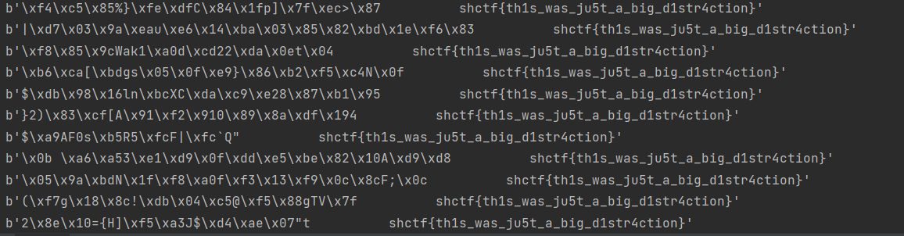
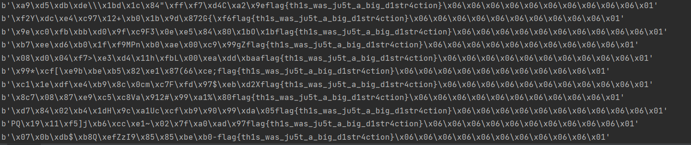
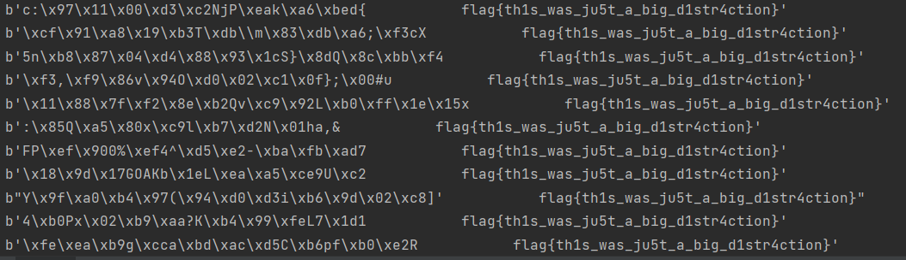

# Crypto-AES
- 题目：
```python
from Crypto.Cipher import AES
import binascii, os

key = b"3153153153153153"
iv =  os.urandom(16)

plaintext = open('message.txt', 'rb').read().strip()

cipher = AES.new(key, AES.MODE_CBC, iv)

encrypted_flag = open('message.enc', 'wb')
encrypted_flag.write(binascii.hexlify(cipher.encrypt(plaintext)))
encrypted_flag.close()
# 2a21c725b4c3a33f151be9dc694cb1cfd06ef74a3eccbf28e506bf22e8346998952895b6b35c8faa68fac52ed796694f62840c51884666321004535834dd16b1
```
- 题目给了密钥和密文，但是iv不知道，一直在想如何攻击iv，但没想到随便试了一下iv =  os.urandom(16)，居然解密后的末尾都是flag

```python
from Crypto.Cipher import AES
import binascii, os


enc = "2a21c725b4c3a33f151be9dc694cb1cfd06ef74a3eccbf28e506bf22e8346998952895b6b35c8faa68fac52ed796694f62840c51884666321004535834dd16b1"
enc = binascii.unhexlify(enc)
key = b"3153153153153153"
while True:
    iv = os.urandom(16)
    cipher = AES.new(key, AES.MODE_CBC, iv)
    plaintext = cipher.decrypt(enc)
    print(plaintext)
# shctf{th1s_was_ju5t_a_big_d1str4ction}
```

- iv如何选择，解密的明文都会出现相同的字节，关键在密钥上key = b"3153153153153153"，key重复了315这个序列
- 通过实验验证选取key = b"4534534534534534"，先进行加密，随后用随机iv对明文解密，解密的密文确实会有相同的字节，但不完整，怀疑是明文中flag的位置问题，讲flag位置向后调整，前面用任意字节填充，果然解密出的明文出现了完整的flag
- 加密脚本：
```python
from Crypto.Cipher import AES
import binascii, os
from Crypto.Util.Padding import pad

key = b"4534534534534534"
iv = os.urandom(16)

plaintext = b"\x06\x06\x06\x06\x06\x06\x06\x06\x06\x06\x06\x06\x06\x06\x06\x06flag{th1s_was_ju5t_a_big_d1str4ction}\x06\x06\x06\x06\x06\x06\x06\x06\x06\x06"
cipher = AES.new(key, AES.MODE_CBC, iv)

plaintext = pad(plaintext, AES.block_size)
enc = cipher.encrypt(plaintext)
print(enc)
print(len(enc))
# b'\x93\xc5\xa91\x11\x06\xdb]\xd8l\x8bo\xa8\xc1\x08\xfa\xa1\xb1\x06\xc7:\xcbGk\xb3\x99e\xa1\xc4\x16E"\x8a\xae\\P\x91*\xda\x1e\xeb\xfdr\xa8\'\x81\x05mIf\x0e\x9b!=+\xf2y\xf6\xa6=0\xed\x1d\xca'
# 64
```

- 解密脚本：
```python
from Crypto.Cipher import AES
import binascii, os

enc = b'\x93\xc5\xa91\x11\x06\xdb]\xd8l\x8bo\xa8\xc1\x08\xfa\xa1\xb1\x06\xc7:\xcbGk\xb3\x99e\xa1\xc4\x16E"\x8a\xae\\P\x91*\xda\x1e\xeb\xfdr\xa8\'\x81\x05mIf\x0e\x9b!=+\xf2y\xf6\xa6=0\xed\x1d\xca'
key = b"4534534534534534"
while True:
    iv = os.urandom(16)
    cipher = AES.new(key, AES.MODE_CBC, iv)
    plaintext = cipher.decrypt(enc)
    print(plaintext)
```
- 运行截图：出现完整flag


- 还有一个问题，该题目解密得到的flag前有空白符，于是修改明文再加密：将flag前用空格填充，直到明文长度为64字节，这次是手动填充，不使用pad函数
```python
from Crypto.Cipher import AES
import binascii, os

key = b"4534534534534534"
iv = os.urandom(16)

plaintext = b"                           flag{th1s_was_ju5t_a_big_d1str4ction}"
cipher = AES.new(key, AES.MODE_CBC, iv)

enc = cipher.encrypt(plaintext)
print(enc)
print(len(enc))
# b'\x9d\x85\xc1\x00\xaf\x05\x1a\xd4\n0(\x01\xd5\xab\x17z\x13Y\x83\x9e\x99\xa6\x83u\n\xd8r\xf5\xbet\x197\x05\x8aY\x04\xb2\xd7k\xa7 \xac\xa9\x18\xceF\xfe\xb3\xdc]Q\x0f\x0c\x82\x12\x10vL\xd5+\x8e\xea\xee\x10'
# 64
```

- 解密：
```python
from Crypto.Cipher import AES
import binascii, os

enc = b'\x9d\x85\xc1\x00\xaf\x05\x1a\xd4\n0(\x01\xd5\xab\x17z\x13Y\x83\x9e\x99\xa6\x83u\n\xd8r\xf5\xbet\x197\x05\x8aY\x04\xb2\xd7k\xa7 \xac\xa9\x18\xceF\xfe\xb3\xdc]Q\x0f\x0c\x82\x12\x10vL\xd5+\x8e\xea\xee\x10'
key = b"4534534534534534"
while True:
    iv = os.urandom(16)
    cipher = AES.new(key, AES.MODE_CBC, iv)
    plaintext = cipher.decrypt(enc)
    print(plaintext)
```
- 果然末尾出现flag，flag前面是空格：
