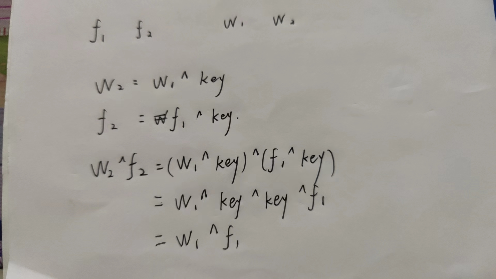

# TwoTimePad
- OneTimePad(一次一密)，密钥只使用一次，理论上是安全的
- TwoTimePad,一个密钥被用于两次加密，有破译的可能
- 题目wctf Crypto: TwoTimePad
```python
from Crypto.Random import random, get_random_bytes

BLOCK_SIZE = 16

with(open('./genFiles/wolverine.bmp', 'rb')) as f:
    wolverine = f.read()
with(open('./genFiles/flag.bmp', 'rb')) as f:
    flag = f.read()

w = open('eWolverine.bmp', 'wb')
f = open('eFlag.bmp', 'wb')

f.write(flag[:55])
w.write(wolverine[:55])

for i in range(55, len(wolverine), BLOCK_SIZE):
    KEY = get_random_bytes(BLOCK_SIZE)
    w.write(bytes(a^b for a, b in zip(wolverine[i:i+BLOCK_SIZE], KEY)))
    f.write(bytes(a^b for a, b in zip(flag[i:i+BLOCK_SIZE], KEY)))
```

- 题目给了三个文件:chall.py,eWolverine.bmp和eFlag.bmp
- 读代码：
```python
from Crypto.Random import random, get_random_bytes

# 定义块大小为 16 字节
BLOCK_SIZE = 16

# 打开源文件 'wolverine.bmp' 和 'flag.bmp' 进行读取
with open('./genFiles/wolverine.bmp', 'rb') as f_wolverine:
    wolverine = f_wolverine.read()
with open('./genFiles/flag.bmp', 'rb') as f_flag:
    flag = f_flag.read()

# 创建输出文件 'eWolverine.bmp' 和 'eFlag.bmp' 进行写入
w = open('eWolverine.bmp', 'wb')
f = open('eFlag.bmp', 'wb')

# 从每个文件中读取前 55 个字节，并将其写入相应的输出文件
f.write(flag[:55])
w.write(wolverine[:55])

# 对于每个文件的剩余部分，逐块进行异或加密
for i in range(55, len(wolverine), BLOCK_SIZE):
    # 生成一个随机密钥，使用 get_random_bytes 函数生成一个随机的 BLOCK_SIZE 字节长的密钥
    KEY = get_random_bytes(BLOCK_SIZE)
    # 对 wolverine 文件的当前块进行异或加密，并将结果写入输出文件
    w.write(bytes(a ^ b for a, b in zip(wolverine[i:i + BLOCK_SIZE], KEY)))
    # 对 flag 文件的当前块进行异或加密，并将结果写入输出文件
    f.write(bytes(a ^ b for a, b in zip(flag[i:i + BLOCK_SIZE], KEY)))

# 关闭所有文件
w.close()
f.close()

```
- 加密过程：使用相同的密钥key对两个bmp文件的从第55字节进行异或加密，加密后写入两个bmp文件中
- 明文应该是原来两个文件异或的结果，将加密后的两个文件异或就可以抵消key的影响得到明文：


- 解密脚本：
```python
HEAD_SIZE = 55  # bmp文件头部信息未加密
# 打开源文件 'wolverine.bmp' 和 'flag.bmp' 进行读取
# 使用绝对地址以及双斜杠,单斜杠有时会报错
with open("C:\\Users\\19753\\Desktop\\ewolverine.bmp", "rb") as f_wolverine:
    wolverine = f_wolverine.read()
with open("C:\\Users\\19753\\Desktop\\eFlag.bmp", "rb") as f_flag:
    flag = f_flag.read()

# 保留文件头部
flag_head = wolverine[:HEAD_SIZE]

aa = bytes(a ^ b for a, b in zip(wolverine[HEAD_SIZE:], flag[HEAD_SIZE:]))
out = flag_head + aa

# 输出还原的flag文件
with open("flag_out.bmp", "wb") as flag:
    flag.write(out)
#  wctf{D0NT_R3CYCLE_K3Y5}
```