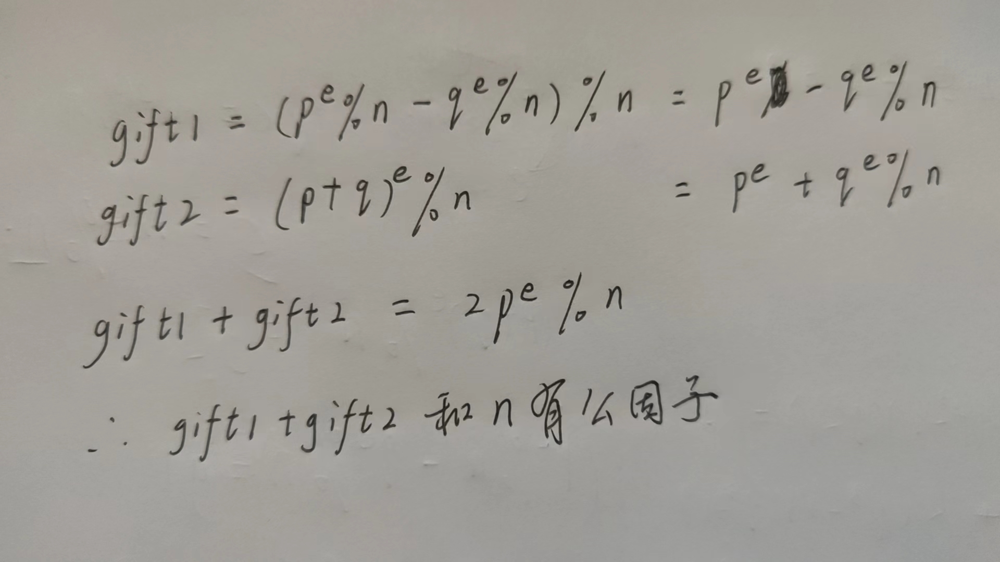

<!-- @import "[TOC]" {cmd="toc" depthFrom=1 depthTo=6 orderedList=false} -->
<!-- code_chunk_output -->

- [Crypto](#crypto)
  - [1.Sign1n[签到]](#1sign1n签到)
  - [2.babyRSAMAX](#2babyrsamax)
  - [3.factor1](#3factor1)
  - [4.factor3](#4factor3)
  - [5.happy_to_solve1](#5happy_to_solve1)
  - [6.Sign1n_Revenge](#6sign1n_revenge)
- [Misc](#misc)
  - [1.base](#1base)
  - [2.真>签到](#2真签到)
  - [3.zzl的护理小课堂](#3zzl的护理小课堂)
  - [4.熊博士](#4熊博士)
  - [5.ZIP神之套](#5zip神之套)
  - [6.game](#6game)
  - [7.ez_隐写](#7ez_隐写)
  - [8.签到](#8签到)
  - [9.TCPL](#9tcpl)
  - [10.Osint2](#10osint2)
- [Web](#web)
  - [1.ezMake](#1ezmake)
  - [ezmd5](#ezmd5)
- [Reverse](#reverse)
  - [1.聪明的信使](#1聪明的信使)
  - [2.喵喵喵的flag碎了一地](#2喵喵喵的flag碎了一地)
  - [3.你是真的大学生吗？](#3你是真的大学生吗)
  - [4.DebugMe](#4debugme)

<!-- /code_chunk_output -->


队伍：d3c4de
得分情况：
# Crypto
## 1.Sign1n[签到]
- 题目：
```python
from Crypto.Util.number import *
from tqdm import *
import gmpy2
flag=b'XYCTF{uuid}'
flag=bytes_to_long(flag)
leak=bin(int(flag))
while 1:
    leak += "0"
    if len(leak) == 514:
        break

def swap_bits(input_str):
    input_list = list(input_str[2:])
    length = len(input_list)

    for i in range(length // 2):
        temp = input_list[i]
        input_list[i] = input_list[length - 1 - i]
        input_list[length - 1 - i] = temp

    return ''.join(input_list)

input_str = leak
result = swap_bits(input_str)
a=result

def custom_add(input_str):
    input_list = list(input_str)
    length = len(input_list)
    
    for i in range(length):
        input_list[i] = str((int(input_list[i]) + i + 1) % 10)

    result = ''.join(input_list)
    return result


input_str = a
result = custom_add(input_str)
b=result
print(b)
#12345678901234567890123456789012345678901234567890123456789012345678901234567890123456789012345678901234567890123456789012345678901234567890123456789012345678901234567891134567799112455688902334677801133557889113356678911245577991223456790012455788902234677801124557799122355788001345578890123566789113445778012235578800123467889122356678911344567991223557880012455788912235667900124556899023355788001234578890123566780013445679902334577801134456899022346778902344578801233467789112355779912234577990233556780113
```
- 分析题目flag主要是被做了两次变换
- 第一次swap_bits()，交换了前后元素的位置，解密时可以直接用这个函数
- 第二次custom_add()，做了一些移位替换，解密只需要将str((int(input_list[i]) + i + 1) % 10)里面的加号换成减号
- 注意细节leak是二进制字符串，在swap_bits()交换元素是现去掉了"0b"，所以解密时需要添上"0b"再使用swap_bits()
- 解密过程：先将得到的数字以字符串形式表示，传入custom_add_decrypt()中进行移位变换，得到a，给a添上"0b"后使用swap_bits()交换元素位置，得到res:
```
10110000101100101000011010101000100011001111011001110000110001001100011011001000110010000110010001100000011000000101101011001100110001100110011001101100010110100110100001101000011001100111000001011010011100100110100001100000011011100101101001101010110011001100010001101100011000000110101011001000011010100110101011001100110001001100101011111010000000000000000000000000000000000000000000000000000000000000000000000000000000000000000000000000000000000000000000000000000000000000000000000000000000000000000000000000
```
- 去掉后面的0：
```
1011000010110010100001101010100010001100111101100111000011000100110001101100100011001000011001000110000001100000010110101100110011000110011001100110110001011010011010000110100001100110011100000101101001110010011010000110000001101110010110100110101011001100110001000110110001100000011010101100100001101010011010101100110011000100110010101111101
```
- 添上0b，表明这是二进制数后再long_to_bytes得到flag


```python
from Crypto.Util.number import *

b = "12345678901234567890123456789012345678901234567890123456789012345678901234567890123456789012345678901234567890123456789012345678901234567890123456789012345678901234567891134567799112455688902334677801133557889113356678911245577991223456790012455788902234677801124557799122355788001345578890123566789113445778012235578800123467889122356678911344567991223557880012455788912235667900124556899023355788001234578890123566780013445679902334577801134456899022346778902344578801233467789112355779912234577990233556780113"


def custom_add_decrypt(input_str):
    input_list = list(input_str)
    length = len(input_list)

    for i in range(length):
        input_list[i] = str((int(input_list[i]) - i - 1) % 10)

    result = "".join(input_list)
    return result


a = custom_add_decrypt(b)
a = "0b" + a
print(a)


def swap_bits(input_str):
    input_list = list(input_str[2:])
    length = len(input_list)

    for i in range(length // 2):
        temp = input_list[i]
        input_list[i] = input_list[length - 1 - i]
        input_list[length - 1 - i] = temp

    return "".join(input_list)


res = swap_bits(a)

print(res)
# 10110000101100101000011010101000100011001111011001110000110001001100011011001000110010000110010001100000011000000101101011001100110001100110011001101100010110100110100001101000011001100111000001011010011100100110100001100000011011100101101001101010110011001100010001101100011000000110101011001000011010100110101011001100110001001100101011111010000000000000000000000000000000000000000000000000000000000000000000000000000000000000000000000000000000000000000000000000000000000000000000000000000000000000000000000000
leak = 0b1011000010110010100001101010100010001100

111101100111000011000100110001101100100011001000011001000110000001100000010110101100110011000110011001100110110001011010011010000110100001100110011100000101101001110010011010000110000001101110010110100110101011001100110001000110110001100000011010101100100001101010011010101100110011000100110010101111101
print(long_to_bytes(int(leak)))
# b'XYCTF{8bcdd200-fc36-4438-9407-5fb605d55fbe}'


```

## 2.babyRSAMAX
```python
from Crypto.Util.number import *
from gmpy2 import *
from random import choice

flag = b"XYCTF{******}"
e = "?"


def getBabyPrime(nbits):
    while True:
        p = 1
        while p.bit_length() <= nbits:
            p *= choice(sieve_base)

        if isPrime(p + 1):
            return p + 1


p = getBabyPrime(512)
q = getBabyPrime(512)
n = p * q
gift1 = (pow(p, e, n) - pow(q, e, n)) % n
gift2 = pow(p + q, e, n)

t = 65537
x = bytes_to_long(e)
y = pow(x, t, n)

m = bytes_to_long(flag)
c = powmod(m, e, n)

print(f"n = {n}")
print(f"gift1 = {gift1}")
print(f"gift2 = {gift2}")
print(f"c = {c}")
print(f"y = {y}")

"""
n = 39332423872740210783246069030855946244104982381157166843977599780233911183158560901377359925435092326653303964261550158658551518626014048783435245471536959844874036516931542444719549997971482644905523459407775392702211086149279473784796202020281909706723380472571862792003687423791576530085747716706475220532321
gift1 = 4549402444746338327349007235818187793950285105091726167573552412678416759694660166956782755631447271662108564084382098562999950228708300902201571583419116299932264478381197034402338481872937576172197202519770782458343606060544694608852844228400457232100904217062914047342663534138668490328400022651816597367310
gift2 = 111061215998959709920736448050860427855012026815376672067601244053580566359594802604251992986382187891022583247997994146019970445247509119719411310760491983876636264003942870756402328634092146799825005835867245563420135253048223898334460067523975023732153230791136870324302259127159852763634051238811969161011462
c = 16938927825234407267026017561045490265698491840814929432152839745035946118743714566623315033802681009017695526374397370343984360997903165842591414203197184946588470355728984912522040744691974819630118163976259246941579063687857994193309554129816268931672391946592680578681270693589911021465752454315629283033043
y = 1813650001270967709841306491297716908969425248888510985109381881270362755031385564927869313112540534780853966341044526856705589020295048473305762088786992446350060024881117741041260391405962817182674421715239197211274668450947666394594121764333794138308442124114744892164155894256326961605137479286082964520217

"""

```

- 先求p,q

- 求得p，q之后可以求出x
- 直接把x当做e求解，发现怎么都不对
- 用x测试这两个发现均错误：
```python
gift1 = (pow(p, e, n) - pow(q, e, n)) % n
gift2 = pow(p + q, e, n)

```
- 那么说明直接把x当做e是错的，注意到x = bytes_to_long(e)，于是尝试print(long_to_bytes(x))
- 果然得到信息： b'XYCTF{e==4096}'
- 注意这不是flag，还没结束，调皮
- e=4096，再次计算d，发现求不出d，于是看一下公因子print(gcd(e, phi ))，公因子是4，那么把e除以4呢？发现gcd(e, phi )还是等于4，那么计算gcd(e, phi // 4)，终于互素了
- 计算d = gmpy2.invert(e, phi // 4)，那么问题来了，m该如何计算呢？m = pow(c, d, n)么？试了一下不行，模p也不行，最后模q得到flag
- EXP:
```python
from Crypto.Util.number import *
from gmpy2 import *

n = 39332423872740210783246069030855946244104982381157166843977599780233911183158560901377359925435092326653303964261550158658551518626014048783435245471536959844874036516931542444719549997971482644905523459407775392702211086149279473784796202020281909706723380472571862792003687423791576530085747716706475220532321
gift1 = 4549402444746338327349007235818187793950285105091726167573552412678416759694660166956782755631447271662108564084382098562999950228708300902201571583419116299932264478381197034402338481872937576172197202519770782458343606060544694608852844228400457232100904217062914047342663534138668490328400022651816597367310
gift2 = 111061215998959709920736448050860427855012026815376672067601244053580566359594802604251992986382187891022583247997994146019970445247509119719411310760491983876636264003942870756402328634092146799825005835867245563420135253048223898334460067523975023732153230791136870324302259127159852763634051238811969161011462
c = 16938927825234407267026017561045490265698491840814929432152839745035946118743714566623315033802681009017695526374397370343984360997903165842591414203197184946588470355728984912522040744691974819630118163976259246941579063687857994193309554129816268931672391946592680578681270693589911021465752454315629283033043
y = 1813650001270967709841306491297716908969425248888510985109381881270362755031385564927869313112540534780853966341044526856705589020295048473305762088786992446350060024881117741041260391405962817182674421715239197211274668450947666394594121764333794138308442124114744892164155894256326961605137479286082964520217
p = gcd(gift1 + gift2, n)
q = n // p
phi = (p - 1) * (q - 1)
t = 65537

d_t = gmpy2.invert(t, q - 1)
x = pow(y, d_t, q)
print(long_to_bytes(x))
e = 4096

print(gcd(e, phi // 4))
d = gmpy2.invert(e, phi // 4)
m = pow(c, d, q)
print(long_to_bytes(m))
# b'XYCTF{Rabin_is_so_biggggg!}'
```
- 提示rabin，也是，公因子是4嘛，那么如何使用rabin解密呢？

## 3.factor1
- 题目
```python
import gmpy2
import hashlib
from Crypto.Util.number import *

p = getPrime(512)
q = getPrime(512)
d = getPrime(512)
e = gmpy2.invert(d, (p**3 - 1) * (q**3 - 1))
flag = "XYCTF{" + hashlib.md5(str(p + q).encode()).hexdigest() + "}"
print(e)
print(p * q)
# 172005065945326769176157335849432320425605083524943730546805772515111751580759726759492349719668775270727323745284785341119685198468883978645793770975366048506237371435027612758232099414404389043740306443065413069994232238075194102578269859784981454218948784071599231415554297361219709787507633404217550013282713899284609273532223781487419770338416653260109238572639243087280632577902857385265070736208291583497988891353312351322545840742380550393294960815728021248513046077985900158814037534487146730483099151396746751774427787635287611736111679074330407715700153025952858666841328055071403960165321273972935204988906850585454805923440635864200149694398767776539993952528995717480620593326867245714074205285828967234591508039849777840636255379730281105670496110061909219669860172557450779495125345533232776767292561378244884362014224844319802810586344516400297830227894063759083198761120293919537342405893653545157892446163
# 99075185389443078008327214328328747792385153883836599753096971412377366865826254033534293886034828804219037466246175526347014045811852531994537520303063113985486063022444972761276531422538694915030159420989401280012025249129111871649831185047820236417385693285461420040134313833571949090757635806658958193793

```
- e很大，采用维纳攻击
- 此题phi=( p ^ 3 - 1)( q ^ 3 - 1),所以n需要使用n^3
- 解得的p*q=n^3,所以p和q均需要开三次方
- EXP:
```python
import gmpy2
import libnum
from Crypto.Util.number import long_to_bytes


def transform(x, y):  # 使用辗转相除将分数 x/y 转为连分数的形式
    res = []
    while y:
        res.append(x // y)
        x, y = y, x % y
    return res


def continued_fraction(sub_res):
    numerator, denominator = 1, 0
    for i in sub_res[::-1]:  # 从sublist的后面往前循环
        denominator, numerator = numerator, i * numerator + denominator
    return denominator, numerator  # 得到渐进分数的分母和分子，并返回


# 求解每个渐进分数
def sub_fraction(x, y):
    res = transform(x, y)
    res = list(
        map(continued_fraction, (res[0:i] for i in range(1, len(res))))
    )  # 将连分数的结果逐一截取以求渐进分数
    return res


def get_pq(a, b, c):  # 由p+q和pq的值通过韦达定理来求解p和q
    par = gmpy2.isqrt(b * b - 4 * a * c)  # 由上述可得，开根号一定是整数，因为有解
    x1, x2 = (-b + par) // (2 * a), (-b - par) // (2 * a)
    return x1, x2


def wienerAttack(e, n):
    for d, k in sub_fraction(
        e, n
    ):  # 用一个for循环来注意试探e/n的连续函数的渐进分数，直到找到一个满足条件的渐进分数
        if k == 0:  # 可能会出现连分数的第一个为0的情况，排除
            continue
        if (
            e * d - 1
        ) % k != 0:  # ed=1 (mod φ(n)) 因此如果找到了d的话，(ed-1)会整除φ(n),也就是存在k使得(e*d-1)//k=φ(n)
            continue

        phi = (e * d - 1) // k  # 这个结果就是 φ(n)
        px, qy = get_pq(1, n - phi + 1, n)
        if px * qy == n:
            p, q = abs(int(px)), abs(
                int(qy)
            )  # 可能会得到两个负数，负负得正未尝不会出现
            d = gmpy2.invert(
                e, (p - 1) * (q - 1)
            )  # 求ed=1 (mod  φ(n))的结果，也就是e关于 φ(n)的乘法逆元d
            p = gmpy2.iroot(p, 3)[0]
            q = gmpy2.iroot(q, 3)[0]
            return d, p, q
    print("该方法不适用")


e = 172005065945326769176157335849432320425605083524943730546805772515111751580759726759492349719668775270727323745284785341119685198468883978645793770975366048506237371435027612758232099414404389043740306443065413069994232238075194102578269859784981454218948784071599231415554297361219709787507633404217550013282713899284609273532223781487419770338416653260109238572639243087280632577902857385265070736208291583497988891353312351322545840742380550393294960815728021248513046077985900158814037534487146730483099151396746751774427787635287611736111679074330407715700153025952858666841328055071403960165321273972935204988906850585454805923440635864200149694398767776539993952528995717480620593326867245714074205285828967234591508039849777840636255379730281105670496110061909219669860172557450779495125345533232776767292561378244884362014224844319802810586344516400297830227894063759083198761120293919537342405893653545157892446163
n = 99075185389443078008327214328328747792385153883836599753096971412377366865826254033534293886034828804219037466246175526347014045811852531994537520303063113985486063022444972761276531422538694915030159420989401280012025249129111871649831185047820236417385693285461420040134313833571949090757635806658958193793
d, p, q = wienerAttack(e, n * n * n)
assert p * q == n
import hashlib

flag = "XYCTF{" + hashlib.md5(str(p + q).encode()).hexdigest() + "}"
print(flag)
# XYCTF{a83211a70e18145a59671c08ddc67ba4}
```

## 4.factor3
- 题目
```python
from Crypto.Util.number import *
import random

flag = b'XYCTF{*****}'
m = bytes_to_long(flag)
def gainPrime():
    while True:
        x = random.getrandbits(256)
        y = random.getrandbits(256)

        if y % 2 == 0:
            continue

        p = x ** 3 + 3 * y ** 3
        if p.bit_length() == 768 and p % 2 == 1 and isPrime(p):
            return p

p, q = gainPrime(), gainPrime()
N = p * q
phi = (p ** 2 + p + 1) * (q ** 2 + q + 1)
d = getPrime(320)
e = inverse(d, phi)
c = d**2^m

print(f"N: {N}")
print(f"e: {e}")
print(f"c: {c}")

N: 913125842482770239379848062277162627509794409924607555622246822717218133091223291889541294440266178282194506242444509803611492259403578922020590849630191477864719052980160940803309686069818208833547621252544423652489179493083138385424424384165228024273745733240109761707533778691158938848158094054261174692601673435971526522219273943464877956131040249169850420336023942653021547841666224446678539579529590840999008107782784268926145671962239929431694391039559247
e: 494518390582436635999115147756676313570637682518235195828939117782099618734167908630788943568232122157772909140885391963441876427590731524706959546524212914108888799081844320513851526790475333924396837458796755678072486028072639014677580265244176441153444956871730684233063789931539669072735599696830757690822185323538738397827461580678488181113667710378657058297572328491762536595872579603698945272140918157163640403488075948987156585480146162739943419183496337465468187233821931312507662218106713861638334075899266373256620752680354704533272722692596941861606161634082613228896420520465402725359166156632884432690715903666803067996854084671477445131853993177110154928274312496230096270510089973592664248613332000290545537840595645944390047611474888693558676781309912289044962293014118087259307560444929227407113819165713213046898243995956550944640168932947118400215917515277554126694376415569909534496134700668701465649939
c: 4450931337369461482106945992542133557585962894030505065110870389112565329875502952762182372926117037373210509516570958483606566274369840551132381128665744266165792377925899683228751870742727716
```
- 很有特点，论文题
- p和q的生成方法是a^3 + 3*b^3
- phi是(p ^ 2 + p + 1)*( q ^ 2 + q + 1)
- 先用脚本分解n：
```python
#---------------------------
'''
1,素数结构 p = a^2 + 3* b^2 ,p%3 == 1
2,phi的结构phi = (p^2+p+1)*(q^2+q+1)
3,给出N,e,c 
论文:https://eprint.iacr.org/2021/1160.pdf 
'''
import time
 
############################################
# Config
##########################################
 
"""
Setting debug to true will display more informations
about the lattice, the bounds, the vectors...
"""
debug = True
 
"""
Setting strict to true will stop the algorithm (and
return (-1, -1)) if we don't have a correct 
upperbound on the determinant. Note that this 
doesn't necesseraly mean that no solutions 
will be found since the theoretical upperbound is
usualy far away from actual results. That is why
you should probably use `strict = False`
"""
strict = False
 
"""
This is experimental, but has provided remarkable results
so far. It tries to reduce the lattice as much as it can
while keeping its efficiency. I see no reason not to use
this option, but if things don't work, you should try
disabling it
"""
helpful_only = True
dimension_min = 7 # stop removing if lattice reaches that dimension
 
############################################
# Functions
##########################################
 
# display stats on helpful vectors
def helpful_vectors(BB, modulus):
    nothelpful = 0
    for ii in range(BB.dimensions()[0]):
        if BB[ii,ii] >= modulus:
            nothelpful += 1
 
    print(nothelpful, "/", BB.dimensions()[0], " vectors are not helpful")
 
# display matrix picture with 0 and X
def matrix_overview(BB, bound):
    for ii in range(BB.dimensions()[0]):
        a = ('%02d ' % ii)
        for jj in range(BB.dimensions()[1]):
            a += '0' if BB[ii,jj] == 0 else 'X'
            if BB.dimensions()[0] < 60:
                a += ' '
        if BB[ii, ii] >= bound:
            a += '~'
        print(a)
 
# tries to remove unhelpful vectors
# we start at current = n-1 (last vector)
def remove_unhelpful(BB, monomials, bound, current):
    # end of our recursive function
    if current == -1 or BB.dimensions()[0] <= dimension_min:
        return BB
 
    # we start by checking from the end
    for ii in range(current, -1, -1):
        # if it is unhelpful:
        if BB[ii, ii] >= bound:
            affected_vectors = 0
            affected_vector_index = 0
            # let's check if it affects other vectors
            for jj in range(ii + 1, BB.dimensions()[0]):
                # if another vector is affected:
                # we increase the count
                if BB[jj, ii] != 0:
                    affected_vectors += 1
                    affected_vector_index = jj
 
            # level:0
            # if no other vectors end up affected
            # we remove it
            if affected_vectors == 0:
                print("* removing unhelpful vector", ii)
                BB = BB.delete_columns([ii])
                BB = BB.delete_rows([ii])
                monomials.pop(ii)
                BB = remove_unhelpful(BB, monomials, bound, ii-1)
                return BB
 
            # level:1
            # if just one was affected we check
            # if it is affecting someone else
            elif affected_vectors == 1:
                affected_deeper = True
                for kk in range(affected_vector_index + 1, BB.dimensions()[0]):
                    # if it is affecting even one vector
                    # we give up on this one
                    if BB[kk, affected_vector_index] != 0:
                        affected_deeper = False
                # remove both it if no other vector was affected and
                # this helpful vector is not helpful enough
                # compared to our unhelpful one
                if affected_deeper and abs(bound - BB[affected_vector_index, affected_vector_index]) < abs(bound - BB[ii, ii]):
                    print("* removing unhelpful vectors", ii, "and", affected_vector_index)
                    BB = BB.delete_columns([affected_vector_index, ii])
                    BB = BB.delete_rows([affected_vector_index, ii])
                    monomials.pop(affected_vector_index)
                    monomials.pop(ii)
                    BB = remove_unhelpful(BB, monomials, bound, ii-1)
                    return BB
    # nothing happened
    return BB
 
 
def attack(N, e, m, t, X, Y):
    modulus = e
 
    PR.<x, y> = PolynomialRing(ZZ)
    a = N + 1
    b = N * N - N + 1
    f = x * (y * y + a * y + b) + 1
 
    gg = []
    for k in range(0, m+1):
        for i in range(k, m+1):
            for j in range(2 * k, 2 * k + 2):
                gg.append(x^(i-k) * y^(j-2*k) * f^k * e^(m - k))
    for k in range(0, m+1):
        for i in range(k, k+1):
            for j in range(2*k+2, 2*i+t+1):
                gg.append(x^(i-k) * y^(j-2*k) * f^k * e^(m - k))
 
    def order_gg(idx, gg, monomials):
        if idx == len(gg):
            return gg, monomials
 
        for i in range(idx, len(gg)):
            polynomial = gg[i]
            non = []
            for monomial in polynomial.monomials():
                if monomial not in monomials:
                    non.append(monomial)
            
            if len(non) == 1:
                new_gg = gg[:]
                new_gg[i], new_gg[idx] = new_gg[idx], new_gg[i]
 
                return order_gg(idx + 1, new_gg, monomials + non)    
 
    gg, monomials = order_gg(0, gg, [])
 
    # construct lattice B
    nn = len(monomials)
    BB = Matrix(ZZ, nn)
    for ii in range(nn):
        BB[ii, 0] = gg[ii](0, 0)
        for jj in range(1, nn):
            if monomials[jj] in gg[ii].monomials():
                BB[ii, jj] = gg[ii].monomial_coefficient(monomials[jj]) * monomials[jj](X, Y)
 
    # Prototype to reduce the lattice
    if helpful_only:
        # automatically remove
        BB = remove_unhelpful(BB, monomials, modulus^m, nn-1)
        # reset dimension
        nn = BB.dimensions()[0]
        if nn == 0:
            print("failure")
            return 0,0
 
    # check if vectors are helpful
    if debug:
        helpful_vectors(BB, modulus^m)
    
    # check if determinant is correctly bounded
    det = BB.det()
    bound = modulus^(m*nn)
    if det >= bound:
        print("We do not have det < bound. Solutions might not be found.")
        print("Try with highers m and t.")
        if debug:
            diff = (log(det) - log(bound)) / log(2)
            print("size det(L) - size e^(m*n) = ", floor(diff))
        if strict:
            return -1, -1
    else:
        print("det(L) < e^(m*n) (good! If a solution exists < N^delta, it will be found)")
 
    # display the lattice basis
    if debug:
        matrix_overview(BB, modulus^m)
 
    # LLL
    if debug:
        print("optimizing basis of the lattice via LLL, this can take a long time")
 
    BB = BB.LLL()
 
    if debug:
        print("LLL is done!")
 
    # transform vector i & j -> polynomials 1 & 2
    if debug:
        print("looking for independent vectors in the lattice")
    found_polynomials = False
    
    for pol1_idx in range(nn - 1):
        for pol2_idx in range(pol1_idx + 1, nn):
            # for i and j, create the two polynomials
            PR.<a, b> = PolynomialRing(ZZ)
            pol1 = pol2 = 0
            for jj in range(nn):
                pol1 += monomials[jj](a,b) * BB[pol1_idx, jj] / monomials[jj](X, Y)
                pol2 += monomials[jj](a,b) * BB[pol2_idx, jj] / monomials[jj](X, Y)
 
            # resultant
            PR.<q> = PolynomialRing(ZZ)
            rr = pol1.resultant(pol2)
 
            # are these good polynomials?
            if rr.is_zero() or rr.monomials() == [1]:
                continue
            else:
                print("found them, using vectors", pol1_idx, "and", pol2_idx)
                found_polynomials = True
                break
        if found_polynomials:
            break
 
    if not found_polynomials:
        print("no independant vectors could be found. This should very rarely happen...")
        return 0, 0
    
    rr = rr(q, q)
 
    # solutions
    soly = rr.roots()
 
    if len(soly) == 0:
        print("Your prediction (delta) is too small")
        return 0, 0
    
    soly = soly[0][0]
    ss = pol1(q, soly)
    solx = ss.roots()[0][0]
    
    return solx, soly
 
def inthroot(a, n):
    return a.nth_root(n, truncate_mode=True)[0]
N = 913125842482770239379848062277162627509794409924607555622246822717218133091223291889541294440266178282194506242444509803611492259403578922020590849630191477864719052980160940803309686069818208833547621252544423652489179493083138385424424384165228024273745733240109761707533778691158938848158094054261174692601673435971526522219273943464877956131040249169850420336023942653021547841666224446678539579529590840999008107782784268926145671962239929431694391039559247
e = 494518390582436635999115147756676313570637682518235195828939117782099618734167908630788943568232122157772909140885391963441876427590731524706959546524212914108888799081844320513851526790475333924396837458796755678072486028072639014677580265244176441153444956871730684233063789931539669072735599696830757690822185323538738397827461580678488181113667710378657058297572328491762536595872579603698945272140918157163640403488075948987156585480146162739943419183496337465468187233821931312507662218106713861638334075899266373256620752680354704533272722692596941861606161634082613228896420520465402725359166156632884432690715903666803067996854084671477445131853993177110154928274312496230096270510089973592664248613332000290545537840595645944390047611474888693558676781309912289044962293014118087259307560444929227407113819165713213046898243995956550944640168932947118400215917515277554126694376415569909534496134700668701465649939
 
X = 1 << 469
Y = 2 * inthroot(Integer(2 * N), 2)
 
res = attack(N, e, 4, 2, X, Y)
print(res) # gives k and p + q, the rest is easy

b, c = res[1], N
Dsqrt =  inthroot(Integer(b^2-4*c),2)
p, q = (b + Dsqrt) // 2, (b - Dsqrt) // 2
assert p * q == N
print("p:",p)
print("q:",q)
# p: 1079692686288325812308630934214667048073665141240195252583556389192093937087035206847129125872559936616225942097278411602071282941911673739879515157769270737229378250560113256396308250699296075273110248314981762673299506406938725953
# q: 845727542734252771097508620366884787581346823455578404917525769041539439746914530374958818236462967773717478357930648479282951655380705183747821800053493097745787392338644671787997907165214166274630065657567039034950440073852768399
```
- 得到p和q后求d，再异或得到flag
```python
from Crypto.Util.number import *

p = 1079692686288325812308630934214667048073665141240195252583556389192093937087035206847129125872559936616225942097278411602071282941911673739879515157769270737229378250560113256396308250699296075273110248314981762673299506406938725953
q = 845727542734252771097508620366884787581346823455578404917525769041539439746914530374958818236462967773717478357930648479282951655380705183747821800053493097745787392338644671787997907165214166274630065657567039034950440073852768399
n = 913125842482770239379848062277162627509794409924607555622246822717218133091223291889541294440266178282194506242444509803611492259403578922020590849630191477864719052980160940803309686069818208833547621252544423652489179493083138385424424384165228024273745733240109761707533778691158938848158094054261174692601673435971526522219273943464877956131040249169850420336023942653021547841666224446678539579529590840999008107782784268926145671962239929431694391039559247
assert p * q == n
phi = (p**2 + p + 1) * (q**2 + q + 1)
e = 494518390582436635999115147756676313570637682518235195828939117782099618734167908630788943568232122157772909140885391963441876427590731524706959546524212914108888799081844320513851526790475333924396837458796755678072486028072639014677580265244176441153444956871730684233063789931539669072735599696830757690822185323538738397827461580678488181113667710378657058297572328491762536595872579603698945272140918157163640403488075948987156585480146162739943419183496337465468187233821931312507662218106713861638334075899266373256620752680354704533272722692596941861606161634082613228896420520465402725359166156632884432690715903666803067996854084671477445131853993177110154928274312496230096270510089973592664248613332000290545537840595645944390047611474888693558676781309912289044962293014118087259307560444929227407113819165713213046898243995956550944640168932947118400215917515277554126694376415569909534496134700668701465649939
d = inverse(e, phi)
c = 4450931337369461482106945992542133557585962894030505065110870389112565329875502952762182372926117037373210509516570958483606566274369840551132381128665744266165792377925899683228751870742727716
m = d**2 ^ c
print(long_to_bytes(m))
# b'XYCTF{I_love_to_read_the_crypto_paper_and_try_to_ak_them}'

```

## 5.happy_to_solve1
- 题目：
```python
from Crypto.Util.number import *
import sympy
from secrets import flag


def get_happy_prime():
    p = getPrime(512)
    q = sympy.nextprime(p ^ ((1 << 512) - 1))
    return p, q


m = bytes_to_long(flag)
p, q = get_happy_prime()
n = p * q
e = 65537
print(n)
print(pow(m, e, n))
# 24852206647750545040640868093921252282805229864862413863025873203291042799096787789288461426555716785288286492530194901130042940279109598071958012303179823645151637759103558737126271435636657767272703908384802528366090871653024192321398785017073393201385586868836278447340624427705360349350604325533927890879
# 14767985399473111932544176852718061186100743117407141435994374261886396781040934632110608219482140465671269958180849886097491653105939368395716596413352563005027867546585191103214650790884720729601171517615620202183534021987618146862260558624458833387692782722514796407503120297235224234298891794056695442287

```
- q = sympy.nextprime(p ^ ((1 << 512) - 1))， ((1 << 512) - 1)得到512位全1的数字，与p异或后的下一个素数即是q
- 忽略素数之间的差值（不会很大），那么p和q则是互相反的，p和q都是512位，那么p + q = 2**512
- 但实际上的q应该还要大一些，那么p + q = 2**512 - k，k不会大于1500，爆破就得到p + q，k每次增加2
- phi = n - (p + q) + 1，输出含有"XYCTF"的字节串即可
- EXP：
```python
import gmpy2
from Crypto.Util.number import *
from  tqdm import tqdm

n =  24852206647750545040640868093921252282805229864862413863025873203291042799096787789288461426555716785288286492530194901130042940279109598071958012303179823645151637759103558737126271435636657767272703908384802528366090871653024192321398785017073393201385586868836278447340624427705360349350604325533927890879
c =  14767985399473111932544176852718061186100743117407141435994374261886396781040934632110608219482140465671269958180849886097491653105939368395716596413352563005027867546585191103214650790884720729601171517615620202183534021987618146862260558624458833387692782722514796407503120297235224234298891794056695442287
e = 65537
k = 1
# 因为q是p的取反后取比其值大的最近的一个素数，所以p + q = 2**512 - 1 + t
for i in tqdm(range(1500)):
    phi = n - (2**512 - 1 + k) + 1
    d = gmpy2.invert(e, phi)
    m = pow(c, d, n)
    if b"XYCTF{" in long_to_bytes(m):
        print(long_to_bytes(m))
    k += 2
# b'XYCTF{3f22f4efe3bbbc71bbcc999a0a622a1a23303cdc}'
```

## 6.Sign1n_Revenge
进入环境，下载sign.py，解题EXP和Sign1n[签到]一样
```python
from Crypto.Util.number import *

b = "12345678901234567890123456789012345678901234567890123456789012345678901234567890123456789012345678901234567890123456789012345678901234567890123456789012345678901234567890123456799123455679912234677900134457889023346778011344567990233556790012355689901334677991134457799122355778011335668890223566799012455779902334568900133566889112456678901344568890233457790013356688902234677890234457899122355689001335668890133467799012455678012234577900124556899012356678911344577991223566890113455689911234677891224556899023"


def custom_add_decrypt(input_str):
    input_list = list(input_str)
    length = len(input_list)

    for i in range(length):
        input_list[i] = str((int(input_list[i]) - i - 1) % 10)

    result = "".join(input_list)
    return result


a = custom_add_decrypt(b)
a = "0b" + a
print(a)


def swap_bits(input_str):
    input_list = list(input_str[2:])
    length = len(input_list)

    for i in range(length // 2):
        temp = input_list[i]
        input_list[i] = input_list[length - 1 - i]
        input_list[length - 1 - i] = temp

    return "".join(input_list)


res = swap_bits(a)

print(res)
# 11001100110110001100001011001110111101100110101001101000011000001100110001101000011100001100001011001000010110100111001001101110011100001100010001011010011010001100010001100000011100100101101001110000110010101100001001100100010110101100101001101010011010101100100011001000011000101100100001101100110011000110011001101100011010001111101000000000000000000000000000000000000000000000000000000000000000000000000000000000000000000000000000000000000000000000000000000000000000000000000000000000000000000000000000000000
leak = 0b11001100110110001100001011001110111101100110101001101000011000001100110001101000011100001100001011001000010110100111001001101110011100001100010001011010011010001100010001100000011100100101101001110000110010101100001001100100010110101100101001101010011010101100100011001000011000101100100001101100110011000110011001101100011010001111101
print(long_to_bytes(int(leak)))
# b'flag{540f48ad-978b-4b09-8ea2-e55dd1d6f364}'
```


# Misc
## 1.base
- 打开附件得到
```python
LBMUGVCGPMYDOZBTGIZWIYTFG44GGYQ=YjIxODFlNzkxYzY3ZjlkZmZhNX0
```

- 分为两段：
第一段是base32，第二段是base64
- EXP:
```python
import base64

enc1 = "LBMUGVCGPMYDOZBTGIZWIYTFG44GGYQ="
enc2 = "YjIxODFlNzkxYzY3ZjlkZmZhNX0="

flag1 = base64.b32decode(enc1)
flag2 = base64.b64decode(enc2)
print(flag1 + flag2)
# b'XYCTF{07d323dbe78cbb2181e791c67f9dffa5}'
```
- 使用python解题需要补上"="，使用在线网站可以不补"="

## 2.真>签到
- 下载附件得到flag签到.zip，解压需要密码，以为是纯数字爆破，使用ARCHPR提示不是zip文件，010editor打开发现flag

```
XYCTF{59bd0e77d13c_1406b23219e_f91cf3a_153e8ea4_77508ba}
```

## 3.zzl的护理小课堂
- 进入环境，以为把题目全部答对就能得到flag，查看源代码发现满分是100，但要拿到flag需要分数不等于100，也不小于100
注意到flag是存在于flag.php中

直接查看flag.php，得到： 还想直接看flag?
构造POST请求flag.php

拿到flag：XYCTF{ZZI_T3L1_Y0u_199d0f8cbe7f}

## 4.熊博士
- 直接得到密文字符串CBXGU{ORF_BV_NVR_BLF_CRZL_QQ}，图片没有用
试了一下，不是凯撒密码，也不是维吉尼亚密码，但可以肯定是替换密码
输出一下CBXGU和XYCTF对应的字母shunx：
```python
a1 = "CBXGU"
a2 = "XYCTF"
aa1 = []
aa2 = []
for i in a1:
    aa1.append(ord(i) - 65)
for i in a2:
    aa2.append(ord(i) - 65)
print(aa1)
print(aa2)
# [2, 1, 23, 6, 20]
# [23, 24, 2, 19, 5]
```
- 也就是说这是一个单表逆序替换
- EXP：
```python
enc = "CBXGU{ORF_BV_NVR_BLF_CRZL_QQ}"
flag = ""
for i in enc:
    if i != "{" and i != "}" and i != "_":
        flag += (chr(25 - (ord(i) - 65) + 65))
    else:
        flag += i
print(flag)
# XYCTF{LIU_YE_MEI_YOU_XIAO_JJ}
```
但提交上去是错误的，反复提交，发现提示试试小写
正确的flag为：XYCTF{liu_ye_mei_you_xiao_jj}

## 5.ZIP神之套
- ida打开exe文件发现字符串xyctf????????ftcyx
猜测密码是xyctf20240401ftcyx，成功打开第一层压缩包
- flag.md在套.zip中，flag.zip中有许多SYCTF的名称的文件，套.zip中也有
选择明文攻击，明文文件就是flag.zip
当密钥搜索完毕，正在尝试找回口令时停止，找回密钥太慢了，找到口令就可以了

点击确定，另存为

打开flag.md发现flag: XYCTF{1A4B8-C9D2F3E-6A4B8C-9D2F3E7F}


## 6.game
- 玩过的都知道，游戏是Papers, Please
- XYCTF{Papers, Please}

## 7.ez_隐写
- 第一层是zip伪加密，打开得到hint和压缩包
- 修改hint高度，提示比赛日期，那么压缩包密码则是20240401
- 提取盲水印得到flag，有点费眼睛

- XYCTF{159-WSX-IJN-852}

## 8.签到
- 关注公众号得到flag

## 9.TCPL
- 打开附件，得到64位的RISC-V程序，linux下配置qemu环境即可运行
- FLAG{PLCT_An4_r0SCv_x0huann0}

## 10.Osint2
- 图片显示时间是15:10分，站台是洛阳龙门站，12306查询该站信息，在15:10分只有两个车次G3293和G3178
- 上网搜洛阳景点：少林寺，老君山，玄奘故里，栾川，龙门石窟
- 一个一个试，得到flag：xyctf{G3293|河南省|老君山}

# Web
## 1.ezMake 
- 进入环境，查看SHELL
```
SHELL := /bin/bash

ifndef PATH
override PATH :=
else
override PATH :=
endif

.PHONY: FLAG
FLAG: ./flag
```
直接地址栏访问/flag，下载flag文件，打开得到flag
XYCTF{12a7e6e6-5e6a-4735-bdad-95f7c1a37051}

## ezmd5
- 随便上传两张jpg图片，返回
```
{"areEqual":true,"md5Equal":false,"md5_1":"b919e19731b0d5318929ef6c906d410e","md5_2":"e29942cdf1f871ccf4b8453bc83a994c"}
```
- 也就是说需要md5相等，上网搜索图片不一样，但md5一样，发现两张图片
 
- 上传得到flag

- XYCTF{069efaad-8914-48b9-9763-63a188821522} 

# Reverse
## 1.聪明的信使
- ida32位打开，找到加密函数

- 解密EXP：
```python
enc_flag = "oujp{H0d_TwXf_Lahyc0_14_e3ah_Rvy0ac@wc!}"
flag = ""

for i in enc_flag:
    if 65 <= ord(i) and ord(i) <= 90:
        flag += chr((ord(i)-9-65)%26 + 65)
    elif 97 <= ord(i) and ord(i) <= 122:
        flag += chr((ord(i)-9-97)%26 + 97)
    else:
        flag += i

print(flag)
# flag{Y0u_KnOw_Crypt0_14_v3ry_Imp0rt@nt!}
```
- flag{Y0u_KnOw_Crypt0_14_v3ry_Imp0rt@nt!}

## 2.喵喵喵的flag碎了一地
- ida64打开，查找字符串发现第一部分flag
- 左侧函数部分发现第二部分flag
- 寻找对br0ken_4parT_调用，发现最后部分flag
- flag{My_fl@g_h4s_br0ken_4parT_Bu7_Y0u_c@n_f1x_1t!}

## 3.你是真的大学生吗？
- ida32打开，关键代码

- 每一个元素与后一个元素异或，最后一个字符与第一个字符异或
- 解密EXP：
```python
enc_flag = [0x76, 0x0E, 0x77, 0x14, 0x60, 0x06, 0x7D, 0x04, 0x6B, 0x1E,
            0x41, 0x2A, 0x44, 0x2B, 0x5C, 0x03, 0x3B, 0x0B, 0x33, 0x05]

# 将列表中的每个元素与后一个元素进行按位异或运算
for i in range(len(enc_flag) - 1):
    enc_flag[i] ^= enc_flag[i + 1]

# 将最后一个元素与第一个元素进行按位异或运算
enc_flag[-1] ^= enc_flag[0]

# 将加密后的字符列表转换为字符串并输出
print(''.join(chr(byte) for byte in enc_flag))
# xyctf{you_know_8086}
```

## 4.DebugMe
- apk丢入JEB，查看MainActivity，进入debug后会输出flag

- XYCTF{d3bugg3r_15_v3ry_u53ful}