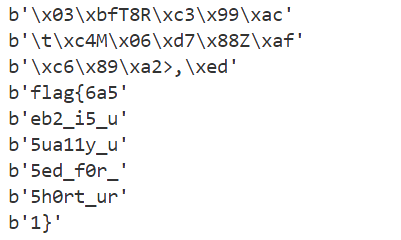

# 题目
- ctfshow 贝斯多少呢
```python
8nCDq36gzGn8hf4M2HJUsn4aYcYRBSJwj4aE0hbgpzHb4aHcH1zzC9C3IL
```

# 解题
- 题目提示明文分段，之后base62解密
- 但是！！找遍诸多网站都无法解密，最终只能编写脚本解密

# 脚本
- 思路是分段长度从4到21，遍历解密后输出，得到的字符串拼接即可
```python
import base62

# 给定的明文
text = "8nCDq36gzGn8hf4M2HJUsn4aYcYRBSJwj4aE0hbgpzHb4aHcH1zzC9C3IL"

# 遍历每个组的字符数从4到21
for length in range(4, 22):
    # 步长为当前长度
    for i in range(0, len(text), length):
        # 取得当前组的子串
        sub_text = text[i : i + length]
        # 解码并输出子串
        decoded_text = base62.decodebytes(sub_text)
        print(decoded_text)

```

# flag

```
flag{6a5eb2_i5_u5ua11y_u5ed_f0r_5h0rt_ur1}
```