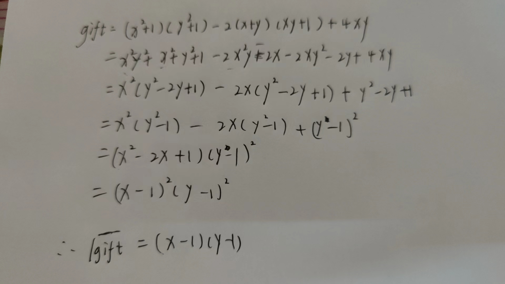

# 陕西省大学生2023 ezmath
- 题目
```python
from Crypto.Util.number import *
from secret import y,a,b
flag=b'flag{}'
l = len(flag)
m1, m2 = flag[: l // 2], flag[l // 2:]

x = bytes_to_long(m1)
c = bytes_to_long(m2)


assert (x**2+1)*(y**2+1)-2*(x+y)*(x*y+1)==gift-4*x*y


4*b**6-2*a**3+3*a*c = 5530346600323339885232820545798418499625132786869393636420197124606005490080520377416491241780814130580634432917029242402389788321303783584093278303358433856193188224687198306898483386282930376793701825481151610363517100498626293248
b**5+6*c**3+2*a*b*c = 2954615125181706551778975245956905163867066802909029011696374372323491135608656194836008189370779030694961333309906927038863656553775849501064217981385517049591593537202663734020724898058374757
3*a**3-3*a*c-3*b**6 = -5530346600323339885232820545798418499625132786869393636420197035566805062067013375355549877479840082835466426039196029766850808080041755202912921908993556467660683726675045317331817898077228454499973287809035537190311008571468738911


'''
gift=18150211062729351455633481905222609221074385988870569666008228964942099019268333450225373082700058568213818917267125668494844006433076192398714708653476096
'''

```
- 先解x：

- 使用divisors函数得到除数列表，遍历输出含有"flag"的字节串
```python
# sage
import gmpy2
from Crypto.Util.number import *
from sage.matrix.matrix2 import Matrix 

gift = 18150211062729351455633481905222609221074385988870569666008228964942099019268333450225373082700058568213818917267125668494844006433076192398714708653476096
gift = gmpy2.iroot(gift, 2)[0]
div = divisors(gift)
for i in div:
    m = i + 1
    m = long_to_bytes(m)
    if b"flag" in m:
        print(m)
        break
# b'flag{e837f64d-a556-41'
```

- 再解c。a，b，c组成了三个方程组，使用sympy解需要半小时以上
```python
from sympy import *

a,b,c = symbols("a b c")
eq = [4*b**6-2*a**3+3*a*c-5530346600323339885232820545798418499625132786869393636420197124606005490080520377416491241780814130580634432917029242402389788321303783584093278303358433856193188224687198306898483386282930376793701825481151610363517100498626293248,b**5+6*c**3+2*a*b*c-2954615125181706551778975245956905163867066802909029011696374372323491135608656194836008189370779030694961333309906927038863656553775849501064217981385517049591593537202663734020724898058374757,3*a**3-3*a*c-3*b**6+5530346600323339885232820545798418499625132786869393636420197035566805062067013375355549877479840082835466426039196029766850808080041755202912921908993556467660683726675045317331817898077228454499973287809035537190311008571468738911]
result = list(nonlinsolve(eq, [a,b,c]))
print(result)

```

- 使用消元法，使之变为1个未知数c求解
```python
import gmpy2
from Crypto.Util.number import *
from sage.matrix.matrix2 import Matrix 


#sage
R.<a,b,c> = PolynomialRing(ZZ)
f1 = 4*b**6-2*a**3+3*a*c-5530346600323339885232820545798418499625132786869393636420197124606005490080520377416491241780814130580634432917029242402389788321303783584093278303358433856193188224687198306898483386282930376793701825481151610363517100498626293248
f2 = b**5+6*c**3+2*a*b*c-2954615125181706551778975245956905163867066802909029011696374372323491135608656194836008189370779030694961333309906927038863656553775849501064217981385517049591593537202663734020724898058374757
f3 = 3*a**3-3*a*c-3*b**6+5530346600323339885232820545798418499625132786869393636420197035566805062067013375355549877479840082835466426039196029766850808080041755202912921908993556467660683726675045317331817898077228454499973287809035537190311008571468738911

def resultant(f1, f2, var):
    return Matrix.determinant(f1.sylvester_matrix(f2, var))
 
h1 = resultant(f1, f2, a) # 消去a
h2 = resultant(f1, f3, a) # 消去a
h3 = resultant(h1, h2, b) # 消去b
m2 = h3.univariate_polynomial().roots()[0][0]
flag2 = long_to_bytes(int(m2))
print(flag2)
# b'5f-af01-c883e3c8d9ca}'
```