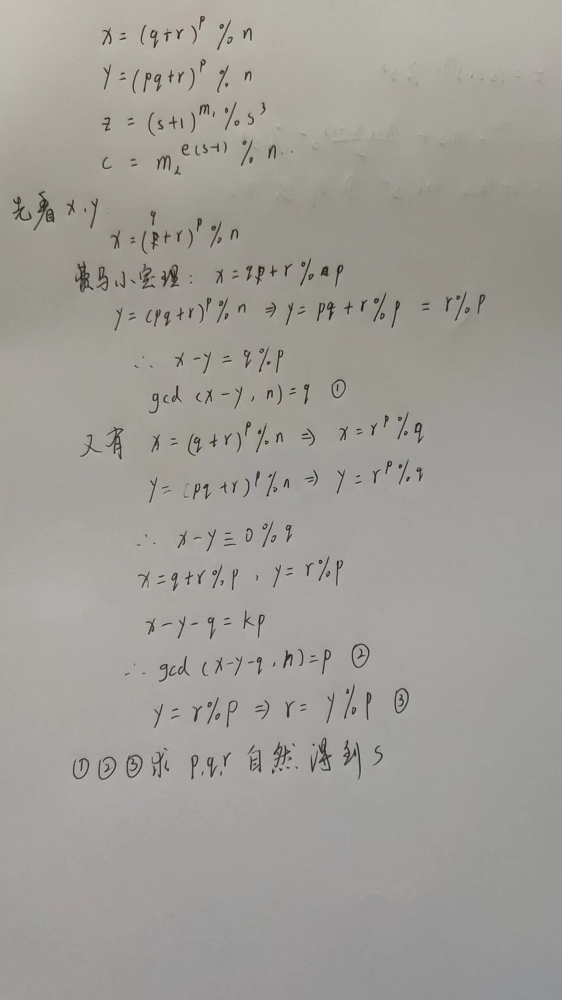
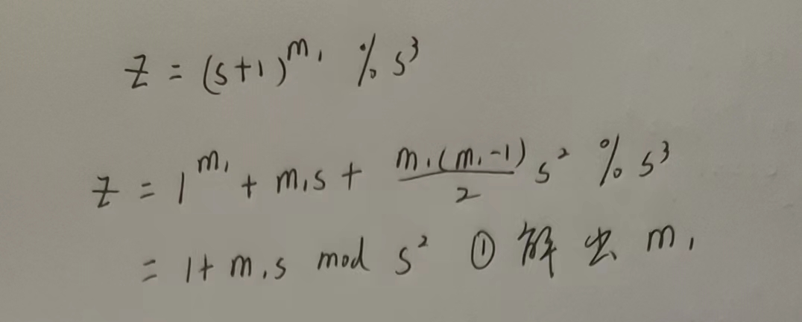
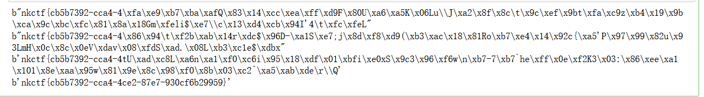

# eZ_Math
```python
# task.py
from Crypto.Util.number import *
from secret import flag

m1, m2 = bytes_to_long(flag[: len(flag) // 2]), bytes_to_long(flag[len(flag) // 2 :])
p, q, r, s = [getStrongPrime(512) for _ in range(4)]
e = 0x10001

n = p * q * r * s
x = pow(q + r, p, n)
y = pow(p * q + r, p, n)
z = pow(s + 1, m1, s**3)
c = pow(m2, e * (s - 1), n)

print(f"{n = }")
print(f"{x = }")
print(f"{y = }")
print(f"{z = }")
print(f"{c = }")

# n = 16063619267258988011034805988633616492558472337115259037200126862563048933118401979462064790962157697989038876156970157178132518189429914950166878537819575544418107719419007799951815657212334175336430766777427972314839713871744747439745897638084891777417411340564312381163685003204182743581513722530953822420925665928135283753941119399766754107671729392716849464530701015719632309411962242638805053491529098780122555818774774959577492378249768503656934696409965037843388835948033129997732058133842695370074265039977902884020467413323500218577769082193651281154702147769044514475692164145099161948955990463002411473013
# x = 3021730035236300354492366560252387204933590210661279960796549263827016146230329262559940840168033978439210301546282150367717272453598367244078695402717500358042032604007007155898199149948267938948641512214616076878271433754986480186150178487625316601499002827958344941689933374158456614113935145081427421623647242719093642478556263121508238995676370877385638074444859047640771188280945186355013165130171802867101829647797879344213688981448535289683363612035513789240264618036062440178755665951650666056478493289870170026121826588708849844053588998886259091357236645819074078054595561158630194224419831088510266212458
# y = 8995787142441643101775260550632842535051686960331455373408888374295557050896156890779515089927839904014859222004906681231525326673182671984194300730575609496770604394218160422560576866112460837985407931067753009696969997384839637927957848613356269534870170452152926447601781637641134982178028922559652443398183848786034348994249923007092159192374765197460466878587635412657807328348343062302127490267456095927890461140420639805398464266081441243108883599713672104446500850203779995739675784794478089863001309614674686652597236324659979849324914804032046113978246674538411441434320732570934185579553749616238819583998
# z = 1283646988194723153191718393109711130382429329041718186548715246082834666179475883560020086589684603980734305610989683434078096863563033623169666389076830792095374856743015929373461198718962686411467443788047511292138922700655772772117855226419561159782734009961921473456332468653898105909729309377890721920937410781006337057478451806364879679045839945032594716202888196404203782734864187890231653321470085251
# c = 4988583141177813116287729619098477713529507701428689219486720439476625736884177254107631282807612305211904876847916760967188201601494592359879509876201418493870112712105543214178376471651715703062382025712952561985261461883133695993952914519494709871429166239968478488380137336776740647671348901626710334330855078254188539448122493675463406596681080368929986034772169421577420193671300532508625180845417164660544286332963072804192276425664877337357353975758574262657585309762422727680851018467657523970318042829660721433987195369353660020476598195375492128671951807024027929490113371463210453342974983253996717176870

```
- 四个方程求解：


- 最后求m2，发现e*(s-1)与(p-1)(q-1)(r-1)(s-1)不互素，而且公因子很大，但与(p-1)的公因子为4，所以选择模p求解m2
- 最后要解四次方程，所以有四个结果需要遍历，直接放在sagemath中运行
```python
# Sagemath中运行
from Crypto.Util.number import *
import gmpy2
from sympy import gcd

n = 16063619267258988011034805988633616492558472337115259037200126862563048933118401979462064790962157697989038876156970157178132518189429914950166878537819575544418107719419007799951815657212334175336430766777427972314839713871744747439745897638084891777417411340564312381163685003204182743581513722530953822420925665928135283753941119399766754107671729392716849464530701015719632309411962242638805053491529098780122555818774774959577492378249768503656934696409965037843388835948033129997732058133842695370074265039977902884020467413323500218577769082193651281154702147769044514475692164145099161948955990463002411473013
x = 3021730035236300354492366560252387204933590210661279960796549263827016146230329262559940840168033978439210301546282150367717272453598367244078695402717500358042032604007007155898199149948267938948641512214616076878271433754986480186150178487625316601499002827958344941689933374158456614113935145081427421623647242719093642478556263121508238995676370877385638074444859047640771188280945186355013165130171802867101829647797879344213688981448535289683363612035513789240264618036062440178755665951650666056478493289870170026121826588708849844053588998886259091357236645819074078054595561158630194224419831088510266212458
y = 8995787142441643101775260550632842535051686960331455373408888374295557050896156890779515089927839904014859222004906681231525326673182671984194300730575609496770604394218160422560576866112460837985407931067753009696969997384839637927957848613356269534870170452152926447601781637641134982178028922559652443398183848786034348994249923007092159192374765197460466878587635412657807328348343062302127490267456095927890461140420639805398464266081441243108883599713672104446500850203779995739675784794478089863001309614674686652597236324659979849324914804032046113978246674538411441434320732570934185579553749616238819583998
z = 1283646988194723153191718393109711130382429329041718186548715246082834666179475883560020086589684603980734305610989683434078096863563033623169666389076830792095374856743015929373461198718962686411467443788047511292138922700655772772117855226419561159782734009961921473456332468653898105909729309377890721920937410781006337057478451806364879679045839945032594716202888196404203782734864187890231653321470085251
c = 4988583141177813116287729619098477713529507701428689219486720439476625736884177254107631282807612305211904876847916760967188201601494592359879509876201418493870112712105543214178376471651715703062382025712952561985261461883133695993952914519494709871429166239968478488380137336776740647671348901626710334330855078254188539448122493675463406596681080368929986034772169421577420193671300532508625180845417164660544286332963072804192276425664877337357353975758574262657585309762422727680851018467657523970318042829660721433987195369353660020476598195375492128671951807024027929490113371463210453342974983253996717176870
e = 65537

q = gmpy2.gcd(x - y, n)
p = gmpy2.gcd(x - y - q, n) // q
r = y % p
s = n // p // q // r

temp = z % s**2
m1 = (temp - 1) // s
flag1 = long_to_bytes(int(m1))

dp = gmpy2.invert(e*(s-1)//4,p-1)
mp = pow(c,dp,p)

R.<x> = PolynomialRing(Zmod(p))
f = x ^ 4 - mp
res = f.roots()
for i in res:
    m2 = int(i[0])
    flag2 = long_to_bytes(int(m2))
    flag = flag1 + flag2
    print(flag)
    # nkctf{cb5b7392-cca4-4ce2-87e7-930cf6b29959}

```

