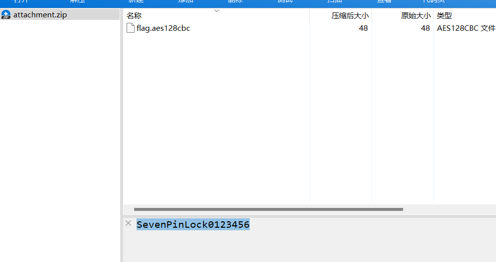
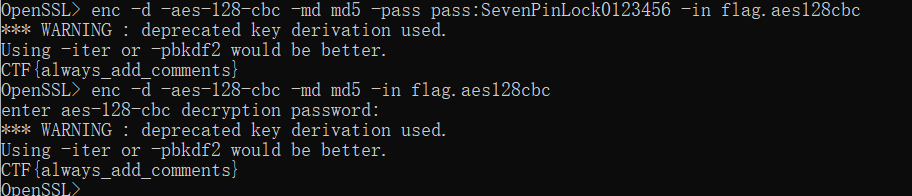

# 使用工具openssl解密
- [BSidesSF2019]slashslash
- 题目只给了一个flag.aes128cbc文件
- openssl使用参考 https://blog.csdn.net/fsq0827/article/details/99710052
- https://blog.csdn.net/MikeCoke/article/details/114590315
- openssl下载 https://blog.csdn.net/zyhse/article/details/108186278

- 可以看到密钥是SevenPinLock0123456

- CTF{always_add_comments}