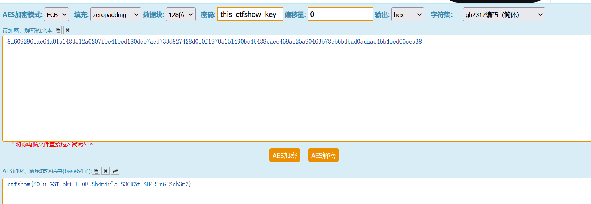

# Shamir密码共享算法
- 原理 https://zhuanlan.zhihu.com/p/440667227
- 题目 [UTCTF2020]Curveball
```python
# Curveball

My friend Shamir was trying to share the flag with me and some of the other problem writers, but he wanted to make sure it didn't get intercepted in transmission, so he split it up. He said that the secrets that he shared will help us find the flag, but I can't figure it out! These are the secrets I've gathered so far:

```
(C81E728D9D4C2F636F067F89CC14862C, 31E96A93BF1A7CE1872A3CCDA6E07F86)
(ECCBC87E4B5CE2FE28308FD9F2A7BAF3, ADF6E4F1052BDE978344743CCDCF5771)
(E4DA3B7FBBCE2345D7772B0674A318D5, 0668FBCFE4098FEA0218163AC21E6531)
```

Can you figure out which flag is the right one?

_by balex_

```
- 三组数看起来都是16进制数，但是作为x，和f(x)未免太大，发现都是32位，可能是hash值，md5解密一下 https://www.sojson.com/encrypt_md5.html
得到：
```
(2,5398141)
(3,5398288)
(5,5398756)

```

```python
# sagemath运行
x_0,y_0 = (2,5398141)
x_1,y_1 = (3,5398288)
x_2,y_2 = (5,5398756)
R.<x> = QQ[]
l_0 = ((x-x_1)/(x_0-x_1))*((x-x_2)/(x_0-x_2))
l_1 = ((x-x_0)/(x_1-x_0))*((x-x_2)/(x_1-x_2))
l_2 = ((x-x_0)/(x_2-x_0))*((x-x_1)/(x_2-x_1))
f_x = (y_0*l_0) + (y_1*l_1) + (y_2*l_2)
print(f_x)
# 29*x^2 + 2*x + 5398021

```
- 得到明文5398021

# 再来一题
- ctfshow 大牛杯SSSS
```
p = e4fa76fb77c30f889bbab54d7d7a3e7edbd7ae6c42a1a443f657e95c5708fa15

(1, 9768db2b62cf5e892fd6a0fc26c1387974eefd609998d04a5db830cd85e334bd)
(3, 7452014a456e0545c248617169f6426edd53d4f65ae9dced2ecc0c2911651410)
(5, ed09d852d4789d46891970459a710db6df790be773a9ba7f51528ac508fc74a)
(7, a2637283075c9494ac78f8d2dc0dd2e171ae93f03b0e29e84b785f552ffae39c)
(9, a54a9f5ada141d245eff3817ac40c80ed2120efcf6e90cdfffef8a3fcd34a3da)

AES-ECB
'8a609296eae64a015148d512a6207fee4feed180dce7aed733d827428d0e0f19705151490bc4b488eaee469ac25a90463b78eb6bdbad0adaae4bb45ed66ceb38'
```

- 先解出常数项：
```python
# sagemath 运行
p = 0xe4fa76fb77c30f889bbab54d7d7a3e7edbd7ae6c42a1a443f657e95c5708fa15

ss = [(1, 0x9768db2b62cf5e892fd6a0fc26c1387974eefd609998d04a5db830cd85e334bd),
(3, 0x7452014a456e0545c248617169f6426edd53d4f65ae9dced2ecc0c2911651410),
(5, 0xed09d852d4789d46891970459a710db6df790be773a9ba7f51528ac508fc74a),
(7, 0xa2637283075c9494ac78f8d2dc0dd2e171ae93f03b0e29e84b785f552ffae39c),
(9, 0xa54a9f5ada141d245eff3817ac40c80ed2120efcf6e90cdfffef8a3fcd34a3da)]

# shamir
Zp = Zmod(p)
A = Matrix(Zp, [[x^i for i in range(5)] for x, y in ss])
b = vector(Zp, [y for x, y in ss])
print(A)

x = A.solve_right(b)
print(x)
```
- 得到常数项153421376468734975731045175614702317458439896683272740513610079
```python
from Crypto.Util.number import *

print(long_to_bytes(153421376468734975731045175614702317458439896683272740513610079))
# b'_you_got_this_ctfshow_key_'
```
- 结合AES-ECB
'8a609296eae64a015148d512a6207fee4feed180dce7aed733d827428d0e0f19705151490bc4b488eaee469ac25a90463b78eb6bdbad0adaae4bb45ed66ceb38'得知，这应该是密钥，但长度不对，只有26字节，aes密钥应该是16,24,32字节
在线网站解密 http://tool.chacuo.net/cryptaes

- ctfshow{S0_u_G3T_5kiLL_0F_Sh4mir'5_S3CR3t_SH4RInG_Sch3m3}