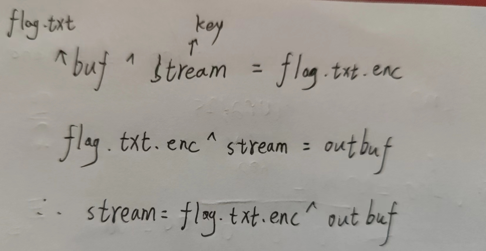

# 一次一密，xor
- [BSidesSF2020]decrypto-1
```python
import sys
import json
import hashlib


class Crypto:

    def __init__(self, key):
        if not isinstance(key, bytes):
            raise TypeError('key must be of type bytes!')
        self.key = key
        self._buf = bytes()
        self._out = open("/dev/stdout", "wb")

    def _extend_buf(self):
        self._buf += self.key

    def get_bytes(self, nbytes):
        while len(self._buf) < nbytes:
            self._extend_buf()
        ret, self._buf = self._buf[:nbytes], self._buf[nbytes:]
        return ret

    def encrypt(self, buf):
        if not isinstance(buf, bytes):
            raise TypeError('buf must be of type bytes!')
        stream = self.get_bytes(len(buf))
        return bytes(a ^ b for a, b in zip(buf, stream))

    def set_outfile(self, fname):
        self._out = open(fname, "wb")

    def encrypt_file(self, fname):
        buf = open(fname, "rb").read()
        self._out.write(self.encrypt(buf))


class JSONCrypto(Crypto):

    def encrypt_file(self, fname):
        buf = open(fname, "r").read().strip()
        h = hashlib.sha256(buf.encode('utf-8')).hexdigest()
        data = {
                "filename": fname,
                "hash": h,
                "plaintext": buf,
        }
        outbuf = json.dumps(data, sort_keys=True, indent=4)
        self._out.write(self.encrypt(outbuf.encode("utf-8")))


def main(argv):
    if len(argv) not in (3, 4):
        print("%s <key> <infile> [outfile]" % sys.argv[0])
        return
    argv.pop(0)
    key = argv.pop(0)
    inf = argv.pop(0)
    crypter = JSONCrypto(key.encode("utf-8"))
    if sys.argv:
        crypter.set_outfile(argv.pop(0))
    crypter.encrypt_file(inf)


if __name__ == '__main__':
    main(sys.argv)

```
- sys.argv[]是一个从程序外部获取参数的桥梁，因为我们从外部取得的参数可以是多个，所以获得的是一个列表，也就是说sys.argv其实可以看作是一个列表，所以才能用[]提取其中的元素。其第一个元素是程序本身，sys.argv[0]表示代码本身文件路径，随后才依次是外部给予的参数。
- pop() 函数用于移除列表中的一个元素(默认最后一个元素)，并且返回该元素的值。
- hash.hexdigest() 返回摘要，作为十六进制数据字符串值。
- json.dumps()将一个Python数据结构转换为JSON对象，indent:参数根据数据格式缩进显示，读起来更加清晰，skipkeys：默认值是False，如果dict的keys内的数据不是python的基本类型(str,unicode,int,long,float,bool,None)，设置为False时，就会报TypeError的错误。此时设置成True，则会跳过这类key 。
- 上面的都不重要。
- stream就是key，它和buf一样长；buf就是flag.txt的内容；整个过程就是使用stream对buf加密，结果写入flag.txt.enc
- 重点：
```
data = {
            "filename": fname,
            "hash": h,
            "plaintext": buf,
        }
```
- outbuf的fname就是flag.txt，而outbuf是对flag.txt.enc再加密的输出，所以key = flag.txt.enc ^ outbuf


- EXP：
```python
import json

data = {
    "filename": "flag.txt",
    "hash": "h",
}

# 转化位json对象获得异或后的值
outbuf = json.dumps(data, sort_keys=True, indent=4)
cipher_pre = open("C:\\Users\\19753\\Desktop\\flag.txt.enc", "rb").read()

# outbuf异或加密后的flag得到key
# 这里循环次数设置大一些（随便多少，主要是为了验证key是多少），发现key重复"n0t4=l4g"，所以key="n0t4=l4g"
for i in range(44):
    print(chr(cipher_pre[i] ^ ord(outbuf[i])))
    # 得到key
key = "n0t4=l4g"

# 上面发现key是重复"n0t4=l4g"这个字符串的，但不知道到底重复多少次，所以只取一次
# 下面只需要取到的重复次数能够满足可以和cipher_pre[i]全部异或就行
# 这里也是要保证key足够长，可以慢慢试range()里面的数慢慢增加就行
for i in range(7):
    key += key
    # 使key足够长.
flag = ""
for i in range(len(cipher_pre)):
    flag += chr(ord(key[i]) ^ cipher_pre[i])
print(flag)
# CTF{plz_dont_r0ll_ur_own_crypto}
```