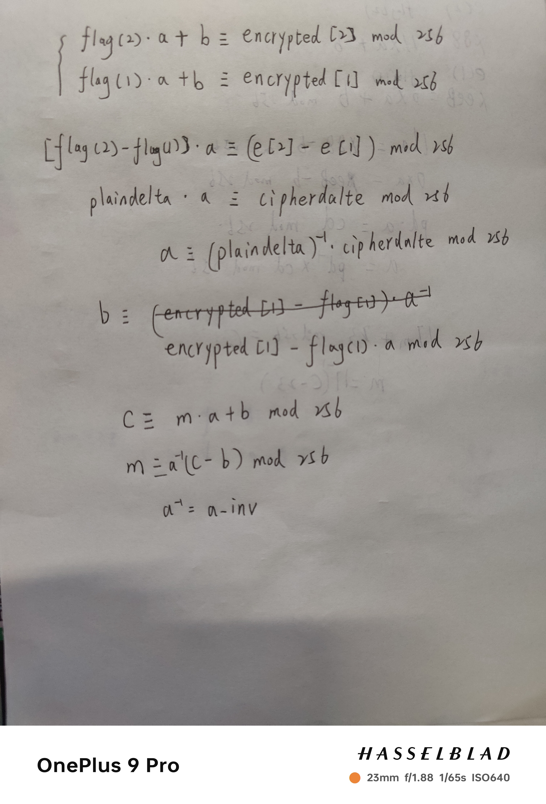

# 一次仿射密码记录
- 题目[NewStarCTF 2023 公开赛道]Affine

## 题目分析
```python
from flag import flag, key

modulus = 256

ciphertext = []

for f in flag:
    ciphertext.append((key[0]*f + key[1]) % modulus)

print(bytes(ciphertext).hex())

# dd4388ee428bdddd5865cc66aa5887ffcca966109c66edcca920667a88312064

```
## 解题关键
- 16进制转字节
- 求出key[0]和key[1]即可解密
- 根据密文字符串和已知的明文字符flag建立方程求解

```python
import gmpy2


flag = 'flag{***************}'    #部分明文

data = "dd4388ee428bdddd5865cc66aa5887ffcca966109c66edcca920667a88312064"   #密文待解密

# 十六进制转字节
encrypted = bytes.fromhex(data)
# encrypted = data
print(encrypted)
plaindelta = ord(flag[2]) - ord(flag[1])
print(plaindelta)
cipherdalte = encrypted[2] - encrypted[1]
print(cipherdalte)

modulus = 256
# gmpy2.invert(plaindelta, modulus)返回plaindelta模modulus的逆元
a = gmpy2.invert(plaindelta, modulus) * cipherdalte % modulus
b = (encrypted[1] - a * ord(flag[1])) % modulus
print(a,b)
# a = 17
# b = 23
a_inv = gmpy2.invert(a, modulus)
result = ""
for c in encrypted:
    result += chr((c - b) * a_inv % modulus)
print(result)
#flag{4ff1ne_c1pher_i5_very_3azy}
```

# 数学原理


