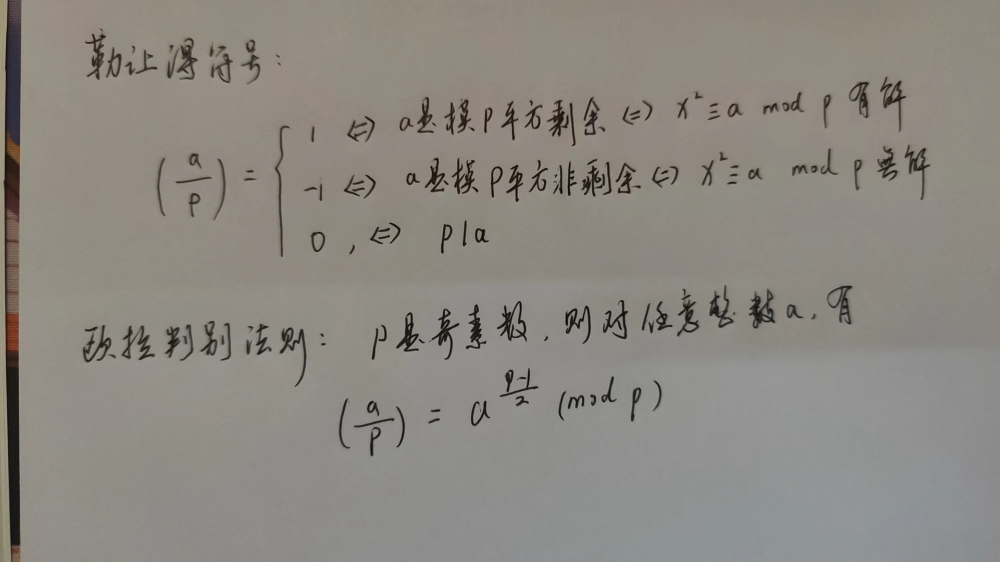
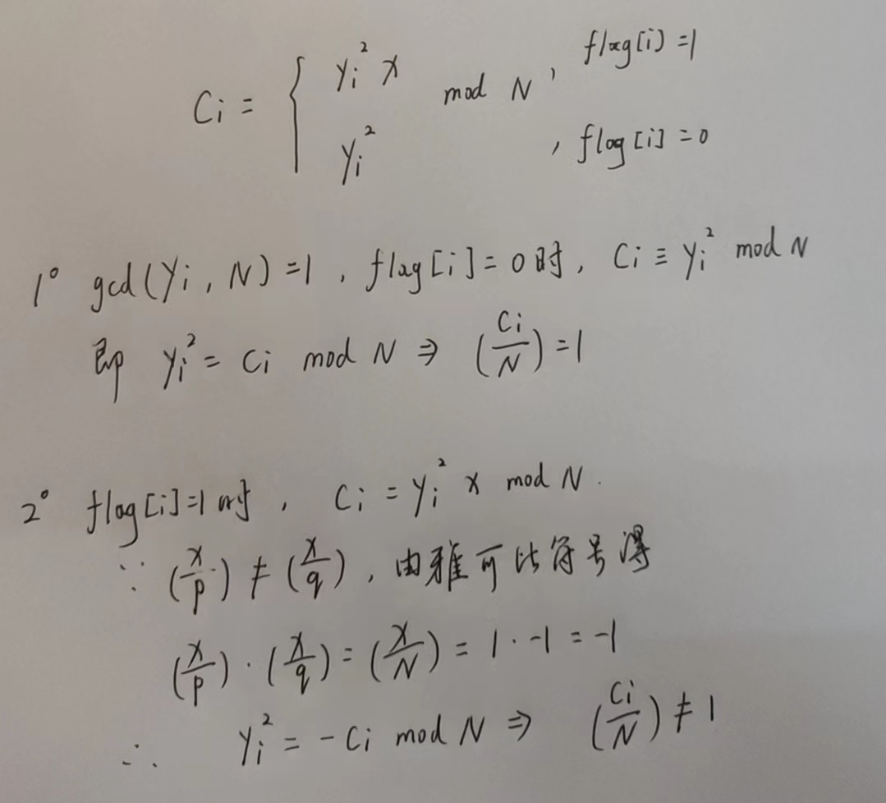

# 勒让德符号
- [羊城杯 2020]GMC
```python
from Crypto.Util.number import getPrime, bytes_to_long, getRandomNBitInteger
from secret import flag
from gmpy2 import gcd


def gmc(a, p):
    if pow(a, (p - 1) // 2, p) == 1:
        return 1
    else:
        return -1


def gen_key():
    [gp, gq] = [getPrime(512) for i in range(2)]
    gN = gp * gq
    return gN, gq, gp


def gen_x(gq, gp):
    while True:
        x = getRandomNBitInteger(512)
        if gmc(x, gp) ^ gmc(x, gq) == -2:
            return x


def gen_y(gN):
    gy_list = []
    while len(gy_list) != F_LEN:
        ty = getRandomNBitInteger(768)
        if gcd(ty, gN) == 1:
            gy_list.append(ty)
    return gy_list


if __name__ == "__main__":

    flag = bin(bytes_to_long(flag))[2:]
    F_LEN = len(flag)
    N, q, p = gen_key()
    x = gen_x(q, p)
    y_list = gen_y(N)
    ciphertext = []

    for i in range(F_LEN):
        tc = pow(y_list[i], 2) * pow(x, int(flag[i])) % N
        ciphertext.append(tc)

    with open("./output.txt", "w") as f:
        f.write(str(N) + "\n")
        for i in range(F_LEN):
            f.write(str(ciphertext[i]) + "\n")

```

- 首先看x：
```python
x = gen_x(q, p)

def gen_x(gq, gp):
    while True:
        x = getRandomNBitInteger(512)
        if gmc(x, gp) ^ gmc(x, gq) == -2:
            return x

def gmc(a, p):
    if pow(a, (p - 1) // 2, p) == 1:
        return 1
    else:
        return -1
```

- 根据勒让德符号定义和欧拉判别法则，gen_x(q, p)返回的x需要满足gmc(x, gp) ^ gmc(x, gq) == -2，而gmc(a, p)返回勒让德符号，要想二者异或结果为-2，则必须是1 ^ -1，也就是说x是p和q其中一个的平方剩余并且是另一个的平方非剩余
- 再看gen_y(N)，它返回一个列表，元素个数是len(flag)，每一个元素都满足gcd(ty, N) == 1
- 加密过程：
```python
for i in range(F_LEN):
        tc = pow(y_list[i], 2) * pow(x, int(flag[i])) % N
        ciphertext.append(tc)
```
- 解密过程如下：
- 所以是需要判断c和N的勒让德符号就可以判断flag的对应位是0还是1
- 那么N如何获得呢，发现out.txt的第一行就是N
- EXP：
```python
from Crypto.Util.number import *
from sympy import jacobi_symbol

with open("C:\\Users\\19753\\Desktop\\output.txt", "r") as f:
    c = f.readlines()
flag = ""

# 先取出n，使用pop取出可以保证后面读取c的时候就是从第二行开始读了
n = int(c.pop(0).strip())
for ci in c:
    tc = int(ci.strip())
    if jacobi_symbol(tc, n) == -1:
        flag += "1"
    else:
        flag += "0"

print(long_to_bytes(int(flag, 2)))
# b'GWHT{876db950c1424a8e49d50cdcc0b3a86e}'

```