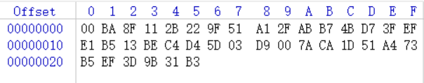

# 异或,代码重写
- 题目 buuctf EasyProgram1
- 两个文件：
```
# 附件.txt
get buf unsign s[256]
get buf t[256]
we have key:whoami
we have flag:????????????????????????????????

for i:0 to 256
    set s[i]:i

for i:0 to 256
    set t[i]:key[(i)mod(key.lenth)]

for i:0 to 256
    set j:(j+s[i]+t[i])mod(256)
        swap:s[i],s[j]

for m:0 to 38
    set i:(i + 1)mod(256)
    set j:(j + S[i])mod(256)
    swap:s[i],s[j]
    set x:(s[i] + (s[j]mod(256))mod(256))
    set flag[m]:flag[m]^s[x]

fprint flagx to file
```

```
# file.txt
 簭+"烸?K?镝?灸註? z?Q碉=??
```
- 加密过程是加密后输出密文到file.txt
- 加密中涉及到flag只有最后一部分，异或运算38次，但file.txt中只有25个乱码字符，考虑可能是有38个字节，拖入010editor或者winhex查看正好38个字节
- 因为是异或运算，只需要把伪代码重新写一遍就可以了
- 解密脚本：
```python
# 处理密文
cipher_hex = [
    0x00,
    0xBA,
    0x8F,
    0x11,
    0x2B,
    0x22,
    0x9F,
    0x51,
    0xA1,
    0x2F,
    0xAB,
    0xB7,
    0x4B,
    0xD7,
    0x3F,
    0xEF,
    0xE1,
    0xB5,
    0x13,
    0xBE,
    0xC4,
    0xD4,
    0x5D,
    0x03,
    0xD9,
    0x00,
    0x7A,
    0xCA,
    0x1D,
    0x51,
    0xA4,
    0x73,
    0xB5,
    0xEF,
    0x3D,
    0x9B,
    0x31,
    0xB3,
]

print(cipher_hex)
key = "whoami"
s = []
t = []
for i in range(256):
    s.append(i)
for i in range(256):
    t.append(key[i % len(key)])
j = 0
for i in range(256):
    j = (j + s[i] + ord(t[i])) % 256
    s[i], s[j] = s[j], s[i]

flag = ""
i, j = 0, 0
for m in range(38):
    i = (i + 1) % 256
    j = (j + s[i]) % 256
    s[i], s[j] = s[j], s[i]
    x = (s[i] + (s[j] % 256)) % 256
    flag += chr(cipher_hex[m] ^ s[x])
print(flag)
# flag{f238yu28323uf28u2yef2ud8uf289euf}

```