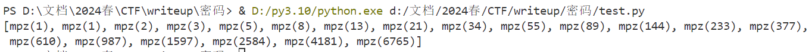

# 题目
- ctfshow麻辣兔头又一锅 
```
126292,165298,124522,116716,23623,21538,72802,90966,193480,77695,98618,127096,15893,65821,58966,163254,179952,134870,45821,21712,68316,87720,156070,16323,86266,148522,93678,110618,110445,136381,92706,129732,22416,177638,110110,4324,180608,3820,67750,134150,23116,116772,50573,149156,5292
60144,146332,165671,109800,176885,65766,76908,147004,135068,182821,123107,77538,86482,88096,101725,16475,158935,123018,42322,144694,186769,176935,59296,134856,65813,131931,144283,95814,102191,185706,55744,67711,149076,108054,135112,100344,35434,121479,14506,145222,183989,17548,38904,27832,105943
```

# 解题
- 题目提示兔子
- 兔子->兔子数列->斐波那契数列
```
n = [126292,165298,124522,116716,23623,21538,72802,90966,193480,77695,98618,127096,15893,65821,58966,163254,179952,134870,45821,21712,68316,87720,156070,16323,86266,148522,93678,110618,110445,136381,92706,129732,22416,177638,110110,4324,180608,3820,67750,134150,23116,116772,50573,149156,5292]
m = [60144,146332,165671,109800,176885,65766,76908,147004,135068,182821,123107,77538,86482,88096,101725,16475,158935,123018,42322,144694,186769,176935,59296,134856,65813,131931,144283,95814,102191,185706,55744,67711,149076,108054,135112,100344,35434,121479,14506,145222,183989,17548,38904,27832,105943]
print(len(n), ' ', len(m))
# len(n) = 45, len(m) = 45
```

- 两组数列长度一样，可能进行异或运算
- 那么每一个具体的数值代表什么含义呢，我们初步猜测每一个具体的数值代表斐波那契数列的某一项的序列，我们可以使用python的gmpy2库来得到斐波那契数列的特定项
- 那么我们怎么保证得到的数据是可见字符呢，我们添加一个掩码0xff来解决这个问题

# 解题脚本
```python
import gmpy2

n = [126292,165298,124522,116716,23623,21538,72802,90966,193480,77695,98618,127096,15893,65821,58966,163254,179952,134870,45821,21712,68316,87720,156070,16323,86266,148522,93678,110618,110445,136381,92706,129732,22416,177638,110110,4324,180608,3820,67750,134150,23116,116772,50573,149156,5292]
m = [60144,146332,165671,109800,176885,65766,76908,147004,135068,182821,123107,77538,86482,88096,101725,16475,158935,123018,42322,144694,186769,176935,59296,134856,65813,131931,144283,95814,102191,185706,55744,67711,149076,108054,135112,100344,35434,121479,14506,145222,183989,17548,38904,27832,105943]
print(len(n), ' ', len(m))
# len(n) = 45, len(m) = 45

flag = ''
for i in range(len(n)):
    tmp = gmpy2.fib(n[i])^gmpy2.fib(m[i])
    tmp = chr(tmp & 0xff)
    flag += tmp

print(flag)

```

# flag
ctfshow{6d83b2f1-1241-4b25-9c1c-0a4c218f6c5f}

## 代码学习

### 1.gmpy2.fib（）函数
```python
import gmpy2

fibonacci_sequence = [gmpy2.fib(i) for i in range(1, 21)]
print(fibonacci_sequence)


```
- 输出结果

所以该函数的作用是将i作为索引得出该索引在斐波那契数列中的值

### 2.tmp = chr(tmp & 0xff)
- 这行代码将tmp的值截断为一个字节（8位），然后将其转换为对应的ASCII字符。这是因为ASCII字符是一个字节（8位）长的，所以只保留tmp的最低8位并将其解释为ASCII字符。