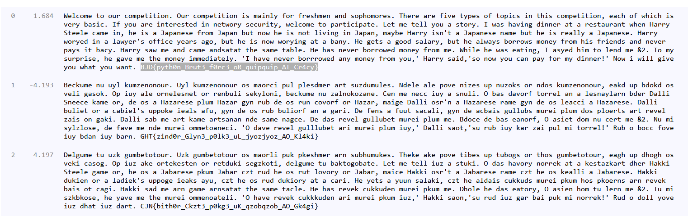

# 替换密码（quipqiup加密）
- 题目地址[BJDCTF 2nd]Y1nglish-y1ng

# 题目
```python
Nkbaslk ds sef aslckdqdqst. Sef aslckdqdqst qo lzqtbw usf ufkoplkt zth oscpslsfko. Dpkfk zfk uqjk dwcko su dscqao qt dpqo aslckdqdqst, kzap su npqap qo jkfw mzoqa. Qu wse zfk qtdkfkodkh qt tkdnsfw okaefqdw, nkbaslk ds czfdqaqczdk. Bkd lk dkbb wse z odsfw.
Q nzo pzjqtv hqttkf zd z fkodzefztd npkt Pzffw Odkkbk azlk qt, pk qo z Izcztkok ufsl Izczt med tsn pk qo tsd bqjqtv qt Izczt, lzwmk Pzffw qot'd z Izcztkok tzlk med pk qo fkzbbw z Izcztkok. Pzffw nsfwkh qt z bznwkf'o suuqak wkzfo zvs, med pk qo tsn nsfwqtv zd z mztw. Pk vkdo z vssh ozbzfw, med pk zbnzwo msffsno lstkw ufsl pqo ufqktho zth tkjkf czwo qd mzaw. Pzffw ozn lk zth azlk zthozdzd dpk ozlk dzmbk. Pk pzo tkjkf msffsnkh lstkw ufsl lk. Npqbk pk nzo kzdqtv, Q zowkh pql ds bkth lk &2. Ds lw oefcfqok, pk vzjk lk dpk lstkw qllkhqzdkbw. 'Q pzjk tkjkf msfffsnkh ztw lstkw ufsl wse,' Pzffw ozqh,'os tsn wse azt czw usf lw hqttkf!' Tsn q nqbb vqjk wse npzd wse nztd.
MIH{cwdp0t_Mfed3_u0fa3_sF_geqcgeqc_ZQ_Af4aw}
```

# 解题
给了一大段文章，应该是词频统计然后替换解密
解密网站 https://quipqiup.com/


看起来第一个就是flag
BJD{pyth0n_Brut3_f0rc3_oR_quipquip_AI_Cr4cy}
题目提示将单词修正，于是将末尾的y换成k
正确flag：
BJD{pyth0n_Brut3_f0rc3_oR_quipquip_AI_Cr4ck}

# 总结 
需要积累这种题目的经验，遇到之后迅速反应过来直接在线解密即可

# 科普
quipqiup是Edwin Olson的快速自动密码求解器。它可以解决报纸上经常出现的简单替代密码，包括诸如密码窃听器（保留单词边界）之类的难题和爱国主义者（如密码迷）之类的难题。