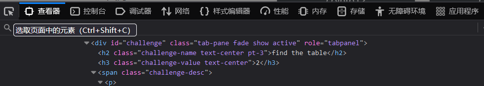
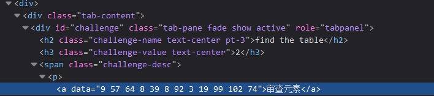

# 题目
- ctfshow 审查元素

# 解题
- 这个题就只有“审查元素四个字”，一眼懵，有点偏怪

## 步骤
- F12进入开发者工具

- 选取左上角的鼠标图标，即可以审查元素，之后将鼠标移动到“审查元素”这四个字上，左键单击

- 得到数字9 57 64 8 39 8 92 3 19 99 102 74，查看元素周期表
- 得到字符F La Gd O Y O U Li K Es No W
- 转换小写flag{doyoulikesnow}

# flag
```
flag{doyoulikesnow}
```