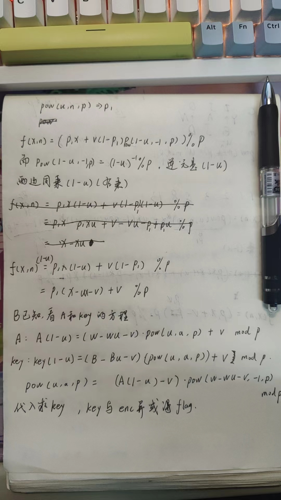

# 题目
- ctfshow NOeasyRSA 
```python
from Crypto.Util.number import long_to_bytes
from Crypto.Util.strxor import strxor
from random import randint
from flag import FLAG
 
def f(x, n):  
    return (pow(u,n,p)*x + v*(1-pow(u,n,p))*pow(1-u, -1, p)) % p  
 
p = 97201997431130462639713476119411091922677381239967611061717766639853376871260165905989218335681560177626304205941143288128749532327607316527719299945637260643711897738116821179208534292854942631428531228316344113303402450588666012800739695018334321748049518585617428717505851025279186520225325765864212731597
u = 14011530787746260724685809284106528245188320623672333581950055679051366424425259006994945665868546765648275822501035229606171697373122374288934559593175958252416643298136731105775907857798815936190074350794406666922357841091849449562922724459876362600203284195621546769313749721476449207319566681142955460891977927184371401451946649848065952527323468939007868874410618846898618148752279316070498097254384228565132693552949206926391461108714034141321700284318834819732949544823937032615318011463993204345644038210938407875147446570896826729265366024224612406740371824999201173579640264979086368843819069035017648357042
v = 16560637729264127314502582188855146263038095275553321912067588804088156431664370603746929023264744622682435376065011098909463163865218610904571775751705336266271206718700427773757241393847274601309127403955317959981271158685681135990095066557078560050980575698278958401980987514566688310172721963092100285717921465575782434632190913355536291988686994429739581469633462010143996998589435537178075521590880467628369030177392034117774853431604525531066071844562073814187461299329339694285509725214674761990940902460186665127466202741989052293452290042871514149972640901432877318075354158973805495004367245286709191395753
w = 30714296289538837760400431621661767909419746909959905820574067592409316977551664652203146506867115455464665524418603262821119202980897986798059489126166547078057148348119365709992892615014626003313040730934533283339617856938614948620116906770806796378275546490794161777851252745862081462799572448648587153412425374338967601487603800379070501278705056791472269999767679535887678042527423534392867454254712641029797659150392148648565421400107500607994226410206105774620083214215531253544274444448346065590895353139670885420838370607181375842930315910289979440845957719622069769102831263579510660283634808483329218819353
a = randint(0, 2**2048)
b = randint(0, 2**2048)
A = f(w, a)
B = f(w, b)
key = long_to_bytes(f(B, a))[:len(FLAG)]
enc = strxor(FLAG, key)
print(f"{A = }")
print(f"{B = }")
print(f"{enc = }")
 
"""
A = 19000912802080599027672447674783518419279033741329820736608320648294849832904652704615322546923683308427498322653162857743332527479657555691849627174691056234736228204031597391109766621450008024310365149769851160904834246087493085291270515883474521052340305802461028930107070785434600793548735004323108063823
B = 73344156869667785951629011239443984128961974188783039136848369309843181351498207375582387449307849089511875560536212143659712959631858144127598424003355287131145957594729789310869405545587664999655457134475561514111282513273352679348722584469527242626837672035004800949907749224093056447758969518003237425788
enc = b'\xfd\xc1\xb7\x9d"$\xc2\xb0\xb5\xee\xf89\xa4V\x8e\x17\x01K9\xbc.\x92=\x85\x80\xd4\x03\xefAl"\xbd\x8b\xcdL\xb5\xa3!'
"""
```

# 解题
- enc是由flag和key异或得到，只需要求出key，与enc异或就可以恢复flag
- 解方程过程


# 解题脚本
```python
from random import randint
from Crypto.Util.number import long_to_bytes
from Crypto.Util.strxor import strxor

p = 97201997431130462639713476119411091922677381239967611061717766639853376871260165905989218335681560177626304205941143288128749532327607316527719299945637260643711897738116821179208534292854942631428531228316344113303402450588666012800739695018334321748049518585617428717505851025279186520225325765864212731597
u = 14011530787746260724685809284106528245188320623672333581950055679051366424425259006994945665868546765648275822501035229606171697373122374288934559593175958252416643298136731105775907857798815936190074350794406666922357841091849449562922724459876362600203284195621546769313749721476449207319566681142955460891977927184371401451946649848065952527323468939007868874410618846898618148752279316070498097254384228565132693552949206926391461108714034141321700284318834819732949544823937032615318011463993204345644038210938407875147446570896826729265366024224612406740371824999201173579640264979086368843819069035017648357042
v = 16560637729264127314502582188855146263038095275553321912067588804088156431664370603746929023264744622682435376065011098909463163865218610904571775751705336266271206718700427773757241393847274601309127403955317959981271158685681135990095066557078560050980575698278958401980987514566688310172721963092100285717921465575782434632190913355536291988686994429739581469633462010143996998589435537178075521590880467628369030177392034117774853431604525531066071844562073814187461299329339694285509725214674761990940902460186665127466202741989052293452290042871514149972640901432877318075354158973805495004367245286709191395753
w = 30714296289538837760400431621661767909419746909959905820574067592409316977551664652203146506867115455464665524418603262821119202980897986798059489126166547078057148348119365709992892615014626003313040730934533283339617856938614948620116906770806796378275546490794161777851252745862081462799572448648587153412425374338967601487603800379070501278705056791472269999767679535887678042527423534392867454254712641029797659150392148648565421400107500607994226410206105774620083214215531253544274444448346065590895353139670885420838370607181375842930315910289979440845957719622069769102831263579510660283634808483329218819353

A = 19000912802080599027672447674783518419279033741329820736608320648294849832904652704615322546923683308427498322653162857743332527479657555691849627174691056234736228204031597391109766621450008024310365149769851160904834246087493085291270515883474521052340305802461028930107070785434600793548735004323108063823
B = 73344156869667785951629011239443984128961974188783039136848369309843181351498207375582387449307849089511875560536212143659712959631858144127598424003355287131145957594729789310869405545587664999655457134475561514111282513273352679348722584469527242626837672035004800949907749224093056447758969518003237425788
enc = b'\xfd\xc1\xb7\x9d"$\xc2\xb0\xb5\xee\xf89\xa4V\x8e\x17\x01K9\xbc.\x92=\x85\x80\xd4\x03\xefAl"\xbd\x8b\xcdL\xb5\xa3!'

u1 = pow(1 - u, -1, p)
p1 = ((A * (1 - u) - v) * pow(w - w * u - v, -1, p)) % p
key = u1 * ((B - B * u - v) * p1 + v) % p
key = long_to_bytes(key)[: len(enc)]
print(strxor(key, enc))
```

# flag
ctfshow{This_Is_Really_Not_So_Smooth!}

# 总结
- 看起来难，但根据wp照着分析也能做
- 代码不难，方程化简求解难些
- 不知道怎么命名这种题型

# 难点
- 化简f(x,n),想到两边右乘(1-u)
- 列出A和key的方程联立求解
